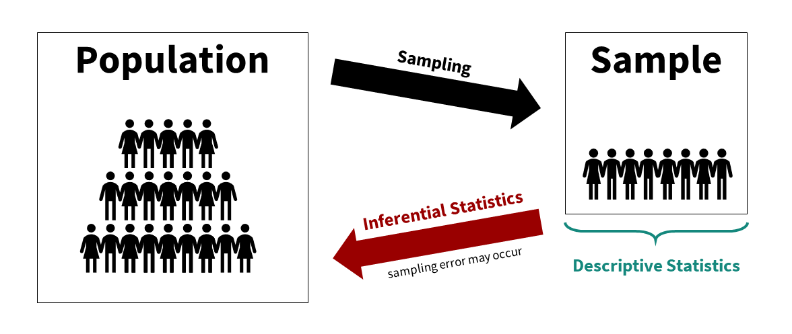

# 2.3 Descriptive vs. Inferential Statistics {.unnumbered}

There are two broad types of statistics that we use when working with data: **descriptive statistics** and **inferential statistics**.

## Descriptive Statistics

**Descriptive statistics** are used to summarize, organize, and describe the data we have collected.

Common ways we describe data include:

-   **Measures of central tendency** (e.g., mean, median, mode)
-   **Measures of dispersion** (e.g., range, standard deviation, variance)
-   **Shape of the distribution** (e.g., skew, kurtosis)
-   **Visualizations** (e.g., tables, graphs)

Descriptive statistics focus only on the **sample data in front of us**.

------------------------------------------------------------------------

## Inferential Statistics

**Inferential statistics** are used to make conclusions about a **population** based on data collected from a **sample**.

Because we usually cannot collect data from an entire population (due to time, cost, or access), we collect data from a sample and use statistical methods to make inferences about the larger group.

A **parameter** describes a population (e.g., the true average test score of all students), while a **statistic** describes a sample (e.g., the average score of the students we measured). In research, we use statistics to estimate unknown population parameters.

Common inferential statistics include:

-   t-tests
-   ANOVA
-   correlation
-   chi-square tests
-   regression

These methods help us answer questions like: “Is this difference meaningful, or could it have occurred by chance?”

------------------------------------------------------------------------

## How They Work Together

Descriptive and inferential statistics are closely connected:

-   We use **descriptive statistics** to summarize our sample
-   We use **inferential statistics** to generalize from the sample to the population

In practice, we almost always use both, but not all studies involve inference. Some studies are purely descriptive, focusing only on accurately summarizing the data collected. However, even when conducting inferential statistics, we begin by describing our sample.

## An example

This can feel abstract, so let’s walk through a simple example.

Imagine we are conducting a study to examine whether watching *Schitt’s Creek* (a very good show, but not helpful for studying) versus watching video lessons on studying techniques (useful, but perhaps less exciting) affects test performance in UW–Stout students.

Our **population of interest** is all UW–Stout students (approximately 10k students). However, it is not feasible to collect data from every student due to time, access, and logistical constraints.

Instead, we collect data from a **sample**. For simplicity, we use students from two sections of an introductory psychology course (about 80 students). This is a **convenience sample**, not a random sample, but it works for illustrating our concepts.

We randomly assign half of the students to watch *Schitt’s Creek* and the other half to watch study skills videos.

One week later, all students take an exam, and we record their test scores.

------------------------------------------------------------------------

## Step 1: Describing the Sample

First, we use **descriptive statistics** to summarize the data.

We might:

-   Create a histogram of test scores (perhaps separated by group)
-   Calculate the **mean** score for each group
-   Examine the **standard deviation** to understand variability
-   Check the **range** of scores

These summaries help us understand what the data look like.

------------------------------------------------------------------------

## Step 2: Making Inferences

Next, we ask our research question: Which group performed better on the exam? To answer this, we use **inferential statistics**.

We take our descriptive statistics (means, standard deviations, sample sizes) and use a statistical test (in this case, an independent samples t-test) to evaluate whether the difference between groups is meaningful.

Rather than calculating this by hand, we typically use statistical software like *jamovi*, which provides a test statistic, a *p*-value, and an effect size.

These results help us determine whether the observed difference in our sample likely reflects a real difference in the population.

------------------------------------------------------------------------

## Why This Matters

Understanding the difference between descriptive and inferential statistics helps you:

-   Clearly describe your data
-   Ask meaningful research questions
-   Make appropriate conclusions about a population
-   Avoid overgeneralizing from limited data

We will build on these ideas throughout the rest of the course, especially when we begin conducting inferential tests.

## Check Your Understanding

1.  You collect data from 50 UW–Stout students and calculate the mean GPA. Is this an example of **descriptive** or **inferential** statistics? Explain briefly.
2.  You use those 50 students to test whether UW–Stout students have a higher GPA than the national average. Is this **descriptive** or **inferential** statistics? Explain briefly.
3.  A researcher reports that 62% of participants preferred online classes. What type of statistic is this?
4.  Why do we typically use both descriptive and inferential statistics in the same study?
5.  A study includes only descriptive statistics and no inferential tests. Give one reason why that might be appropriate.

::: {.callout-tip collapse="true"}
### Answers

1.  **Descriptive.** You are summarizing the sample you collected.
2.  **Inferential.** You are using the sample to make a claim about a larger population.
3.  **Descriptive.** It summarizes the sample data.
4.  Descriptive statistics summarize what the sample looks like, and inferential statistics help us decide what the sample may suggest about the population.
5.  Answers will vary. For example, the goal of the study may simply be to describe a group or summarize observations without making broader population claims.
:::
