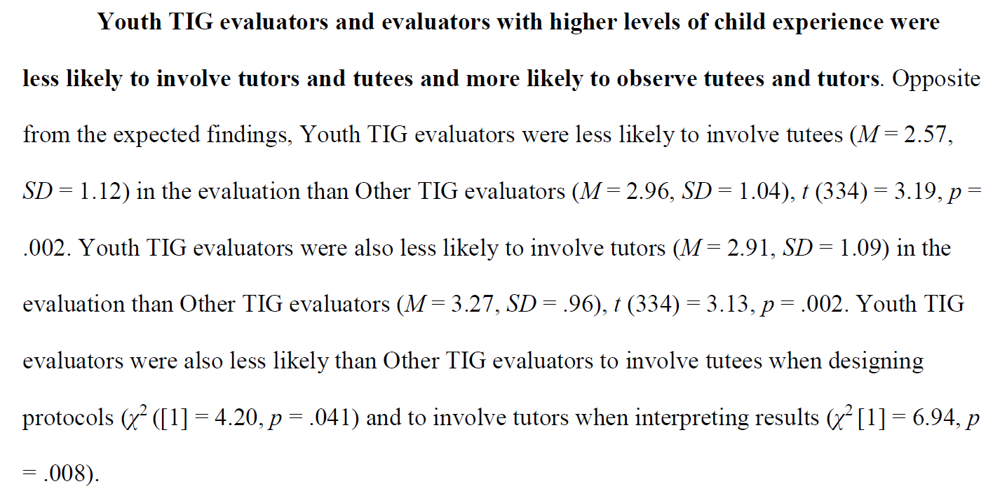

# 4. Describing data in jamovi

In this chapter, we begin describing our data using statistical summaries.

In Chapter 2, we learned what descriptive statistics are and why they matter. In Chapter 3, we learned how to set up and navigate data in jamovi. Now, we will bring those together and begin using jamovi to describe our data.

By the end of this chapter, you should be able to:

-   Generate descriptive statistics in jamovi
-   Choose appropriate descriptive statistics based on variable type
-   Interpret measures of center and variability
-   Write up descriptive statistics clearly

------------------------------------------------------------------------

## 4.1 Describing continuous variables

We will start by describing **continuous variables**, such as test scores, age, or reaction time.

### Running descriptive statistics in jamovi

To generate descriptive statistics:

1.  Click **Exploration**
2.  Select **Descriptives**
3.  Move your variable into the **Variables** box

Once you do this, jamovi will automatically generate output.

In the options panel, you can select which statistics to display.

For most purposes, you should include:

-   **Mean**: the average value
-   **Median**: the middlemost value
-   **Standard deviation**: average spread around the mean
-   **Variance**: squared spread
-   **Minimum and maximum**: the lowest and highest values, respectively
-   **N (sample size)**: the total number of observations

You may also include:

-   **Skewness**: the shape of the tail of the distribution
-   **Kurtosis**: the shape of the height of the distribution

------------------------------------------------------------------------

### Interpreting the output

Once you run the analysis, jamovi will provide a table of descriptive statistics.

When interpreting a continuous variable, focus on:

-   **Center** such as mean or median
-   **Variability** such as standard deviation or variance
-   **Range** such as the highest and lowest values

You can ask yourself the following questions to understand the distribution of the data:

-   Are the mean and median similar, which suggests a more normal distribution?
-   Are the values tightly clustered or widely spread out?
-   Are there potential outliers?
-   Do the highest and lowest values make sense based on the dataset?

This information is often used to write-up results in APA Style. For example:

> The average test score was 78.4 (SD = 10.2), with scores ranging from 52 to 95.

This tells us:

-   the typical score (mean)
-   how spread out scores are (SD)
-   the range of observed values

I recommend you watch this video by Alexander Swan on [how to describe continuous data in jamovi](https://youtu.be/oVE0nxJ0J44).

### Check Your Understanding

1.  You run descriptive statistics and get:

    -   Mean = 75
    -   Median = 60

    What might this suggest about the distribution?

2.  Why is it important to report both the mean and the standard deviation?

3.  Two datasets both have a mean of 80. One has a standard deviation of 2 and the other has a standard deviation of 15. What does this tell you?

4.  A variable has a minimum of 18 and a maximum of 19, but the standard deviation is very large. What would you want to check?

5.  If the mean and median are very different, which measure of center might be more useful to report? Why?

::: {.callout-tip collapse="true"}
### Answers

1.  The distribution may be skewed. Because the mean is greater than the median, it may be **right-skewed**.

2.  The mean describes the center of the data, while the standard deviation describes how spread out the values are. Both are needed to understand the distribution.

3.  The two datasets have the same average, but the second dataset is much more variable.

4.  You would want to check the raw data and output carefully, because those values may not be consistent. There could be an error or a misunderstanding in the output.

5.  The **median** may be more useful, because it is less affected by skew and outliers.
:::

------------------------------------------------------------------------

## 4.2 Describing categorical variables

Now let’s describe **categorical variables**, such as gender, major, or condition.

### Running frequencies in jamovi

To describe categorical variables:

1.  Click **Exploration**
2.  Select **Descriptives**
3.  Move your variable into the **Variables** box
4.  Select the **Frequency tables** check box

------------------------------------------------------------------------

### Interpreting output

Example:

| Category | Count | Percent |
|----------|-------|---------|
| Yes      | 45    | 56.3%   |
| No       | 35    | 43.8%   |

Interpretation:

> 56.3% of participants responded “Yes,” while 43.8% responded “No.”

**Key reminder**

For categorical variables:

-   We do **not** calculate means or standard deviations
-   We describe how often each category occurs
-   A statistics table will be provided, but as the variable is categorical it will only provide N and Missing, as the other statistics are used for continuous variables

I recommend you watch this video by Alexander Swan on [how to describe categorical data in jamovi](https://youtu.be/eGdkYZbljbQ).

### Check Your Understanding

1.  Why would it be inappropriate to calculate the mean for a nominal variable?

2.  What statistics are typically most appropriate for categorical variables?

3.  A variable has the categories:

    -   Psychology
    -   Business
    -   Engineering

    What would be a useful way to describe this variable?

4.  A student codes major as:

    -   1 = Psychology
    -   2 = Business
    -   3 = Engineering

    They then calculate the mean and report that the “average major” was 2.1. What is the problem with this interpretation?

::: {.callout-tip collapse="true"}
### Answers

1.  Nominal variables represent categories, not numerical quantities, so averages are not meaningful.

2.  Frequencies (counts) and percentages.

3.  Report how many participants fall into each category and the percentage in each category.

4.  The numbers are only codes for categories. They do not represent meaningful numerical values, so the mean is not interpretable.
:::

------------------------------------------------------------------------

## 4.3 Describing a continuous variable by a categorical variable

Often, we want to describe a continuous variable **across groups**.

Example:

-   Test scores by condition
-   Stress levels by major

------------------------------------------------------------------------

### Running grouped descriptives

In **Descriptives**:

1.  Click **Exploration**
2.  Select **Descriptives**
3.  Place your continuous variable in the **Variables** box
4.  Place your categorical variable in the **Split by** box

------------------------------------------------------------------------

### Interpreting output

jamovi will now provide descriptive statistics **for each group separately**.

This allows you to compare:

-   group means
-   group variability
-   sample sizes

For example:

> Students in the intervention group scored higher (M = 82.3, SD = 8.5) than students in the control group (M = 75.6, SD = 11.2).

::: {.warning data-latex=""}
Descriptive statistics are not inferential statistics. We can describe differences—but we are not yet testing whether those differences are statistically significant. That comes later. Be careful that you write up descriptive statistics as simply *describing* the data and not making causal inferences.
:::

### Check Your Understanding

1.  You compare test scores between two groups and find:

    -   Group A: M = 80, SD = 8
    -   Group B: M = 75, SD = 10

    Can you conclude that the difference is statistically significant? Why or why not?

2.  What does using the **Split by** box in jamovi allow you to examine?

3.  Why might it be useful to compare both the means and standard deviations across groups?

4.  A researcher reports that Group A scored higher than Group B descriptively. What additional step would be needed to test whether that difference is statistically significant?

::: {.callout-tip collapse="true"}
### Answers

1.  No. These are descriptive statistics only. You would need an inferential test to evaluate statistical significance.

2.  It allows you to describe a continuous variable separately across the levels of a categorical variable.

3.  The means show differences in center, and the standard deviations show differences in variability.

4.  Conduct an inferential test, such as an independent samples *t*-test, if appropriate.
:::

------------------------------------------------------------------------

## 4.4 Choosing the right descriptive statistics

Not all statistics are appropriate for all variables.

Here is a quick reminder from Chapter 2. The type of variable determines:

-   what statistics you can compute
-   how you interpret the results

This is why correctly setting your variable type in jamovi (Chapter 3) is so important.

| Variable Type | What to Report           |
|---------------|--------------------------|
| Continuous    | Mean, median, SD, range  |
| Ordinal       | Median, frequencies      |
| Nominal       | Frequencies, percentages |

### Check Your Understanding

1.  Which descriptive statistics would be most appropriate for each of the following?

    -   Favorite color
    -   Class rank
    -   Reaction time

2.  Why might the median be preferred over the mean for some variables?

3.  A variable is ordinal, but a researcher reports the mean. What question should you ask before deciding whether that is appropriate?

4.  Why is the type of variable so important when deciding how to describe data?

::: {.callout-tip collapse="true"}
### Answers

1.  

    -   Favorite color → frequencies and percentages\
    -   Class rank → median or frequencies\
    -   Reaction time → mean, standard deviation, range

2.  The median is less affected by skew and outliers.

3.  Ask whether the variable is being treated as approximately continuous and whether that choice is conceptually justified.

4.  Variable type determines which summaries are meaningful and appropriate.
:::

------------------------------------------------------------------------

## 4.5 Writing up descriptive statistics

Being able to compute statistics is not enough—you also need to communicate them clearly.

------------------------------------------------------------------------

### Basic format (continuous variable)

> *M* = *, SD =*

Example:

> Participants reported moderate stress levels (M = 3.45, SD = 0.82).

------------------------------------------------------------------------

### Including range

> Scores ranged from \_\_\_ to \_\_\_

------------------------------------------------------------------------

### Group comparisons

> Group A (*M* = , *SD* = ) scored higher/lower than Group B (*M* = , *SD* = ).

------------------------------------------------------------------------

### Tips

-   Always include **units** (e.g., test scores, minutes, ratings)
-   Round consistently (typically 2 decimal places)
-   Be clear and concise

### Examples from the literature

In small examples, we might write-up our descriptive statistics into a paragraph[^04-descriptive-statistics-1] (note: I also describe an independent t-test and a chi-square test of independence in this paragraph):

[^04-descriptive-statistics-1]: This comes from [Wanzer (2017) Developmentally appropriate evaluations: How evaluation practices differ across age of participants](https://thesiscommons.org/bk57d/)

{width="602"}

In examples with many variables, we might write-up our descriptive statistics into a table[^04-descriptive-statistics-2]:

[^04-descriptive-statistics-2]: This comes from [Wanzer et al. (2020) Experiencing flow while viewing art: Development of the aesthetic experience questionnaire](https://psycnet.apa.org/record/2018-49650-001)

{width="400"}

### Check Your Understanding

1.  Rewrite this more clearly:

    -   “The average score was 78 and spread was 10.”

2.  What important information is missing from this write-up?

    -   “Participants in Group A scored higher than participants in Group B.”

3.  Why is it important to include units or context when writing up descriptive statistics?

4.  A student writes:

    -   “The mean major was 2.3.”

    What feedback would you give?

::: {.callout-tip collapse="true"}
### Answers

1.  Example: “Participants had an average score of 78 (SD = 10).”

2.  The means, standard deviations, and likely sample sizes for each group are missing.

3.  Numbers alone can be unclear. Context helps readers understand what the values represent.

4.  Major is a categorical variable, so the mean is not meaningful. They should report frequencies or percentages instead.
:::

------------------------------------------------------------------------

## 4.6 Common mistakes

Here are a few common mistakes to avoid:

-   Reporting means for categorical variables
-   Ignoring variability (only reporting the mean)
-   Misinterpreting skewed data
-   Forgetting to report sample size
-   Not checking your data before analysis

### Check Your Understanding

1.  What is one problem with reporting only the mean for a continuous variable?

2.  Why is it a mistake to report means for nominal variables?

3.  If a variable is coded incorrectly in jamovi, how might that affect your descriptive statistics?

4.  A researcher finds a very large standard deviation. What are two possible explanations?

::: {.callout-tip collapse="true"}
### Answers

1.  The mean alone does not show variability, skew, or possible outliers.

2.  Nominal variables are categories, not quantities, so a mean is not interpretable.

3.  jamovi may calculate inappropriate statistics or allow the wrong type of analysis.

4.  The data may truly be very spread out, or there may be outliers, errors, or incorrect coding.
:::

------------------------------------------------------------------------

## 4.7 Looking ahead

In this chapter, we focused on summarizing data numerically.

In the next chapter, we will learn how to **visualize data** using graphs, which can often reveal patterns that numbers alone cannot.

Together, descriptive statistics and visualizations provide a complete picture of your data.
