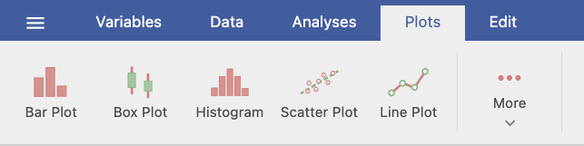

# 6.2 Choosing the Right Graph {.unnumbered}

The plot you choose should depend on the variables you have and the pattern you want readers to see. Start by identifying whether each variable is categorical or continuous. Then decide whether you want to show a distribution, compare groups, examine a relationship, or show change across a meaningful order.

| What Do You Want to Show? | Variables | Recommended Plot | What the Plot Communicates |
|------------------|------------------|------------------|------------------|
| Counts or percentages across categories | One categorical variable | Bar plot | How common each category is |
| Whether two categorical variables are associated | Two categorical variables | Grouped or stacked bar plot | How the distribution of one categorical variable differs across the other |
| The distribution of one continuous variable | One continuous variable | Histogram or box plot | Shape, center, spread, and possible unusual values |
| The relationship between two continuous variables | Two continuous variables | Scatterplot | Direction, form, strength, and possible unusual cases in the relationship |
| Change across time or another meaningfully ordered sequence | A continuous outcome across ordered observations or conditions | Line plot | The pattern and direction of change across the sequence |
| A continuous outcome across categories | One continuous variable and one or more categorical grouping variables | Box plot, bar plot with error bars, or line plot when the categories are meaningfully ordered | How groups differ in their distributions or summary values |

A single dataset may support more than one reasonable plot. The best choice depends on what you want the reader to learn.

For example, a box plot and a bar plot with error bars can both compare a continuous outcome across groups. A box plot reveals more about the distribution, whereas a bar plot emphasizes a summary such as the mean. Neither is automatically correct in every situation.

## Creating a Plot in jamovi

The specific settings differ across plots, but the basic process is similar:

1.  Select the **Plots** tab.
2.  Choose the type of plot you want to create.
3.  Move the relevant variable or variables into the plot setup boxes.
4.  Add a grouping variable when you want to compare groups.
5.  Review the resulting graph.
6.  Revise the title, axis labels, legend, orientation, or value labels when needed.

The available options change depending on the plot and the types of variables being visualized. You do not need to learn every customization option now. Focus first on selecting the correct variables and making the graph understandable.

## Shared Formatting Options

Most plots include similar options for titles, axes, and legends:

-   **Plot & Axis Titles:** Add a plot title, subtitle, caption, and reader-friendly axis titles.
-   **Axes:** Adjust label size or rotation. Some plots also allow you to change an axis range.
-   **Legend:** Rename, reposition, or hide the legend.

::: {.callout-warning title="Be Careful When Changing an Axis Range"}
Changing an axis range can make a graph easier to read, but it can also exaggerate or minimize differences. Any adjusted range should be clearly labeled and should not mislead the reader about the size of an effect.
:::

::: {.callout-tip title="A Basic Standard for Every Graph"}
A reader should be able to understand what the variables and groups represent without seeing your dataset or jamovi setup screen.
:::

When reviewing a graph, ask:

-   Does the plot type match the variables and the question?
-   Are the title and axis labels descriptive?
-   Is the legend needed, and is it clear?
-   Would counts or percentages provide a fairer comparison?
-   Does the graph show the feature of the data that matters for the research question?

:::: {.callout-tip title="Check Your Understanding"}
A researcher wants to examine whether weekly study time is related to exam performance. Both variables are continuous. Which plot should the researcher use, and what should they look for?

::: {.collapse title="Check Your Answer"}
The researcher should use a scatterplot. They should examine the direction, form, and strength of the relationship and look for unusual observations.
:::
::::

Want to learn more about choosing the right chart? [Chart Chooser](https://www.highcharts.com/chartchooser/) provides a useful tutorial based on the variables and communication objective.
