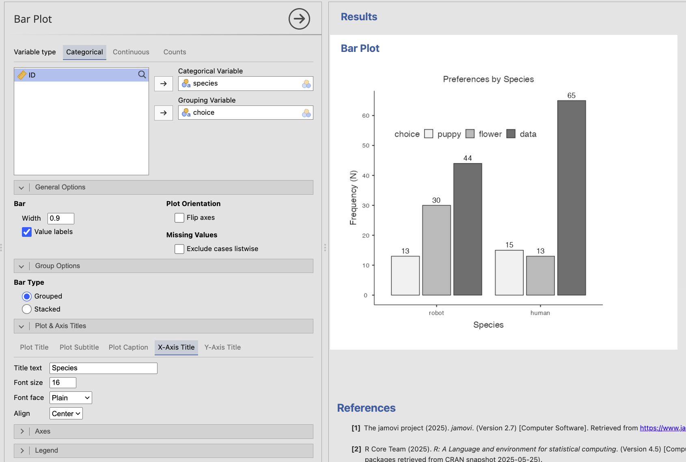

# 6.3 Visualizing One or More Categorical Variables {.unnumbered}

Categorical variables describe membership in categories. Because the values are categories rather than meaningful numerical quantities, we usually visualize them using a **bar plot**.

## One Categorical Variable

For one categorical variable, a bar plot shows the count or percentage of observations in each category. This makes it easy to see which categories are most and least common.

For example, a bar plot of preferred course format could show how many students selected in-person, online, or hybrid instruction.

When interpreting a bar plot of one categorical variable, ask:

-   Which category is most common?
-   Which category is least common?
-   Are the categories approximately balanced or very unequal?
-   Are counts or percentages more useful for the intended audience?

Counts and percentages communicate similar information when there is only one sample. Percentages are often easier to compare across studies or datasets with different sample sizes.

## Two Categorical Variables

A grouped or stacked bar plot can visualize the relationship between two categorical variables. One variable defines the main categories, and the second variable defines the groups within each category.

For example, a plot could compare preferences for puppies, flowers, or data among robots and humans. The graph should make it possible to see whether the pattern of preferences differs by species.

With two categorical variables, choosing between counts and percentages is especially important:

-   **Counts** show the number of observations in each combination of categories.
-   **Percentages** are often more useful when the groups contain different numbers of observations.

A group with a larger sample will usually have taller count bars even when the relative pattern of responses is similar. Percentages place the groups on the same scale and can make the comparison fairer.

## Creating a Categorical Bar Plot in jamovi

1.  Select **Plots → Bar Plot**.
2.  Select **Categorical** under **Variable type**.
3.  Move the primary categorical variable into **Categorical Variable**.
4.  To visualize two categorical variables, move the second variable into **Grouping Variable**.
5.  Under **Group Options**, choose **Grouped** to place bars beside one another or **Stacked** to combine them within each main category.
6.  Select **Value labels** when showing the exact counts or percentages would help the reader.
7.  Revise the title, axis titles, and legend as needed.

For the species-and-choice example, `species` could be the categorical variable and `choice` the grouping variable. Reversing them would display the same observations from a different perspective. Choose the arrangement that makes the research question easiest to answer.

::: {.callout-note title="Bar Plots Are Not Histograms"}
Bar plots display separate categories, so the bars are separated by spaces. Histograms display intervals of a continuous variable, so the bars touch because the intervals form a continuous scale.
:::
