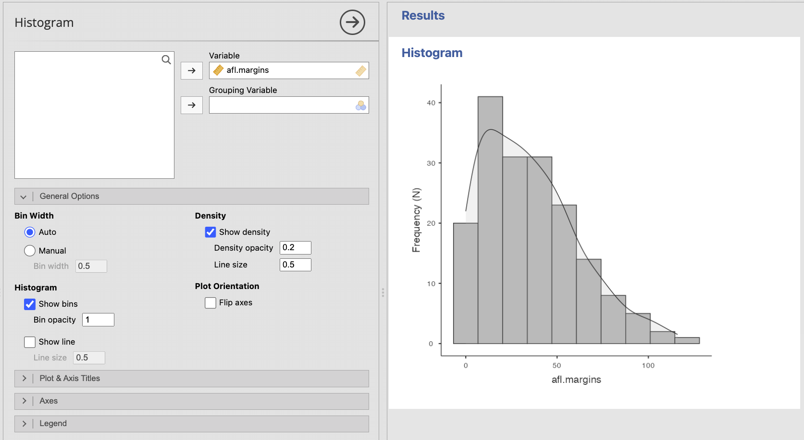
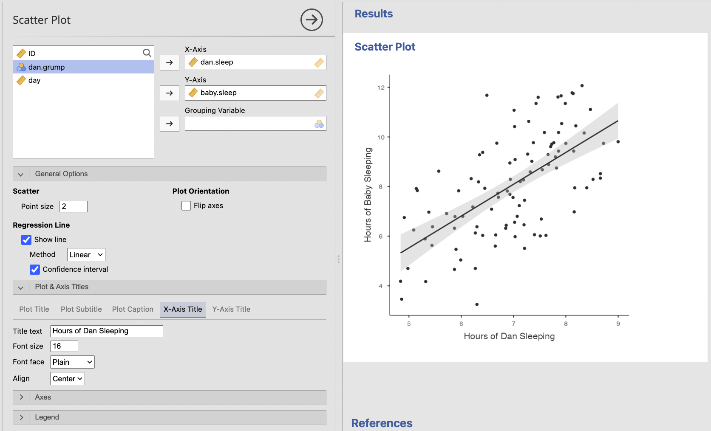
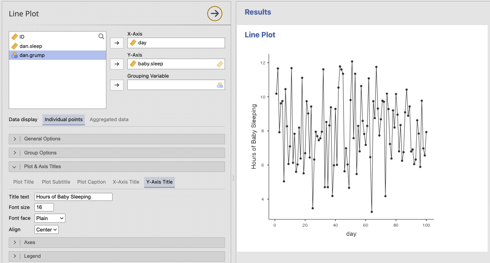

# 6.4 Visualizing One or More Continuous Variables {.unnumbered}

Continuous variables contain meaningful numerical values. The best plot depends on whether you want to examine the distribution of one variable, compare the distributions of several variables, or examine the relationship between two variables.

## Histograms: The Distribution of One Continuous Variable

A **histogram** divides a continuous variable into intervals, called bins, and shows how many observations fall within each interval. Histograms are especially useful for examining:

-   The overall shape of the distribution
-   Symmetry or skew
-   The location of most observations
-   Gaps, clusters, or multiple peaks
-   Possible extreme values

Unlike a bar plot, the bars in a histogram touch because each bar represents part of a continuous scale.

The apparent shape of a histogram can change depending on the number and width of the bins. Avoid drawing conclusions from one arbitrary bin setting alone, especially with a small sample.

### Creating a Histogram in jamovi

1.  Select **Plots → Histogram**.
2.  Move the continuous variable into **Variable**.
3.  Add an optional **Grouping Variable** only when comparing the distributions of clearly defined groups will help answer the research question.
4.  Leave **Bin Width** set to **Auto** unless you have a reason to adjust it.
5.  Select **Show density** when a smooth density curve would help reveal the overall shape.
6.  Revise the title and axis titles as needed.

You may also use **Exploration → Descriptives** when quickly inspecting a variable or checking assumptions.

## Box Plots: Compact Summaries of Continuous Variables

A **box plot** summarizes a continuous variable using the median, quartiles, and spread of the data. It can also flag possible outliers.

A box plot is less detailed than a histogram, but it is compact and makes it easier to compare several continuous variables or groups on a common scale.

When interpreting a box plot, look for:

-   The median within the box
-   The middle 50% of the data, represented by the box
-   The spread represented by the whiskers
-   Possible outliers beyond the whiskers
-   Differences in spread or skew suggested by uneven boxes or whiskers

Remember that a point flagged by a box plot is a **possible outlier**, not automatically an error or a value that should be removed.

### Creating a Box Plot in jamovi

1.  Select **Plots → Box Plot**.
2.  Move the continuous variable into **Variable**.
3.  Add **Grouping Variable 1** or **Grouping Variable 2** only when you want to compare the variable across categorical groups.
4.  Leave **Show outliers** selected so possible unusual observations remain visible.
5.  Select **Flip axes** when horizontal boxes make long category labels easier to read.
6.  Revise the title, axis titles, and legend as needed.

.png)

The **Notch** option adds an approximate interval around the median. It is not necessary for the basic box plots used in this course unless an assignment specifically requests it.

## Scatterplots: Relationships Between Two Continuous Variables

A **scatterplot** shows the relationship between two continuous variables. Each point represents one observation with a value on the x-axis and a value on the y-axis.

When interpreting a scatterplot, examine:

-   **Direction:** Is the relationship positive, negative, or absent?
-   **Form:** Is the relationship approximately linear, curved, or more complex?
-   **Strength:** How closely do the points follow the overall pattern?
-   **Unusual observations:** Are there points far from the rest of the data or from the overall relationship?

A scatterplot is important even when you plan to calculate a correlation. Two datasets can have similar correlations while having very different patterns, such as a curved relationship or an influential outlier.

### Creating a Scatterplot in jamovi

1.  Select **Plots → Scatter Plot**.
2.  Move one continuous variable into **X-Axis** and the other into **Y-Axis**.
3.  Add a categorical **Grouping Variable** only when distinguishing groups helps answer the research question.
4.  Select **Show line** when a regression line would help summarize a linear pattern.
5.  Keep the confidence interval around the fitted line when communicating uncertainty would be useful.
6.  Revise the title and axis titles as needed.

When possible, place a predictor or explanatory variable on the x-axis and an outcome variable on the y-axis. This convention does not establish causality; it simply makes the intended question easier to follow.

## Line Plots: Ordered Continuous Observations

A **line plot** connects observations across a meaningful order, such as time. It is useful when the sequence itself matters and the connecting line represents continuity or change.

Do not use a line plot merely because values can be placed in some order. Connecting points implies that movement from one x-axis value to the next is meaningful.

### Creating a Line Plot in jamovi

1.  Select **Plots → Line Plot**.
2.  Move the ordered or time variable into **X-Axis**.
3.  Move the continuous outcome into **Y-Axis**.
4.  Add a categorical **Grouping Variable** when separate lines would help compare groups.
5.  Choose **Individual points** when each row represents a meaningful paired x- and y-observation.
6.  Choose **Aggregated data** when the graph should summarize observations at each x-axis value, such as displaying a mean at each time point.
7.  Keep **Show lines** and **Show points** selected when both the pattern and the observed locations matter.
8.  Use different colors, line types, or point types when groups must remain distinguishable.
9.  Revise the title, axis titles, and legend as needed.

:::: {.callout-tip title="Check Your Understanding"}
A researcher measures stress and sleep quality for 150 participants. The researcher wants to know whether participants with greater stress tend to report poorer sleep quality.

Which plot should be used? Why would a histogram not answer the same question?

::: {.collapse title="Check Your Answer"}
A scatterplot should be used because both variables are continuous and the question concerns their relationship. A histogram would show the distribution of only one variable at a time and would not show how stress and sleep quality vary together.
:::
::::
