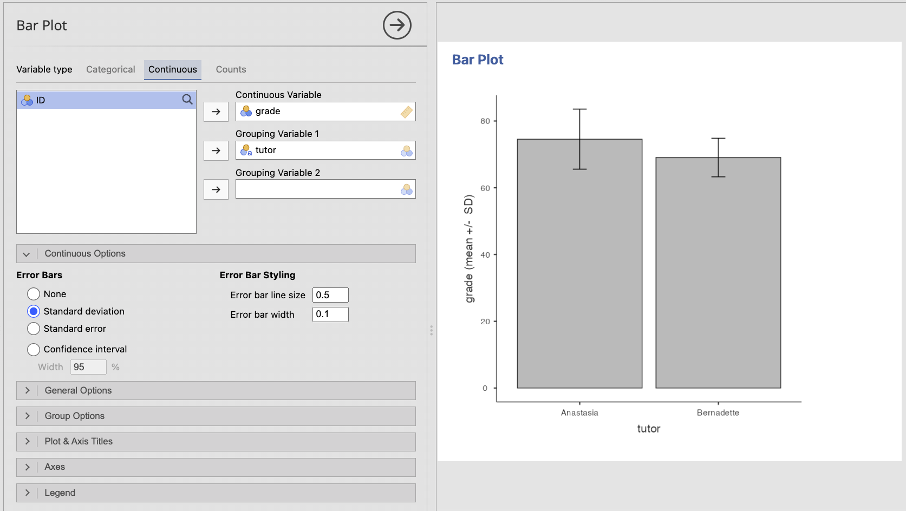
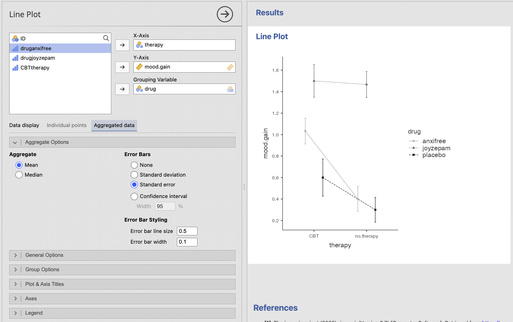

# 6.5 Visualizing a Continuous Variable Across a Categorical Variable {.unnumbered}

Many research questions compare a continuous outcome across categories. Examples include comparing exam scores across instructional formats, job satisfaction across departments, or stress across experimental conditions.

Several plots can answer this type of question. The best choice depends on whether you want to emphasize the **distribution of the observations**, a **summary of each group**, or **change across ordered categories**.

## Box Plots: Comparing Group Distributions

A grouped box plot displays a separate distribution for each category. It allows readers to compare:

-   Medians
-   Variability
-   Possible skew
-   Possible outliers
-   The extent to which the group distributions overlap

Box plots are usually preferable when you want readers to see more than just the group means.

To create a grouped box plot in jamovi:

1.  Select **Plots → Box Plot**.
2.  Move the continuous outcome into **Variable**.
3.  Move the categorical variable into **Grouping Variable 1**.
4.  Add **Grouping Variable 2** only when a second categorical distinction is important to the research question.
5.  Leave **Show outliers** selected.
6.  Revise the title, axis titles, and legend as needed.

.png)

In **Exploration → Descriptives**, jamovi can also supplement a box plot with violin shapes, jittered raw data points, and group means. These additions can reveal clusters, gaps, unusual observations, and small group sizes that a box plot alone may hide.

## Bar Plots: Comparing Group Summaries

A bar plot can display a continuous variable across one or two categorical grouping variables. In this case, the height of each bar represents the **mean** of the continuous variable rather than a count.

A bar plot of means can make group differences easy to see, but it hides the distribution of the individual observations. When using this type of plot:

-   Include error bars when available.
-   Identify what the error bars represent.
-   Do not assume that the bars show the range of the data.
-   Consider whether a box plot or raw-data display would communicate more information.

### Creating a Bar Plot of a Continuous Variable in jamovi

1.  Select **Plots → Bar Plot**.
2.  Select **Continuous** under **Variable type**.
3.  Move the continuous outcome into **Continuous Variable**.
4.  Move the primary categorical variable into **Grouping Variable 1**.
5.  Add **Grouping Variable 2** only when a second categorical grouping is necessary.
6.  Under **Continuous Options**, choose the error bars required for the analysis or assignment: **Standard deviation**, **Standard error**, or **Confidence interval**.
7.  Revise the title, axis titles, legend, and value labels as needed.

Error bars may represent a standard deviation, standard error, or confidence interval. These quantities have different meanings. You will learn more about uncertainty and confidence intervals later in the textbook. For now, make sure the graph or its caption clearly identifies what the error bars represent.

::: {.callout-note title="Do Not Choose Error Bars Only Because They Look Smaller"}
The error-bar type should match what you intend to communicate. Standard deviations describe variability among observations. Standard errors and confidence intervals describe uncertainty around an estimated mean.
:::

## Line Plots: Comparing Ordered Categories or Time Points

A line plot may be useful when the categorical variable has a meaningful order, such as measurement occasions, dosage levels, or stages of a process. Connecting the points emphasizes the pattern of change across that order.

A line plot is generally not appropriate for unordered categories such as academic major, geographic region, or treatment labels with no meaningful sequence. Connecting those categories would imply a progression that does not exist.

To create a line plot of group summaries:

1.  Select **Plots → Line Plot**.
2.  Move the ordered category or time variable into **X-Axis**.
3.  Move the continuous outcome into **Y-Axis**.
4.  Add a categorical **Grouping Variable** when separate lines should represent different groups.
5.  Select **Aggregated data** when the plot should display a summary such as the mean at each time point or ordered category.
6.  Revise the title, axis titles, and legend as needed.

For repeated-measures data, a line plot can instead display individual participants' trajectories. A plot of individual trajectories and a plot of group means communicate different information, so choose based on the question you want to answer.

::: {.callout-tip title="Choosing Between Common Options"}
Use a **box plot** when the distribution, variability, or possible outliers matter. Use a **bar plot with error bars** when the primary message is a comparison of group means. Use a **line plot** when the groups or observations have a meaningful order and the pattern of change matters.
:::

:::: {.callout-tip title="Check Your Understanding"}
A researcher compares anxiety scores across three therapy conditions. The conditions are separate treatment types with no meaningful order.

1.  Would a line plot be the best choice?
2.  What plots would be more appropriate?

::: {.collapse title="Check Your Answer"}
1.  No. Connecting the three treatment types would imply a meaningful progression from one condition to the next.
2.  A grouped box plot would show the distributions, or a bar plot with clearly identified error bars could emphasize the group means.
:::
::::
