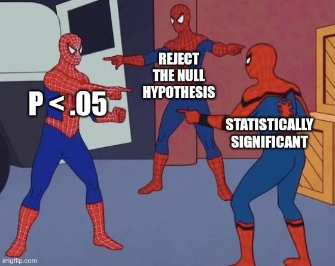

# 8.2 Alpha and p-values {.unnumbered}

Chapter 7 introduced s as part of hypothesis testing. In this section, we slow down and talk more carefully about what *p*-values mean, what  means, and why both are so easy to misuse.

## What Is a p-value?

A *p*-value is the probability of observing data as extreme as, or more extreme than, the data you observed, **assuming the null hypothesis is true**.

There are two key pieces of that definition:

1. The *p*-value is about the probability of the **data**, not the probability of the hypothesis.
2. The *p*-value is calculated assuming the **null hypothesis is true**.

Another way to say this is:

> If there really were no effect, no difference, or no relationship, how surprising would these data be?

The smaller the *p*-value, the more surprising the data are under the null hypothesis.

## What Is Alpha?

Alpha is the threshold we set for deciding whether a result counts as statistically significant. In many studies, alpha is set at .05.

If *p* < α, we reject the null hypothesis.

If *p* > α, we fail to reject the null hypothesis.

Alpha is also the Type I error rate we are willing to tolerate **if the null hypothesis is true**. If we set alpha at .05, then we are saying that, in the long run, we are willing to incorrectly reject a true null hypothesis about 5% of the time.

That does not mean there is a 5% chance that this specific result is wrong. That is one of the common misunderstandings.

## Common Misconceptions About p-values

People talk about *p*-values all the time, and not always carefully. Here are some common misconceptions:

| Misconception | Why it is wrong |
|---|---|
| A non-significant *p*-value means the null hypothesis is true. | We failed to find enough evidence against the null; we did not prove the null. |
| A significant *p*-value means the null hypothesis is false. | We rejected the null, but we could still be making a Type I error. |
| A significant *p*-value means the effect is practically important. | Practical importance depends on context and effect size. |
| A significant *p*-value means there is only a 5% chance we are wrong. | Alpha is a long-run error rate, not the probability this specific result is wrong. |

The recurring theme is this: *p*-values tell us about how surprising the data are under the null hypothesis. They do not tell us whether the null or alternative hypothesis is true.

::: {.callout-note collapse="true" title="Where These Misconceptions Come From"}
This discussion is strongly influenced by Daniel Lakens' work on statistical inference. His resources on p-value misconceptions are helpful if you want a deeper explanation of why these interpretations are wrong and why they persist.
:::

## Are p-values Bad?

You may have heard people say that *p*-values are bad, unreliable, or should be abandoned.

I understand where that frustration comes from. *p*-values are misunderstood constantly. People use them as if they prove hypotheses, measure practical importance, or give the probability that a finding is true. They do not do any of those things.

But I do not think the *p*-value itself is the villain.

The problem is often that researchers want *p*-values to do something they were never designed to do. NHST does not confirm hypotheses. It helps us decide whether our data are surprising enough under the null hypothesis to reject the null.

That is useful, but limited.

::: {.callout-note collapse="true" title="Why Do People Argue About p-values?"}
Some journals and scholars have argued that p-values should be abandoned because they are so often misused. Others argue that the better solution is to use p-values correctly and report them alongside effect sizes, confidence intervals, good design, transparent methods, and replication.

My view is closer to the second position. The p-value can be useful when we are clear about what it does and does not tell us.
:::

## Why .05?

Why is alpha often set at .05?

Mostly because of tradition. The .05 threshold became common because it was convenient: it corresponds roughly to the most extreme 5% of values under a reference distribution. Over time, that convenience hardened into convention.

But .05 is not magic.

In this course, unless stated otherwise, we will usually use α = .05. In real research, you should think carefully about whether .05 is appropriate. If false positives would be especially costly, you may want a lower alpha. If missing a real effect would be especially costly, you may want higher power.

That is another BEAN connection: alpha does not operate alone. It affects power and error rates.

## Alpha as Part of BEAN

Lowering alpha makes it harder to reject the null hypothesis. That reduces the risk of Type I errors, but it can also reduce power if everything else stays the same.

Holding effect size and sample size constant:

- Lower alpha → fewer false positives, but lower power
- Higher alpha → more power, but more false positives

This is why alpha should be a decision, not just a default we apply without thinking.
