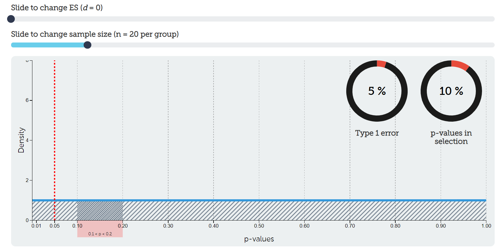

# 8.3 Power {.unnumbered}

 is the probability of observing a statistically significant result **if the alternative hypothesis is true**.

In other words, power tells us how likely we are to detect an effect if the effect really exists.

Power is often set at 80%, meaning that if the effect exists, we have an 80% chance of detecting it. That also means we have a 20% chance of missing it. That 20% is beta.

This is why beta and power are connected:

> Power = 1 - beta

::: {.callout-note collapse="true" title="Formula Note"}
If beta is the probability of a Type II error, then power is the probability of avoiding a Type II error.

For example, if beta = .20, then power = 1 - .20 = .80.
:::

## Power vs. p-values

Power and *p*-values are related to hypothesis testing, but they assume different things.

A *p*-value asks:

> If the null hypothesis is true, how surprising are these data?

Power asks:

> If the alternative hypothesis is true, how likely are we to detect the effect?

That difference matters. A small *p*-value tells us the data are surprising under the null hypothesis. It does not tell us whether the study had a good chance of detecting the effect in the first place.

## Power and Error Types

Let's connect alpha, power, Type I error, and Type II error.

In the table below, the rows represent the result of the study. The columns represent what is true in the real world. Of course, in real life, we never get to know with certainty whether the null or alternative hypothesis is true. That is why replication and good study design matter.

|  | H₀ is true | H₁ is true |
|---|---|---|
| *p* < .05 | Type I error | Correct inference |
| *p* > .05 | Correct inference | Type II error |

Now let's add BEAN language:

- **Alpha** is the probability of a Type I error if the null hypothesis is true.
- **Power** is the probability of a correct inference if the alternative hypothesis is true.
- **Beta** is the probability of a Type II error if the alternative hypothesis is true.

::: {.callout-tip title="Check Your Understanding"}
In the table below, decide where each term belongs: alpha, power, Type I error, Type II error, and correct inference.

|  | H₀ is true | H₁ is true |
|---|---|---|
| *p* < .05 | A | B |
| *p* > .05 | C | D |
:::

::: {.callout-note collapse="true" title="Suggested Answer"}
A = alpha / Type I error  
B = power / correct inference  
C = correct inference  
D = beta / Type II error

The key is to remember that alpha only matters when the null hypothesis is true, and power only matters when the alternative hypothesis is true.
:::

## Assuming the Null Is 100% True

Let's imagine the null hypothesis is 100% true. We will also use the common defaults of alpha = 5% and power = 80%.

|  | H₀ is true | H₁ is true |
|---|---:|---:|
| *p* < .05 | 5% | 0% |
| *p* > .05 | 95% | 0% |

How did we get there?

If the null hypothesis is 100% true, then the H₀ column must add to 100%. Because the hypotheses are mutually exclusive, the H₁ column must add to 0%.

Alpha is 5%, so 5% goes in the top-left cell. The remaining 95% goes in the bottom-left cell.

In this situation, power does not matter because the alternative hypothesis is not true. You cannot detect an effect that does not exist.

If we tested this nonexistent effect 100 times, about 95 of those studies would correctly fail to reject the null hypothesis. About 5 would incorrectly reject the null hypothesis and produce Type I errors.

## Assuming the Alternative Is 100% True

Now let's imagine the alternative hypothesis is 100% true. Again, alpha = 5% and power = 80%.

|  | H₀ is true | H₁ is true |
|---|---:|---:|
| *p* < .05 | 0% | 80% |
| *p* > .05 | 0% | 20% |

If the alternative hypothesis is 100% true, then the H₁ column must add to 100%, and the H₀ column must add to 0%.

Power is 80%, so 80% goes in the top-right cell. The remaining 20% goes in the bottom-right cell. That 20% is beta, or the Type II error rate.

If we tested this real effect 100 times, about 80 studies would correctly detect the effect. About 20 studies would miss it.

## Assuming a 50/50 Split

In reality, we do not know whether the null or alternative hypothesis is true. For practice, let's imagine we are 50/50: half the probability is in the null-hypothesis column, and half is in the alternative-hypothesis column.

Again, alpha = 5% and power = 80%.

|  | H₀ is true | H₁ is true |
|---|---:|---:|
| *p* < .05 | 2.5% | 40% |
| *p* > .05 | 47.5% | 10% |

How did we get there?

Each column has to add to 50%. Alpha is 5% of the null column, so 5% of 50% is 2.5%. Power is 80% of the alternative column, so 80% of 50% is 40%.

Now imagine you got a statistically significant result. In this example, that significant result could fall in either of the top cells. It could be a Type I error (2.5%) or a correct inference (40%).

The statistically significant result is 16 times more likely to come from the alternative-hypothesis column than the null-hypothesis column:

> 40 / 2.5 = 16

That is not a perfect guarantee. It is just a way to reason through how alpha and power shape our decisions.

## Increasing Power

Now let's keep the 50/50 split but increase power to 95%. Alpha stays at 5%.

|  | H₀ is true | H₁ is true |
|---|---:|---:|
| *p* < .05 | 2.5% | 47.5% |
| *p* > .05 | 47.5% | 2.5% |

Now a statistically significant result is 19 times more likely to come from the alternative-hypothesis column than the null-hypothesis column:

> 47.5 / 2.5 = 19

Increasing power helps. It makes us more likely to detect a real effect.

## Decreasing Alpha

Now let's return to 80% power but lower alpha from 5% to 1%. We will keep the 50/50 split.

|  | H₀ is true | H₁ is true |
|---|---:|---:|
| *p* < .01 | 0.5% | 40% |
| *p* > .01 | 49.5% | 10% |

Now a statistically significant result is 80 times more likely to come from the alternative-hypothesis column than the null-hypothesis column:

> 40 / 0.5 = 80

This is why lowering alpha can substantially reduce false positives. But remember the tradeoff: lowering alpha can also reduce power unless you increase sample size, target a larger effect, or make other design changes.

## Your Turn

Assume the null and alternative hypotheses are equally likely. Set alpha to 1% and power to 95%.

Fill in the table and calculate how much more likely a statistically significant result is to come from the alternative-hypothesis column than the null-hypothesis column.

|  | H₀ is true | H₁ is true |
|---|---:|---:|
| *p* < .01 | A | B |
| *p* > .01 | C | D |

::: {.callout-note collapse="true" title="Suggested Answer"}
Because H₀ and H₁ are equally likely, each column must add to 50%.

Alpha is 1%, so 1% of 50% is 0.5%. That means:

- A = 0.5%
- C = 49.5%

Power is 95%, so 95% of 50% is 47.5%. That means:

- B = 47.5%
- D = 2.5%

A statistically significant result is 95 times more likely to come from the alternative-hypothesis column than the null-hypothesis column:

47.5 / 0.5 = 95
:::

## How This Connects to BEAN

So far, we have focused mostly on alpha and power. But power also depends on effect size and sample size.

Holding everything else constant:

- Larger effect size → higher power
- Larger sample size → higher power
- Lower alpha → lower power
- Higher desired power → larger required sample size

BEAN!
