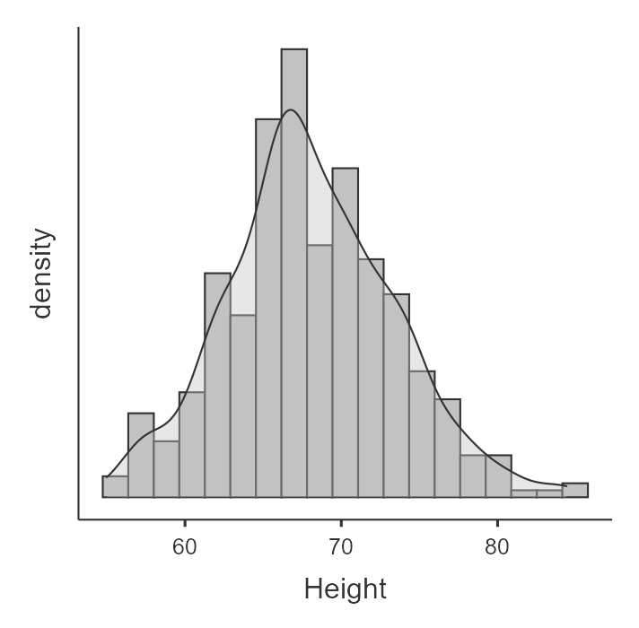
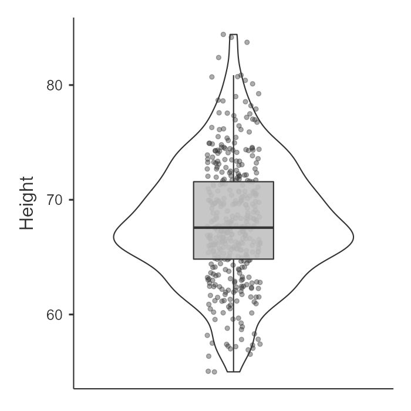
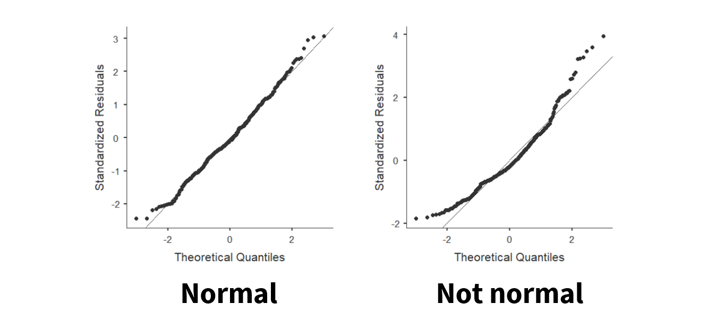
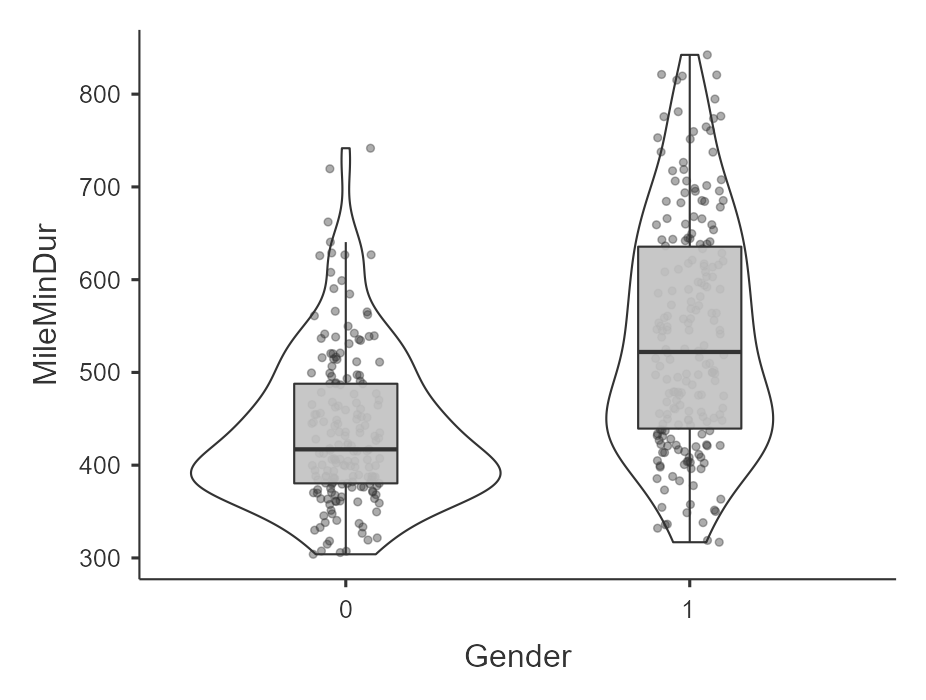

# 9.2 Parametric Assumptions {.unnumbered}

Most of the inferential statistics we'll be learning in this class are *parametric statistics*, which means they rely on certain assumptions about the data.

These assumptions are critical because:

> Violating assumptions can lead to incorrect or misleading conclusions—even if everything else in your analysis looks correct.

This is why **checking assumptions is a key part of Step 2 in our 4-step framework**.

In this class, we will focus on assumptions related to the normal distribution and related properties of the data.


## Why assumptions matter

Inferential statistics are built on mathematical models. These models assume that the data behave in certain ways. When those assumptions are met, our statistical tests work as expected.

When assumptions are violated:

-   p-values may be inaccurate
-   effect sizes may be misleading
-   conclusions may not be valid

> Checking assumptions helps ensure that your results are trustworthy.

It's important to check assumptions because your data may not always be what they seem. You need to look at your data in all sorts of ways to make sure it's satisfactory for inferential statistics.


There are four basic assumptions of most parametric tests:

1.  Interval or ratio (i.e., continuous) dependent variable
2.  Independent scores on the dependent variable
3.  Normal distribution
4.  Homogeneity of variances

[This video](https://www.youtube.com/watch?v=zNbF006Y5x4) recaps the rest of the chapter in another format.

```{r echo = FALSE, eval = knitr::is_html_output(excludes = "epub"), message = FALSE, warning = FALSE}
library(vembedr)
embed_url("https://www.youtube.com/watch?v=tNojQp7DQt8")
```

Let's discuss these in turn and how to test for them.

## 1. Interval/ratio data

If we are performing a parametric test, then the dependent variable (DV) must be measured at the interval or ratio level (i.e., continuous).

It is important that the data have proportional intervals between values. Ordinal variables often do not meet this assumption.

A common issue is treating Likert-scale items as continuous variables. A single Likert item is ordinal, and we technically cannot calculate a mean or difference between ordinal values. However, it is common practice to average or sum multiple Likert items and treat that composite score as continuous (although some argue this is still inappropriate).

There is no formal statistical test for this assumption. Instead, you must determine:

-   what type of variable you are working with
-   how it was measured

## 2. Independent scores

This assumption refers to **independence between participants**, not within participants.

-   In **between-subjects designs**, each participant’s score should be independent of every other participant’s score.

-   In **within-subjects designs**, scores within a participant are expected to be related—but participants should still be independent of one another.

A violation occurs when data are **nested or clustered**, such as:

-   students within the same classroom
-   employees within the same organization

In these cases, participants within a group may be more similar than expected, violating independence.

Like the previous assumption, this is not something we formally test. Instead, it depends on:

-   how the data were collected
-   the structure of the sample

## 3. Normal distribution

For most parametric tests, the dependent variable should be approximately normally distributed.

A **normal distribution** (or bell-shaped curve) has several key properties:

-   Data are symmetrically distributed around the mean

-   Skew and kurtosis are approximately 0

-   The mean and median are equal

-   We know the proportion of data within standard deviations of the mean

We will use **four complementary approaches** to evaluate normality:

a.  Visualize the distribution

b.  Examine skew and kurtosis

c.  Conduct a Shapiro-Wilk test

d.  Examine the Q-Q plot

::: {.callout-note}
You should use multiple methods when checking normality. These methods do not always agree, so you must make a judgment as a researcher.

Personally, I tend to prioritize visual inspection and err on the side of caution.
:::

Let's practice using the variable Height from an example dataset.

### a. Visualize the distribution

In jamovi:

-   Go to **Exploration → Descriptives**
-   Under *Plots*, select:
    -   Histogram and/or density plot

    -   Boxplot, violin plot, and/or data points

We visually inspect whether the distribution resembles a bell-shaped curve.

In the following example, height appears approximately normally distributed.

{width="400"}

{width="400"}

### b. Test the skew and kurtosis

In jamovi:

-   Go to **Exploration → Descriptives → Statistics**

-   Select skew and kurtosis

For our example of height, here is our skew and kurtosis:

|                     |            |
|---------------------|------------|
| **Descriptives**    | **Height** |
| Skewness            | .230       |
| Std. error skewness | .121       |
| Kurtosis            | .113       |
| Std. error kurtosis | .241       |

We need to calculate *z*-scores for skew and kurtosis. We do that by dividing the value by its standard error:

-   Skew: .230 / .121 = 1.90

-   Kurtosis: .113 / .241 = .47

Interpretation:

-   If \|z\| \< 1.96 → not significant → approximately normal

-   If \|z\| \> 1.96 → significant → not normal

::: {.callout-note}
Why 1.96? 1.96 is the critical value of z when alpha is .05 and we have a two-tailed test.
:::

### c. Shapiro-Wilk test

In jamovi:

-   Go to **Exploration → Descriptives → Statistics**

-   Select Shapiro-Wilk

For our example of height, Shapiro-Wilk's for height is 68.03, *p* = .070.

Interpretation:

-   p \> .05 → normality assumption met

-   p \< .05 → violation

::: {.callout-note}
This may feel counterintuitive: we want non-significant results because the null hypothesis is that the data are normally distributed.
:::

### d. Q-Q plot

In jamovi:

-   Go to **Exploration → Descriptives → Plots**
-   Select Q-Q plot

We look for points falling along the diagonal line.

-   Left: approximately normal
-   Right: not normal

{alt=""}

Focus primarily on the center of the distribution; small deviations at the tails are common.

Here's a video by Alexander Swan on [interpreting a Q-Q plot in jamovi](https://www.youtube.com/watch?v=sLhFc-4qSXE):

```{r echo = FALSE, eval = knitr::is_html_output(excludes = "epub"), message = FALSE, warning = FALSE}
library(vembedr)
embed_url("https://www.youtube.com/watch?v=sLhFc-4qSXE")
```

## 4. Homogeneity of variance

The third assumption of many parametric statistics is that the variance in the DV needs to be the same at each level of the IV. If we fail to meet the assumption, we say we have heterogeneity. It might help you to remember that the prefix *homo* means same and *hetero* means different.

::: {.callout-note}
Normality applies only to the DV overall.

Homogeneity of variance applied to the DV *within each group of the IV.*
:::

We can evaluate this assumption in three ways:

a.  Visualize inspection

b.  Comapring variance values

c.  Levene's test

::: {.callout-note}
As with normality, these methods may not always agree. Use judgment and justify your decision.
:::

### a. Visual inspection

In jamovi:

-   Go to **Exploration** and select **Descriptives**
-   Move the DV to the *variables* box
-   Move the IV to the *Split by* box
-   Select boxplot, violin, and/or jittered data

Interpretation: Large differences in the spread of data visually suggest a violation of the assumption of homogeneity of variance

For example, here's an example of data that violates the assumption of homogeneity of variance (gender by mile time) because the variance in scores for females (coded as 1) is a lot wider than the variance in scores for males (0). I am looking at the data points and violin plot to see the spread; the 1 looks wider where as the 0 looks skinnier.

{width="500"}

### b. Compare variance values

In jamovi:

-   Go to **Exploration** and select **Descriptives**
-   Move the DV to the *variables* box
-   Move the IV to the *Split by* box
-   Under Statistics, select variance

Interpretation: large differences in variance values suggest a violation of the assumption of homogeneity of variance

Example:

-   Male variance in mile duration in minutes: 6796.20

-   Female variance in mile duration in minutes: 15401.55

Females have 2.26 times greater variance compared to males. Clearly, there is much greater variability for females than males for time it takes to run the mile.

### Levene's test

In jamovi:

-   Go to **ANOVA → One-way ANOVA**
-   Move your continuous DV to the Dependent Variables box
-   Move your categorical IV to your Grouping Variable box
-   Check *homogeneity test*
-   Only look at the Levene's test; ignore everything else at this moment

Interpretation:

-   p \> .05 → assumption met
-   p \< .05 → violation

Here's our example of gender on mile duration in minutes. In this case, because the p-value is \< .05, it indicates we violated the assumption of homogeneity of variance.

Here's the result of Levene's test for the effect of gender on mile duration:

| Levene's   |     F | df1 | df2 |      p |
|:-----------|------:|----:|----:|-------:|
| MileMinDur | 41.33 |   1 | 381 | \<.001 |

::: {.callout-note}
Again, we want non-significant results because the null hypothesis is that variances are equal.
:::

## Recapping parametric assumptions

Let's summarize the four assumptions and generally how to test for them:

1.  **Interval or ratio (i.e., continuous) dependent variable**
    1.  Know your levels of measurement and make sure the dependent variable is continuous.
2.  **Independent scores on the dependent variable**
    1.  Know your research design and how the data was collected. Make sure that one participant's data isn't thought to affect another participant's data.
3.  **Normal distribution of the dependent variable**
    1.  Visualize the distribution with a histogram and/or density plot of the dependent variable

    2.  Test the skew and kurtosis by calculating the *z*-scores

    3.  Test using the Shapiro-Wilk test

    4.  Examine the Q-Q plot for deviations from the diagonal line
4.  **Homogeneity of variances**
    1.  Visualize the distribution by a boxplot, violin plot, and/or data (jittered recommended) with the dependent variable split by the independent variable
    2.  Examine the variances of the dependent variable split by the independent variable
    3.  Test using Levene's test


::: {.callout-tip title="Check Your Understanding"}
1.  Why is it important to check assumptions before running inferential tests?

2.  Which assumptions are determined conceptually (not tested statistically)?

3.  For normality, do we want statistically significant or non-significant results? Why?

4.  What does Levene’s test evaluate?

5.  What does it mean if data are “nested”?
:::

::: {.callout-tip collapse="true" title="Answers"}
1.  Because violations can lead to incorrect or misleading conclusions

2.  Continuous DV and independence

3.  Non-significant results, because the null hypothesis is that the data are normally distributed

4.  Whether variances are equal across groups

5.  Data where participants are grouped (e.g., classrooms), making them more similar within groups than expected
:::

## Looking ahead

In this section, we focused on identifying and evaluating assumptions.

In the next section, we will answer a critical question:

> What should we do when these assumptions are violated?
