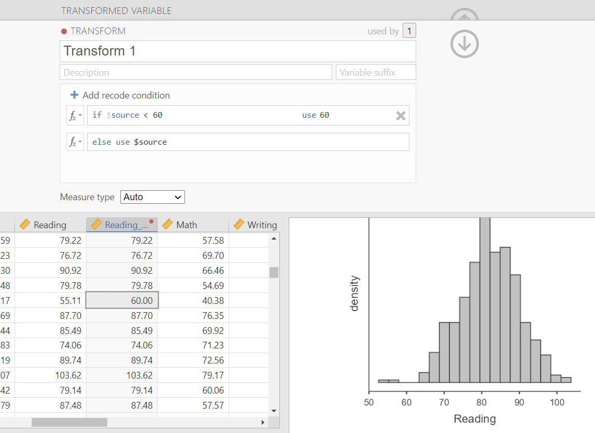

# 9.3 Violated Assumptions {.unnumbered}

In the previous section, we learned how to identify and evaluate the assumptions of parametric tests.

But what happens when those assumptions are **not** met?

> Violations of assumptions are common—and they do not mean your analysis is “ruined.”

Instead, they require you to make thoughtful decisions about how to proceed.


## A general approach

When an assumption is violated, you have several options depending on:

-   the type of violation
-   the severity of the violation
-   your research goals

Broadly, your options include:

-   choosing a different statistical test
-   modifying your data (carefully and transparently)
-   using alternative approaches that are more appropriate for your data

In this section, we will walk through what to do for each assumption. This [video](https://www.youtube.com/watch?v=ypF1omeM-7g) also walks through the chapter.

```{r echo = FALSE, eval = knitr::is_html_output(excludes = "epub"), message = FALSE, warning = FALSE}
library(vembedr)
embed_url("https://www.youtube.com/watch?v=ypF1omeM-7g")
```


## Interval/ratio data

If you are trying to perform a statistical test with a categorical DV, the answer is simple:

> Use a statistical test that is appropriate for a categorical dependent variable.

Do **not** try to treat a categorical variable as continuous.

For example:

-   Ordinal DV + categorical IV → chi-square\
-   Ordinal DV + continuous IV → logistic regression (not covered in this course)

Refer back to Section 9.1 to identify appropriate tests for categorical outcomes.


## Independent data

If you violate the assumption of independence, this is a **design issue**, not a data issue.

This typically occurs with **nested or clustered data**, such as:

-   students within classrooms\
-   employees within organizations

In these cases, you need statistical methods that account for dependence, such as:

-   multilevel modeling (hierarchical modeling)

We will not cover these methods in this course, but it is important to recognize:

> Violations of independence cannot be “fixed” with simple data adjustments.


## Normality or homogeneity of variance

If you violate either normality or homogeneity of variance, you have several options:

A.  Remove outliers
B.  Winsorize or trim the data
C.  Transform the data
D.  Perform a non-parametric test

::: {.callout-note}
A common concern is whether modifying data “invalidates” the analysis.

Outliers and non-normal data can distort statistical results. Adjusting data is often about making it more appropriate for the assumptions of the test. Any changes should be transparently reported so others can evaluate your decisions.
:::

### A: Remove outliers

Before doing anything else, check for outliers.

- **Univariate outliers** → examine individual variables  
- **Multivariate outliers** → require more advanced methods (e.g., Mahalanobis distance, Cook’s distance; not covered here)

What can you do with outliers?

1. Ignore them: not recommended  
2. Delete them: generally not recommended (loss of data)  
3. Winsorize or trim: often appropriate for a few extreme values  
4. Transform the variable: useful when many outliers exist  

### B. Winsorize or trim the data

- **Winsorizing** → used when both tails have outliers  
- **Trimming** → used when outliers are on one side of the distribution of data (e.g., the high or low end but not both) 

In both cases, extreme values are replaced with less extreme values.

In jamovi, this can be done using the **Transform** feature.

Example:
- Replace values < 60 with 60 (trimming)  
- Replace values > 100 with 100 and values < 20 with 20 (winsorizing)  



### C. Transforming data

If violations persist, you can transform the entire variable.

Common transformations:

+---------------+------------------------------------------+-----------------------------+-----------------------------+---------------------------------+
| Name          | Syntax                                   | Corrects positive skew?     | Corrects negative skew?     | Helps unequal variances?        |
+===============+==========================================+=============================+=============================+=================================+
| Log           | log(X)                                   | Yes                         | No                          | Yes                             |
+---------------+------------------------------------------+-----------------------------+-----------------------------+---------------------------------+
| Square Root   | sqrt(X)                                  | Yes                         | No                          | Yes                             |
+---------------+------------------------------------------+-----------------------------+-----------------------------+---------------------------------+
| Reciprocal    | 1/X                                      | Yes                         | No                          | Yes                             |
+---------------+------------------------------------------+-----------------------------+-----------------------------+---------------------------------+
| Reverse Score | (1+MAX) - X, then transform              | No                          | Yes                         | No                              |
+---------------+------------------------------------------+-----------------------------+-----------------------------+---------------------------------+

After transforming your data:

> You must re-check assumptions using your new variable.

### D. Non-parametric tests

If transformations and adjustments do not resolve the issue, you can use a **non-parametric test**.

Non-parametric tests:

- Do not rely on normality  
- Are more robust to violations  
- Often have lower statistical power when assumptions *are* met  

> Parametric tests are preferred when assumptions are met, but non-parametric tests are more appropriate when assumptions are violated.

As we move into specific statistical tests, you will learn the non-parametric equivalents (e.g., Mann–Whitney instead of independent t-test).


## Putting it all together

When assumptions are violated, think through your options in order:

1. Check for and address outliers  
2. Consider transformations  
3. If needed, use a non-parametric alternative  

> There is no single “correct” solution—your goal is to make a justified and transparent decision.


::: {.callout-tip title="Check Your Understanding"}
1. What should you do if your dependent variable is categorical but you planned to use a parametric test?  

2. Why is violating independence different from violating normality?  

3. What is one advantage and one disadvantage of removing outliers?  

4. When would you use a transformation instead of winsorizing?  

5. When should you use a non-parametric test?  
:::

::: {.callout-tip collapse="true" title="Answers"}
1. Use a statistical test appropriate for a categorical dependent variable  

2. Because independence is a design issue and cannot be fixed through simple data adjustments  

3. Advantage: removes extreme influence; Disadvantage: reduces sample size  

4. When there are many outliers or a skewed distribution across the entire variable  

5. When assumptions are violated and cannot be resolved through other methods  
:::