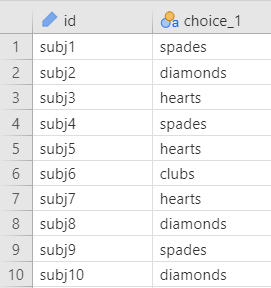
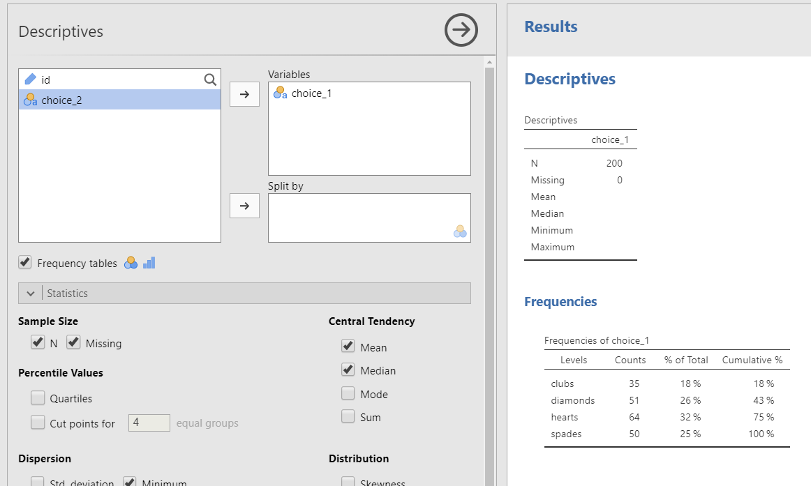
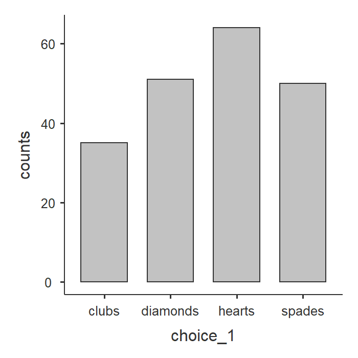
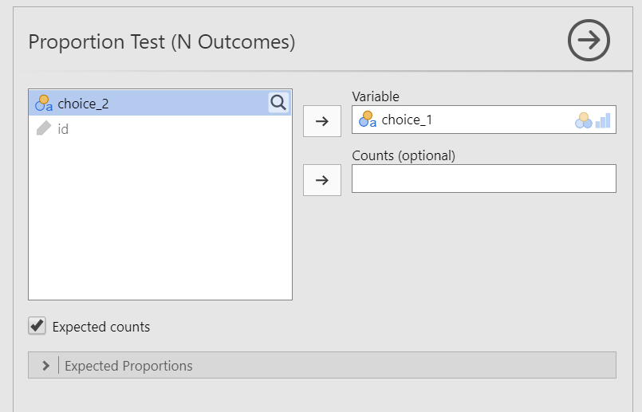
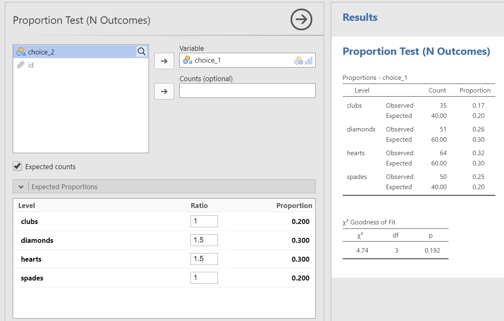
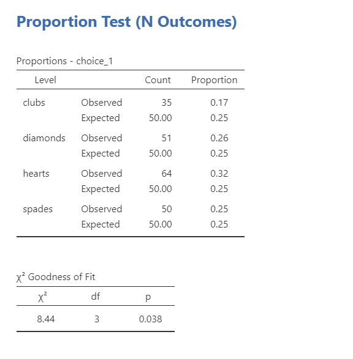
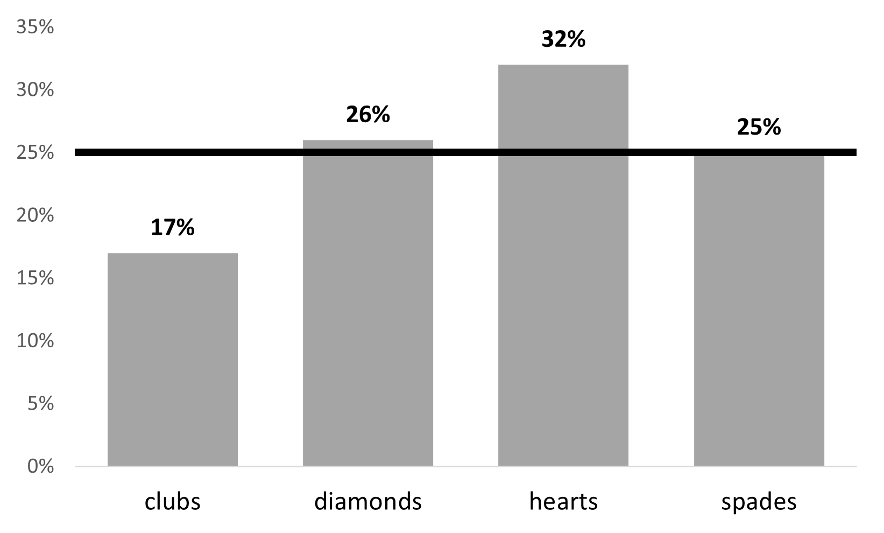

# 11.1 Chi-Square Goodness-of-Fit {.unnumbered}

```{r, echo = FALSE, message=FALSE}
library(tidyverse)
library(viridis)
options(knitr.graphics.auto_pdf = TRUE)
```

The $\chi^2$ (chi-square) goodness-of-fit test determines whether the observed frequencies for one categorical variable match a specified set of expected frequencies.

The general hypotheses for a chi-square goodness-of-fit test are:

-   $H_0$: The population proportions match the expected proportions.

-   $H_1$: At least one population proportion differs from its expected proportion.

::: {.danger data-latex=""}
These general statements should be adapted to your specific research question. For example, when testing whether people choose card suits randomly, the null hypothesis would state that each of the four suits has a probability of .25.
:::

The chi-square goodness-of-fit test is nondirectional: it tests whether the observed distribution differs from the expected distribution, not whether a particular category is higher or lower than expected.

## Step 1: Look at the Data

Let’s use the `randomness` dataset from the `lsj-data` library. In this study, participants selected two cards from a deck. For this example, we will analyze `choice_1`, the suit of the first card selected, to determine whether participants selected the four suits with equal probability.

The following [video walks through the chi-square goodness-of-fit example](https://www.youtube.com/watch?v=Pg1EA0eh2p0) used in this section.

```{r echo = FALSE, eval = knitr::is_html_output(excludes = "epub"), message = FALSE, warning = FALSE}
library(vembedr)
embed_url("https://www.youtube.com/watch?v=Pg1EA0eh2p0")
```

### Data Setup

In the raw-data format, a chi-square goodness-of-fit test requires one categorical variable, with one row for each participant or observation. In this example, `choice_1` records the suit selected by each participant.



### Describe the Data

Once we confirm that the data are set up correctly in jamovi, we should examine the frequencies and percentages for each category. For a nominal variable such as `choice_1`, the mean and median are not meaningful. Instead, select **Frequency tables** to obtain the number and percentage of observations in each category.

The largest percentage of participants selected hearts first (*n* = 64, 32%), followed by diamonds (*n* = 51, 25.5%), spades (*n* = 50, 25%), and clubs (*n* = 35, 17.5%).



A bar plot can visualize these descriptive statistics nicely.

{width="300"}

### Specify the Hypotheses

We want to determine whether participants selected the four card suits with equal probability. A standard deck contains 13 cards from each of four suits, so the expected proportion for each suit is .25 or 25%.

-   $H_0$: Participants select hearts, diamonds, spades, and clubs with equal probability (25%)

-   $H_1$: Participants do not select all four suits with equal probability; at least one suit has a probability different from 25%.

::: {.callout-tip title="Check Your Understanding"}

A university reports that its student population is 40% first-year students, 30% sophomores, 20% juniors, and 10% seniors. A researcher collects a sample and wants to determine whether the class-year distribution in the sample matches the university population.

1. Would equal expected proportions be appropriate?
2. What expected proportions should be entered in jamovi?
3. Write the null hypothesis.

::: {.collapse title="Check Your Answer"}

1. No. The university population is not evenly distributed across the four class years.
2. The expected proportions are .40, .30, .20, and .10.
3. The null hypothesis is that the proportions of first-year students, sophomores, juniors, and seniors in the population represented by the sample match the university proportions of .40, .30, .20, and .10.
:::
:::

## Step 2: Check Assumptions

The chi-square goodness-of-fit test assumes that observations are independent and that the expected frequencies are sufficiently large.

1.  **Independent observations:** Each participant or observation should contribute to only one category. This assumption must be evaluated from the study design.

2.  **Sufficiently large expected frequencies:** As a general guideline for this course, each expected frequency should be at least 5. Select **Expected counts** in jamovi and verify that each expected count meets this guideline.

In this example, each participant contributes one `choice_1` observation, and one participant’s selection does not determine another participant’s selection. The independence assumption is therefore met. The expected count for each suit is 50 (25% of 200 selections), so the expected-frequency assumption is also met.

::: {.callout-tip title="Check Your Understanding"}

A researcher asks 40 participants to select their favorite of five campus dining options. The expected proportion for each option is .20.

1. What is the expected frequency for each dining option?
2. Is the expected-frequency guideline met?
3. What additional assumption must be evaluated from the study design?

::: {.collapse title="Check Your Answer"}

1. The expected frequency is (40 \times .20 = 8) for each option.
2. Yes. Each expected frequency is at least 5.
3. The observations must be independent. Each participant should contribute to only one category, and one participant’s response should not determine another participant’s response.
:::
:::

## Step 3: Perform the Test

To perform the chi-square goodness-of-fit test in jamovi:

1.  Go to the Analyses tab, click the Frequencies button, and choose "One sample proportion tests - N outcomes".

2.  Move your variable into the Variable box. In this case, move `choice_1` into the Variable box.

3.  Select **Expected counts** so you can check for your assumption of expected frequencies.

When you are done, your setup should look like this:



### Specifying Unequal Expected Proportions

By default, jamovi assumes equal expected proportions across all categories. In this example, the expected proportion is .25 for each of the four suits. However, some research questions involve unequal expected proportions. For example, you might test whether a binary distribution in a sample matches a population distribution of 36% in one category and 64% in the other.

Use **Expected Proportions** to enter the proportions specified by the null hypothesis. These values define the expected distribution; they are not the same as checking whether the resulting expected counts are sufficiently large.

For example, suppose the null hypothesis predicts that red cards will be selected more frequently than black cards. We can enter those predicted proportions in jamovi and test whether the observed distribution differs from that specified distribution. In the example below, the observed frequencies do not differ significantly from the unequal expected proportions entered in the analysis.



## Step 4: Interpret Results



The first table displays the observed and expected frequencies. Because the null hypothesis assigns equal probability to four categories, the expected frequency for each suit is (N/k = 200/4 = 50), or 25% of the sample. All expected frequencies exceed 5, so the expected-frequency assumption is met.

The second table presents the chi-square test. The result is statistically significant, *p* = .038, so we reject the null hypothesis that all four suits are selected with equal probability. The degrees of freedom equal the number of categories minus one: (df = k - 1 = 4 - 1 = 3).

This jamovi analysis does not provide an effect-size estimate for the goodness-of-fit test. An effect size such as Cohen’s (w) can be calculated using other software, but it is not required for the analyses in this course.

::: {.callout-tip title="Check Your Understanding"}

A chi-square goodness-of-fit test is statistically significant. One category has more observations than expected, and another has fewer observations than expected.

Can you conclude from the omnibus chi-square test alone that each of those two categories differs significantly from its expected frequency?

::: {.collapse title="Check Your Answer"}

No. The significant omnibus test indicates that the overall observed distribution differs from the expected distribution somewhere. Descriptive differences can be discussed, but identifying which individual categories differ significantly requires additional follow-up analyses, such as the standardized residuals which jamovi currently does not provide for a goodness-of-fit test.

:::
:::

### Write Up the Results in APA Style

We can write up our results in APA something like this:

> Of the 200 participants in the experiment, 64 selected hearts for their first choice, 51 selected diamonds, 50 selected spades, and 35 selected clubs. A chi-square goodness-of-fit test was conducted to test whether the choice probabilities were identical for all four suits and indicated that the four suits were not selected with equal probability,$\chi^2$ (3) = 8.44; *p* = .038. Participants selected hearts more frequently than expected and clubs less frequently than expected.

This example includes the descriptive frequencies, identifies the analysis, reports the test statistic and *p*-value, and interprets the result. Depending on the number of categories, the descriptive frequencies could instead be presented in a table. See Chapter 10 for the required components of an APA-style results section.

### Visualize the Results

We can easily visualize the results using the Plots feature in jamovi. Select **Bar Plot**, ensure you are in variable type Categorical, and move `choice_1` to the Categorical Variable box.

The default is a good start, but you should retitle the x-axis with a descriptive label rather than the variable name, such as “Card Pull Choice #1.” To change the capitalization or order of the card suits, edit the variable’s levels in the data setup before creating the graph.


A more informative graph can display the observed percentages together with a reference line representing the expected percentage of 25%. The following graph was created in Excel using instructions from [this tutorial](https://exceljet.net/chart/column-chart-with-target-line):

{width="500"}
