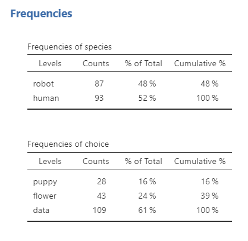
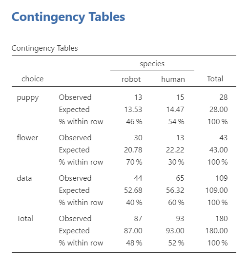
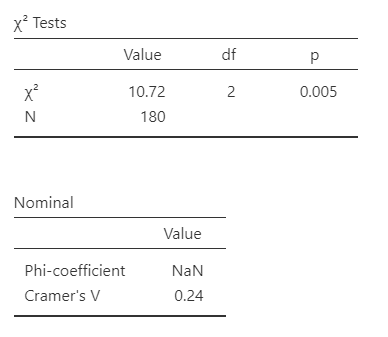
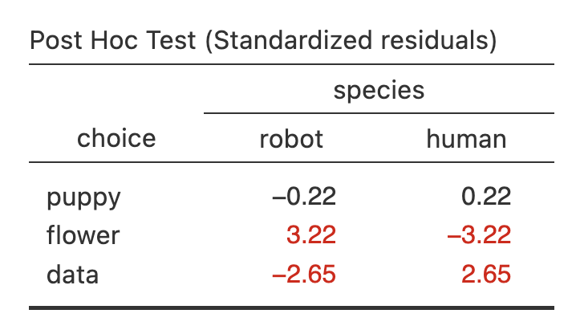
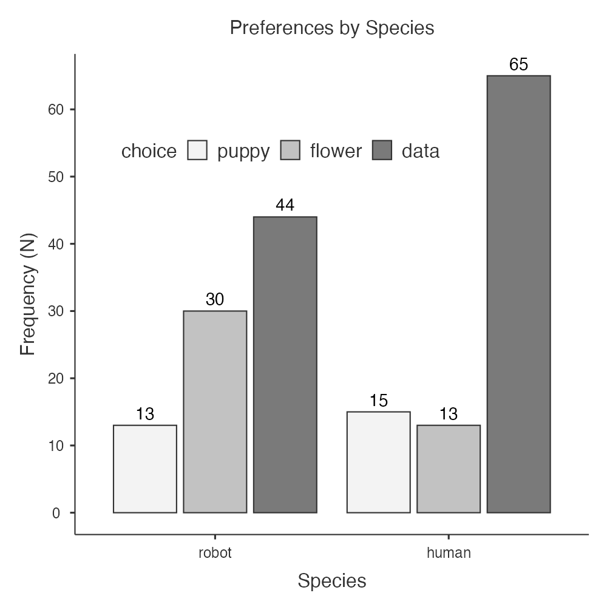
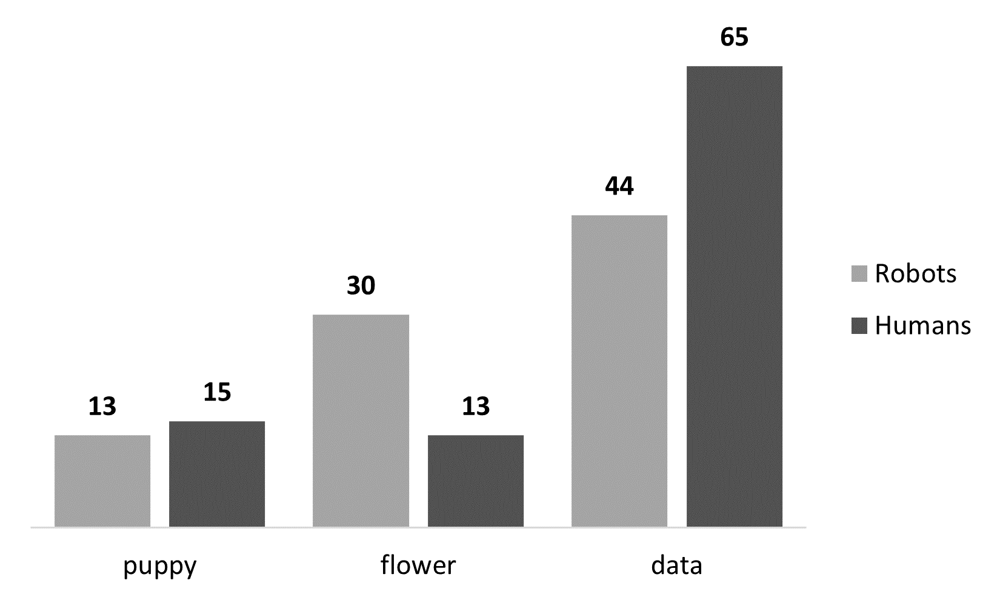
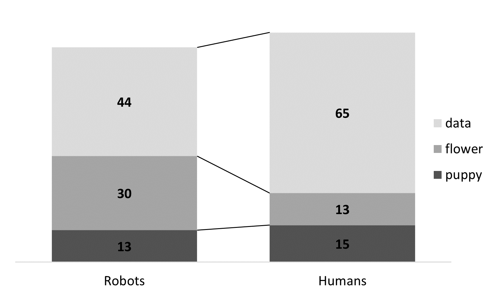

# 11.2 Chi-Square Test of Independence {.unnumbered}

```{r, echo = FALSE, message=FALSE}
library(tidyverse)
library(viridis)
options(knitr.graphics.auto_pdf = TRUE)
```

The $\chi^2$ (chi-square) test of independence, also called a test of association, determines whether two categorical variables are related. It compares the observed frequencies in a contingency table with the frequencies that would be expected if the two variables were independent.

The general hypotheses for the chi-square test of independence are:

-   $H_0$: The two categorical variables are independent; the distribution of one variable is the same across the categories of the other variable.

-   $H_1$: The two categorical variables are associated; the distribution of one variable differs across at least one category of the other variable.

::: {.warning data-latex=""}
Adapt these general hypotheses to the variables in your study. Both categorical variables should be clearly identified in the hypotheses.
:::

The omnibus chi-square test is nondirectional. It determines whether an association exists but does not, by itself, identify which cells account for that association.

The dimensions of a contingency table are often described using language such as a “2 × 3 chi-square test of independence.” This indicates that one variable has two categories and the other has three categories. A more detailed description might be: “We conducted a 2 (condition: experimental or control) × 3 (mood: happy, sad, or neutral) chi-square test of independence.”

## Step 1: Look at the Data

Let’s use the `chapek9` dataset from the `lsj-data` library. The dataset includes each participant’s species (robot or human) and preference for puppies, flowers, or data.

In the fictional setting of *Chapek 9*, only robots may enter the capital city. The residents attempt to distinguish robots from humans by asking whether each visitor prefers puppies, flowers, or large, properly formatted data files. We will test whether preference is associated with species.

This produces a 2 × 3 contingency table: `species` has two categories, and `choice` has three categories.

Here's a [video walking through the chi-square test of independence example](https://www.youtube.com/watch?v=6a5soxXTfkw) in this chapter.

```{r echo = FALSE, eval = knitr::is_html_output(excludes = "epub"), message = FALSE, warning = FALSE}
library(vembedr)
embed_url("https://www.youtube.com/watch?v=6a5soxXTfkw")
```

### Data Setup

In the raw-data format, the chi-square test of independence requires two categorical variables, with one row per participant or observation. The `chapek9` dataset is structured as follows:

| ID  | species | choice |
|-----|---------|--------|
| 1   | robot   | flower |
| 2   | human   | data   |
| 3   | human   | data   |
| 4   | human   | data   |
| 5   | robot   | data   |
| 6   | human   | flower |
| 7   | human   | data   |
| 8   | robot   | data   |
| 9   | human   | puppy  |
| 10  | robot   | flower |

### Describe the Data

Once we confirm that the data are set up correctly, we should examine a contingency table containing the frequencies and percentages for each combination of categories. Means and medians are not appropriate for these nominal variables. A grouped or stacked bar plot can also help us compare the distributions.



### Specify the Hypotheses

The research question is whether preference for puppies, flowers, or data is associated with whether a visitor is a human or robot. The hypotheses are:

-   $H_0$: Species and preference are independent; humans and robots have the same distribution of preferences.

-   $H_1$: Species and preference are associated; humans and robots differ in their distribution of preferences.

::: {.callout-tip title="Check Your Understanding"}

A researcher examines whether employment status—employed or unemployed—is associated with preferred course format—in person, online, or hybrid.

1. How many categorical variables are there?
2. What are the dimensions of the contingency table?
3. Write the null hypothesis.

::: {.collapse title="Check Your Answer"}

1. There are two categorical variables: employment status and preferred course format.
2. This is a 2 × 3 contingency table.
3. The null hypothesis is that employment status and preferred course format are independent. In other words, the distribution of course-format preferences is the same for employed and unemployed participants.

:::
:::

## Step 2: Check Assumptions

The chi-square test of independence has the following assumptions:

1.  **Expected frequencies are sufficiently large**. As a general guideline for this course, each expected frequency should be at least 5. For a 2 × 2 table with small expected frequencies, use [Fisher’s exact test](#fishers-exact-test).

    -   Evaluate this assumption by selecting **Expected counts** under **Cells**. Then inspect the expected count in each cell of the contingency table.

2.  **Observations are independent**, meaning each participant or case contributes to only one cell of the contingency table. When the same participants provide two paired binary responses, go to chapter [11.3 McNemar's test](11.3-mcnemars-test.qmd).

    -   This assumption must be evaluated from the study design rather than the jamovi output. A standard chi-square test of independence generally requires different, unrelated observations in the cells. McNemar’s test applies only to paired binary data, not to every within-subjects categorical design.
    
::: {.callout-tip title="Check Your Understanding"}

A researcher records pet ownership and housing type for 60 participants. Participants can appear in more than one pet category because some own both a dog and a cat.

Is the independence assumption met?

::: {.collapse title="Check Your Answer"}

No. Each participant must contribute to only one cell of the contingency table. Allowing the same participant to appear in multiple pet categories violates the independence assumption.

:::
:::

## Step 3: Perform the Test

1.  Go to the Analyses tab, click the Frequencies button, and choose "Independent Samples - $\chi^2$ test of association".

2.  Move one categorical variable into **Rows** and the other into **Columns**. For this example, move `choice` into **Rows** and `species` into **Columns**. Reversing the variables will not change the chi-square statistic, although it will change how the table and percentages are displayed. Placing the variable with more categories in the rows often produces a table that fits more easily on a portrait-oriented page.

3.  Under **Statistics**, select $\chi^2$ under **Tests** and select **Phi and Cramer’s V** under **Nominal** to request an effect-size estimate.

4.  Select **Expected Counts** under Cells to test your assumption of expected frequencies. You can also request the row, column, and total percentages. I often find these easier to report and interpret.

5.  Select **Standardized residuals (adjusted Pearson)** under **Post Hoc Tests**. Cells with an absolute adjusted residual greater than approximately 1.96 contribute more strongly than expected to the significant association. The default highlighting threshold of 2 provides a close approximation.

### Ordinal Variables

The chi-square test can still be used when one or both variables are ordinal, but $\chi^2$, Phi, and Cramer’s V do not incorporate the ordering of the categories. When the order is substantively meaningful, jamovi also provides ordinal measures of association.

-   **Kendall’s tau-b** adjusts for tied observations and is commonly used when the two ordinal variables have the same or similar numbers of categories.

<!-- -->

-   **Gamma** measures ordinal association but does not adjust for tied pairs, so it may produce a larger estimate when many ties are present.

When the table is strongly rectangular, other ordinal measures such as Kendall’s tau-c may be preferable, although they are not covered in this course.

Choose the measure that best matches the structure of the table and explain why it is appropriate. For the nominal variables in the current example, report Cramer’s V.

## Step 4: Interpret Results

The output below includes the observed frequencies, expected frequencies, row percentages, chi-square test, effect size, and adjusted residuals.



The first table displays the observed and expected frequencies. The smallest expected frequency is 13.53, so all expected counts exceed 5 and the expected-frequency assumption is met.



The chi-square test is statistically significant, *p* = .005, so we reject the null hypothesis that species and preference are independent. The degrees of freedom are calculated as ((r - 1)(c - 1)). For this 2 × 3 table, df = (2 - 1)(3 - 1) = 2. The analysis includes (*N* = 180) observations.

jamovi reports Cramer’s V as the effect size. Phi is generally used for a 2 × 2 table, whereas Cramer’s V can be used with larger contingency tables. Cramer’s V ranges from 0 to 1, with larger values indicating a stronger association. Unlike a correlation coefficient, it does not indicate a positive or negative direction.

The adjusted residuals help identify which cells contribute most strongly to the significant association. Examine the absolute value of each residual; values greater than approximately \|1.96\| indicate that the observed count differs notably from the count expected under independence. In this example, the puppy counts are close to what would be expected. Robots selected flowers more often than expected, whereas humans selected data more often than expected.

{width="350"}

::: {.callout-tip title="Check Your Understanding"}

The overall chi-square test is statistically significant. One cell has an adjusted residual of −2.40.

1. Does this cell contain more or fewer observations than expected?
2. Why should you examine the absolute value of an adjusted residual?

::: {.collapse title="Check Your Answer"}

1. The negative residual indicates that the cell contains fewer observations than expected.
2. Both unusually high positive residuals and unusually low negative residuals can contribute to the association. Therefore, the absolute value is compared with approximately 1.96.

:::
:::

### Write Up the Results in APA Style

We can write up our results in APA something like this:

> A Pearson chi-square test of independence across 180 participants indicated a statistically significant association between species and preference, $\chi^2$ (2) = 10.72, *p* = .005, Cramer's V = .24. Robots were more likely to say they prefer flowers (70%) compared to humans (30%; *z* = 3.22) and humans were more likely to say they prefer data (60%) compared to robots (40%; *z* = 2.65). Robots (46%) and humans (54%; *z* = 0.22) were equally likely to prefer puppies.

When several frequencies must be communicated, the observed counts and percentages can be presented in a table rather than described entirely in the text. For example:

> A Pearson chi-square test of independence across 180 participants indicated a statistically significant association between species and preference, $\chi^2$ (2) = 10.72, *p* = .005, Cramer's V = .24. Robots selected flowers more frequently than expected, whereas humans selected data more frequently than expected (see Table 1).
>
> |        | Robots   | Humans   |
> |--------|----------|----------|
> | puppy  | 13 (46%) | 15 (54%) |
> | flower | 30 (70%) | 13 (30%) |
> | data   | 44 (40%) | 65 (60%) |

### Visualize the Results

Using the Plots feature in jamovi, you can specify the Categorical Variable as `species` and the Grouping Variable as `choice`, select **Value labels**, and make the x-axis in title case "Species." I also tinkered with the legend to move it inside, horizontal, and positioned in a blank space. You can see my final figure below.



However, you can also create these pretty easily in Excel. There are two that I think work well for this dataset and our research questions. A clustered column chart allows the categories to be compared side by side:

{width="500"}

A stacked bar chart emphasizes the distribution within each category:

{width="500"}

Select the graph that most clearly communicates the pattern relevant to the research question. Be especially careful about whether the graph displays counts, row percentages, or column percentages, because each answers a somewhat different descriptive question.

## Fisher's Exact Test {#fishers-exact-test}

For a chi-square test of independence with small expected frequencies, select Fisher’s exact test instead of relying on the Pearson chi-square approximation. Fisher’s exact test evaluates the same null hypothesis of independence but calculates an exact p-value.

Report Fisher’s exact test by name rather than reporting the Pearson (\\chi\^2) statistic as though it were the Fisher statistic. For example:

> Fisher's exact test of independence showed a significant association between species and choice, $\chi^2$ (2) = 10.72, *p* = .004, Cramer's V = .24. Robots were more likely to say they prefer flowers (70%) compared to humans (30%) and humans were more likely to say they prefer data (60%) compared to robots (40%). Robots (46%) and humans (54%) were equally likely to prefer puppies.

Note that what changes is only the p-value from the chi-square test and Fisher's exact test. Fisher’s exact test and Pearson’s chi-square test may produce different *p*-values because they use different methods of calculation. The descriptive frequencies and effect size do not change, but the inferential test being reported does.

::: {.callout-tip title="Check Your Understanding"}

A researcher has a 2 × 2 contingency table. Two cells have expected frequencies below 5.

Which inferential test should the researcher use?

::: {.collapse title="Check Your Answer"}

The researcher should use Fisher’s exact test because the table is 2 × 2 and the expected frequencies are too small for the Pearson chi-square approximation.

:::
:::
