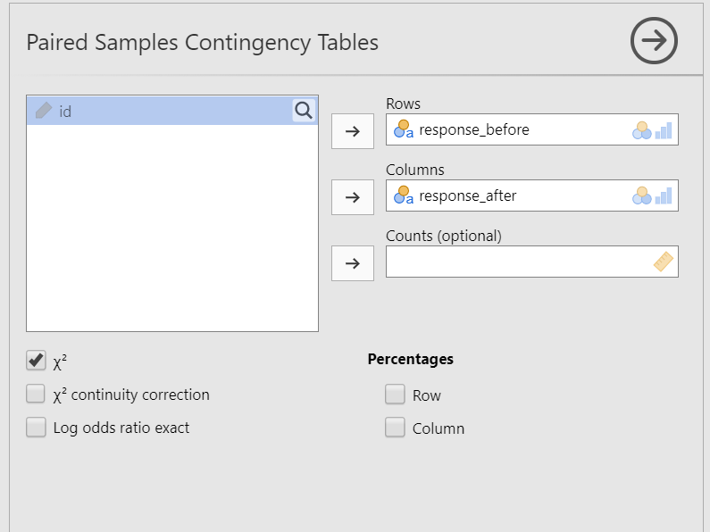
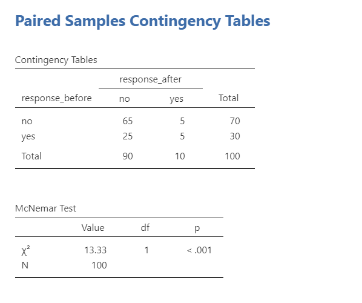

# 11.3 McNemar's Test {.unnumbered}

```{r, echo = FALSE, message=FALSE}
library(tidyverse)
library(viridis)
options(knitr.graphics.auto_pdf = TRUE)
```

McNemar’s test is used to compare two paired binary responses. It is appropriate when the same participants are measured twice, or when observations are otherwise matched, and the outcome has exactly two categories.

This section provides a brief introduction to the test. The main goal is to help you recognize when paired categorical data require McNemar’s test rather than a standard chi-square test of independence.

## Step 1: Look at the Data

Suppose the *Australian Generic Political Party* (AGPP) wants to evaluate whether its political advertisement changes voting intentions. One hundred participants report whether they intend to vote for the AGPP before and after viewing the advertisement.

Open the `agpp` dataset from the `lsj-data` library. The dataset contains a participant identifier and two binary variables: voting intention before and voting intention after viewing the advertisement.

### Data Setup

In the raw-data format, McNemar’s test requires two binary categorical variables, with one row per participant or matched pair. The two variables represent the same response measured under two conditions or at two time points. The `agpp` dataset is structured as follows:

| ID      | response_before | response_after |
|---------|-----------------|----------------|
| subj.1  | no              | yes            |
| subj.2  | yes             | no             |
| subj.3  | yes             | no             |
| subj.4  | yes             | no             |
| subj.5  | no              | no             |
| subj.6  | no              | no             |
| subj.7  | no              | no             |
| subj.8  | no              | yes            |
| subj.9  | no              | no             |
| subj.10 | no              | no             |

### Describe the Data

Before conducting the test, compare the frequencies of “yes” and “no” responses before and after the advertisement. Because the same participants provided both responses, the most important information is the number of participants who changed from “no” to “yes” and the number who changed from “yes” to “no.” McNemar’s test compares these two discordant cells.

In this example:

-   65 participants responded “no” at both time points.

-   5 participants responded “yes” at both time points.

-   5 participants changed from “no” to “yes.”

-   25 participants changed from “yes” to “no.”

The advertisement appears to have reduced support, but McNemar’s test is needed to determine whether the two types of change differ more than would be expected by chance.

::: {.callout-tip title="Check Your Understanding"}

In a training study, 18 employees changed from fail to pass, 4 changed from pass to fail, 20 passed both times, and 8 failed both times.

1. Which observations does McNemar’s test compare?
2. Based only on the descriptive frequencies, what direction of change appears more common?

::: {.collapse title="Check Your Answer"}

1. McNemar’s test compares the 18 employees who changed from fail to pass with the 4 employees who changed from pass to fail.
2. Improvement from fail to pass appears more common than decline from pass to fail.

:::
:::

### Specify the Hypotheses

We want to determine whether voting intentions change after participants view the advertisement. McNemar’s test compares the two types of disagreement: participants who change from “no” to “yes” and participants who change from “yes” to “no.”

-   $H_0$: The probability of changing from “no” to “yes” equals the probability of changing from “yes” to “no.” Voting intentions do not systematically change after viewing the advertisement.

-   $H_1$: The probability of changing from “no” to “yes” differs from the probability of changing from “yes” to “no.” Voting intentions systematically change after viewing the advertisement.

::: {.callout-tip title="Check Your Understanding"}

In a training study, 18 employees changed from fail to pass, 4 changed from pass to fail, 20 passed both times, and 8 failed both times.

1. Which observations does McNemar’s test compare?
2. Based only on the descriptive frequencies, what direction of change appears more common?

::: {.collapse title="Check Your Answer"}

1. McNemar’s test compares the 18 employees who changed from fail to pass with the 4 employees who changed from pass to fail.
2. Improvement from fail to pass appears more common than decline from pass to fail.

:::
:::

## Step 2: Check Assumptions

McNemar’s test has the following assumptions:

1.  **The observations are paired.** The two responses must come from the same participants or from meaningfully matched pairs.

2.  **The outcome is binary at both measurements.** Each response variable must contain exactly two categories, such as yes/no or pass/fail.

3.  **The pairs are independent of other pairs.** One participant’s paired responses should not affect another participant’s paired responses.

The `agpp` data meet these assumptions: each participant provides a before and after response, both variables contain the categories “yes” and “no,” and each participant represents a separate case.

## Step 3: Perform the Test

1.  Go to the Analyses tab, click the Frequencies button, and choose "Paired Samples - McNemar test".

2.  Move `response_before` into **Rows** and `response_after` into **Columns**. Reversing the variables will not change the McNemar test statistic, but keeping time in chronological order makes the table easier to interpret.

3.  Under the Statistics tab, select $\chi^2$ under Tests.

4.  Optionally, request row and column percentages to help describe the pattern of responses.

When you are done, your setup should look like this:



## Step 4: Interpret Results



The contingency table displays the four possible response patterns. McNemar’s test focuses on the discordant pairs: the 5 participants who changed from “no” to “yes” and the 25 participants who changed from “yes” to “no.”

The McNemar test is statistically significant, *p* \< .001, so we reject the null hypothesis that the two types of change occur with equal probability. More participants changed from intending to vote for the AGPP to not intending to vote for the AGPP than changed in the opposite direction. The advertisement was therefore associated with a decrease in stated voting intention.

The before-and-after comparison establishes that voting intentions changed after the advertisement, but the absence of a comparison condition limits a causal conclusion. Other influences associated with time or repeated measurement could also contribute to the change.

::: {.callout-tip title="Check Your Understanding"}

A McNemar test is statistically significant because substantially more participants changed from “yes” to “no” than from “no” to “yes.”

What can the researcher conclude?

::: {.collapse title="Check Your Answer"}

The researcher can conclude that the paired binary response changed systematically and that movement from “yes” to “no” was more common than movement from “no” to “yes.” Whether the researcher can conclude that an intervention caused the change depends on the study design, including whether there was an appropriate comparison condition.

:::
:::

### Write Up the Results in APA Style

We can write up our results in APA something like this:

> McNemar's test indicated that support for AGPP changed from before to after viewing the AGPP advertisement, $\chi^2$ (1) = 13.33, *p* \< .001. Most participants continued to not vote for AGPP after the ad (*n* = 65) and a few continued to vote for AGPP after the ad (*n* = 5). However, many participants who originally stated they would vote for AGPP changed to no longer voting for AGPP after the ad (*n* = 25); only five people who originally would not vote for AGPP changed to vote for AGPP after the ad.

### Visualize the Results

A paired categorical outcome can be summarized using a 2 × 2 table or a graph showing the number of participants in each response pattern. The visualization should make the direction of change clear, especially the difference between participants who changed from “no” to “yes” and those who changed from “yes” to “no.”
