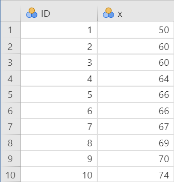
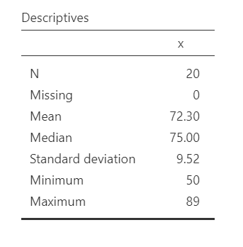
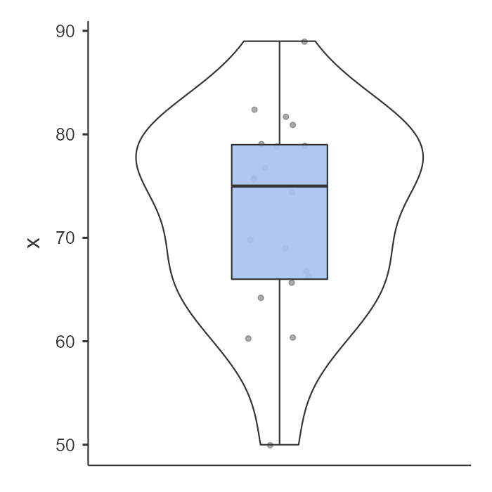
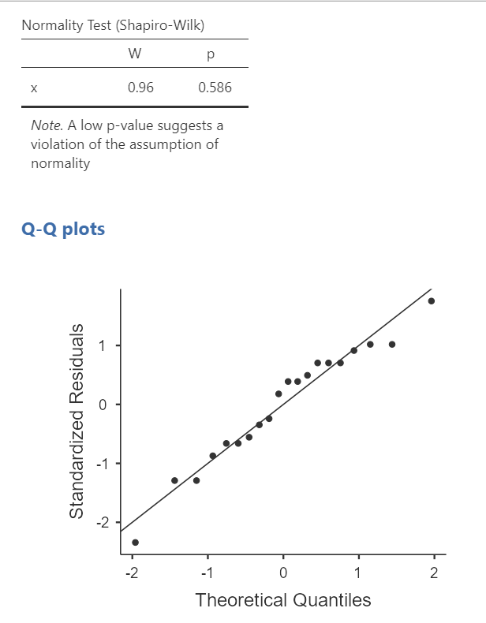
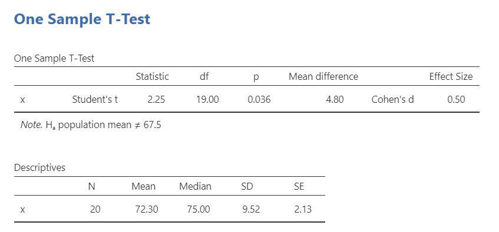
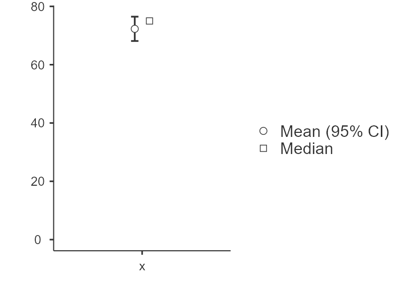
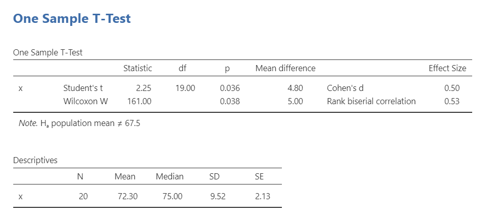

# 12.1 One Sample *t*-Test {.unnumbered}

```{r, echo = FALSE, message=FALSE}
library(tidyverse)
options(knitr.graphics.auto_pdf = TRUE)
```

A **one sample *t*-test** is used to test whether the mean of one continuous variable differs from a known or hypothesized comparison value. In jamovi, this test is labeled **One Sample T-Test**. Other sources may call it a **one-sample *t*-test**.

There are three different types of alternative hypotheses we could have for a one sample *t*-test. In the hypotheses below, the sample mean is being compared to a specified comparison value.

1.  **Two-tailed**

    -   $H_1$: The sample mean is different from the comparison value.
    -   $H_0$: The sample mean is equal to the comparison value.

2.  **One-tailed**

    -   $H_1$: The sample mean is greater than the comparison value.
    -   $H_0$: The sample mean is less than or equal to the comparison value.

3.  **One-tailed**

    -   $H_1$: The sample mean is less than the comparison value.
    -   $H_0$: The sample mean is greater than or equal to the comparison value.

For this chapter, we will work with the `zeppo` dataset from the `lsj-data` library. This dataset contains hypothetical data from 20 psychology students taking Dr. Zeppo’s introductory statistics class. Dr. Zeppo knows that the mean grade across all students in the course is 67.5. A psychology colleague hypothesizes that psychology students earn higher grades than the overall course average. We will use a one sample *t*-test to compare the mean grade for the psychology students in this sample to the comparison value of 67.5.

## Step 1: Look at the Data

If you learn one thing through this course, it is that *you should always look at your data!!!* Descriptive and inferential statistics can sometimes hide weird things with your data, so it's incredibly important you look at it first.

### Data Set-Up

To conduct a one sample *t*-test, the dataset needs one continuous variable. Each row should represent one participant or unit of analysis. The comparison value is not stored as a grouping variable in the dataset; instead, we enter it directly into jamovi when we run the test.

Below is the first ten rows of our data from the zeppo dataset.



### Describe the Data

Once we confirm our data is setup correctly in jamovi, we should look at our data using descriptive statistics and graphs. First, our descriptive statistics are shown below. Our overall data consists of 20 cases and the students in our dataset have a mean grade of 72.30 (*SD* = 9.52). The minimum and maximum values look accurate; theoretically, student grades should range from 0-100. The distribution does not look perfectly normal, which is common with small samples. Because a one sample *t*-test assumes the outcome is approximately normally distributed, we will formally check this assumption before interpreting the test results.



{width="523"}

### Specify the Hypotheses

For a one sample *t*-test, we focus on one continuous outcome variable and one comparison value. In this example, the outcome variable is students’ course grades. The comparison value is the overall course mean of 67.5.

Therefore our hypotheses can be written up as such:

-   $H_1$: Psychology students have a higher mean grade than the overall course mean of 67.5.
-   $H_0$: Psychology students have a mean grade less than or equal to the overall course mean of 67.5.

We will use the conventional alpha value of $\alpha = .05$. Therefore, we will consider the result statistically significant if the *p*-value is less than .05.

::: {.callout-tip title="Check Your Understanding"}

A researcher wants to test whether students’ average sleep is less than the recommended 8 hours per night.

1. What is the comparison value?
2. Is the alternative hypothesis directional or non-directional?
3. Write the alternative hypothesis in words.

::: {.callout-note title="Check Your Answer" collapse="true"}

1. The comparison value is 8 hours.
2. The alternative hypothesis is directional because the researcher predicts that the mean is less than 8 hours.
3. The alternative hypothesis is that students’ mean sleep is less than 8 hours per night.

:::
:::

## Step 2: Check Assumptions

As a parametric test, the one sample *t*-test has several assumptions:

1.  The outcome variable is **approximately normally distributed** in the population.

2.  The outcome variable is **interval or ratio** (i.e., continuous).

3.  Observations are **independent**. Each participant or case should contribute one score, and one participant’s score should not determine another participant’s score.

We cannot test the second and third assumptions using the output alone; those assumptions are based on how the data were measured and collected.

However, we can and should test for the first assumption. Fortunately, the one sample *t*-test in jamovi has options under **Assumption Checks** that help us evaluate normality.

One thing to keep in mind in all statistical software is that we often check assumptions simultaneously to performing the statistical test. However, we should always check assumptions first before looking at and interpreting our results. Therefore, whereas the instructions for performing the test are below, we discuss checking assumptions here first to help ingrain the importance of always checking assumptions for interpreting results.

::: {.callout-tip title="Check Your Understanding"}

A one sample *t*-test compares the mean exam score from one sample to a passing score of 70. The dataset includes one row per student and one continuous exam score variable.

1. Is a grouping variable needed?
2. Where does the comparison value of 70 go?

::: {.callout-note title="Check Your Answer" collapse="true"}

1. No. A one sample *t*-test uses one continuous outcome variable and does not require a grouping variable.
2. The comparison value is entered in the one sample *t*-test options in jamovi.

:::
:::

### Testing Normality

jamovi easily allows us to check for normality using all four methods we've learned about.

First, the Shapiro-Wilk test was not statistically significant (*W* = .96, *p* = .586), which means the test does not provide evidence that the distribution differs from normality.

Second, the dots are fairly close to the diagonal line in the Q-Q plot.



Third, we can examine the z-scores of skew and kurtosis:

-   **Skew**: $-.53/.51 = -1.04$

-   **Kurtosis**: $.07/.99 = .07$

Remember that we divide the value by its standard error to determine the z-score. If the absolute value of the z-score is below approximately 1.96, then the skew or kurtosis value does not suggest a substantial departure from normality. Both skew and kurtosis meet the assumption of normality.

Fourth, we can examine the distribution of the data using a histogram, density curve, box plot, or violin plot. The distribution shown above is not perfectly normal, but it is close enough for this example.

Overall, all four tests lead us to conclude that we satisfy the assumption of normality.

## Step 3: Perform the Test

### Decide Whether to Use the Parametric or Nonparametric Test

If the normality assumption is reasonably met, use the one sample Student’s *t*-test.

If the normality assumption is seriously violated and no appropriate transformation addresses the issue, use the Wilcoxon signed-rank test. In jamovi, this option appears as **Wilcoxon W**.

::: {.callout-tip title="Check Your Understanding"}

A researcher wants to run a one sample *t*-test, but the outcome variable is strongly skewed and the normality assumption is not met.

Which test should the researcher consider instead?

::: {.callout-note title="Check Your Answer" collapse="true"}

The researcher should consider the Wilcoxon signed-rank test, labeled **Wilcoxon W** in jamovi. This is the nonparametric alternative to the one sample *t*-test.

:::
:::

### Decide Which Hypothesis You Should Be Using

When you specify hypotheses, decide whether the alternative hypothesis is directional (one-tailed) or non-directional (two-tailed) based on the research question.

If the alternative hypothesis is non-directional (two-tailed) then you choose `≠Test value`.

If the alternative hypothesis is directional (one-tailed), choose `> Test value` if the research question predicts that the sample mean is higher than the comparison value. Choose `< Test value` if the research question predicts that the sample mean is lower than the comparison value.

:::{.warning data-latex=""}
Remember that the hypothesis you use is based on your alternative hypothesis and research question! This is not based on what the data looks like. It's a function of the research question you have prior to looking at the data.
:::

### Perform the Test

Now that we have checked the assumptions, we can perform the one sample *t*-test. Here are the steps for doing so in jamovi:

1.  Go to the **Analyses** tab, click **T-Tests**, and choose **One Sample T-Test**.

2.  Move the continuous outcome variable `x` to the **Dependent Variables** box.

3.  Under **Tests**, select `Student's` if the normality assumption is reasonably met. Select `Wilcoxon W` if the normality assumption is seriously violated. We met the assumption, so we will select `Student's`.

4.  Under **Hypothesis**, enter the comparison value. In this example, enter `67.5`. Then select the hypothesis that matches the research question. In this example, select `> Test value` because the hypothesis predicts that psychology students have a higher mean grade than the comparison value.

5.  Under **Additional Statistics**, select `Mean difference`, `Effect size`, and `Descriptives`. You may also select `Descriptives plots`, although [Chapter 6](06.0-visualizing-data-in-jamovi.qmd) provides better options for creating graphs

6.  Under **Assumption Checks**, select `Normality test` and `Q-Q plot`.

## Step 4: Interpret Results

Once we are satisfied that the assumptions for the one sample *t*-test are reasonably met, we can interpret the results.



Our p-value is less than our alpha value of .05, so our results are statistically significant. Like most of the statistics we'll come across, the larger the t-statistic (or F-statistic, or chi-square statistic...), the smaller the p-value will be.

:::{.info data-latex=""}
What is "df"? That stands for degrees of freedom. The "key terms" chapter covers them in more detail, but in the case of the one-sample t-test they are calculated by the number of participants in our sample minus 1 (n-1) which in this case is 20-1 or 19. 
:::

Because the result is statistically significant, we reject the null hypothesis. The sample provides evidence that psychology students have a higher mean grade than the overall course mean of 67.5.

However, remember what we've learned in the previous chapters! We rejected the null hypothesis, but there's always the chance that we've made a type 1 error.

### A Note About Positive and Negative t Values

Students often worry about whether a *t* statistic is positive or negative. For a one sample *t*-test, the sign shows whether the sample mean is above or below the comparison value. In this example, the *t* statistic is positive because the sample mean is higher than the comparison value: \(72.30 - 67.50 = 4.80\).

If the sample mean had been lower than the comparison value, the mean difference and *t* statistic would have been negative. The sign helps identify the direction of the difference, but the *p*-value tells us whether that difference is statistically significant.

You will not get negative values for chi-square or *F* statistics, but *t* statistics can be positive or negative.

### Write Up the Results in APA Style

As reviewed in @sec-apa-style, an APA-style results section should describe the research question, summarize the relevant descriptive statistics, report the inferential test and effect size, and interpret the result.

We can write up our results in APA something like this:

> A one sample *t*-test indicated that psychology students had a significantly higher mean grade (*M* = 72.30, *SD* = 9.52, *n* = 20) than the overall course mean of 67.50, *t*(19) = 2.25, *p* = .046, *d* = .50.

Note that this is not the only way we can write up the results in APA format. The key is that we include all four pieces of information as specified above.

Also note that the M, SD, n, t, p, and d are all italicized! This is an important part of APA style to remember.

### Visualize the Results

For a one sample *t*-test, the graph should help readers understand the distribution of the continuous variable and how the sample compares to the comparison value. A histogram or box plot is usually more informative than the default descriptives plot from the one sample *t*-test output.

A histogram can show the shape of the grade distribution, including whether the scores are roughly symmetric or skewed. A box plot can summarize the median, spread, and possible outliers. If possible, include a reference line or clear caption identifying the comparison value of 67.5.

The goal is not simply to make a graph because jamovi provides one. The goal is to help readers understand what the sample grades look like and how they compare to the value used in the hypothesis test.

By selecting **Descriptives plots** in the setup, you get the figure below. Personally, I don't think this is a very good plot. It's not very informative. It just provides the mean (circle), 95% confidence interval (blue bars), and the median.



## Wilcoxon W Test

If the normality assumption is seriously violated and no appropriate transformation addresses the issue, you can use the Wilcoxon signed-rank test. In jamovi, this option is labeled **Wilcoxon W**.

The Wilcoxon signed-rank test is a nonparametric alternative to the one sample *t*-test. It is based on ranks rather than the original values, so it does not test the mean in the same way as a *t*-test. Because of this, we usually describe the sample using the median when reporting the Wilcoxon result.

The Wilcoxon signed-rank test does not require the same normality assumption as the one sample *t*-test, but it still requires an appropriate one-sample design with independent observations.




To conduct this test in jamovi, select `Wilcoxon W` under **Tests**. You will interpret whether the sample differs from the comparison value, but you should report the test as a Wilcoxon signed-rank test rather than as a *t*-test:

> A Wilcoxon signed-rank test indicated that psychology students’ grades (*Mdn* = 75.00, *n* = 20) were significantly higher than the overall course comparison value of 67.5, *W* = 161, *p* = .038, \(r_{rb} = .53\).

Notice that the Wilcoxon write-up reports the median rather than the mean. This is because the Wilcoxon signed-rank test is rank-based and is not testing a mean difference in the same way as the one sample *t*-test.


