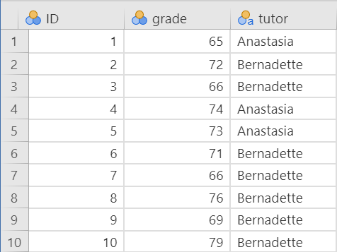
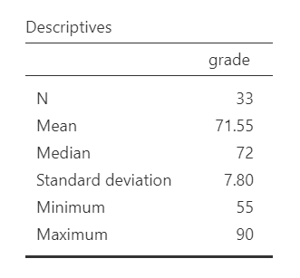
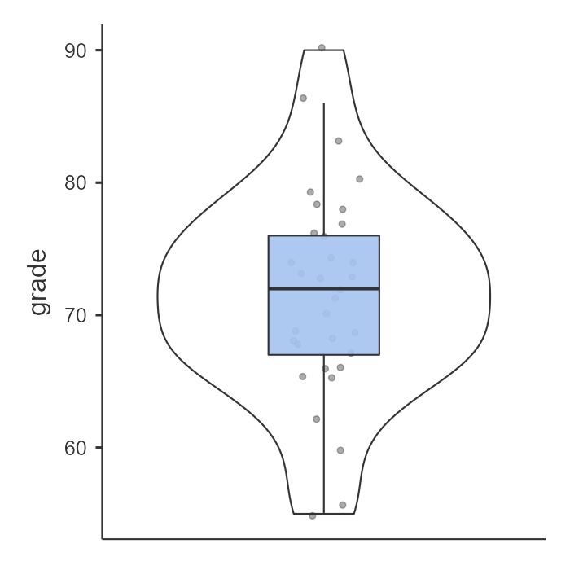
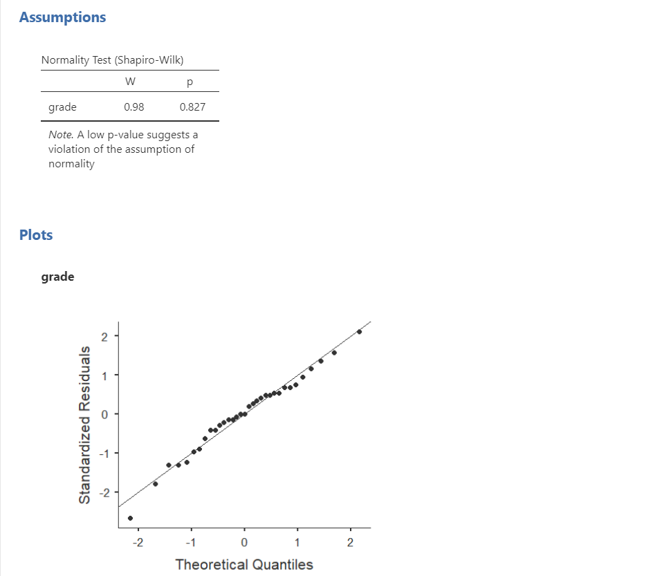
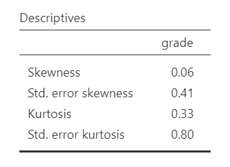
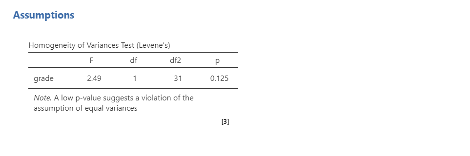
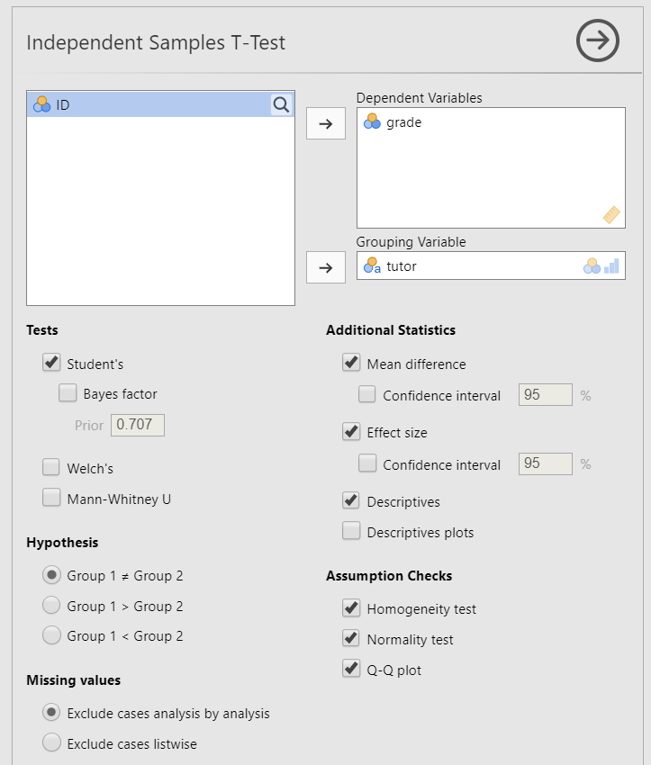
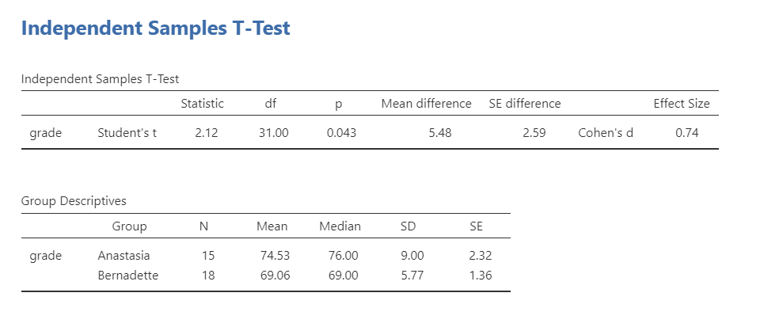
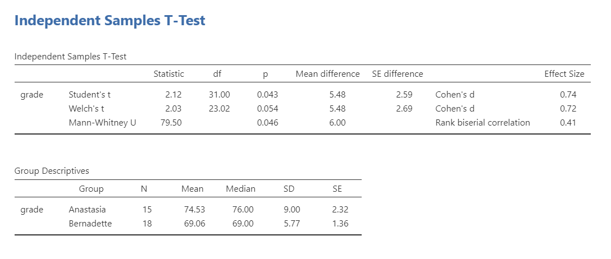

# 12.2 Independent *t*-Test {.unnumbered}

```{r ind-t_setup, echo = FALSE, message=FALSE}
library(tidyverse)
options(knitr.graphics.auto_pdf = TRUE)
```

An **independent *t*-test** is used to test whether two independent groups differ on a continuous outcome variable. We use an independent *t*-test when we have one continuous outcome variable and one categorical grouping variable with exactly two groups. The groups are independent because different participants or cases are in each group.

In jamovi, this test is labeled **Independent Samples T-Test**. Other sources may call it an **independent-samples *t*-test**. In jamovi, the equal-variance version of the test is labeled **Student's**.

### General Independent *t*-Test Hypotheses

There are three different types of alternative hypotheses we could have for an independent *t*-test:

1. **Two-tailed**

   * $H_1$: There is a difference between the two groups on the outcome variable.
   * $H_0$: There is no difference between the two groups on the outcome variable.

2. **One-tailed**

   * $H_1$: Group 1 scores higher than Group 2 on the outcome variable.
   * $H_0$: Group 1 scores the same as or lower than Group 2 on the outcome variable.

3. **One-tailed**

   * $H_1$: Group 1 scores lower than Group 2 on the outcome variable.
   * $H_0$: Group 1 scores the same as or higher than Group 2 on the outcome variable.


We use an independent *t*-test whenever we compare two separate groups on one continuous outcome variable. For example, we might use an independent *t*-test in an experiment comparing a treatment group and a control group on an outcome of interest. We might also use an independent *t*-test to compare two existing groups, such as students taught by two different tutors.

## Step 1: Look at the Data

For this chapter, we will work with the `harpo` dataset from the `lsj-data` library. This dataset contains hypothetical data from 33 students taking Dr. Harpo’s statistics lectures. Students were taught by one of two tutors: Anastasia (*n* = 15) or Bernadette (*n* = 18). Our research question is: Do students taught by Anastasia and Bernadette differ in their mean grades?

The [video](https://www.youtube.com/watch?v=64dkiHIC7uY) below walks through an independent *t*-test in jamovi.

```{r echo = FALSE, eval = knitr::is_html_output(excludes = "epub"), message = FALSE, warning = FALSE}
library(vembedr)
embed_url("https://www.youtube.com/watch?v=64dkiHIC7uY")
```

### Data Set-Up

To conduct an independent *t*-test, the dataset needs one continuous outcome variable and one categorical grouping variable with exactly two groups. Each row should represent one participant or unit of analysis, and each participant should belong to only one group.

Below is the first ten rows of our data from the Harpo dataset.



::: {.callout-tip title="Check Your Understanding"}

A researcher compares final exam scores for students in an online section and an in-person section of the same course.

1. What is the continuous outcome variable?
2. What is the categorical grouping variable?
3. Why would this be an independent *t*-test rather than a dependent *t*-test?

::: {.callout-note title="Check Your Answer" collapse="true"}

1. The continuous outcome variable is final exam score.
2. The categorical grouping variable is course section, with two groups: online and in person.
3. This is an independent *t*-test because different students are in the two groups.

:::
:::

### Describe the Data

Once we confirm that the data are set up correctly in jamovi, we should describe the outcome variable overall and within each group. For an independent *t*-test, the group means, standard deviations, sample sizes, and visual distributions are especially important because the test compares the two group means.

In this example, Anastasia’s students had a higher mean grade than Bernadette’s students. We should also examine whether the distributions look roughly normal within each group and whether the groups have similar variability. These descriptive checks help us prepare for the formal assumption checks in the next step.



{width="528"}

### Specify the Hypotheses

Our research question is: Do students taught by Anastasia and Bernadette differ in their grades? This research question is non-directional because it does not predict which tutor’s students will have higher grades. Therefore, our hypotheses are:

* $H_1$: There is a difference in grades between students taught by Anastasia and students taught by Bernadette.
* $H_0$: There is no difference in grades between students taught by Anastasia and students taught by Bernadette.

We will use the conventional alpha value of $\alpha = .05$. Therefore, we will consider the result statistically significant if the *p*-value is less than .05.

::: {.callout-tip title="Check Your Understanding"}

A researcher asks whether employees in Department A and Department B differ in job satisfaction. The researcher does not predict which department will have higher satisfaction.

1. Is the alternative hypothesis directional or non-directional?
2. Which jamovi hypothesis option should be selected?

::: {.callout-note title="Check Your Answer" collapse="true"}

1. The alternative hypothesis is non-directional because the researcher predicts a difference but does not predict which group will have the higher mean.
2. Select `Group 1 ≠ Group 2`.

:::
:::

## Step 2: Check Assumptions

As a parametric test, the independent *t*-test has several assumptions:

1.  The outcome variable is **approximately normally distributed within each group**.

2.  The two groups have roughly equal variances, which is called **homogeneity of variance**.

3.  The outcome variable is **interval or ratio** (i.e., continuous).

4.  Observations are **independent**. Each participant or case should contribute one score and belong to only one group.

We cannot test the third and fourth assumptions using the output alone; those assumptions are based on how the data were measured and collected.

However, we can and should evaluate the first two assumptions. The independent *t*-test in jamovi includes assumption-check options for normality and homogeneity of variance.

One thing to keep in mind in all statistical software is that we often check assumptions simultaneously while performing the statistical test. However, we should always check assumptions first before looking at and interpreting our results. Therefore, whereas the instructions for performing the test are below, we discuss checking assumptions here first to help ingrain the importance of always checking assumptions for interpreting results.

### Testing Normality

jamovi allows us to check normality using the Shapiro-Wilk test and Q-Q plots. For an independent *t*-test, normality should be evaluated within each group. A nonsignificant Shapiro-Wilk test does not provide evidence that the distribution differs from normality. We should also examine the Q-Q plots, histograms or box plots, and skew and kurtosis values. Overall, the normality assumption appears reasonable for this example.



Remember that we can also test for normality by **looking at our data** (e.g., a histogram or density plot, which you can see above) and by examining **skew and kurtosis**. However, you will need to view them using Exploration --\> Descriptives, not in the t-tests menu. Here is our skew and kurtosis:

-   **Skew**: $.06/.41 = .15$

-   **Kurtosis**: $.33/.80 = .41$

Remember that we divide each value by its standard error to calculate a z-score. If the absolute value of the z-score is below approximately 1.96, then the skew or kurtosis value does not suggest a substantial departure from normality. In this example, the skew and kurtosis values do not raise major concerns. The Shapiro-Wilk test, Q-Q plots, and visual displays also suggest that the normality assumption is reasonable.



### Testing Homogeneity of Variance

We evaluate homogeneity of variance using Levene’s test and by comparing the variability of the outcome across the two groups. Levene’s test was not statistically significant, *F*(1, 31) = 2.49, *p* = .125. This means the test does not provide evidence that the group variances differ substantially, so the homogeneity-of-variance assumption appears reasonable.



That said, the sample sizes are small (*n* = 15 for Anastasia and *n* = 18 for Bernadette), so the assumption checks should be interpreted cautiously. The group standard deviations also differ somewhat, which is visible in the grouped plot. When sample sizes are small, it is especially helpful to examine the graph and descriptive statistics rather than relying on Levene’s test alone.

::: {.callout-note}
In fact, we've read in the BEAN chapters how to calculate for power! We could use our knowledge to identify what size effect size we could reliably detect (e.g., with 80% power at an alpha of .05) given our sample sizes. Try it out!
:::

## Step 3: Perform the Test

### Decide Whether to Use Student’s, Welch’s, or Mann-Whitney

The independent *t*-test menu in jamovi includes three options: Student’s, Welch’s, and Mann-Whitney U. In this course, use the assumption checks to decide which option to report.

| Assumption Pattern | Test to Report |
|---|---|
| Normality is reasonably met and homogeneity of variance is reasonably met | Student’s *t*-test |
| Normality is reasonably met but homogeneity of variance is not met | Welch’s *t*-test |
| Normality is seriously violated and no appropriate transformation addresses the issue | Mann-Whitney U test |

Some researchers prefer Welch’s *t*-test as the default because it performs well when variances are unequal and usually gives very similar results to Student’s *t*-test when variances are equal. For this course, we will only use Welch’s test when the homogeneity-of-variance assumption is not met.

::: {.callout-tip title="Check Your Understanding"}

A researcher wants to compare two independent groups on a continuous outcome. The normality assumption appears reasonable, but Levene’s test is statistically significant.

Which test should the researcher report for this course?

::: {.callout-note title="Check Your Answer" collapse="true"}

The researcher should report Welch’s *t*-test because normality appears reasonable but the homogeneity-of-variance assumption is not met.

:::
:::

### Decide Which Hypothesis You Should Be Using

When you specify hypotheses, decide whether the alternative hypothesis is directional (one-tailed) or non-directional (two-tailed) based on the research question.

If the alternative hypothesis is non-directional, choose `Group 1 ≠ Group 2`.

If the alternative hypothesis is directional, choose `Group 1 > Group 2` or `Group 1 < Group 2` based on the direction predicted by the research question. Do not choose the direction after looking at which group has the higher sample mean.

:::{.callout-warning}
The hypothesis direction must be chosen *before* looking at the results. Do not switch from a two-tailed test to a one-tailed test because the sample means appear to differ in one direction.
:::

### Perform the Test

Now that we have checked the assumptions, we can perform the independent *t*-test. Here are the steps for doing so in jamovi:

1.  Go to the **Analyses** tab, click **T-Tests**, and choose **Independent Samples T-Test**.

2.  Move the continuous outcome variable `grade` to the **Dependent Variables** box.

3.  Move the categorical grouping variable `tutor` to the **Grouping Variable** box.

4.  Under **Tests**, select the appropriate test based on the assumptions. In this example, normality and homogeneity of variance are both reasonably met, so select `Student's`.

5.  Under **Hypothesis**, select the option that matches the research question. In this example, select `Group 1 ≠ Group 2` because the research question is two-tailed.

6.  Under **Additional Statistics**, select `Mean difference`, `Effect size`, and `Descriptives`. You may also select `Descriptives plots`, although Chapter 6 provides better options for creating graphs.

7.  Under **Assumption Checks**, select `Homogeneity test`, `Normality test`, and `Q-Q plot`.

When you are done, your setup should look like this:



## Step 4: Interpret Results

Once we are satisfied that the assumptions for the independent *t*-test are reasonably met, we can interpret the results.



The *p*-value is less than our alpha value of .05, so the result is statistically significant. We reject the null hypothesis of equal population means. The sample provides evidence that students taught by Anastasia and Bernadette differ in their mean grades.

Because Anastasia’s students had the higher sample mean, the difference is in favor of Anastasia’s class. However, the statistical test tells us whether the group means differ more than we would expect by chance; it does not, by itself, prove that the tutor caused the difference unless the study design supports a causal conclusion.

:::{.callout-note}
The abbreviation **df** stands for degrees of freedom. For Student’s independent *t*-test, the degrees of freedom are calculated as \(n_1 + n_2 - 2\). In this example, \(df = 15 + 18 - 2 = 31\).
:::

### A Note About Positive and Negative *t* Values

Students often worry about whether a *t* statistic is positive or negative. For an independent *t*-test, the sign depends on which group is treated as Group 1 and which group is treated as Group 2. In this example, the mean difference is calculated as Anastasia’s class minus Bernadette’s class: \(74.53 - 69.06 = 5.47\). Because Anastasia’s class has the higher mean, the *t* statistic is positive.

If the group order were reversed, the mean difference and *t* statistic would be negative. The sign helps identify the direction of the difference based on the group order, but the *p*-value tells us whether that difference is statistically significant.

You will not get negative values for *F* statistics or chi-square statistics, but *t* statistics can be positive or negative.

### Write Up the Results in APA Style

As reviewed in @sec-apa-style, an APA-style results section should describe the research question, summarize the relevant descriptive statistics, report the inferential test and effect size, and interpret the result.

We can write up our results in APA something like this:

> An independent *t*-test indicated that students taught by Anastasia had significantly higher grades (*M* = 74.53, *SD* = 9.00, *n* = 15) than students taught by Bernadette (*M* = 69.06, *SD* = 5.77, *n* = 18), *t*(31) = 2.12, *p* = .043, *d* = .74.

This is not the only correct way to write the result. The key is to include the correct information (i.e., group descriptive statistics, test statistic, degrees of freedom, *p*-value, effect size, and interpretation) and to make it clear and easy to read.

### Visualize the Results

For an independent *t*-test, the graph should help readers compare the distribution of the continuous outcome across the two groups. A box plot is usually a good choice because it shows the median, spread, overlap between groups, and possible outliers.

A bar plot with error bars can also be used to communicate group means, especially when the goal is to summarize the mean difference. However, a bar plot hides the shape of the distribution, so it is less useful when we are first examining the data or checking assumptions.

For this example, a grouped box plot of `grade` by `tutor` would allow readers to compare the grade distributions for Anastasia’s and Bernadette’s students. If you use a bar plot of means, clearly identify what the error bars represent, such as standard errors or confidence intervals.

## Welch’s *t*-Test {#welchs-t-test}

Welch’s *t*-test is used when the outcome variable is approximately normally distributed but the homogeneity-of-variance assumption is not met. Welch’s test does not pool the group variances, and its degrees of freedom are adjusted rather than calculated as \(n_1 + n_2 - 2\). Welch’s *t*-test is still a parametric test because it still assumes that the outcome is approximately normally distributed within groups.



:::{.callout-warning}
In practice, you should report the test that matches your assumptions rather than reporting Student’s, Welch’s, and Mann-Whitney U together. They are shown together here only so you can compare how the output differs.
:::

To conduct Welch’s *t*-test in jamovi, select `Welch's` under **Tests**. You will interpret the result similarly to Student’s independent *t*-test, but the degrees of freedom may not be a whole number:

> Welch’s *t*-test indicated that students taught by Anastasia did not have significantly different grades (*M* = 74.53, *SD* = 9.00, *n* = 15) than students taught by Bernadette (*M* = 69.06, *SD* = 5.77, *n* = 18), *t*(23.02) = 2.03, *p* = .054, *d* = .72.

Student’s and Welch’s tests can produce slightly different *p*-values because they estimate the standard error and degrees of freedom differently. If the homogeneity-of-variance assumption is met, Student’s test is appropriate for this course. If the homogeneity-of-variance assumption is not met, Welch’s test is the better choice because it does not assume equal variances.

## Mann-Whitney U Test

The Mann-Whitney U test is a nonparametric alternative to the independent *t*-test. It is based on ranks rather than the original values, so it does not test mean differences in the same way as a *t*-test. Because it is rank-based, we usually describe each group using medians when reporting the result.

If the normality assumption is seriously violated and no appropriate transformation addresses the issue, consider the Mann-Whitney U test. This test does not require the same normality assumption as the independent *t*-test, but it still requires an appropriate two-group design with independent observations.


:::{.callout-warning}
In practice, you should report the test that matches your assumptions rather than reporting Student’s, Welch’s, and Mann-Whitney U together. They are shown together here only so you can compare how the output differs.
:::

The basic idea is that the Mann-Whitney U test ranks all scores across both groups and compares the rank patterns between groups. You interpret the *p*-value in the usual way, but the result should be reported as a Mann-Whitney U test rather than as an independent *t*-test.

> A Mann-Whitney U test indicated that grades differed significantly between students taught by Anastasia (*Mdn* = 76, *n* = 15) and students taught by Bernadette (*Mdn* = 69, *n* = 18), *U* = 79.50, *p* = .046, \(r_{pb} = .41\).

::: {.callout-tip title="Check Your Understanding"}

A researcher compares two independent groups, but the continuous outcome is strongly skewed in both groups and the normality assumption is seriously violated.

Which test should the researcher consider instead of an independent *t*-test?

::: {.callout-note title="Check Your Answer" collapse="true"}

The researcher should consider the Mann-Whitney U test, the nonparametric alternative to the independent *t*-test.

:::
:::
