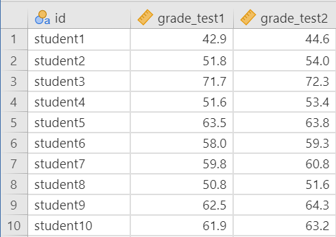
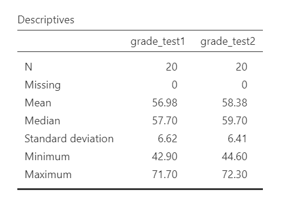
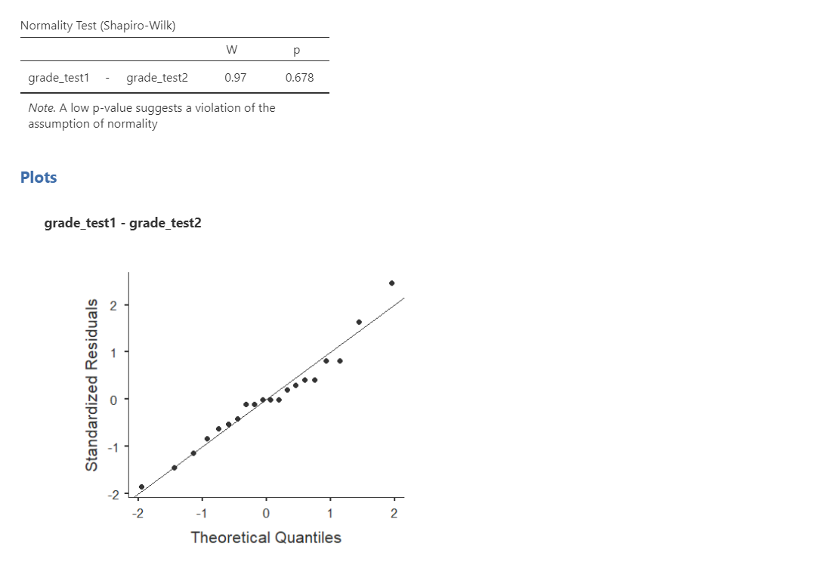
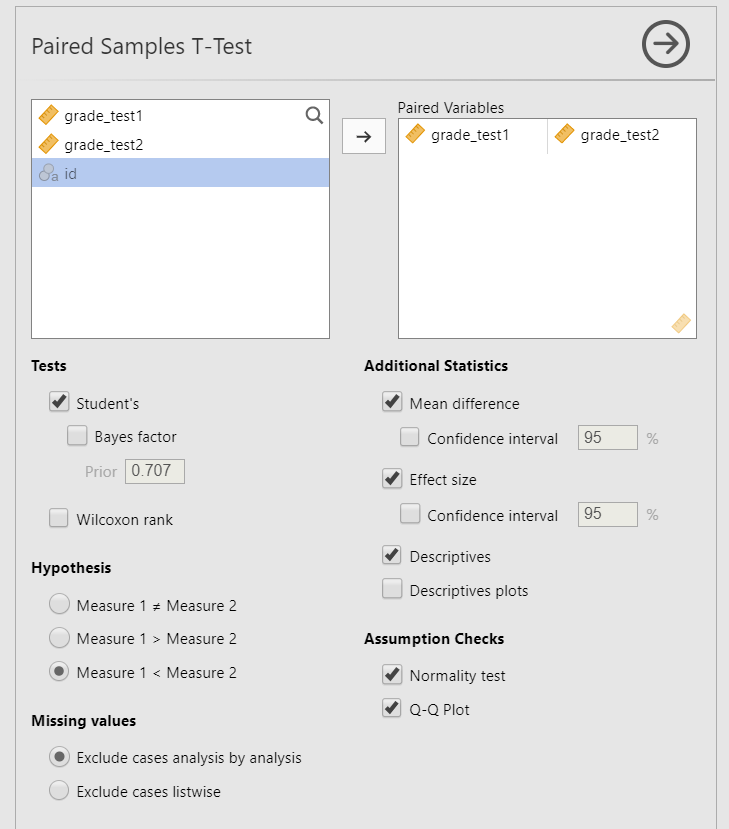
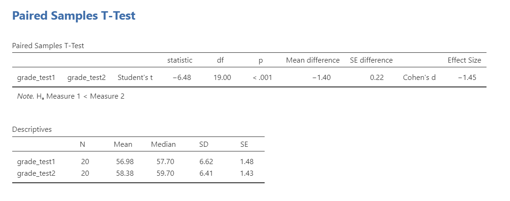
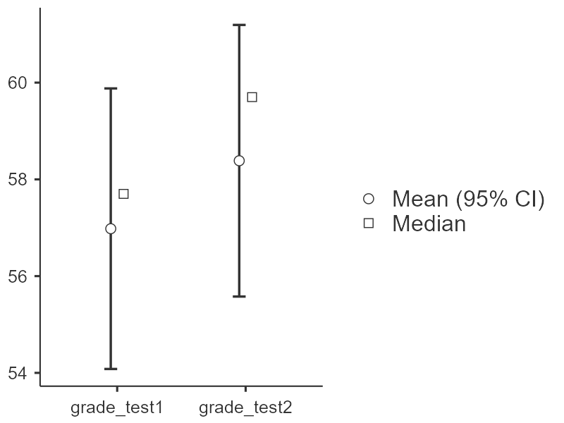
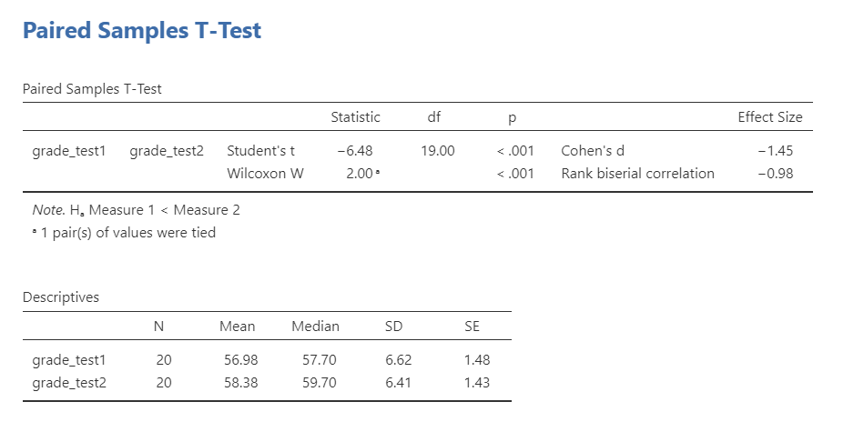

# 12.3 Dependent *t*-Test {.unnumbered}

```{r, echo = FALSE, message=FALSE}
library(tidyverse)
options(knitr.graphics.auto_pdf = TRUE)
```

A **dependent *t*-test** is used to test whether two related measurements differ on a continuous outcome variable. We use a dependent *t*-test when the same participants are measured twice or when observations are matched in pairs.

In jamovi, this test is labeled **Paired Samples T-Test**. Other sources may call it a **paired-samples *t*-test**, **dependent-samples *t*-test**, or **paired *t*-test**.

There are three different types of alternative hypotheses we could have for a dependent *t*-test:

1.  **Two-tailed**

    - $H_1$: There is a difference between the two related measurements.
    - $H_0$: There is no difference between the two related measurements.

2.  **One-tailed**

    - $H_1$: Scores are higher on Measurement 1 than on Measurement 2.
    - $H_0$: Scores are the same or lower on Measurement 1 than on Measurement 2.

3.  **One-tailed**

    - $H_1$: Scores are lower on Measurement 1 than on Measurement 2.
    - $H_0$: Scores are the same or higher on Measurement 1 than on Measurement 2.

## Step 1: Look at the Data

For this chapter, we will work with the `chico` dataset from the `lsj-data` library. This dataset contains hypothetical data from students in Dr. Chico’s class. Each student took two tests: one early in the semester and one later in the semester. Dr. Chico thinks the first test is a “wake-up call” for students. She predicts that students will work harder after the first test and score higher on the second test.

The [video](https://www.youtube.com/watch?v=ywMPrS9Bo3Q) below walks through an dependent *t*-test in jamovi.

```{r echo = FALSE, eval = knitr::is_html_output(excludes = "epub"), message = FALSE, warning = FALSE}
library(vembedr)
embed_url("https://www.youtube.com/watch?v=ywMPrS9Bo3Q")
```

### Data Set-Up

To conduct a dependent *t*-test in jamovi, the dataset usually needs two columns: one column for the first measurement and one column for the second measurement. Each row should represent one participant or matched pair. The two scores in the same row are paired because they belong to the same participant or matched case.



:::: {.callout-tip title="Check Your Understanding"}
Look at the data shown above.

1.  What are the two related measurements?
2.  How do you know this dataset is set up for a dependent *t*-test?
3.  Why would this not be an independent *t*-test?

::: {.callout-note title="Check Your Answer" collapse="true"}
1.  The two related measurements are `grade_test1` and `grade_test2`.
2.  The dataset is set up for a dependent *t*-test because each row represents one student, and each student has a score for both tests.
3.  This is not an independent *t*-test because the two scores being compared come from the same students rather than from two separate groups of students.
:::
::::

### Describe the Data

Once we confirm that the data are set up correctly in jamovi, we should describe both measurements. In this example, the 20 students had a mean score of 56.98 (*SD* = 6.62) on the first test and 58.38 (*SD* = 6.41) on the second test. There are no missing cases, and the minimum and maximum values appear reasonable because test scores should range from 0 to 100.

For a dependent *t*-test, we should also pay attention to the pattern of change within participants. The descriptive statistics show that the average score was higher on the second test, but we still need to test whether the difference is large enough to be statistically significant.



### Specify the Hypotheses

Dr. Chico predicts that students will score higher on the second test than on the first test. This is a directional research question. Therefore, our hypotheses are:

- $H_1$: Students score higher on the second test than on the first test.
- $H_0$: Students score the same or lower on the second test than on the first test.

We will use the conventional alpha value of $\alpha = .05$. Therefore, we will consider the result statistically significant if the *p*-value is less than .05.

:::: {.callout-tip title="Check Your Understanding"}
A researcher measures confidence before and after a public-speaking workshop. The researcher predicts that confidence will be higher after the workshop.

1.  Is this a directional or non-directional hypothesis?
2.  What are the two related measurements?
3.  Why is a dependent *t*-test appropriate?

::: {.callout-note title="Check Your Answer" collapse="true"}
1.  The hypothesis is directional because the researcher predicts that confidence will be higher after the workshop.
2.  The two related measurements are confidence before the workshop and confidence after the workshop.
3.  A dependent *t*-test is appropriate because the same participants provide both confidence scores.
:::
::::

## Step 2: Check Assumptions

As a parametric test, the dependent *t*-test has several assumptions:

1.  The **difference scores** are approximately normally distributed. A difference score is the difference between each participant’s two measurements.

2.  The outcome variable is **interval or ratio** (i.e., continuous).

3.  Pairs are **independent of other pairs**. The two measurements within a row are related, but each participant or matched pair should be independent of the other participants or matched pairs.

We cannot test the second and third assumptions using the output alone; those assumptions are based on how the data were measured and collected.

However, we can and should evaluate the first assumption. The paired samples *t*-test in jamovi includes assumption-check options for normality of the difference scores.

One thing to keep in mind in all statistical software is that we often check assumptions simultaneously to performing the statistical test. However, we should always check assumptions first before looking at and interpreting our results. Therefore, whereas the instructions for performing the test are below, we discuss checking assumptions here first to help ingrain the importance of always checking assumptions for interpreting results.

### Testing Normality

For a dependent *t*-test, the normality assumption applies to the **difference scores**, not to each measurement separately. In this example, the difference score is the difference between each student’s first test score and second test score.

jamovi’s paired samples *t*-test can check the normality of the paired differences when you select the normality options. If you want to create additional graphs of the difference scores, you can also compute a new variable such as `grade_test2 - grade_test1`.

We evaluate normality of the difference scores using multiple pieces of evidence: the Shapiro-Wilk test, Q-Q plot, skew and kurtosis values, and a histogram, density curve, box plot, or violin plot when helpful. The Shapiro-Wilk test was not statistically significant (*W* = .97, *p* = .678), which means the test does not provide evidence that the difference scores differ from normality. The points in the Q-Q plot are also fairly close to the diagonal line, although small samples can make visual interpretation more difficult. We should also calculate z-scores for skew and kurtosis by dividing each value by its standard error; absolute values below approximately 1.96 do not suggest a substantial departure from normality. Overall, the normality assumption appears reasonable for this example.



::: callout-note
A dependent *t*-test does not require a homogeneity-of-variance test because the two measurements are paired rather than independent groups. The key assumption is that the **difference scores** are approximately normally distributed. When there are three or more related measurements, we use repeated-measures ANOVA and evaluate a related assumption called sphericity.
:::

## Step 3: Perform the Test

### Decide Whether to Use the Parametric or Nonparametric Test

If the normality assumption for the difference scores is reasonably met, use the dependent *t*-test.

If the normality assumption is seriously violated and no appropriate transformation addresses the issue, use the Wilcoxon signed-rank test. In jamovi, this option is labeled **Wilcoxon rank**.

:::: {.callout-tip title="Check Your Understanding"}
A researcher measures participants’ stress before and after a mindfulness exercise. The difference scores are strongly skewed, and the normality assumption is not met.

Which test should the researcher consider instead of the dependent *t*-test?

::: {.callout-note title="Check Your Answer" collapse="true"}
The researcher should consider the Wilcoxon signed-rank test, labeled **Wilcoxon rank** in jamovi. This is the nonparametric alternative to the dependent *t*-test.
:::
::::

### Decide Which Hypothesis You Should Be Using

When you specify hypotheses, decide whether the alternative hypothesis is directional (one-tailed) or non-directional (two-tailed) based on the research question.

If the alternative hypothesis is non-directional, choose `Measure 1 ≠ Measure 2`.

If the alternative hypothesis is directional, choose `Measure 1 > Measure 2` or `Measure 1 < Measure 2` based on the direction predicted by the research question and the order of the paired variables in jamovi. Do not choose the direction after looking at which measurement has the higher sample mean.

::: callout-warning
The hypothesis direction must be chosen before looking at the results. Also pay attention to the order of the paired variables in jamovi. `Measure 1 < Measure 2` means the first variable listed is predicted to have a lower mean than the second variable listed.
:::

### Perform the Test

Now that the assumptions appear reasonable, we can perform the dependent *t*-test. Here are the steps for doing so in jamovi:

1.  Go to the **Analyses** tab, click **T-Tests**, and choose **Paired Samples T-Test**.

2.  Move the two related measurements into the **Paired Variables** box. In this example, pair `grade_test1` with `grade_test2`.

3.  Under **Tests**, select `Student's` if the normality assumption for the difference scores is reasonably met. Select `Wilcoxon rank` if the normality assumption is seriously violated.

4.  Under **Hypothesis**, select the option that matches your research question. In this example, select `Measure 1 < Measure 2` because `grade_test1` is listed first and Dr. Chico predicts that scores will be higher on the second test.

5.  Under **Additional Statistics**, select `Mean difference`, `Effect size`, and `Descriptives`. You may also select `Descriptives plots`, although [Chapter 6](06.0-visualizing-data-in-jamovi.qmd) provides better options for creating graphs

6.  Under **Assumption Checks**, select `Normality test` and `Q-Q plot`.

When you are done, your setup should look like this:



## Step 4: Interpret Results

Once we are satisfied that the assumptions for the dependent *t*-test are reasonably met, we can interpret the results.



The *p*-value is less than .05, so the result is statistically significant. We reject the null hypothesis. The sample provides evidence that students scored higher on the second test than on the first test.

::: callout-note
The abbreviation **df** stands for degrees of freedom. For a dependent *t*-test, the degrees of freedom are calculated as (n - 1), where (n) is the number of pairs. In this example, there are 20 students, so (df = 20 - 1 = 19).
:::

### A Note About Positive and Negative *t* Values

Students often worry about whether a *t* statistic is positive or negative. For a dependent *t*-test, the sign depends on the order of the paired variables. In this example, `grade_test1` is listed before `grade_test2`, so the mean difference is calculated as Test 1 minus Test 2: (56.98 - 58.38 = -1.40). Because the first test mean is lower than the second test mean, the *t* statistic is negative.

If the variables were entered in the reverse order, the mean difference and *t* statistic would be positive. The sign helps identify the direction of the difference based on the variable order, but the *p*-value tells us whether that difference is statistically significant.

You will not get negative values for *F* statistics or chi-square statistics, but *t* statistics can be positive or negative.

### Write Up the Results in APA Style

As reviewed in [Chapter 10: Writing Results in APA Style](10.0-writing-results-in-apa-style.qmd), an APA-style results section should describe the research question, summarize the relevant descriptive statistics, report the inferential test and effect size, and interpret the result.

We can write up our results in APA something like this:

> A dependent *t*-test indicated that students scored significantly higher on the second test (*M* = 58.38, *SD* = 6.41) than on the first test (*M* = 56.98, *SD* = 6.62), *t*(19) = 6.48, *p* \< .001, *d* = 1.45.

This is not the only correct way to write the result. The key is to include the correct information (i.e., the descriptive statistics for both measurements, test statistic, degrees of freedom, *p*-value, effect size, and interpretation) and to make it clear and easy to read.

### Visualize the Results

For a dependent *t*-test, the graph should help readers understand how scores changed across the two related measurements. Because the same participants provide both scores, the most informative graph often shows the paired nature of the data.

Unfortunately, jamovi's Plots feature cannot yet incorporate multiple continuous variables into a single plot to appropriately visualize the results of a dependent *t*-test into a single figure. Until it has this feature, you should select "Descriptives plots" in the Additional Statistics options when setting up the dependent *t*-test in jamovi to get an appropriate visualization.

The figure below shows what the default Descriptives plots looks like in jamovi for our example analysis from above.



::: callout-warning
Many students make the mistake of presenting a Q-Q plot as their visualization of results. However, the Q-Q plot is a visualization used to check the assumption of normality, so this is not an appropriate visualization of the results.
:::

## Wilcoxon Signed-Rank Test

If the normality assumption for the difference scores is seriously violated, use the Wilcoxon signed-rank test. In jamovi, this option is labeled **Wilcoxon rank**.

The Wilcoxon signed-rank test is a nonparametric alternative to the dependent *t*-test. It is based on ranks of the paired differences rather than the original mean difference, so it does not test the mean difference in the same way as a dependent *t*-test. Because it is rank-based, we usually describe the paired measurements using medians when reporting the result.

To conduct this test in jamovi, select `Wilcoxon rank` under **Tests**. The output below shows both Student’s and Wilcoxon rank only so you can compare how the output differs:



::: callout-warning
In practice, you should report the test that matches your assumptions rather than reporting both Student’s and Wilcoxon signed-rank tests together. They are shown together here only so you can compare how the output differs.
:::

You will interpret whether the paired measurements differ, but you should report the test as a Wilcoxon signed-rank test rather than as a *t*-test:

> A Wilcoxon signed-rank test indicated that students scored significantly higher on the second test (*Mdn* = 59.70) than on the first test (*Mdn* = 57.70), *W* = 2.00, *p* \< .001.

The note about tied values indicates that at least one participant (in this case, student15) had the same score on both tests. You usually do not need to discuss this note in the write-up unless tied values are important for understanding the data.
