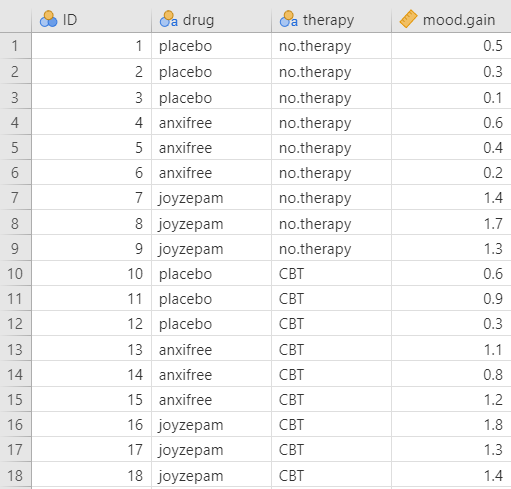
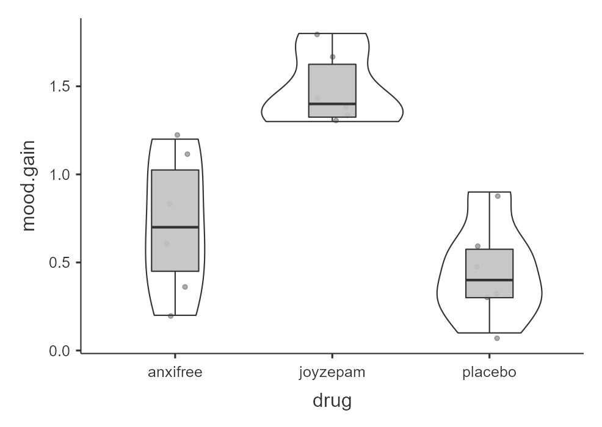
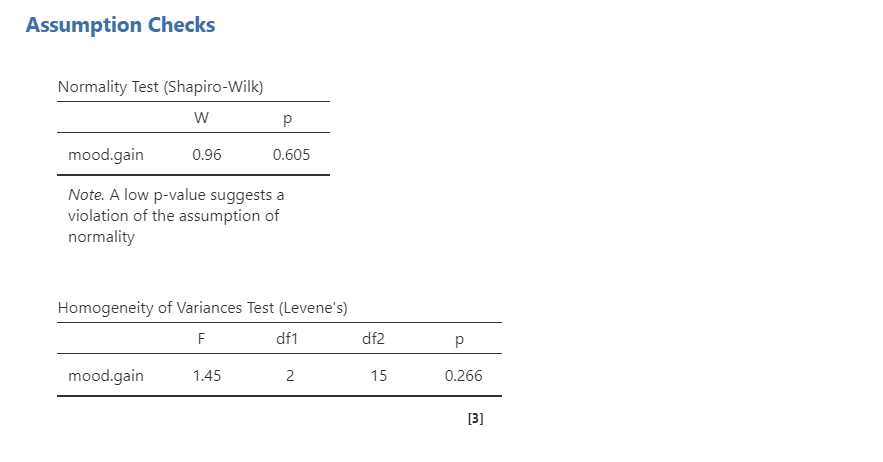
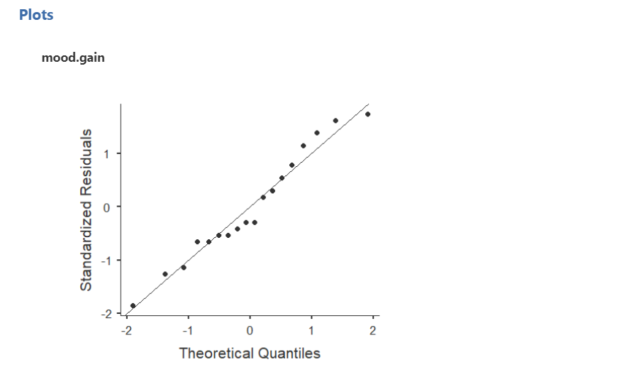
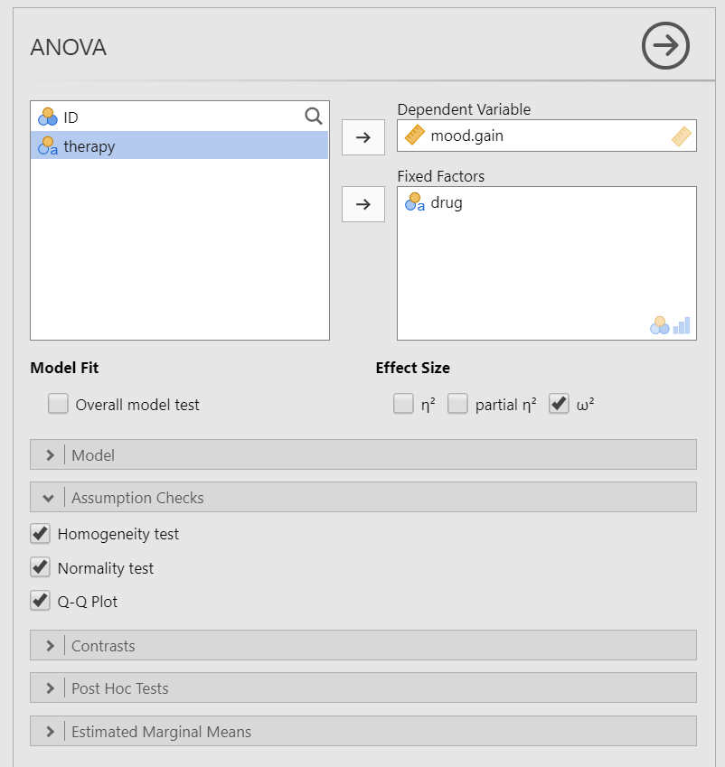
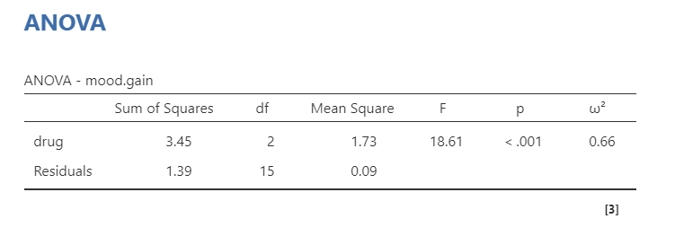
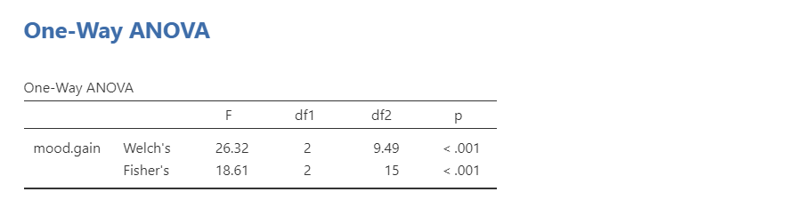
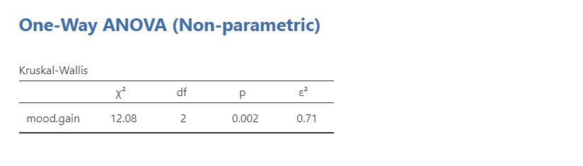

# 13.1 One-Way ANOVA {#sec-one-way-anova .unnumbered}

```{r, echo = FALSE, message=FALSE}
library(tidyverse)
options(knitr.graphics.auto_pdf = TRUE)
```

A **one-way ANOVA** is used to test whether three or more independent groups differ on one continuous outcome variable. We use a one-way ANOVA when we have one continuous outcome variable and one categorical grouping variable with three or more groups. The groups are independent because different participants or cases are in each group.

In jamovi, this test can be conducted through the **ANOVA** menu. Other sources may call this test a **one-way between-subjects ANOVA** or **independent factor ANOVA**. It is not the same as a factorial ANOVA, which includes two or more independent variables.

A one-way ANOVA is an **omnibus test**. This means it tests whether there is a difference somewhere among the group means, but it does not tell us exactly which groups differ from each other. For example, if we compare three groups and the ANOVA is statistically significant, we know that at least one group differs from at least one other group. However, the ANOVA alone does not tell us whether Group 1 differs from Group 2, Group 1 differs from Group 3, or Group 2 differs from Group 3.

The general hypotheses for a one-way ANOVA are:

- $H_0$: There is no difference between the groups on the outcome variable.
- $H_1$: There is a difference between at least two groups on the outcome variable.

If the one-way ANOVA is statistically significant, we usually need follow-up analyses, such as planned contrasts or post hoc tests, to determine which groups differ. These follow-up analyses are covered in @sec-finding-group-differences.

## Why Not Multiple t-Tests?

The reason we do not perform several separate *t*-tests is that each additional test increases the chance of making at least one Type I error. This overall error rate is called the **familywise error rate** or **experimentwise error rate**.

For example, if we ran three separate *t*-tests with $\alpha = .05$ for each test, the familywise error rate would be:

\[ 1 - (.95\^3) = 1 - .857 = .143 \]

This means the chance of making at least one Type I error across the three tests would be about 14.3%, not 5%.

As the number of tests increases, the familywise error rate increases:

| Number of Tests | Familywise Error Rate |
|----------------:|----------------------:|
|               1 |                  5.0% |
|               2 |                  9.8% |
|               3 |                 14.3% |
|               5 |                 22.6% |
|              10 |                 40.1% |
|              20 |                 64.2% |

A one-way ANOVA allows us to conduct one overall test of whether there is a difference among the groups. If that overall test is statistically significant, we can then use follow-up procedures that are designed to control or limit the familywise error rate.

::: callout-note
The xkcd comic [Significant](https://xkcd.com/882/) provides a memorable example of why multiple comparisons can produce false positives.
:::

## Relationship Between ANOVA and the Independent *t*-Test

A one-way ANOVA with exactly two groups gives the same *p*-value as an independent *t*-test. The test statistics are related because:

F = t\^2

For example, if an independent *t*-test produced *t*(16) = -1.31, *p* = .210, the same comparison analyzed as a one-way ANOVA would produce *F*(1, 16) = 1.71, *p* = .210.

In practice, we usually use an independent *t*-test when there are exactly two independent groups and a one-way ANOVA when there are three or more independent groups. The key idea is that ANOVA extends the logic of comparing means to situations with more than two groups.

## Step 1: Look at the Data

For this chapter, we will work with the `clinicaltrial` dataset from the `lsj-data` library. This dataset contains hypothetical data from a clinical trial testing a new antidepressant drug called *Joyzepam*. Participants were randomly assigned to one of three drug conditions: a placebo, an existing antidepressant/anxiety medication called *Anxifree*, or the new medication *Joyzepam*.

The outcome variable is `mood.gain`, which measures improvement in mood after three months. Scores range from -5 to +5, with higher scores indicating greater improvement. The grouping variable for this chapter is `drug`, which has three groups: `placebo`, `anxifree`, and `joyzepam`.

Although the dataset also includes a second variable, `therapy`, we will ignore that variable for now. A one-way ANOVA uses one categorical grouping variable. Later, factorial ANOVA will allow us to examine more than one grouping variable at the same time.

Here's a [video](https://www.youtube.com/watch?v=NBxLBXtvp8E) walking through the one-way ANOVA test.

```{r echo = FALSE, eval = knitr::is_html_output(excludes = "epub"), message = FALSE, warning = FALSE}
library(vembedr)
embed_url("https://www.youtube.com/watch?v=NBxLBXtvp8E")
```

### Data Set-Up

To conduct a one-way ANOVA, the dataset needs one continuous outcome variable and one categorical grouping variable with three or more independent groups. Each row should represent one participant or unit of analysis, and each participant should belong to only one group.

In this example, `mood.gain` is the continuous outcome variable and `drug` is the categorical grouping variable. Because `drug` has three groups, a one-way ANOVA is more appropriate than an independent *t*-test.



:::: {.callout-tip title="Check Your Understanding"}
Look at the data shown above.

1.  Which variable is the continuous outcome variable?
2.  Which variable is the categorical grouping variable for this one-way ANOVA?
3.  Why is this a one-way ANOVA rather than an independent *t*-test?

::: {.callout-note title="Check Your Answer" collapse="true"}
1.  The continuous outcome variable is `mood.gain`.
2.  The categorical grouping variable is `drug`.
3.  This is a one-way ANOVA because the grouping variable has three independent groups: placebo, anxifree, and joyzepam. An independent *t*-test is used when there are only two independent groups.
:::
::::

### Describe the Data

Once we confirm that the data are set up correctly in jamovi, we should describe the outcome variable overall and within each group. For a one-way ANOVA, the group means, standard deviations, sample sizes, and visual distributions are especially important because the test compares the groups on the outcome variable.

In this example, there are 18 participants, with 6 participants in each drug condition. This is a **balanced design** because the groups have the same sample size. Balanced designs are helpful because ANOVA tends to behave better when group sizes are equal or similar.

We should also examine the distribution of `mood.gain` across the three drug conditions. A grouped box plot is especially useful because it shows the center, spread, overlap, and possible outliers for each group. Visually, `joyzepam` appears to have higher mood gain than the other two conditions, but we need the ANOVA to test whether the overall group difference is statistically significant.



### Specify the Hypotheses

Our research question is: Do participants in the three drug conditions differ in mood gain? This research question is non-directional because the one-way ANOVA tests whether there is a difference somewhere among the three groups. Therefore, our hypotheses are:

- $H_0$: There is no difference in mood gain between the three drug conditions.
- $H_1$: There is a difference in mood gain between at least two of the three drug conditions.

We will use the conventional alpha value of $\alpha = .05$. Therefore, we will consider the result statistically significant if the *p*-value is less than .05.

:::: {.callout-tip title="Check Your Understanding"}
A researcher compares stress scores across three class years: first-year students, sophomores, and juniors.

1.  What is the outcome variable?
2.  What is the grouping variable?
3.  Write the alternative hypothesis in words.

::: {.callout-note title="Check Your Answer" collapse="true"}
1.  The outcome variable is stress score.
2.  The grouping variable is class year, with three groups: first-year students, sophomores, and juniors.
3.  The alternative hypothesis is that there is a difference in stress scores between at least two of the three class-year groups.
:::
::::

## Step 2: Check Assumptions {#anova-assumptions}

As a parametric test, the one-way ANOVA has several assumptions:

1.  The outcome variable is **approximately normally distributed within each group**. In jamovi’s ANOVA output, the normality test and Q-Q plot are based on the model residuals. You can also examine the skew/kurtosis and histogram using Descriptives.

2.  The groups have roughly equal variances, which is called **homogeneity of variance**.

3.  The outcome variable is **interval or ratio** (i.e., continuous).

4.  Observations are **independent**. Each participant or case should contribute one score and belong to only one group.

We cannot test the third and fourth assumptions using the output alone; those assumptions are based on how the data were measured and collected. However, we can and should evaluate the first two assumptions.

### ANOVA Is Somewhat Robust to Assumption Violations

ANOVA is often described as **robust**, which means it can still perform reasonably well when assumptions are not perfectly met. However, robustness has limits. ANOVA is most robust when group sizes are equal or similar and group variances are equal or similar.

Assumption violations become more concerning when group sizes are very unequal, variances are very unequal, sample sizes are small, or the distributions are strongly non-normal. When assumptions are seriously violated, we may need to use an alternative test, such as [Welch’s ANOVA](#welchs-anova) or the [Kruskal-Wallis test](#kruskal-wallis-test).

### Testing Normality

We evaluate normality using the four methods introduced earlier: the Shapiro-Wilk test, Q-Q plot, skew and kurtosis values, and visual inspection of the distribution. For a one-way ANOVA, we are interested in whether the outcome is approximately normal within groups. In jamovi’s ANOVA output, the normality test and Q-Q plot evaluate the model residuals.

The Shapiro-Wilk test was not statistically significant (*W* = .96, *p* = .605), which means the test does not provide evidence that the residuals differ from normality. The points in the Q-Q plot are also fairly close to the diagonal line. We should also calculate z-scores for skew and kurtosis by dividing each value by its standard error; absolute values below approximately 1.96 do not suggest a substantial departure from normality. Finally, we should examine grouped histograms, box plots, or violin plots of `mood.gain` by `drug`. Overall, the normality assumption appears reasonable for this example.





### Testing Homogeneity of Variance

We evaluate homogeneity of variance using Levene’s test and by comparing the variability of the outcome across groups. Levene’s test was not statistically significant, *F*(2, 15) = 1.45, *p* = .266. This means the test does not provide evidence that the group variances differ substantially, so the homogeneity-of-variance assumption appears reasonable.

That said, the sample size is small (*N* = 18), so assumption checks should be interpreted cautiously. When sample sizes are small, it is especially helpful to examine the group standard deviations and grouped plots rather than relying on Levene’s test alone.

:::: {.callout-tip title="Check Your Understanding"}
A researcher compares anxiety scores across four independent treatment groups. The Shapiro-Wilk test is not statistically significant, the Q-Q plot looks reasonable, and the skew and kurtosis z-scores are below 1.96. However, Levene’s test is statistically significant.

Which assumption is causing concern?

::: {.callout-note title="Check Your Answer" collapse="true"}
The homogeneity-of-variance assumption is causing concern. The normality checks appear reasonable, but a statistically significant Levene’s test suggests that the group variances may differ substantially.
:::
::::

## Step 3: Perform the Test

### Decide Whether to Use ANOVA, Welch’s ANOVA, or Kruskal-Wallis

The appropriate test depends on whether the assumptions are reasonably met. In this course, use the assumption checks to decide which test to report.

| Assumption Pattern | Test to Report |
|------------------------------------|------------------------------------|
| Normality is reasonably met and homogeneity of variance is reasonably met | One-way ANOVA |
| Normality is reasonably met but homogeneity of variance is not met | Welch’s ANOVA |
| Normality is seriously violated and no appropriate transformation addresses the issue | Kruskal-Wallis test |

Welch’s ANOVA is the alternative when group variances are unequal but the outcome is still approximately normal. The Kruskal-Wallis test is the nonparametric alternative when the normality assumption is seriously violated.

:::: {.callout-tip title="Check Your Understanding"}
A researcher compares wellbeing scores across three independent groups. The normality assumption appears reasonable, but Levene’s test is statistically significant.

Which test should the researcher report for this course?

::: {.callout-note title="Check Your Answer" collapse="true"}
The researcher should report Welch’s ANOVA because normality appears reasonable but the homogeneity-of-variance assumption is not met.
:::
::::

### A Note About Directional Hypotheses in ANOVA

The overall ANOVA is not directional in the same way a *t*-test can be directional. The *F* statistic tests whether there is a difference somewhere among the groups, but it does not test whether one specific group is higher or lower than another specific group.

Directional predictions can be tested with planned contrasts or interpreted through follow-up comparisons, which are covered in @sec-finding-group-differences.

### Perform the Test

::: callout-warning
For the main one-way ANOVA in this course, use **ANOVA** in jamovi rather than **One-Way ANOVA**. The **ANOVA** analysis in jamovi provides the effect-size and assumption-check options we want for this chapter.
:::

1.  Go to the **Analyses** tab, click **ANOVA**, and choose **ANOVA**.

2.  Move the continuous outcome variable `mood.gain` to the **Dependent Variable** box.

3.  Move the categorical grouping variable `drug` to the **Fixed Factors** box.

4.  Under **Effect Size**, select (\omega\^2) (omega-squared).

5.  Under **Assumption Checks**, select `Homogeneity test`, `Normality test`, and `Q-Q plot`.

6.  Ignore the **Model**, **Contrasts**, and **Post Hoc Tests** menus for now. Follow-up analyses are covered in @sec-finding-group-differences.

7.  Under **Estimated Marginal Means**, move `drug` to the **Marginal Means** box. Select `Marginal means tables`, `Marginal means plots`, and `Observed scores`.

When you are done, your setup should look like this:



## Step 4: Interpret Results

Once we are satisfied that the assumptions for the one-way ANOVA are reasonably met, we can interpret the results.



The *p*-value is less than .05, so the result is statistically significant. We reject the null hypothesis of no group differences. The sample provides evidence that mood gain differs across the three drug conditions.

Because the one-way ANOVA is an omnibus test, this result tells us that at least two drug conditions differ from each other. It does not tell us which specific drug conditions differ. We need follow-up analyses to answer that question.

The ANOVA result is reported as *F*(2, 15) = 18.61, *p* \< .001. The two numbers in parentheses are the degrees of freedom for the test. For most students, the key interpretation is whether the *p*-value is less than alpha and what the result means for the research question.

::: {.callout-note title="Optional: Where Do the *F* and Degrees of Freedom Come From?" collapse="true"}
The *F* statistic has two degrees-of-freedom values.

1.  The first value is the **between-groups degrees of freedom**. It is calculated as the number of groups minus 1. In this example, (k - 1 = 3 - 1 = 2).

2.  The second value is the **within-groups** or **residual degrees of freedom**. It is calculated as the total sample size minus the number of groups. In this example, (N - k = 18 - 3 = 15).

The *F* value is calculated by dividing the between-groups mean square by the residual mean square:

\[ F = \frac{MS_{\text{between}}}{MS_{\text{residual}}} \]

You might try to calculate the *F*-value from the output above and notice that your answer is slightly different from the value reported by jamovi. This happens because the output table rounds the displayed mean squares. jamovi uses the unrounded values when calculating the final *F* statistic.
:::

The effect size we will report for one-way ANOVA is omega-squared, (\omega\^2). Omega-squared estimates how much of the variability in the outcome is associated with the grouping variable, with a correction that makes it less biased than eta-squared, especially in small samples. You may also see eta-squared, (\eta\^2), or partial eta-squared, (\eta\^2_p), reported in other sources.

Values closer to 0 indicate a smaller effect, and values closer to 1 indicate a larger effect. As with all effect sizes, interpretation should consider the research context rather than relying only on generic cutoffs.

### Write Up the Results in APA Style

::: callout-warning
This write-up reports only the overall ANOVA. If the ANOVA is statistically significant, a complete results section should also report appropriate follow-up analyses, such as post hoc tests or planned contrasts.
:::

As reviewed in @sec-apa-style, an APA-style results section should describe the research question, summarize the relevant descriptive statistics, report the inferential test and effect size, and interpret the result.

> A one-way ANOVA indicated that mood gain differed significantly across the three drug conditions, *F*(2, 15) = 18.61, *p* \< .001, (\omega\^2 = .66).

This write-up is not complete by itself because the ANOVA was statistically significant. We still need follow-up analyses to determine which drug conditions differ from each other.

### Visualize the Results

For a one-way ANOVA, the graph should help readers compare the distribution of the continuous outcome across the groups. A grouped box plot is usually a good choice because it shows the median, spread, overlap between groups, and possible outliers.

A bar plot with error bars can also be used to communicate group means, especially when the goal is to summarize the mean differences. However, a bar plot hides the shape of the distribution, so it is less useful when we are first examining the data or checking assumptions.

For this example, a grouped box plot of `mood.gain` by `drug` would allow readers to compare the mood-gain distributions across the placebo, anxifree, and joyzepam conditions. If you use a bar plot of means, clearly identify what the error bars represent, such as standard errors or confidence intervals.

## Welch’s ANOVA {#welchs-f-test}

Welch’s ANOVA is used when the outcome variable is approximately normally distributed but the homogeneity-of-variance assumption is not met. Welch’s ANOVA does not assume equal variances across groups, and its degrees of freedom are adjusted.

To conduct Welch’s ANOVA in jamovi, use **ANOVA → One-Way ANOVA**. Move `mood.gain` to the **Dependent Variables** box and `drug` to the **Grouping Variable** box. Under **Variances**, select `Don't assume equal (Welch's)`.

::: callout-warning
In practice, you should report the test that matches your assumptions rather than reporting both the standard one-way ANOVA and Welch’s ANOVA together. They are shown together here only so you can compare how the output differs.
:::



> Welch’s ANOVA indicated that mood gain differed significantly across the three drug conditions, *F*(2, 9.49) = 26.32, *p* \< .001.

## Kruskal-Wallis Test {#kruskal-wallis-test}

The Kruskal-Wallis test is the nonparametric alternative to the one-way ANOVA. It is used when the normality assumption is seriously violated and no appropriate transformation addresses the issue.

The Kruskal-Wallis test is based on ranks rather than the original outcome values, so it does not test group means in the same way as a one-way ANOVA. Because it is rank-based, we usually describe each group using medians when reporting the result.

To conduct the Kruskal-Wallis test in jamovi, go to **ANOVA** and choose **One-Way ANOVA, Kruskal-Wallis**. Move `mood.gain` to the **Dependent Variables** box and `drug` to the **Grouping Variable** box. Select `Effect size`. If follow-up comparisons are needed, use `DSCF pairwise comparisons`, which are discussed in @sec-finding-group-differences.

::: callout-warning
In practice, you should report the test that matches your assumptions rather than reporting both the one-way ANOVA and Kruskal-Wallis test together. They are shown together here only so you can compare how the output differs.
:::



> A Kruskal-Wallis test indicated that mood gain differed significantly across the three drug conditions, (\chi\^2(2) = 12.08), *p* = .002, (\epsilon\^2 = .71).

:::: {.callout-tip title="Check Your Understanding"}
A researcher compares satisfaction scores across four independent groups. The distributions are strongly skewed, and the normality assumption is seriously violated.

Which test should the researcher consider instead of a one-way ANOVA?

::: {.callout-note title="Check Your Answer" collapse="true"}
The researcher should consider the Kruskal-Wallis test, which is the nonparametric alternative to the one-way ANOVA.
:::
::::
