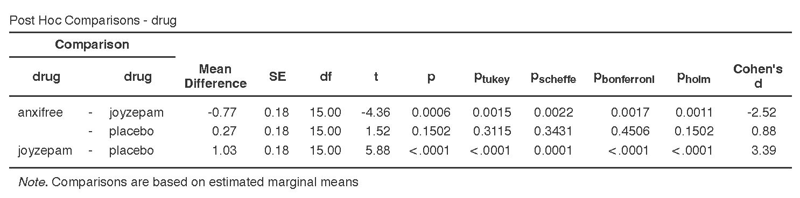

# 13.2 Finding Group Differences After ANOVA {.unnumbered}

A one-way ANOVA is an **omnibus test**. It tells us whether there is a difference somewhere among the group means, but it does not tell us exactly which groups differ from each other. When the overall ANOVA is statistically significant, we usually need follow-up analyses to identify the specific group differences.

There are two main types of follow-up analyses:

- **Post hoc comparisons** are used when we want to compare groups after looking at the overall ANOVA and do not have a small set of specific predictions.
- **Planned contrasts** are used when we have specific group comparisons in mind before looking at the data.

In this course, we will usually report follow-up analyses only when the overall ANOVA is statistically significant. Planned contrasts are a little different because they are based on specific *a priori* hypotheses, but we will keep the course rule simple: first interpret the overall ANOVA, then report the follow-up comparisons that match the research question.

::: callout-warning
Do not interpret a long list of group comparisons just because jamovi can produce them. Follow-up tests should be connected to the research question and the overall ANOVA result.
:::

:::: {.callout-tip title="Check Your Understanding"}
A one-way ANOVA comparing three teaching methods is statistically significant.

1.  What does the significant ANOVA tell us?
2.  What does the significant ANOVA not tell us?
3.  What kind of analysis would help identify which teaching methods differ?

::: {.callout-note title="Check Your Answer" collapse="true"}
1.  The significant ANOVA tells us that there is a difference somewhere among the three teaching-method groups.
2.  It does not tell us exactly which teaching methods differ from each other.
3.  Follow-up analyses, such as post hoc comparisons or planned contrasts, would help identify the specific group differences.
:::
::::

Before interpreting follow-up tests, we should return to the descriptive statistics and graph. The follow-up tests tell us which differences are statistically significant, but the means and visualizations help us understand the direction and size of those differences. You can get the group means from the **Estimated Marginal Means** table in the ANOVA analysis or from the **Exploration** menu.

## Post Hoc Comparisons

Post hoc comparisons are used after a significant omnibus ANOVA when we want to compare the groups pair by pair. We will continue using the clinical trial example from [Section 13.1: One-Way ANOVA](13.1-one-way-anova.qmd), where participants were assigned to one of three drug conditions: placebo, anxifree, or joyzepam.

Because there are three groups, there are three pairwise comparisons:

1.  placebo versus anxifree
2.  placebo versus joyzepam
3.  anxifree versus joyzepam

These comparisons are similar to conducting multiple independent *t*-tests, but they include corrections to control the familywise error rate. The **familywise error rate** is the probability of making at least one Type I error across a family of related tests.

In this course, use the following follow-up procedures:

| Overall Test           | Follow-Up Procedure               |
|------------------------|-----------------------------------|
| Standard one-way ANOVA | Tukey post hoc comparisons        |
| Welch’s ANOVA          | Games-Howell post hoc comparisons |
| Kruskal-Wallis test    | DSCF pairwise comparisons         |

Tukey’s HSD is a common post hoc procedure for one-way ANOVA. It adjusts the pairwise comparisons so that the overall Type I error rate is controlled across the set of comparisons.

::: {.callout-note title="Optional: Other Post Hoc Corrections" collapse="true"}
jamovi provides several post hoc correction options. `None` does not correct for multiple comparisons and is usually not appropriate when conducting several pairwise tests. `Bonferroni` is a conservative correction that adjusts *p*-values based on the number of comparisons. `Holm` is a sequential correction that is often less conservative than Bonferroni. `Scheffe` is another conservative option that can be useful in some settings but is not used in this course.

For this course, use Tukey post hoc comparisons after a standard one-way ANOVA unless instructed otherwise.
:::

To request post hoc tests in jamovi, open the **Post Hoc Tests** menu in the ANOVA setup. Move the grouping variable, `drug`, into the post hoc comparisons box. Select `Tukey` as the correction and select Cohen’s (d) if you want an effect size for each pairwise comparison.

The post hoc table shows each pairwise group comparison. For each comparison, focus on the group names, the mean difference, the adjusted *p*-value, and the effect size if requested. In this example, the Tukey results show that joyzepam differs significantly from both placebo and anxifree, but placebo and anxifree do not differ significantly from each other.

:::: {.callout-tip title="Check Your Understanding"}
A Tukey post hoc table compares three groups: A, B, and C. The comparison between A and B has *p* = .018, the comparison between A and C has *p* = .641, and the comparison between B and C has *p* = .004.

1.  Which pairwise comparisons are statistically significant using (\alpha = .05)?
2.  Which pairwise comparison is not statistically significant?
3.  Why should you describe each *p*-value as a comparison between two groups?

::: {.callout-note title="Check Your Answer" collapse="true"}
1.  A versus B and B versus C are statistically significant.
2.  A versus C is not statistically significant.
3.  A post hoc *p*-value belongs to a pairwise comparison. It tells us whether two specific groups differ, not whether one group is significant by itself.
:::
::::

If you report Welch’s ANOVA because the homogeneity-of-variance assumption was not met, use Games-Howell post hoc comparisons. If you report the Kruskal-Wallis test because the normality assumption was seriously violated, use DSCF pairwise comparisons.

::: callout-note
In practice, you should report one set of follow-up comparisons that matches the overall test you used. For this course, use Tukey after a standard one-way ANOVA, Games-Howell after Welch’s ANOVA, and DSCF pairwise comparisons after Kruskal-Wallis.
:::

### Write Up Post Hoc Results in APA Style

As reviewed in [Chapter 10: Writing Results in APA Style](10.0-writing-results-in-apa-style.qmd), an APA-style results section should describe the research question, summarize the relevant descriptive statistics, report the inferential test and effect size, and interpret the result. When an ANOVA is statistically significant, the write-up should also report the relevant follow-up comparisons.

> A one-way ANOVA indicated that mood gain differed significantly across the three drug conditions, *F*(2, 15) = 18.61, *p* \< .001, (\omega\^2 = .66). Tukey post hoc comparisons indicated that participants in the joyzepam condition (*M* = 1.48, *SD* = 0.21) had significantly greater mood gain than participants in the anxifree condition (*M* = 0.72, *SD* = 0.39), *p* = .002, and the placebo condition (*M* = 0.45, *SD* = 0.28), *p* \< .001. Mood gain did not differ significantly between the anxifree and placebo conditions, *p* = .312.

This is not the only correct way to write the result. The key is to report the overall ANOVA, describe the group means, identify which pairwise comparisons were statistically significant, and avoid treating a pairwise *p*-value as if it belongs to only one group.

::: callout-warning
A post hoc *p*-value belongs to a comparison between two groups. Do not write that “joyzepam was significant” or “the placebo group was not significant.” Instead, write which two groups were compared and whether that comparison was statistically significant.
:::

## Games-Howell Post Hoc Tests After Welch’s ANOVA

If you report Welch’s ANOVA because the homogeneity-of-variance assumption was not met, use Games-Howell post hoc comparisons. Games-Howell is designed for pairwise comparisons when group variances may be unequal.

To request Games-Howell comparisons in jamovi, use **ANOVA → One-Way ANOVA**, move the outcome variable to **Dependent Variables**, move the grouping variable to **Grouping Variable**, and select `Games-Howell (unequal variances)` under **Post-Hoc Tests**.

Interpret the results the same way you would interpret Tukey post hoc comparisons: identify which pairwise group comparisons are statistically significant and describe the direction of those differences using the group means.

## DSCF Pairwise Comparisons After Kruskal-Wallis

If you report the Kruskal-Wallis test because the normality assumption was seriously violated, use DSCF pairwise comparisons. DSCF stands for Dwass-Steel-Critchlow-Fligner. You do not need to memorize that name, but you should recognize that DSCF is the follow-up procedure used with Kruskal-Wallis in jamovi.

To request DSCF pairwise comparisons in jamovi, use **ANOVA → One-Way ANOVA, Kruskal-Wallis** and select `DSCF pairwise comparisons`.

Interpret the results as pairwise comparisons between groups. Because Kruskal-Wallis and DSCF are rank-based, describe the groups using medians rather than relying only on means.

## Planned Contrasts

Planned contrasts are used when we have specific group comparisons in mind before analyzing the data. Unlike post hoc comparisons, planned contrasts are not meant to search through every possible pairwise difference. They are used to test targeted predictions.

In jamovi, planned contrasts are available under the **Contrasts** menu in the ANOVA analysis. The type of contrast determines which group comparisons are tested.

| Contrast Type | What It Is Usually Used For |
|-----------------|-------------------------------------------------------|
| **Simple** | Compares each group to a reference group. This is useful when one group is a control or comparison group. |
| **Deviation** | Compares each group to the overall mean across groups. |
| **Difference** | Compares each group to the average of the groups that came before it, based on the order of the factor levels. |
| **Helmert** | Compares each group to the average of the groups that come after it, based on the order of the factor levels. |
| **Repeated** | Compares adjacent groups, based on the order of the factor levels. This is useful when the groups have a meaningful sequence. |
| **Polynomial** | Tests ordered trends, such as a linear or quadratic pattern. This is useful when the groups are ordered levels, such as low, medium, and high dosage. |

The key idea is that the contrast type should match the research question. For example, if the main question is whether each drug condition differs from placebo, a simple contrast using placebo as the reference group may be appropriate. If the main question is whether mood gain increases across ordered dosage levels, a polynomial contrast may be appropriate. If the groups do not have a meaningful order, a polynomial contrast would usually not make sense.

For this course, you are most likely to use post hoc comparisons after a one-way ANOVA. Planned contrasts are most useful when the research question clearly identifies specific comparisons before the analysis.

### Write Up Planned Contrasts in APA Style

A planned-contrast write-up should identify the specific comparison being tested, report the relevant test result, and interpret the direction of the difference. If the contrast type matters for understanding the comparison, name it in the write-up.

For example, if the planned comparison used a simple contrast comparing each medication to the placebo condition, the write-up could say:

> A one-way ANOVA indicated that mood gain differed significantly across the three drug conditions, *F*(2, 15) = 18.61, *p* \< .001, (\\omega\^2 = .66). Simple planned contrasts using placebo as the reference group indicated that participants in the joyzepam condition had significantly greater mood gain than participants in the placebo condition, *p* \< .001. Participants in the anxifree condition did not differ significantly from participants in the placebo condition, *p* = \[value\].

If the planned comparison tested whether the new drug differed from the two comparison conditions combined, the write-up could say:

> A one-way ANOVA indicated that mood gain differed significantly across the three drug conditions, *F*(2, 15) = 18.61, *p* \< .001, (\\omega\^2 = .66). A planned contrast comparing the joyzepam condition to the placebo and anxifree conditions combined indicated that participants in the joyzepam condition showed greater mood gain than participants in the two comparison conditions, *p* \< .001.

Only use planned contrasts when the comparison follows from the research question. If the goal is to examine all pairwise group differences after a significant ANOVA, use post hoc comparisons instead.

:::: {.callout-tip title="Check Your Understanding"}
A researcher compares four therapy conditions. Before collecting data, the researcher predicts that the new therapy will outperform the three existing therapies. The researcher is less interested in comparing all existing therapies to each other.

Would post hoc comparisons or planned contrasts better match this research question?

::: {.callout-note title="Check Your Answer" collapse="true"}
Planned contrasts better match this research question because the researcher has a specific comparison in mind before analyzing the data: the new therapy compared with the existing therapies.
:::
::::

:::: {.callout-tip title="Check Your Understanding"}
In the clinical trial example, suppose our specific prediction is that joyzepam will lead to greater mood gain than the two comparison conditions.

1.  Is this a post hoc question or a planned contrast question?
2.  Why should this decision be made before looking at the results?

::: {.callout-note title="Check Your Answer" collapse="true"}
1.  This is a planned contrast question because it focuses on a specific predicted comparison.
2.  The decision should be made before looking at the results so that the researcher is not choosing comparisons based on which results appear statistically significant.
:::
::::

### Write Up Planned Contrasts in APA Style

A planned-contrast write-up should identify the specific comparison being tested, report the relevant test result, and interpret the direction of the difference.

> A one-way ANOVA indicated that mood gain differed significantly across the three drug conditions, *F*(2, 15) = 18.61, *p* \< .001, (\omega\^2 = .66). A planned contrast comparing the joyzepam condition to the two comparison conditions combined indicated that participants in the joyzepam condition showed greater mood gain than participants in the placebo and anxifree conditions, *p* \< .001.

Only use planned contrasts when the comparison follows from the research question. If the goal is to examine all pairwise group differences after a significant ANOVA, use post hoc comparisons instead.
