# 13.3 Repeated Measures ANOVA {.unnumbered}

```{r, echo = FALSE, message=FALSE}
library(tidyverse)
options(knitr.graphics.auto_pdf = TRUE)
```

A **repeated measures ANOVA** is used to test whether three or more related measurements differ on one continuous outcome variable. We use a repeated measures ANOVA when the same participants are measured across three or more time points, conditions, or tasks.

A repeated measures ANOVA is similar to a dependent *t*-test, but it is used when there are three or more related measurements instead of two. In jamovi, this test is labeled **Repeated Measures ANOVA**. Other sources may call it a **one-way repeated measures ANOVA** or **one-way within-subjects ANOVA**.

There are two common ways we might use a repeated measures ANOVA. First, the same participants might be measured on the same outcome at three or more time points. In that case, the repeated measures factor is time.

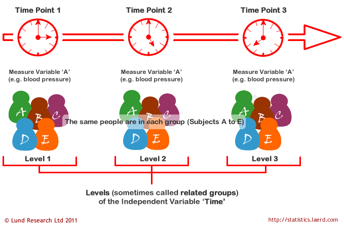

Second, the same participants might complete three or more conditions or tasks. In that case, the repeated measures factor is condition or task.

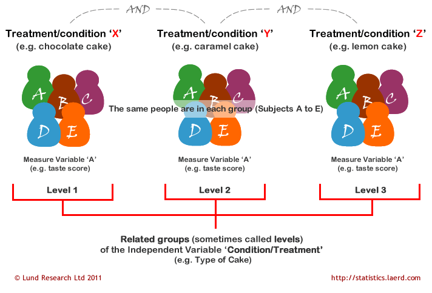

## Step 1: Look at the Data

For this chapter, we will work with the `broca` dataset from the `lsj-data` library. This dataset contains hypothetical data from six patients with Broca’s aphasia, a language difficulty that can occur after a stroke. Each patient completed three word-recognition tasks:

1.  **Speech:** repeating single words read aloud by the researcher
2.  **Conceptual:** matching pictures with their correct names
3.  **Syntax:** reordering syntactically incorrect sentences

Each task included 10 attempts, and the score for each task is the number of attempts completed successfully. Because each patient completed all three tasks, the three task scores are related measurements. Our research question is: Do patients differ in word-recognition scores across the three tasks?

The [video](https://www.youtube.com/watch?v=Fl6S9IBC1q0) below walks through a repeated measures ANOVA in jamovi.

```{r echo = FALSE, eval = knitr::is_html_output(excludes = "epub"), message = FALSE, warning = FALSE}
library(vembedr)
embed_url("https://www.youtube.com/watch?v=Fl6S9IBC1q0")
```

### Data Set-Up

To conduct a repeated measures ANOVA in jamovi, the dataset usually needs one column for each related measurement. Each row should represent one participant or matched case. The scores in the same row are related because they come from the same participant or matched case.

In the `broca` dataset, each row represents one patient. The three related measurements are `speech`, `conceptual`, and `syntax`, which contain each patient’s score on the three word-recognition tasks.

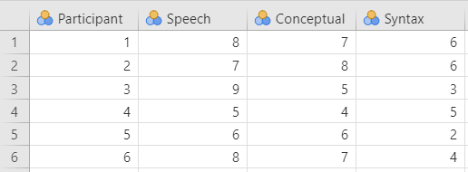

:::: {.callout-tip title="Check Your Understanding"}
Look at the data shown above.

1.  What are the three related measurements?
2.  How do you know this dataset is set up for a repeated measures ANOVA?
3.  Why would this not be a one-way ANOVA with independent groups?

::: {.callout-note title="Check Your Answer" collapse="true"}
1.  The three related measurements are `speech`, `conceptual`, and `syntax`.
2.  The dataset is set up for a repeated measures ANOVA because each row represents one patient, and each patient has a score for all three tasks.
3.  This is not a one-way ANOVA with independent groups because the three scores being compared come from the same patients rather than from three separate groups of patients.
:::
::::

### Describe the Data

Once we confirm that the data are set up correctly in jamovi, we should describe each related measurement. In this example, there are only six patients, so the dataset is very small. The descriptive statistics show that patients appear to score highest on the speech task and lowest on the syntax task. However, we need the repeated measures ANOVA to test whether the differences across tasks are statistically significant.

For repeated measures data, the pattern of scores within participants is important. A table of means and standard deviations is useful, but a graph showing the repeated measurements can help us see whether most participants show a similar pattern across tasks.

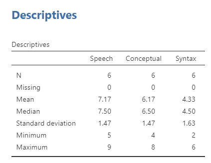

### Specify Your Hypotheses

Our research question is: Do patients differ in word-recognition scores across the three tasks? This research question is non-directional because the repeated measures ANOVA tests whether there is a difference somewhere across the related measurements. Therefore, our hypotheses are:

- $H_0$: There is no difference in word-recognition scores across the three tasks.
- $H_1$: There is a difference in word-recognition scores between at least two of the three tasks.

We will use the conventional alpha value of $\alpha = .05$. Therefore, we will consider the result statistically significant if the *p*-value is less than .05.

:::: {.callout-tip title="Check Your Understanding"}
A researcher measures students’ anxiety at the beginning, middle, and end of the semester.

1.  What is the repeated measures factor?
2.  How many related measurements are there?
3.  Write the alternative hypothesis in words.

::: {.callout-note title="Check Your Answer" collapse="true"}
1.  The repeated measures factor is time.
2.  There are three related measurements: beginning, middle, and end of the semester.
3.  Anxiety differs between at least two of the three time points.
:::
::::

## Step 2: Check Assumptions

As a parametric test, the repeated measures ANOVA has several assumptions:

1.  The outcome is **approximately normally distributed within the repeated measurements**, or the model residuals are approximately normal.

2.  The variances of the differences between pairs of repeated measurements are roughly equal. This is called **sphericity**.

3.  The outcome variable is **interval or ratio** (i.e., continuous).

4.  Cases are **independent of other cases**. The repeated measurements within a row are related, but each participant or matched case should be independent of the other participants or matched cases.

We cannot test the third and fourth assumptions using the output alone; those assumptions are based on how the data were measured and collected. However, we can and should evaluate normality and sphericity.

### Testing Normality

::: callout-note
Normality is evaluated a little differently for repeated measures ANOVA than for the tests we have used so far. In jamovi’s repeated measures ANOVA output, the main normality check available is the Q-Q plot of the residuals.
:::

For repeated measures ANOVA, we are interested in whether the repeated-measures model is reasonably consistent with the normality assumption. In jamovi, select `Q-Q plot` under **Assumption Checks**. If the points fall reasonably close to the diagonal line, then the normality assumption appears reasonable.

When possible, you should also examine the distributions of the repeated measurements using descriptive statistics and graphs. This may include checking skew and kurtosis values and visually inspecting histograms, box plots, or violin plots for each repeated measurement. These checks do not replace the residual Q-Q plot, but they can help you better understand the data.

### Testing Sphericity

Sphericity is the repeated measures ANOVA assumption that is most different from the tests we have used so far. Sphericity means that the variances of the differences between pairs of repeated measurements are approximately equal.

For example, with three tasks, there are three sets of difference scores:

1.  speech minus conceptual
2.  speech minus syntax
3.  conceptual minus syntax

The sphericity assumption asks whether the variability of those difference scores is roughly equal across the three pairs. This assumption only applies when there are three or more related measurements, which is why we did not discuss it for the dependent *t*-test.

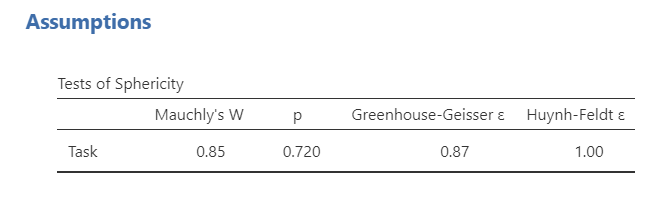

Mauchly’s test of sphericity tests the null hypothesis that the sphericity assumption is met. If Mauchly’s test is not statistically significant, the test does not provide evidence that sphericity has been violated. In this example, Mauchly’s test is not statistically significant, so the sphericity assumption appears reasonable.

If Mauchly’s test is statistically significant, then the sphericity assumption is not met. In that case, we should use a sphericity correction, such as Greenhouse-Geisser or Huynh-Feldt, when interpreting the repeated measures ANOVA.

For this course, use the following rule:

| Sphericity Result | What to Report |
|------------------------------------|------------------------------------|
| Mauchly’s test is not statistically significant | Report the uncorrected repeated measures ANOVA result |
| Mauchly’s test is statistically significant and Greenhouse-Geisser (\epsilon \< .75) | Report the Greenhouse-Geisser corrected result |
| Mauchly’s test is statistically significant and Greenhouse-Geisser (\epsilon \ge .75) | Report the Huynh-Feldt corrected result |

:::: {.callout-tip title="Check Your Understanding"}
A repeated measures ANOVA has four time points. Mauchly’s test is statistically significant, and the Greenhouse-Geisser epsilon value is .62.

1.  Is the sphericity assumption met?
2.  Which correction should be reported for this course?

::: {.callout-note title="Check Your Answer" collapse="true"}
1.  No. A statistically significant Mauchly’s test suggests that the sphericity assumption is not met.
2.  The Greenhouse-Geisser correction should be reported because the Greenhouse-Geisser epsilon value is below .75.
:::
::::

## Step 3: Perform the Test

### Decide Whether to Use Repeated Measures ANOVA or Friedman’s Test

The appropriate test depends on whether the assumptions are reasonably met. In this course, use the assumption checks to decide which test to report.

| Assumption Pattern | Test to Report |
|------------------------------------|------------------------------------|
| Normality is met and sphericity is met | Repeated measures ANOVA |
| Normality is met but sphericity is not met | Repeated measures ANOVA with the appropriate sphericity correction |
| Normality is not met | Friedman test |

The Friedman test is the nonparametric alternative to the repeated measures ANOVA. It is used when the normality assumption is seriously violated for a design with three or more related measurements.

:::: {.callout-tip title="Check Your Understanding"}
A researcher compares reaction time across three related conditions. The Q-Q plot looks reasonable, but Mauchly’s test is statistically significant.

Which test result should the researcher report for this course?

::: {.callout-note title="Check Your Answer" collapse="true"}
The researcher should report the repeated measures ANOVA with the appropriate sphericity correction. The normality assumption appears reasonable, but sphericity is not met.
:::
::::

### Perform the Test

We have already discussed what to do if you violate the assumption of sphericity above; you select one of the two sphericity corrections based on the values of the sphericity tests.

If you violate the assumption of normality or if the dependent variable is ordinal, then you can use the Friedman test. You can select this using the Repeated Measures ANOVA - Friedman option under the ANOVA analysis.

1.  Go to the **Analyses** tab, click **ANOVA**, and choose **Repeated Measures ANOVA**.

2.  Under **Repeated Measures Factors**, rename `RM Factor 1` to `Task`.

3.  Rename the three levels of `Task` as `Speech`, `Conceptual`, and `Syntax`.

4.  Under **Repeated Measures Cells**, move each variable into the correct cell. Move `speech` to the Speech cell, `conceptual` to the Conceptual cell, and `syntax` to the Syntax cell.

5.  Select generalized eta-squared, (\eta\^2_G), as the effect size.

6.  Rename the **Dependent Variable Label** to describe what is measured across the repeated tasks. In this example, use `Word recognition score`.

7.  Under **Assumption Checks**, select `Sphericity tests` and `Q-Q plot`. If the sphericity assumption is violated, report the appropriate corrected result rather than the uncorrected result.

8.  Under **Post Hoc Tests**, select `Tukey`. Remember that we only interpret post hoc tests if the overall repeated measures ANOVA is statistically significant.

9.  Under **Estimated Marginal Means**, move `Task` to the **Marginal Means** box. Select `Marginal means tables`, `Marginal means plots`, and `Observed scores`. Uncheck `Equal cell weights`.

When you are done, your setup should look like this:

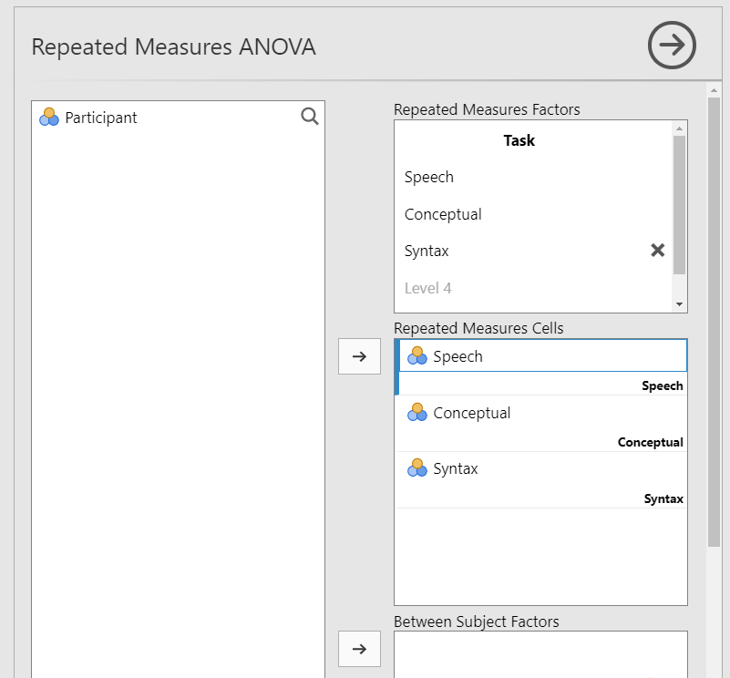

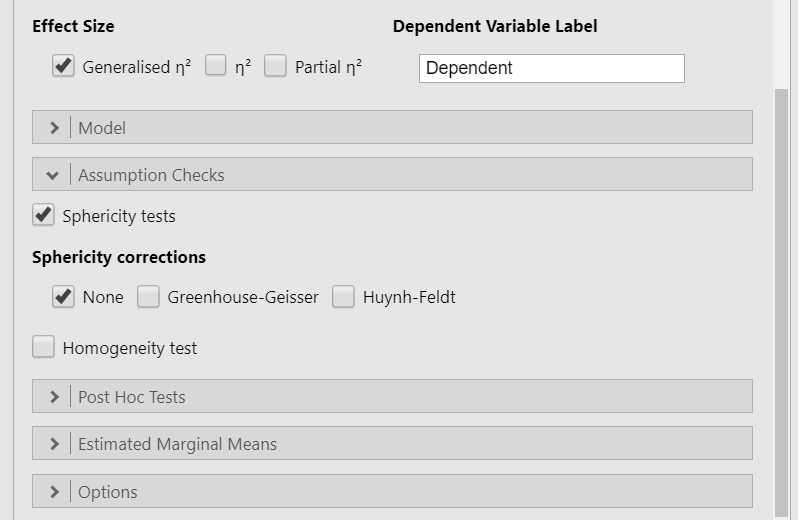

## Step 4: Interpret Results

Once we are satisfied that the assumptions for the repeated measures ANOVA are reasonably met, we can interpret the results.

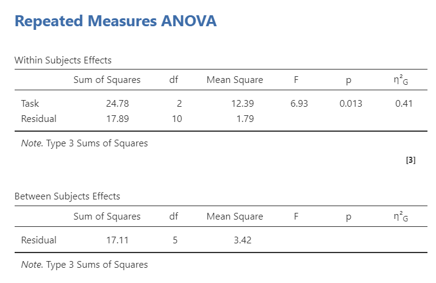

jamovi provides a **Within Subjects Effects** table and a **Between Subjects Effects** table. In this example, we only have a within-subjects effect: `Task`. The Within Subjects Effects table is the table we need for the repeated measures ANOVA result. The Between Subjects Effects table can be ignored here because we do not have a between-subjects grouping variable. It becomes useful in mixed factorial ANOVA, where a design includes both repeated measurements and independent groups.

The overall effect of Task is statistically significant, *F*(2, 10) = 6.93, *p* = .013. We reject the null hypothesis of no task differences. The sample provides evidence that word-recognition scores differ across the three tasks.

::: {.callout-note title="Optional: Where Do the Degrees of Freedom Come From?" collapse="true"}
The repeated measures ANOVA has two degrees-of-freedom values.

1.  The first value is based on the number of repeated measurements. It is calculated as (k - 1), where (k) is the number of repeated measurements. In this example, (3 - 1 = 2).

2.  The second value is the residual degrees of freedom. For a simple repeated measures ANOVA, it is calculated as ((n - 1)(k - 1)), where (n) is the number of participants and (k) is the number of repeated measurements. In this example, ((6 - 1)(3 - 1) = 10).
:::

Because the repeated measures ANOVA is an omnibus test, this result tells us that at least two task scores differ from each other. It does not tell us which specific tasks differ. We need follow-up comparisons to answer that question.

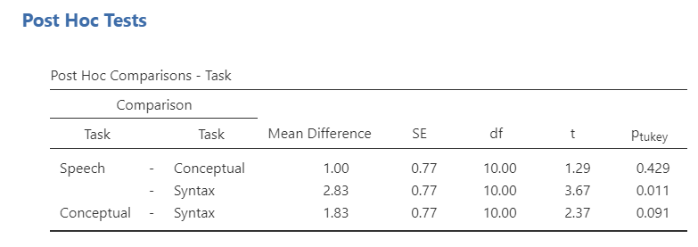

Because the overall repeated measures ANOVA is statistically significant, we can interpret the Tukey post hoc comparisons. The post hoc table shows that scores differed significantly between the speech and syntax tasks, *p* = .011. The conceptual task did not differ significantly from either the speech task or the syntax task.

The estimated marginal means table helps us interpret the direction of the difference. Participants recognized more words in the speech task than in the syntax task.

:::: {.callout-tip title="Check Your Understanding"}
A repeated measures ANOVA comparing three related time points is statistically significant. Tukey post hoc comparisons show that Time 1 differs from Time 3, but Time 2 does not differ from either Time 1 or Time 3.

1.  What does the significant overall ANOVA tell us?
2.  Which specific comparison is statistically significant?
3.  Why do we need the estimated means?

::: {.callout-note title="Check Your Answer" collapse="true"}
1.  The significant overall ANOVA tells us that there is a difference somewhere across the three related time points.
2.  The statistically significant comparison is Time 1 versus Time 3.
3.  The estimated means tell us the direction of the difference, such as whether scores were higher at Time 1 or Time 3.
:::
::::

### Write Up the Results in APA Style

As reviewed in @sec-apa-style, an APA-style results section should describe the research question, summarize the relevant descriptive statistics, report the inferential test and effect size, and interpret the result. When a repeated measures ANOVA is statistically significant, the write-up should also report appropriate follow-up comparisons.

> A repeated measures ANOVA indicated that word-recognition scores differed significantly across the three tasks, *F*(2, 10) = 6.93, *p* = .013, (\eta\^2_G = .41). Tukey post hoc comparisons indicated that participants recognized significantly more words in the speech task (*M* = 7.17, *SE* = 0.62) than in the syntax task (*M* = 4.33, *SE* = 0.62), *p* = .011. Scores on the conceptual task (*M* = 6.17, *SE* = 0.62) did not differ significantly from scores on the speech or syntax tasks.

This is not the only correct way to write the result. The key is to report the overall repeated measures ANOVA, the relevant descriptive statistics, the effect size, the follow-up comparisons, and the interpretation.

### Visualize the Results

For a repeated measures ANOVA, the graph should help readers understand how scores changed across the related measurements. Because the same participants completed all three tasks, the most informative graph often shows the repeated nature of the data.

A line plot can be useful when the repeated measurements have a meaningful order, such as time points. For unordered tasks or conditions, a plot of estimated marginal means with observed scores can still help readers compare the task scores, but the connecting line should not be interpreted as a trend over time.

For this example, the plot should communicate that word-recognition scores were highest for the speech task and lowest for the syntax task. The observed scores are useful because the sample is very small.


## Friedman Test {#friedman-test}

The Friedman test is the nonparametric alternative to the repeated measures ANOVA. It is used when the normality assumption is seriously violated and no appropriate transformation addresses the issue.

The Friedman test is based on ranks rather than the original outcome values, so it does not test mean differences in the same way as a repeated measures ANOVA. Because it is rank-based, we usually describe the repeated measurements using medians when reporting the result.

To conduct the Friedman test in jamovi, go to **ANOVA** and choose **Repeated Measures ANOVA - Friedman**. Move the related measurements, `speech`, `conceptual`, and `syntax`, to the **Measures** box. Select `Pairwise comparisons (Durbin-Conover)` for follow-up comparisons and `Descriptives` for means and medians.

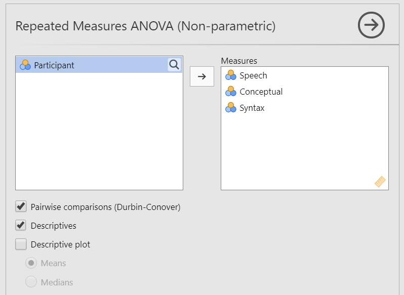

The Friedman test is statistically significant, which suggests that word-recognition scores differ across the three tasks. The Durbin-Conover pairwise comparisons show that the only statistically significant pairwise difference is between speech and syntax.

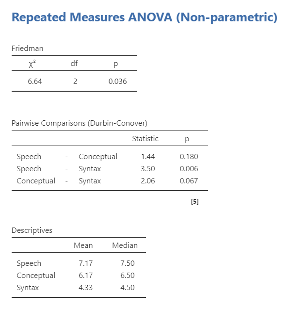

We can write up the results similarly as before except using the median because as a non-parametric test it is analyzing the median and not the mean:

> A Friedman test indicated that word-recognition scores differed significantly across the three tasks, (\chi\^2(2) = 6.64), *p* = .036. Durbin-Conover pairwise comparisons indicated that participants recognized more words in the speech task (*Mdn* = 7.50) than in the syntax task (*Mdn* = 6.50), *p* = .006. Scores on the conceptual task (*Mdn* = 6.50) did not differ significantly from scores on the speech or syntax tasks.

:::: {.callout-tip title="Check Your Understanding"}
A researcher compares scores across three related conditions, but the normality assumption is seriously violated.

1.  Which nonparametric test should the researcher consider?
2.  Why should the researcher describe the repeated measurements using medians?

::: {.callout-note title="Check Your Answer" collapse="true"}
1.  The researcher should consider the Friedman test.
2.  The Friedman test is rank-based rather than mean-based, so medians are usually more appropriate descriptive statistics for the write-up.
:::
::::
