# 13.4 Factorial ANOVA {.unnumbered}

```{r, echo = FALSE, message=FALSE}
library(tidyverse)
options(knitr.graphics.auto_pdf = TRUE)
```

Factorial ANOVA allows us to examine two or more independent variables at the same time. Like the ANOVA tests in the previous sections, factorial ANOVA is used with one continuous outcome variable. What makes it factorial is that the model includes two or more factors.

Factorial ANOVA allows us to test two kinds of effects:

- **Main effects**, which test whether each factor is related to the outcome while accounting for the other factors in the model.
- **Interaction effects**, which test whether the effect of one factor depends on the level of another factor.

There are several types of factorial designs:

- **Independent factorial design**: two or more between-subjects factors
- **Repeated measures factorial design**: two or more within-subjects or repeated-measures factors
- **Mixed factorial design**: at least one between-subjects factor and at least one within-subjects factor

You may also see factorial ANOVAs described as **two-way**, **three-way**, or **n-way** ANOVAs. This refers to the number of independent variables or factors in the model. For example, a two-way ANOVA has two factors, and a three-way ANOVA has three factors.

Factorial designs are also described by the number of levels in each factor. For example, a 2 × 3 ANOVA has two factors: one factor with two levels and one factor with three levels. If one factor is between-subjects and the other is within-subjects, we would describe the design as a 2 × 3 mixed factorial ANOVA.

This section introduces three common factorial designs. The goal is not to memorize every possible factorial model, but to learn how to recognize the design, identify main effects and interactions, and interpret the output.

::: callout-note
Factorial ANOVA is an extension topic in this course. You do not need to memorize every possible factorial design. Focus on identifying whether each factor is between-subjects or within-subjects, interpreting main effects and interactions, and recognizing when follow-up comparisons are needed.
:::

Because factorial ANOVA is an extension topic in this course, this section moves more quickly than the previous ANOVA sections. However, we are still using the same four-step hypothesis-testing process:

1.  Look at the data and identify the design.
2.  Check assumptions.
3.  Perform the test.
4.  Interpret the main effects, interactions, and follow-up comparisons when needed.

| Design | Factor Structure | Example Question |
|------------------------|------------------------|------------------------|
| **Independent factorial ANOVA** | Two or more between-subjects factors | Do attendance, reading, and their interaction predict grades? |
| **Repeated measures factorial ANOVA** | Two or more within-subjects factors | Do performance scores differ by time, area, and their interaction when the same people complete all conditions? |
| **Mixed factorial ANOVA** | At least one between-subjects factor and at least one within-subjects factor | Do cravings differ by condition, reward type, and their interaction when reward is measured within participants? |

:::: {.callout-tip title="Check Your Understanding"}
For each study below, identify the type of factorial ANOVA design.

1.  A researcher compares test anxiety across two teaching formats: online and in person. Students are also classified by class year: first-year, sophomore, junior, or senior. Each student belongs to one teaching format and one class year.

2.  A researcher measures the same participants' reaction times under three sound conditions and two lighting conditions. Every participant completes all six combinations.

3.  A researcher compares therapy and waitlist control groups on depression scores measured at pretest, posttest, and follow-up. Each participant belongs to only one group but provides depression scores at all three time points.

::: {.callout-note title="Check Your Answer" collapse="true"}
1.  This is an **independent factorial ANOVA** because both factors are between-subjects factors. Each student belongs to only one teaching format and one class year.

2.  This is a **repeated measures factorial ANOVA** because both factors are within-subjects factors. Each participant completes all sound conditions and all lighting conditions.

3.  This is a **mixed factorial ANOVA** because one factor is between-subjects and one factor is within-subjects. Group is between-subjects because each participant is in either therapy or waitlist control. Time is within-subjects because each participant is measured at pretest, posttest, and follow-up.
:::
::::

## Independent Factorial ANOVA

An independent factorial ANOVA includes two or more between-subjects factors. Each participant belongs to one level of each factor, and different participants are in the different combinations of factor levels.

### Identify the Design

For this example, we will use the `rtfm` dataset from the `lsj-data` library. The continuous outcome variable is `grade`. There are two between-subjects factors:

- `attend`: whether the student attended lectures
- `reading`: whether the student read the textbook

Both factors have two levels: `0` = no and `1` = yes. This is a 2 × 2 independent factorial ANOVA because there are two between-subjects factors and each factor has two levels. Our research question is: Do attendance, reading, and their interaction predict student grades?

:::: {.callout-tip title="Check Your Understanding"}
A researcher studies whether sleep condition and caffeine condition affect reaction time. Participants are randomly assigned to either normal sleep or sleep deprivation. They are also randomly assigned to either caffeine or no caffeine.

1.  How many factors are there?
2.  What are the factors?
3.  Why is this an independent factorial design?
4.  What would the interaction test?

::: {.callout-note title="Check Your Answer" collapse="true"}
1.  There are two factors.
2.  The factors are sleep condition and caffeine condition.
3.  This is an independent factorial design because both factors are between-subjects factors. Each participant is assigned to only one sleep condition and only one caffeine condition.
4.  The interaction would test whether the effect of caffeine on reaction time depends on sleep condition.
:::
::::

Here's a [video](https://www.youtube.com/watch?v=EynjbSDW56I) walking through the independent factorial ANOVA.

```{r echo = FALSE, eval = knitr::is_html_output(excludes = "epub"), message = FALSE, warning = FALSE}
library(vembedr)
embed_url("https://www.youtube.com/watch?v=EynjbSDW56I")
```

### Check Assumptions

For an independent factorial ANOVA, the assumptions are similar to the one-way ANOVA: approximate normality, homogeneity of variance, a continuous outcome variable, and independent observations.

In this example, the normality assumption appears reasonable, but Levene's test is statistically significant, which suggests that the homogeneity-of-variance assumption may not be met. jamovi does not provide a simple Welch's ANOVA option for factorial designs in the same way it does for one-way ANOVA. Because this example is being used to illustrate factorial ANOVA, we will continue with the standard factorial ANOVA but note the assumption concern when interpreting the results.

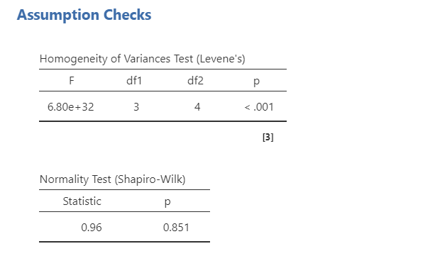

### Run the Factorial ANOVA in jamovi

Because both factors are between-subjects factors, use **ANOVA → ANOVA** in jamovi.

1.  Move the continuous outcome variable `grade` to the **Dependent Variable** box.

2.  Move both grouping variables, `attend` and `reading`, to the **Fixed Factors** box.

3.  Under **Effect Size**, select (\omega\^2).

4.  Under **Assumption Checks**, select `Homogeneity test`, `Normality test`, and `Q-Q plot`.

5.  Under **Estimated Marginal Means**, request marginal means tables and plots for `attend`, `reading`, and the `attend * reading` interaction.

6.  If needed, use **Post Hoc Tests** for factors with three or more levels. In this example, each factor has only two levels, so the main effects can be interpreted directly from the marginal means.

### Interpret Main Effects and Interactions

The ANOVA table includes three effects: the main effect of `attend`, the main effect of `reading`, and the `attend * reading` interaction.

The main effect of `attend` tests whether grades differ between students who attended lectures and students who did not, averaging across reading status. The main effect of `reading` tests whether grades differ between students who read the textbook and students who did not, averaging across attendance status. The interaction tests whether the relationship between attendance and grades depends on whether students read the textbook.

In this example, both main effects are statistically significant. Students who attended lectures had higher grades than students who did not, and students who read the textbook had higher grades than students who did not. The interaction is not statistically significant, which suggests that the effect of attendance does not clearly depend on whether students read the textbook.

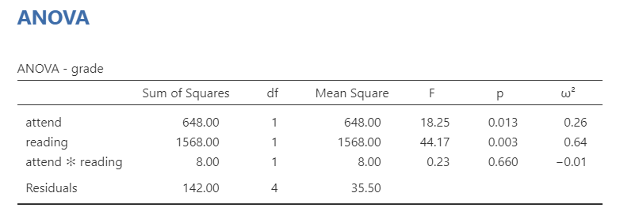

Because both `attend` and `reading` have only two levels, we do not need post hoc tests to determine which levels differ. Each significant main effect already compares the two levels of that factor. The estimated marginal means tell us the direction of the differences.

Post hoc tests become more useful when a factor has three or more levels. For example, if `reading` had three levels, we would need follow-up comparisons to identify which levels differed.

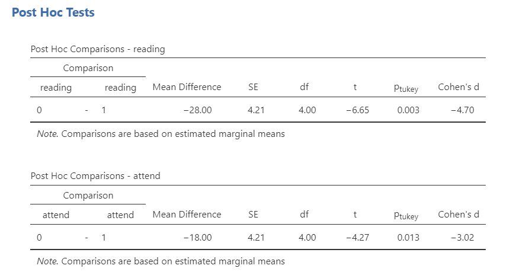

:::: {.callout-tip title="Check Your Understanding"}
In a 2 × 2 factorial ANOVA, the main effect of Factor A is statistically significant, the main effect of Factor B is statistically significant, and the interaction is not statistically significant.

What does the nonsignificant interaction suggest?

::: {.callout-note title="Check Your Answer" collapse="true"}
The nonsignificant interaction suggests that the effect of one factor does not clearly depend on the level of the other factor. In other words, the pattern for one factor is fairly similar across the levels of the other factor.
:::
::::

### Interactions

An **interaction** occurs when the relationship between one factor and the outcome changes across the levels of another factor. In other words, the effect of one factor depends on the level of the other factor.

Interaction plots can help us understand the pattern. In a simple two-factor interaction plot, the lines represent the levels of one factor and the x-axis represents the levels of the other factor. When lines are roughly parallel, that usually suggests little or no interaction. When lines are clearly nonparallel or cross, that suggests a possible interaction.

However, the plot is not the statistical test. We use the ANOVA table to determine whether the interaction is statistically significant, and we use the plot to understand the pattern.

In this example, the lines are roughly parallel, which is consistent with the nonsignificant interaction. The plot also shows that grades are higher for students who attended lectures and higher for students who read the textbook, which is consistent with the significant main effects.

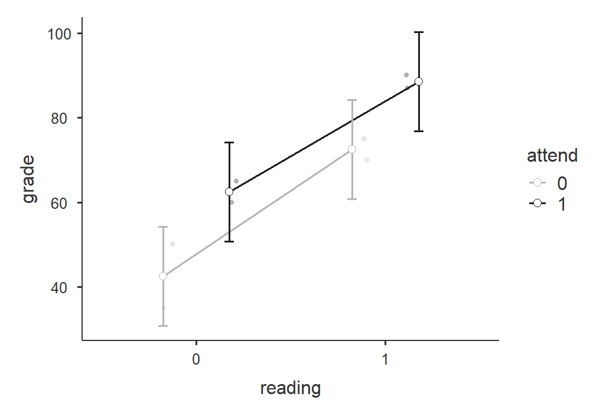

:::: {.callout-tip title="Check Your Understanding"}
In an interaction plot, the lines for two groups cross.

Does this automatically mean the interaction is statistically significant?

::: {.callout-note title="Check Your Answer" collapse="true"}
No. Crossing or nonparallel lines suggest that an interaction may be present, but the ANOVA table provides the statistical test of the interaction. The plot helps us interpret the pattern.
:::
::::

### Write Up the Results

> A 2 × 2 independent factorial ANOVA was conducted to examine whether attendance and textbook reading were associated with student grades. There was a significant main effect of attendance, *F*(1, 4) = 18.25, *p* = .013, (\omega\^2 = .26), such that students who attended lectures had higher grades than students who did not. There was also a significant main effect of reading, *F*(1, 4) = 44.17, *p* = .003, (\omega\^2 = .64), such that students who read the textbook had higher grades than students who did not. The attendance × reading interaction was not statistically significant, *F*(1, 4) = 8.00, *p* = .600, (\omega\^2 = -.01).

> Tukey's post hoc comparisons show that students who attended lectures (*M* = 75.50, *SE* = 2.98) had higher grades than students who did not (*M* = 57.50, *SE* = 2.98; *p* = .003, *d* = 4.70); furthermore, students who read (*M* = 80.50, *SE* = 2.98) had higher grades than students who did not (*M* = 52.50, *SE* = 2.98; *p* = .013; *d* = 3.02).

::: callout-note
Because each factor has only two levels, follow-up pairwise comparisons are not necessary for the main effects. The estimated marginal means can be used to describe the direction of each main effect.
:::

## Repeated Measures Factorial ANOVA

A repeated measures factorial ANOVA includes two or more within-subjects factors. Each participant provides scores for every combination of the repeated-measures factor levels.

### Identify the Design

In this example, 10 employees were evaluated before and after a training program. They were evaluated in three performance areas: product knowledge, client relations, and action. This creates a 2 × 3 repeated measures factorial design:

- **Time:** pre-training and post-training
- **Area:** product, client, and action

Both factors are within-subjects factors because the same employees are measured at every time point and in every area.

The dataset is adapted from an example from [Real Statistics Using Excel](https://www.real-statistics.com/anova-repeated-measures/two-within-subjects-factors/). You can find the dataset here to follow along: [Repeated-measures-factorial-ANOVA.xlsx Download](https://github.com/danawanzer/stats-with-jamovi/blob/master/data/Repeated-measures-factorial-ANOVA.xlsx).

Here's a [video](https://www.youtube.com/watch?v=BQAFjSzoFHU) walking through the repeated measures factorial ANOVA.

```{r echo = FALSE, eval = knitr::is_html_output(excludes = "epub"), message = FALSE, warning = FALSE}
library(vembedr)
embed_url("https://www.youtube.com/watch?v=BQAFjSzoFHU")
```

### Check Assumptions

First, we check sphericity for the within-subjects effects. In a repeated measures factorial ANOVA, sphericity may be tested for each within-subjects factor and interaction that has more than two levels. Mauchly's tests are not statistically significant in this example, so the sphericity assumption appears reasonable and no correction is needed.

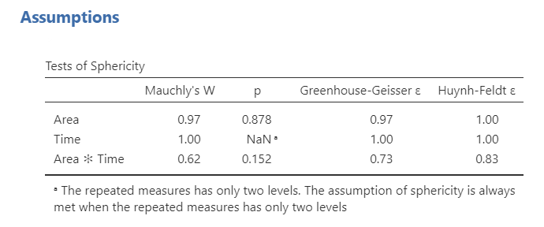

### Run the Repeated Measures Factorial ANOVA in jamovi

In jamovi, select **ANOVA → Repeated Measures ANOVA**.

1.  Under **Repeated Measures Factors**, rename `RM Factor 1` to `Time` and give it two levels: `Pre` and `Post`.

2.  Add a second repeated measures factor named `Area` and give it three levels: `Product`, `Client`, and `Action`.

3.  Under **Repeated Measures Cells**, move each variable into the correct cell. For example, move the pre-training product score into the `Pre, Product` cell.

4.  Rename the **Dependent Variable Label** to `Performance`.

5.  Select generalized eta-squared, (\eta\^2_G), as the effect size.

6.  Under **Assumption Checks**, select `Sphericity tests` and `Q-Q plot`.

7.  Under **Post Hoc Tests**, request Tukey comparisons for statistically significant main effects. If the interaction is statistically significant and you want to understand it more fully, you may also need follow-up comparisons for the interaction term.

8.  Under **Estimated Marginal Means**, request tables and plots for `Time`, `Area`, and the `Time * Area` interaction. Select `Observed scores`.

### Interpret Main Effects and Interactions

The Within Subjects Effects table shows three effects: the main effect of `Time`, the main effect of `Area`, and the `Time * Area` interaction.

The main effect of Time tests whether performance differs from pre-training to post-training, averaging across performance areas. The main effect of Area tests whether performance differs across product, client, and action areas, averaging across time. The interaction tests whether the pre-to-post change differs across the three performance areas.

In this example, there is a statistically significant main effect of Time, a statistically significant main effect of Area, and a statistically significant Time × Area interaction. Because the interaction is statistically significant, the main effects should be interpreted cautiously and in relation to the interaction pattern.

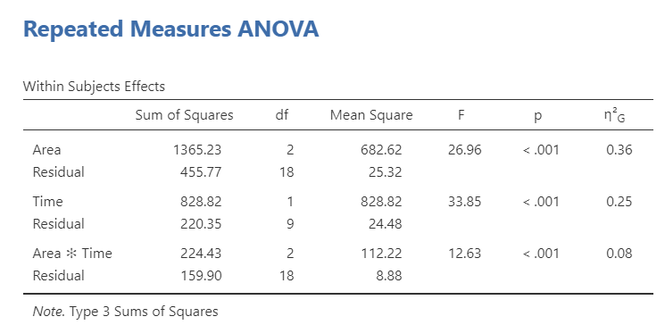

Because the main effects are statistically significant, we can examine the Tukey post hoc comparisons for Time and Area. The post hoc comparisons indicate that post-training performance was higher than pre-training performance. For Area, client and action performance were higher than product performance, but client and action performance did not differ from each other.

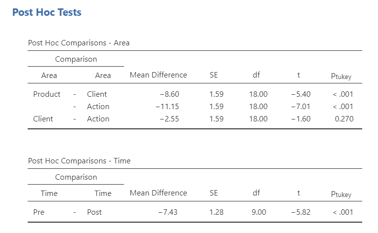

Because the Time × Area interaction is statistically significant, we should also examine the interaction plot and, if needed, follow-up comparisons for the interaction. The plot suggests that performance improved from pre-training to post-training for client and action performance, but not as clearly for product performance.

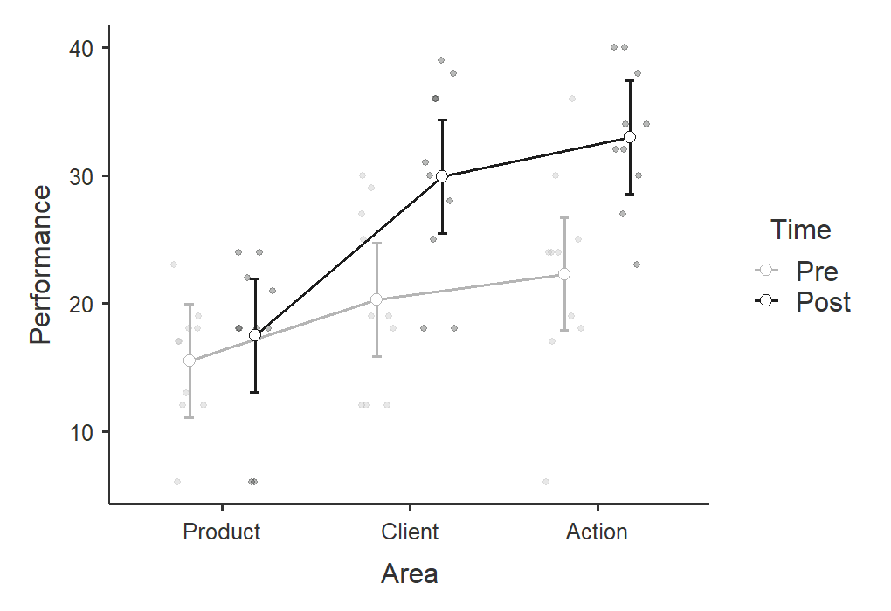

:::: {.callout-tip title="Check Your Understanding"}
In a 2 × 3 repeated measures factorial ANOVA, the Time × Area interaction is statistically significant.

What does this interaction mean in words?

::: {.callout-note title="Check Your Answer" collapse="true"}
It means that the change across time is not the same for every area. For example, performance might improve from pre to post in some areas but not others.
:::
::::

### Write Up the Results

> A 2 × 3 repeated measures factorial ANOVA was conducted to examine whether employee performance differed by time and performance area. The sphericity assumption appeared reasonable for all within-subjects effects. There was a significant main effect of time, *F*(1, 9) = 33.85, *p* \< .001, (\eta\^2_G = .25), such that post-training performance was higher than pre-training performance. There was also a significant main effect of area, *F*(2, 18) = 26.96, *p* \< .001, (\eta\^2_G = .36). Tukey post hoc comparisons indicated that client and action performance were higher than product performance, but client and action performance did not differ from each other. These main effects were qualified by a significant Time × Area interaction, indicating that the pre-to-post change differed across performance areas, *F*(2, 18) = 12.63, *p* \< .001, (\eta\^2_G = .08). As shown in Figure 1, performance improved from pre-training to post-training for client and action performance, but not clearly for product performance.

## Mixed Factorial ANOVA

A mixed factorial ANOVA includes at least one between-subjects factor and at least one within-subjects factor. Participants belong to only one level of the between-subjects factor, but they provide scores for all levels of the within-subjects factor.

### Identify the Design

In this example, participants were assigned to one of two conditions: a control condition or a fasting condition. Each participant also rated cravings for three reward types: food, money, and music. This creates a 2 × 3 mixed factorial design:

-   **Condition:** control or fasting, between-subjects
-   **Reward:** food, money, or music, within-subjects

The outcome variable is food craving rating. You can find the dataset here to follow along: [mixed-factorial.sav Download](https://github.com/danawanzer/stats-with-jamovi/blob/master/data/mixed-factorial.sav).

::: {.callout-tip title="Check Your Understanding"}

A researcher compares anxiety across three time points: baseline, post-treatment, and follow-up. Participants are also assigned to one of two treatment groups: therapy or waitlist control.

1.  Which factor is within-subjects?
2.  Which factor is between-subjects?
3.  What would the Time × Group interaction test?

::: {.callout-note title="Check Your Answer" collapse="true"}

1.  Time is the within-subjects factor because the same participants are measured at baseline, post-treatment, and follow-up.
2.  Group is the between-subjects factor because each participant is in either the therapy group or the waitlist control group.
3.  The Time × Group interaction tests whether the pattern of change over time differs between the therapy and waitlist control groups.

:::

:::

Here's a video walking through the mixed factorial ANOVA.

```{r echo = FALSE, eval = knitr::is_html_output(excludes = "epub"), message = FALSE, warning = FALSE}
library(vembedr)
embed_url("https://www.youtube.com/watch?v=lbZK_FoZKW4")
```

### Check Assumptions

First, we check sphericity for the within-subjects factor, Reward. Mauchly's test is not statistically significant, *p* = .073, so the sphericity assumption appears reasonable and no correction is needed.

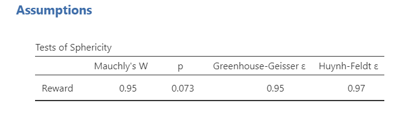

### Run the Mixed Factorial ANOVA in jamovi

To perform a mixed factorial ANOVA, use **ANOVA → Repeated Measures ANOVA** because the design includes a within-subjects factor.

1.  Under **Repeated Measures Factors**, rename `RM Factor 1` to `Reward`.

2.  Rename the three levels of `Reward` as `Food`, `Money`, and `Music`.

3.  Under **Repeated Measures Cells**, move each variable into the correct cell. Move `FQ_1` to Food, `FQ_2` to Money, and `FQ_3` to Music.

4.  Move the between-subjects variable `condition` to **Between Subjects Factors**.

5.  Select generalized eta-squared, \(\eta^2_G\), as the effect size.

6.  Under **Assumption Checks**, select `Sphericity tests` and `Q-Q plot`.

7.  Under **Post Hoc Tests**, request Tukey comparisons for statistically significant main effects. If the interaction is statistically significant, you may need follow-up comparisons for the interaction term.

8.  Under **Estimated Marginal Means**, request tables and plots for `Reward`, `Condition`, and the `Reward * Condition` interaction. Select `Observed scores`.

### Interpret Main Effects and Interactions

For a mixed factorial ANOVA, we interpret both the Within Subjects Effects table and the Between Subjects Effects table. The Within Subjects Effects table includes the main effect of the within-subjects factor, Reward, and the Reward × Condition interaction. The Between Subjects Effects table includes the main effect of the between-subjects factor, Condition.

In this example, the main effect of Reward is statistically significant, and the main effect of Condition is statistically significant. The Reward × Condition interaction is not statistically significant. This suggests that food craving ratings differ by reward type and by condition, but the pattern across reward types does not clearly differ between the control and fasting conditions.

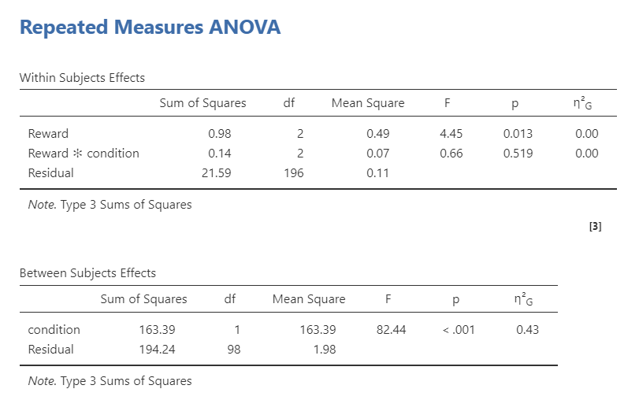

Because the main effect of Reward is statistically significant, we can examine the Tukey post hoc comparisons for Reward. The only significant pairwise difference is between food and music. Because the main effect of Condition has only two levels, no post hoc test is needed to identify the difference; the estimated marginal means show that cravings were higher in the fasting condition than in the control condition.

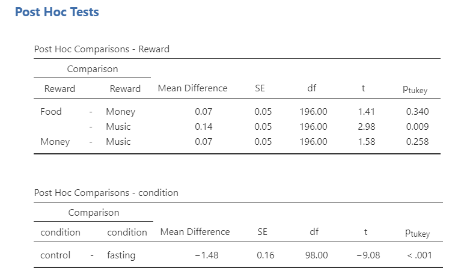

The interaction plot is still useful for understanding the pattern. In this example, the lines are fairly parallel, which is consistent with the nonsignificant Reward × Condition interaction.

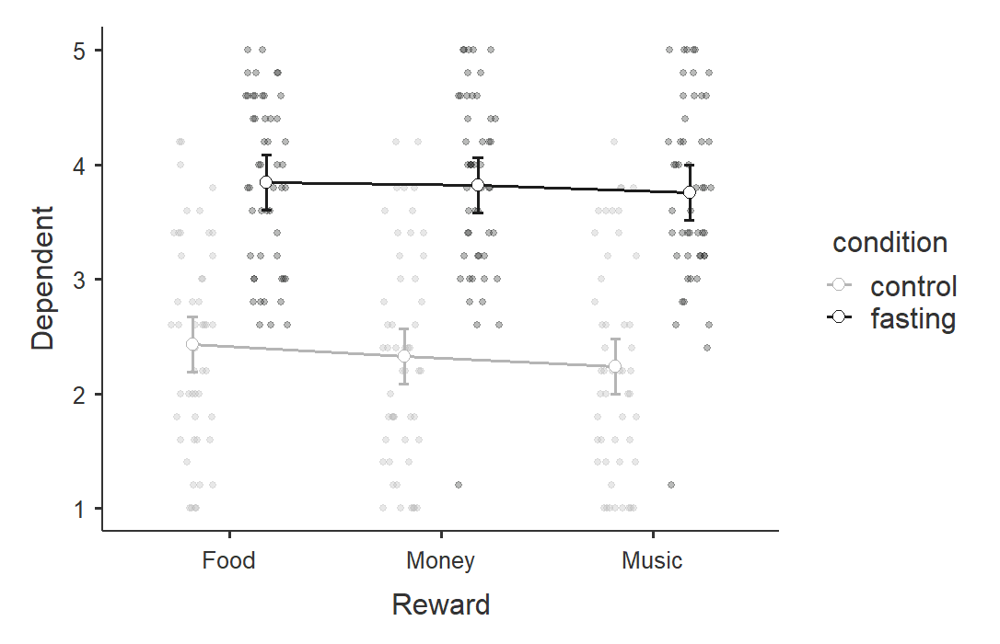

### Write Up the Results

> A 2 × 3 mixed factorial ANOVA was conducted to examine whether food craving ratings differed by condition and reward type. Condition was a between-subjects factor with two levels: control and fasting. Reward was a within-subjects factor with three levels: food, money, and music. The sphericity assumption appeared reasonable for Reward, so no correction was applied.
>
> There was a significant main effect of condition, *F*(1, 98) = 82.44, *p* < .001, \(\eta^2_G = .43\), such that participants in the fasting condition reported higher cravings (*M* = 3.81, *SE* = 0.11) than participants in the control condition (*M* = 2.33, *SE* = 0.11). There was also a significant main effect of reward, *F*(2, 196) = 4.45, *p* = .013, \(\eta^2_G = .00\). Tukey post hoc comparisons indicated that cravings were higher for food rewards (*M* = 3.14, *SE* = 0.09) than music rewards (*M* = 3.00, *SE* = 0.09), *p* = .009. Cravings for money rewards (*M* = 3.07, *SE* = 0.09) did not differ significantly from food rewards, *p* = .340, or music rewards, *p* = .258. The Reward × Condition interaction was not statistically significant, *F*(2, 196) = 0.66, *p* = .519, \(\eta^2_G = .00\).

:::{.callout-note}
Some effect sizes may appear as .00 after rounding, especially when the effect is very small. Always interpret the effect size in context rather than relying on statistical significance alone.
:::

## Summary

| Design | Between-Subjects Factors | Within-Subjects Factors | Main Output Tables |
|---|---:|---:|---|
| Independent factorial ANOVA | Two or more | None | ANOVA table |
| Repeated measures factorial ANOVA | None | Two or more | Within Subjects Effects |
| Mixed factorial ANOVA | One or more | One or more | Within Subjects Effects and Between Subjects Effects |

Across all factorial ANOVA designs, remember to interpret main effects and interactions separately. Main effects describe the overall relationship between one factor and the outcome. Interactions describe whether the relationship between one factor and the outcome depends on another factor.
