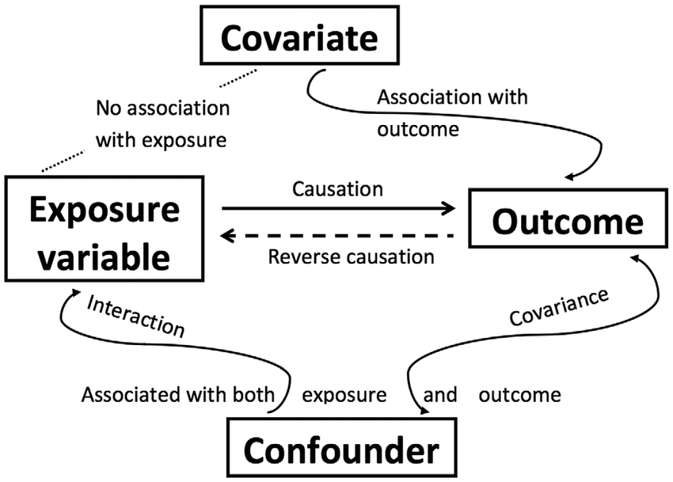
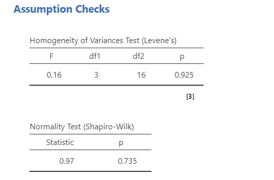
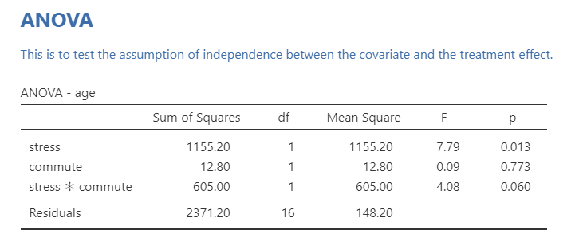
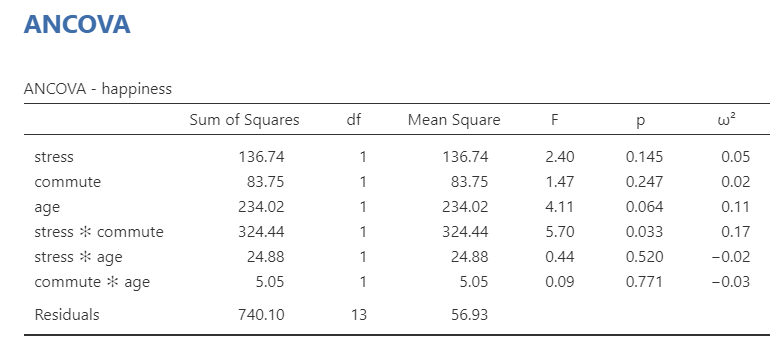
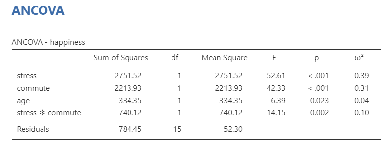
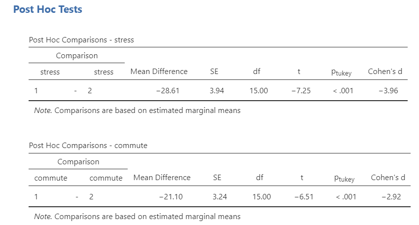

# 13.5 ANCOVA {.unnumbered}

```{r, echo = FALSE, message=FALSE}
library(tidyverse)
options(knitr.graphics.auto_pdf = TRUE)
```

**ANCOVA** stands for **AN**alysis of **COVA**riance. ANCOVA is an extension of ANOVA that includes one or more continuous covariates. Like ANOVA, ANCOVA is used when we have a continuous outcome variable and one or more categorical independent variables. The difference is that ANCOVA also includes a continuous variable that we want to statistically adjust for.

A **covariate** is a continuous variable included in the model because it is related to the outcome variable. Including a useful covariate can sometimes reduce unexplained error variance and provide a clearer estimate of group differences.

A **confounding variable** is a variable that is related to both the independent variable and the outcome variable. ANCOVA can sometimes be used to statistically adjust for a potential confounder, but this does not automatically solve all design problems. If groups differ on important covariates because participants were not randomly assigned, the results should be interpreted cautiously.



There are two common reasons for including covariates:

1. **To reduce error variance**: If the covariate helps explain individual differences in the outcome, including it can reduce the unexplained variability in the model.

2. **To statistically adjust group comparisons**: If groups differ on a variable that is related to the outcome, including that variable as a covariate can help estimate group differences after adjusting for that variable.

ANCOVA is useful, but it is not magic. It cannot turn a weak design into a strong causal design, and it depends on assumptions that need to be checked carefully.

We use ANCOVA when we have:

- one continuous outcome variable,
- one or more categorical independent variables,
- one or more continuous covariates,
- and a research question about group differences after statistically adjusting for the covariate.

::: {.callout-tip title="Check Your Understanding"}

A researcher compares exam scores across three teaching methods. Students also differ in prior GPA, and prior GPA is related to exam scores.

1. What is the outcome variable?
2. What is the categorical independent variable?
3. What variable could be included as a covariate?

::: {.callout-note title="Check Your Answer" collapse="true"}

1. The outcome variable is exam score.
2. The categorical independent variable is teaching method.
3. Prior GPA could be included as a covariate because it is continuous and related to exam scores.

:::

:::

## Step 1: Look at the Data

For this chapter, we will work with the `ancova` dataset from the `lsj-data` library. This fictional dataset comes from a health psychology study examining happiness. The outcome variable is `happiness`. The study includes two categorical independent variables:

- `commute`: whether participants usually drive or cycle
- `stress`: whether participants report high or low stress

The continuous covariate is `age`.

This is a 2 × 2 independent factorial design with a covariate because there are two categorical independent variables, each with two levels, and one continuous covariate. Our research question is: Do happiness scores differ by commute type, stress level, and their interaction after statistically adjusting for age?

Here's a [video](https://www.youtube.com/watch?v=OdKyMYoO0VU) walking through the ANCOVA test.

```{r echo = FALSE, eval = knitr::is_html_output(excludes = "epub"), message = FALSE, warning = FALSE}
library(vembedr)
embed_url("https://www.youtube.com/watch?v=OdKyMYoO0VU")
```

### Data Set-Up

To conduct ANCOVA in jamovi, the dataset should include one continuous outcome variable, one or more categorical independent variables, and one or more continuous covariates. Each row should represent one participant or unit of analysis.

::: {.callout-tip title="Check Your Understanding"}

Look at the ANCOVA example.

1. What is the continuous outcome variable?
2. What are the categorical independent variables?
3. What is the continuous covariate?

::: {.callout-note title="Check Your Answer" collapse="true"}

1. The continuous outcome variable is `happiness`.
2. The categorical independent variables are `stress` and `commute`.
3. The continuous covariate is `age`.

:::

:::

## Step 2: Check Assumptions

ANCOVA has many of the same assumptions as ANOVA:

1. The outcome variable is approximately normally distributed within the model, or the model residuals are approximately normal.

2. The groups have roughly equal variances, which is called **homogeneity of variance**.

3. The outcome variable is interval or ratio (i.e., continuous).

4. Observations are independent. Each participant or case should contribute one score and belong to only one combination of factor levels.

ANCOVA also has assumptions related to the covariate:

5. The covariate should have a roughly linear relationship with the outcome variable.

6. The relationship between the covariate and the outcome should be similar across groups. This is called **homogeneity of regression slopes**.

7. In an experimental design, the covariate should not systematically differ across the treatment groups. If the covariate differs across groups, the analysis can still be run, but the results should be interpreted more cautiously.

We can evaluate normality using the Shapiro-Wilk test, Q-Q plot, skew and kurtosis values, and visual inspection when available. In this example, the Shapiro-Wilk test was not statistically significant, *p* = .735, the Q-Q plot looked reasonable, and the skew and kurtosis checks did not raise major concerns. Therefore, the normality assumption appears reasonable.

We evaluate homogeneity of variance using Levene’s test and by comparing the variability of the outcome across groups. Levene’s test was not statistically significant, *p* = .925, so the homogeneity-of-variance assumption appears reasonable.




### Covariate Balance Across Groups

In randomized experimental designs, the covariate should not systematically differ across treatment groups. If the covariate differs across groups, it suggests that the groups were not equivalent on that variable before adjustment.

We can examine this by testing whether the covariate differs across the categorical independent variables. In this example, age differs by stress level. This means age is not evenly balanced across the stress groups.

This does not mean we must stop the analysis, and it does not automatically mean mediation is needed. Instead, it means we should interpret the adjusted group differences cautiously. Age may be acting as a potential confounder because it is related to both the grouping variable and the outcome.



### Homogeneity of Regression Slopes

The homogeneity-of-regression-slopes assumption means that the relationship between the covariate and the outcome is similar across groups. In this example, the relationship between age and happiness should be similar across the levels of stress and commute.

We test this assumption by adding interaction terms between the covariate and the categorical independent variables. If the covariate-by-factor interaction is statistically significant, the assumption may be violated.

In this example, age does not significantly interact with stress, *p* = .520, or commute, *p* = .771. Therefore, the homogeneity-of-regression-slopes assumption appears reasonable.


::: {.callout-tip title="Check Your Understanding"}

In an ANCOVA, the interaction between the covariate and the grouping variable is statistically significant.

What assumption is causing concern?

::: {.callout-note title="Check Your Answer" collapse="true"}

The homogeneity-of-regression-slopes assumption is causing concern. A significant covariate-by-group interaction suggests that the relationship between the covariate and the outcome differs across groups.

:::

:::

## Step 3: Perform the Test

To perform an ANCOVA in jamovi:

1. Go to the **Analyses** tab, click **ANOVA**, and choose **ANCOVA**.

2. Move the continuous outcome variable `happiness` to the **Dependent Variable** box.

3. Move the categorical independent variables `stress` and `commute` to the **Fixed Factors** box.

4. Move the continuous covariate `age` to the **Covariates** box.

5. Under **Effect Size**, select \(\omega^2\).

6. Under **Assumption Checks**, select `Homogeneity test`, `Normality test`, and `Q-Q Plot`.

7. Under **Estimated Marginal Means**, request tables and plots for `stress`, `commute`, and the `stress * commute` interaction. Select `Observed scores` if you want to display the observed data along with the estimated means.

Because both `stress` and `commute` have only two levels, post hoc tests are not needed for the main effects. If the interaction is statistically significant, focus on the interaction plot and the estimated marginal means for the `stress * commute` combination.

## Step 4: Interpret Results

The ANCOVA table shows statistically significant main effects of `stress` and `commute`, a statistically significant `stress * commute` interaction, and a statistically significant effect of the covariate `age`.

Because the `stress * commute` interaction is statistically significant, we should interpret the main effects cautiously. The interaction tells us that the relationship between commute type and happiness depends on stress level, or that the relationship between stress and happiness depends on commute type.

The estimated marginal means and interaction plot help us understand the pattern. In this example, happiness is similar across commute types in the low-stress condition, but in the high-stress condition, participants who cycle report higher happiness than participants who drive.



:::{.callout-note title="Optional: Why Do Some Follow-Up Tests Look Like *t*-Tests?" collapse="true"}

When a factor has only two levels, the *F* test for that factor is equivalent to a two-group comparison. In that case, the square root of the *F* statistic equals the absolute value of the corresponding *t* statistic. This is interesting mathematically, but it is not essential for interpreting the ANCOVA.

:::

Post hoc tests show that low stress had higher happiness than high stress, and that cycling had higher happiness than driving. We can also look to the estimated marginal means tables and plots for information for reporting.


::: {.callout-tip title="Check Your Understanding"}

An ANCOVA shows a statistically significant interaction between stress and commute type.

What does this interaction mean in words?

::: {.callout-note title="Check Your Answer" collapse="true"}

It means that the relationship between commute type and happiness differs depending on stress level. For example, cycling may be associated with higher happiness under high stress but not under low stress.

:::

:::

### Write Up the Results in APA Style

As reviewed in @sec-apa-style, an APA-style results section should describe the research question, summarize the relevant descriptive statistics or estimated marginal means, report the inferential test and effect size, and interpret the result. For ANCOVA, the write-up should also identify the covariate.

> A 2 × 2 ANCOVA was conducted to examine whether happiness differed by stress level and commute type after statistically adjusting for age. Stress and commute type were included as categorical independent variables, and age was included as a continuous covariate. The normality, homogeneity-of-variance, and homogeneity-of-regression-slopes assumptions appeared reasonable. However, age differed by stress level, so the adjusted stress effect should be interpreted cautiously.
>
> There was a significant main effect of stress, *F*(1, 15) = 52.61, *p* < .001, \(\omega^2 = .39\), and a significant main effect of commute type, *F*(1, 15) = 42.33, *p* < .001, \(\omega^2 = .31\). These main effects were qualified by a significant Stress × Commute interaction, *F*(1, 15) = 14.15, *p* = .002, \(\omega^2 = .10\). Estimated marginal means indicated that happiness was similar across commute types in the low-stress condition, but in the high-stress condition, participants who cycled reported higher happiness than participants who drove. Age was also significantly associated with happiness, *F*(1, 15) = 6.39, *p* = .023, \(\omega^2 = .04\).

### Visualize the Results

For ANCOVA, the graph should help readers understand the adjusted group means and, when relevant, the interaction pattern. Because this example includes a statistically significant Stress × Commute interaction, an interaction plot is especially useful.

A good plot would show adjusted happiness means for each combination of stress level and commute type. The plot should make it clear that commute type matters more in the high-stress condition than in the low-stress condition.

If you use an ANCOVA plot, be clear that the plotted means are adjusted for the covariate. Adjusted means are not always identical to the raw group means because the model has statistically adjusted for age.

## Summary

| Concept | What It Means in ANCOVA |
|---|---|
| Outcome variable | The continuous variable being predicted or compared |
| Fixed factor | A categorical independent variable |
| Covariate | A continuous variable included to statistically adjust the model |
| Adjusted mean | A group mean estimated after accounting for the covariate |
| Homogeneity of regression slopes | The covariate has a similar relationship with the outcome across groups |
| Interaction | The effect of one factor depends on another factor |
