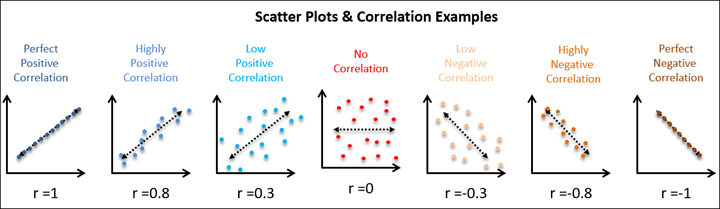
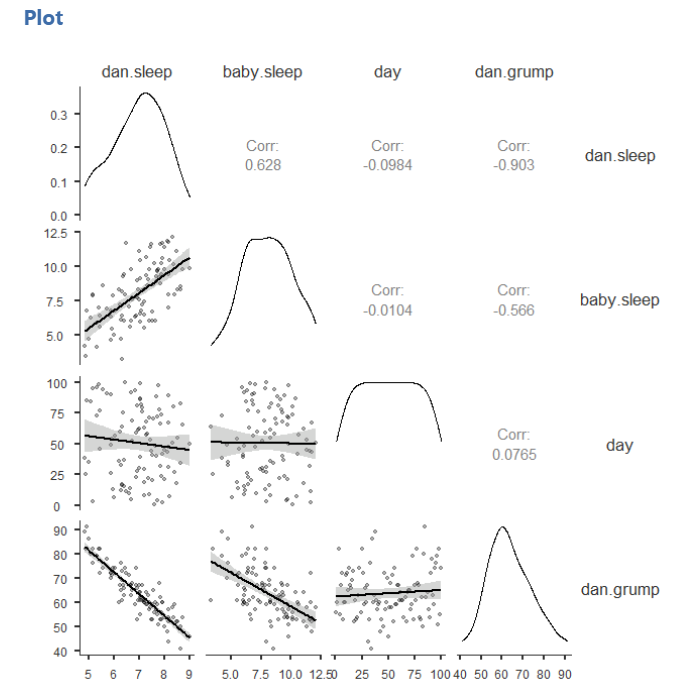
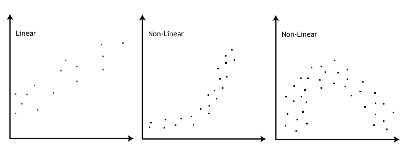
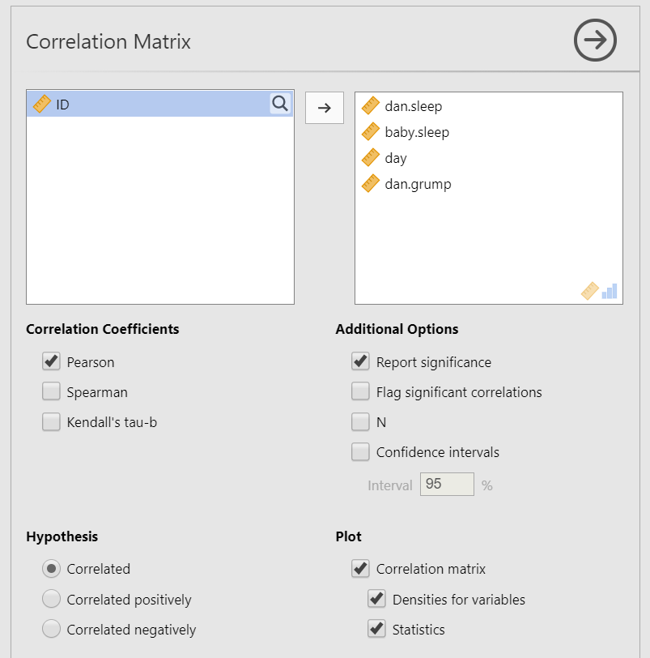
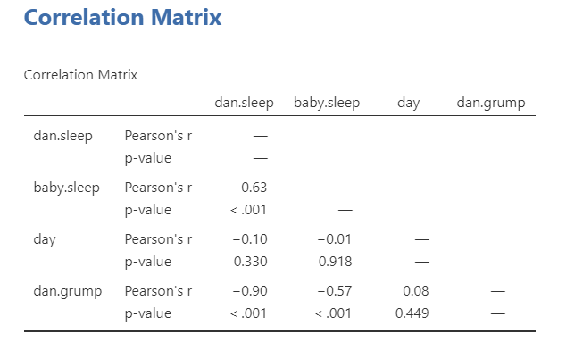
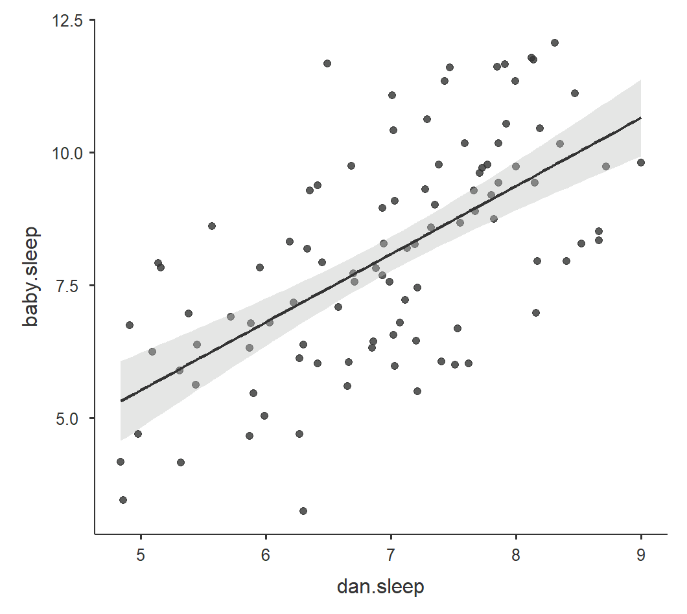

# 14.1 Correlation {#sec-correlation .unnumbered}

```{r, echo = FALSE, message=FALSE}
library(tidyverse)
options(knitr.graphics.auto_pdf = TRUE)
```

Correlation is used to describe the relationship between two variables. In this section, we focus mostly on the **Pearson correlation**, which is used when we want to examine the linear relationship between two continuous variables.

A correlation can tell us three things about a relationship:

1. **Direction**: whether the relationship is positive or negative.
2. **Strength**: how closely the variables are related.
3. **Statistical significance**: whether the observed relationship is unlikely to have occurred by chance if there were no relationship in the population.

Correlation coefficients range from -1 to +1.

- A **positive correlation** means that higher scores on one variable tend to go with higher scores on the other variable.
- A **negative correlation** means that higher scores on one variable tend to go with lower scores on the other variable.
- A correlation close to **0** means there is little or no linear relationship between the variables.

Correlation does not show causation. A statistically significant correlation tells us that two variables are related, but it does not tell us whether one variable caused the other.

Pearson correlations are standardized, so they are also effect sizes. As a rough heuristic, values around \(|.10|\) are often described as small, values around \(|.30|\) as medium, and values around \(|.50|\) as large. These are only general guidelines. The importance of a correlation depends on the research context.


:::{.callout-note title="Optional: Why Is Correlation Standardized?" collapse="true"}

Correlations are standardized covariances. Covariance describes the extent to which two variables vary together. Because covariance depends on the original units of measurement, it can be hard to interpret directly. Correlation standardizes covariance so that the result always ranges from -1 to +1.

:::



:::{.callout-note}
Want to practice estimating correlations from scatterplots? Try [Guess the Correlation](https://www.guessthecorrelation.com/).
:::

:::{.callout-note}
Kristoffer Magnusson’s interactive visualization, [Interpreting Correlations](https://rpsychologist.com/correlation/), is also useful for seeing how different correlation values look in scatterplots.
:::


## Step 1: Look at the Data

For this chapter, we will work with the `parenthood` dataset from the `lsj-data` library. This dataset contains 100 days of data about a new parent’s daily grumpiness, the parent’s sleep quality, and the baby’s sleep quality.

The main variables we will use are:

- `dan.grump`: the parent’s grumpiness, measured from 0 to 100
- `dan.sleep`: the parent’s sleep quality
- `baby.sleep`: the baby’s sleep quality

The dataset also includes `day`, which records the day of the study from 1 to 100. We may inspect `day`, but it is not one of the main variables in our research question.

Here's a [video](https://www.youtube.com/watch?v=p4LNqatn2sg) walking through the correlation.

```{r echo = FALSE, eval = knitr::is_html_output(excludes = "epub"), message = FALSE, warning = FALSE}
library(vembedr)
embed_url("https://www.youtube.com/watch?v=p4LNqatn2sg")
```

### Data Set-Up

To conduct a Pearson correlation, the dataset needs two continuous variables. Each row should represent one participant, case, or unit of analysis, and each case should have a score on both variables.

In this example, each row represents one day. The variables `dan.grump`, `dan.sleep`, and `baby.sleep` are continuous variables. If jamovi imports one of these variables as nominal, change the measure type before running the correlation. This is why it is important to inspect the data before analyzing it.

{width="500"}

::: {.callout-tip title="Check Your Understanding"}

A researcher wants to test whether hours of sleep are related to exam scores.

1. What are the two variables?
2. What type of variables are needed for a Pearson correlation?
3. What should each row of the dataset represent?

::: {.callout-note title="Check Your Answer" collapse="true"}

1. The two variables are hours of sleep and exam score.
2. A Pearson correlation uses two continuous variables.
3. Each row should represent one participant, with one value for hours of sleep and one value for exam score.

:::

:::

### Describe the Data

Once we confirm that the data are set up correctly in jamovi, we should describe the variables using descriptive statistics and graphs. For correlation, we should examine each variable individually and then examine the relationship between the variables.

The descriptive statistics show the sample size, missing data, means, medians, standard deviations, minimum values, maximum values, skew, and kurtosis. These help us understand the scale and distribution of each variable.

We should also create scatterplots for the pairs of variables we plan to correlate. A scatterplot helps us see the direction, form, strength, and possible outliers in the relationship. This is important because a Pearson correlation summarizes a **linear** relationship. If the relationship is strongly curved or affected by an extreme outlier, the Pearson correlation may be misleading.


::: {.callout-tip title="Check Your Understanding"}

Why should we look at a scatterplot before interpreting a Pearson correlation?

::: {.callout-note title="Check Your Answer" collapse="true"}

A scatterplot helps us see whether the relationship is roughly linear and whether any unusual points may strongly influence the correlation. A Pearson correlation can be misleading if the relationship is curved or driven by an outlier.

:::

:::

### Specify Your Hypotheses

For a Pearson correlation, the null hypothesis is that there is no linear relationship between the two variables. The alternative hypothesis depends on whether the research question is directional or non-directional.

For a two-tailed correlation:

- \(H_0\): There is no linear relationship between the two variables.
- \(H_1\): There is a linear relationship between the two variables.

For a directional positive correlation:

- \(H_0\): The variables are not positively related.
- \(H_1\): The variables are positively related.

For a directional negative correlation:

- \(H_0\): The variables are not negatively related.
- \(H_1\): The variables are negatively related.

In this example, we will focus on whether the parent’s grumpiness is related to the parent’s sleep quality and the baby’s sleep quality. Because we are not specifying a direction before looking at the results, we will use two-tailed hypotheses.

Because we are examining more than one pair of variables, each correlation has its own hypothesis test.

::: {.callout-tip title="Check Your Understanding"}

A researcher predicts that students who sleep more hours will have lower stress scores.

1. Is this a directional or non-directional hypothesis?
2. Is the predicted relationship positive or negative?
3. Which jamovi hypothesis option should be selected?

::: {.callout-note title="Check Your Answer" collapse="true"}

1. This is a directional hypothesis because the researcher predicts the direction of the relationship.
2. The predicted relationship is negative because higher sleep is expected to be related to lower stress.
3. Select `Correlated negatively`.

:::

:::

## Step 2: Check Assumptions

The Pearson correlation has several assumptions:

1. Both variables are measured at the **interval or ratio** level, meaning they are continuous.

2. The observations are **paired and independent**. Each case should have one score on each variable, and one case should not determine another case.

3. The relationship between the two variables is **linear**.

4. The variables are **approximately normally distributed**. In practice, we evaluate normality using the same checks introduced earlier: Shapiro-Wilk tests, Q-Q plots, skew and kurtosis z-scores, and visual inspection.

5. The relationship should not be driven by **extreme outliers**.

We cannot test the first two assumptions using the output alone; those assumptions are based on how the data were measured and collected. However, we can evaluate normality, linearity, and outliers using descriptive statistics and graphs.

### Testing Normality

For Pearson correlation, we evaluate the normality of both continuous variables included in the correlation. We use the four normality checks introduced earlier: Shapiro-Wilk tests, Q-Q plots, skew and kurtosis z-scores, and visual inspection of the distributions.

In this example, the main variables of interest are `dan.grump`, `dan.sleep`, and `baby.sleep`. The variable `day` is different because it simply records the day of the study from 1 to 100. It has a uniform distribution by design, so it is not useful for judging the normality of the main psychological variables.

Overall, the normality checks for the main variables do not raise major concerns.



### Testing Linearity and Outliers

To check linearity, examine a scatterplot for each pair of variables being correlated. The points should show a roughly straight-line pattern. The relationship does not need to be perfect, but it should not show a strong curve.

We should also look for extreme outliers. An outlier can strongly affect a correlation, especially in small samples. If one unusual point appears to drive the relationship, the correlation should be interpreted cautiously.

In this example, the scatterplots do not suggest strong non-linear relationships or extreme outliers, so the linearity assumption appears reasonable.

The image below by [Laerd Statistics](https://statistics.laerd.com/spss-tutorials/pearsons-product-moment-correlation-using-spss-statistics.php) illustrates the difference between linear and non-linear relationships. 



## Step 3: Perform the Test

### Decide Whether to Use Pearson or Spearman

If the variables are continuous, approximately normal, and linearly related, use the Pearson correlation.

If the variables are ordinal, seriously non-normal, or better described by a monotonic rank-order relationship, use Spearman’s rank correlation instead. In jamovi, Spearman’s correlation is labeled `Spearman`.

Kendall’s tau is another rank-based correlation. It can be useful in some settings, especially with small samples or many tied ranks, but we will not use it in this course.

### Decide Which Hypothesis You Should Be Using

If the alternative hypothesis is non-directional, select `Correlated`.

If the alternative hypothesis is directional and predicts a positive relationship, select `Correlated positively`.

If the alternative hypothesis is directional and predicts a negative relationship, select `Correlated negatively`.

The direction should be chosen based on the research question before looking at the results.

### Perform the Test

1. Go to the **Analyses** tab, click **Regression**, and choose **Correlation Matrix**.

2. Move the variables you want to correlate into the **Variables** box. In this example, move `dan.grump`, `dan.sleep`, and `baby.sleep`.

3. Select the correlation coefficient based on the assumptions. In this example, the assumptions appear reasonable, so select `Pearson`.

4. Under **Hypothesis**, select the option that matches your research question. In this example, select `Correlated`.

5. Under **Additional Options**, select `Report significance` and `Flag significant correlations`. If you have missing data, also select `N`.

6. Under **Plots**, select `Correlation matrix`. You can also select `Densities for variables` and `Statistics` if you want the plot to display the distributions and correlation coefficients.

When you are done, your setup should look like this:



## Step 4: Interpreting Results

Once we are satisfied that the assumptions for Pearson correlation are reasonably met, we can interpret the results.



The correlation matrix shows the correlation coefficient and *p*-value for each pair of variables. The sign of the correlation tells us the direction of the relationship, and the absolute value tells us the strength of the relationship.

In this example, the parent’s grumpiness is negatively correlated with the parent’s sleep quality. This means that days with better parent sleep tend to be days with lower grumpiness. The parent’s grumpiness is also negatively correlated with the baby’s sleep quality. This means that days with better baby sleep also tend to be days with lower parent grumpiness.

The parent’s sleep quality and the baby’s sleep quality are positively correlated, meaning that days with better baby sleep tend to also be days with better parent sleep.

The degrees of freedom for a Pearson correlation are calculated as \(n - 2\). With 100 days of data, \(df = 98\).

### Write Up the Results in APA Style

As reviewed in @sec-apa-style, an APA-style results section should describe the research question, summarize the relevant descriptive statistics, report the inferential test and effect size, and interpret the result.

> Pearson correlations indicated that the parent’s grumpiness was negatively related to the parent’s sleep quality, *r*(98) = -.90, *p* < .001, and the baby’s sleep quality, *r*(98) = -.57, *p* < .001. The parent’s sleep quality was positively related to the baby’s sleep quality, *r*(98) = .63, *p* < .001.

This write-up focuses on the correlations. If the descriptive statistics are important for the research question, you could also report the means and standard deviations for each variable before reporting the correlations.

> Pearson correlations indicated that the parent’s grumpiness (*M* = 63.71, *SD* = 10.05) was negatively related to the parent’s sleep quality (*M* = 6.97, *SD* = 1.02), *r*(98) = -.90, *p* < .001, and the baby’s sleep quality(*M* = 8.05, *SD* = 2.07), *r*(98) = -.57, *p* < .001. The parent’s sleep quality was positively related to the baby’s sleep quality, *r*(98) = .63, *p* < .001.

### Visualize the Results

For correlation, the most useful visualization is usually a scatterplot. A scatterplot shows each case as a point, with one variable on the x-axis and the other variable on the y-axis. This helps readers see the direction, form, strength, and possible outliers in the relationship.

A correlation matrix plot can be useful when we are examining several variables at once. However, when writing about a specific correlation, a single scatterplot is often clearer.

For this example, a scatterplot of `dan.sleep` and `dan.grump` would show the strong negative relationship between the parent’s sleep quality and grumpiness. A fitted line can help summarize the linear trend, but the points themselves are important because they show the actual data.



### Shared Variance

When we square the Pearson correlation coefficient, we get \(r^2\). This value represents the proportion of variance shared by the two variables.

For example, the correlation between the parent’s grumpiness and the parent’s sleep quality is \(r = -.90\). Squaring this value gives:

\[
r^2 = (-.90)^2 = .81
\]

This means that approximately 81% of the variance in one variable is shared with the other variable. Because correlation does not establish causation, we should avoid saying that sleep quality “explains” or “causes” 81% of grumpiness unless the research design supports a causal interpretation.

::: {.callout-tip title="Check Your Understanding"}

A correlation between social support and stress is \(r = -.40\).

1. Is the relationship positive or negative?
2. What is \(r^2\)?
3. Can we conclude that social support causes lower stress?

::: {.callout-note title="Check Your Answer" collapse="true"}

1. The relationship is negative.
2. \(r^2 = (-.40)^2 = .16\), so the variables share about 16% of their variance.
3. No. A correlation shows that the variables are related, but it does not establish causation.

:::

:::

## Spearman Correlation

Spearman’s correlation is the rank-based alternative to Pearson correlation. Use Spearman’s correlation when the variables are ordinal, when the normality assumption is seriously violated, or when the relationship is monotonic but not well described as linear.

A monotonic relationship means that as one variable increases, the other variable tends to increase or tends to decrease, but the pattern does not have to form a straight line.

A Spearman correlation is reported similarly to Pearson correlation, but the statistic is usually written as \(r_s\) or \(\rho\).

> A Spearman correlation indicated that the two variables were significantly related, \(r_s = .42\), *p* = .018.
