# 14.2 Regression {#sec-regression .unnumbered}

```{r, echo = FALSE, message=FALSE}
library(tidyverse)
library(viridis)
options(knitr.graphics.auto_pdf = TRUE)
```

Regression is used when we want to predict or explain variation in one continuous outcome variable using one or more predictor variables. Unlike ANOVA, which focuses on categorical predictors, regression can include continuous predictors, categorical predictors, or both. In this course, we will focus on regression models with a continuous outcome variable.

Regression is directional in its setup. We identify one variable as the **outcome variable** and one or more variables as **predictor variables**. This does not automatically mean the predictors cause the outcome. Causal conclusions depend on the research design, measurement quality, and possible alternative explanations.

There are several regression approaches you may encounter:

1. **Simple linear regression** uses one predictor variable to predict one continuous outcome variable. When the predictor is continuous, simple linear regression is closely related to correlation.

2. **Multiple regression** uses two or more predictors to predict one continuous outcome variable. Predictors may be continuous, categorical, or a combination of both.

3. **Hierarchical regression** uses two or more blocks of predictors. This allows us to test whether adding a new block of predictors improves the model beyond the predictors already included.

Regression is also connected to many of the statistical tests we have already learned. A regression with one dichotomous predictor produces results that are closely related to an independent *t*-test. A regression with one categorical predictor with three or more levels is closely related to ANOVA. A regression with one continuous predictor is closely related to correlation. We will return to this larger connection in [Section 14.3: General Linear Model](14.3-general-linear-model.qmd).

## Understanding Regression

A linear regression model is based on a line. You may remember the equation of a line as:

\[
y = mx + b
\]

In regression, the same general idea applies. The model estimates a predicted outcome score from one or more predictors. The **intercept** is the predicted outcome value when all predictors are 0. The **slope** or **coefficient** tells us how much the predicted outcome changes when a predictor increases by one unit, holding the other predictors constant.

With one predictor, a regression equation can be written as:

\[
\hat{y} = b_0 + b_1x
\]

With two predictors, a regression equation can be written as:

\[
\hat{y} = b_0 + b_1x_1 + b_2x_2
\]

The symbol \(\hat{y}\) means the predicted value of the outcome variable. The model does not perfectly predict every data point. The difference between the observed outcome and the predicted outcome is called a **residual**.

\[
\text{residual} = y - \hat{y}
\]

Let's imagine we have a dataset of dragons. We want to predict each dragon's weight using two predictors: whether the dragon is spotted and the dragon's height. In this example, the outcome variable is weight. The predictors are spotted status and height.

The regression equation might be:

\[
\widehat{\text{weight}} = 2.4 + .6(\text{spotted}) + .3(\text{height})
\]

The intercept, 2.4, is the predicted weight for a dragon that is not spotted and has a height of 0. This is needed for the equation, but it may not be substantively meaningful because a dragon with a height of 0 is not realistic. The coefficient for spotted, .6, means that spotted dragons are predicted to weigh .6 tons more than non-spotted dragons with the same height. The coefficient for height, .3, means that for each one-unit increase in height, predicted weight increases by .3 tons, holding spotted status constant.

```{r echo = FALSE, fig.cap = "Regression lines and residuals", fig.show='hold',fig.align='center', out.width = "49%"}
knitr::include_graphics(c("images/13-regression/dragon_categorical.png", "images/13-regression/dragons_continuous.png"))
```

Regression finds the line or model that makes the residuals as small as possible. In other words, the model tries to make the predicted values as close as possible to the observed values.

The images below show the difference between a model that fits the data well and a model that fits poorly. When the residuals are smaller, the model is closer to the observed data points.

```{r echo = FALSE, fig.cap = "Regression lines and residuals", fig.show='hold',fig.align='center', out.width = "49%"}
knitr::include_graphics(c("images/13-regression/good-regression-line.jpg", "images/13-regression/bad-regression-line.jpg"))
```

Let's return to the dragon example. Suppose a dragon is not spotted and has a height of 5.1. Based on the regression model, we would predict the dragon to weigh 3.9 tons. If the dragon actually weighs 4.2 tons, the residual is .3 tons.

```{r echo = FALSE, fig.cap = "Regression lines and residuals", fig.show='hold',fig.align='center', out.width = "49%"}
knitr::include_graphics(c("images/13-regression/dragon_predict_mlr.png", "images/13-regression/dragon_residual.png"))
```

One of the assumptions we check in regression is whether the residuals are approximately normally distributed. This means we examine the distribution of prediction errors, not just the original outcome variable.

```{r echo = FALSE, fig.cap = "Regression lines and residuals", fig.show='hold',fig.align='center', out.width = "49%"}
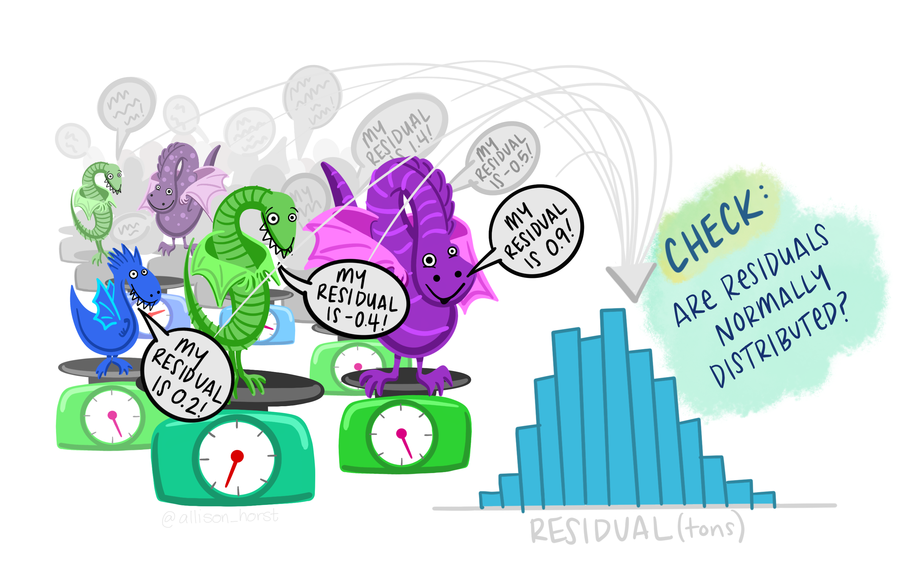
```

:::{.callout-note}
Regression includes more setup than many of the earlier tests because the model gives us several pieces of information: overall model fit, individual predictor coefficients, predicted values, residuals, and assumption checks. The goal is not to memorize every detail at once. Focus first on identifying the outcome, identifying the predictors, and interpreting the overall model and coefficients.
:::

::: {.callout-tip title="Check Your Understanding"}

A researcher uses hours studied and prior GPA to predict final exam score.

1. What is the outcome variable?
2. What are the predictor variables?
3. Why should the researcher avoid automatically saying that hours studied and prior GPA *caused* exam scores?

::: {.callout-note title="Check Your Answer" collapse="true"}

1. The outcome variable is final exam score.
2. The predictor variables are hours studied and prior GPA.
3. Regression can show that predictors are related to the outcome, but causal conclusions depend on the research design and possible alternative explanations.

:::

:::

## Step 1: Look at the Data

For this chapter, we will return to the `parenthood` dataset from the `lsj-data` library. This dataset includes 100 days of data about Dan's sleep quality, the baby's sleep quality, Dan's grumpiness, and the day of the study from 1 to 100.

The main variables are:

- `dan.grump`: Dan's grumpiness
- `dan.sleep`: Dan's sleep quality
- `baby.sleep`: the baby's sleep quality
- `day`: the day of the study, from 1 to 100

For the first regression model, our research question is: Do Dan's sleep quality and the baby's sleep quality predict Dan's grumpiness?

The video below walks through regression in jamovi.

```{r echo = FALSE, eval = knitr::is_html_output(excludes = "epub"), message = FALSE, warning = FALSE}
library(vembedr)
embed_url("https://www.youtube.com/watch?v=SfubvsatkdA")
```

### Data Set-Up

For regression, the dataset needs one continuous outcome variable and one or more predictor variables. Predictors may be continuous or categorical, depending on the model. Each row should represent one participant, case, day, or other unit of analysis.

In this example, each row represents one day. The continuous outcome variable is `dan.grump`. The first two predictor variables are `dan.sleep` and `baby.sleep`. The variable `day` will be used later in this chapter to demonstrate categorical predictors, but it is not included in the first multiple regression model.

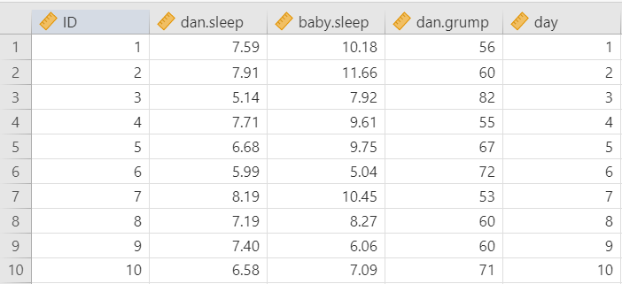

::: {.callout-tip title="Check Your Understanding"}

Look at the regression example.

1. What is the continuous outcome variable in the first regression model?
2. What are the predictor variables in the first regression model?
3. What does each row of the dataset represent?

::: {.callout-note title="Check Your Answer" collapse="true"}

1. The continuous outcome variable is `dan.grump`.
2. The predictors are `dan.sleep` and `baby.sleep`.
3. Each row represents one day of data collection.

:::

:::

### Describe the Data

Once we confirm that the data are set up correctly in jamovi, we should look at descriptive statistics and graphs. Descriptive statistics help us understand the sample size, missing data, means, medians, standard deviations, minimum values, maximum values, skew, and kurtosis.

The descriptive statistics show that there are 100 cases and no missing data. The variables `dan.grump`, `dan.sleep`, and `baby.sleep` are the main psychological variables in the regression model. The variable `day` is different because it records the day of the study from 1 to 100. It has a uniform distribution by design rather than a normal distribution.

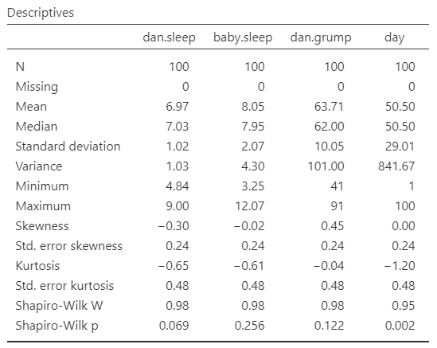

For regression, we should also examine scatterplots of the continuous predictors with the outcome. Scatterplots help us see whether the relationships look roughly linear and whether there are unusual points that may strongly influence the model.

## Step 2: Check Assumptions

Regression has several assumptions. Some assumptions are based on the research design and how the data were measured. Other assumptions are evaluated using model diagnostics.

### Design and Data Assumptions

Before interpreting the regression output, we should confirm that the basic design and variable assumptions are reasonable:

1. The outcome variable is continuous.
2. The predictors are continuous or appropriately coded categorical variables.
3. The observations are independent. Each case should contribute one outcome value, and one case should not determine another case.

In this example, `dan.grump` is continuous, and the first two predictors, `dan.sleep` and `baby.sleep`, are also continuous. Each row represents a day, so we should think about whether the days can reasonably be treated as independent. Because these are repeated daily observations from the same person, this assumption may be imperfect. For this course example, we will proceed with the regression, but in a more advanced course you might learn models designed specifically for repeated daily data.

### Outliers and Influential Cases

Regression can be strongly affected by unusual cases. One way to check for influential cases is Cook's distance. Cook's distance examines whether one entire row of data has a large influence on the regression model.

A common rule of thumb is that Cook's distance values greater than 1 may indicate a highly influential case. In this example, the Cook's distance values are small, so this check does not raise concern.

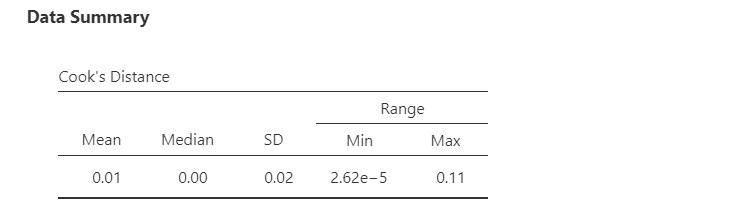

If Cook's distance suggests an influential case, do not automatically delete it. First, investigate the case. Check whether it reflects a data-entry error, a measurement problem, or a legitimate but unusual observation. Any decision to remove a case should be justified and reported.

### Normality of the Residuals

In earlier chapters, we often examined whether the outcome variable was approximately normally distributed. In regression, the key normality assumption is about the residuals. The residuals are the differences between the observed outcome values and the predicted outcome values.

In jamovi, we can evaluate residual normality using the Shapiro-Wilk test and the Q-Q plot of the residuals. In this example, the Shapiro-Wilk test is not statistically significant, and the Q-Q plot looks reasonable. Therefore, the residual normality assumption appears reasonable.

Large samples can make the Shapiro-Wilk test statistically significant even when the Q-Q plot looks acceptable. In that case, use multiple pieces of evidence rather than relying on one test alone.

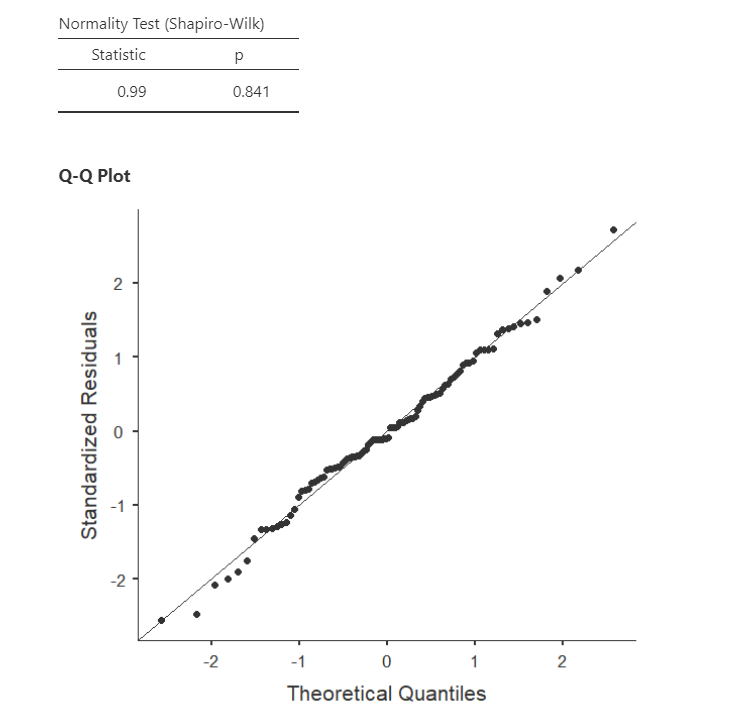

### Linearity and Homoscedasticity

**Linearity** means that the relationship between each continuous predictor and the outcome is roughly linear. If the relationship is strongly curved, a linear regression model may not describe the data well.

**Homoscedasticity** means that the spread of the residuals is roughly similar across the range of predicted values. If the residuals fan out or become much narrower across the plot, the assumption may be violated.

In jamovi, we can examine these assumptions using the residual plot. The residuals should be scattered fairly randomly around 0, without a strong curve or funnel shape. In this example, the residual plot does not raise major concerns.

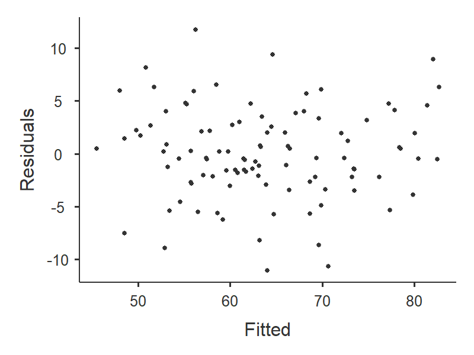

### Independence of Residuals

The independence assumption means that residuals should not be strongly related to one another. For example, in time-ordered data, one day's residual may be related to the next day's residual. The Durbin-Watson test can be used to check for autocorrelation in residuals.

Values near 2 suggest that residual autocorrelation is not a major concern. Values much closer to 0 or 4 may raise concern. In this example, the Durbin-Watson value does not raise major concern for the purposes of this example.

### Multicollinearity

**Multicollinearity** occurs when predictors are very strongly related to each other. When predictors overlap too much, it becomes difficult to estimate the unique contribution of each predictor.

We can evaluate multicollinearity using tolerance and the variance inflation factor, or VIF. Tolerance values below .10 or VIF values above 10 are common warning signs. In this example, multicollinearity does not raise major concern.

::: {.callout-tip title="Check Your Understanding"}

In a regression model, the residual Q-Q plot looks reasonable, but one case has a Cook's distance greater than 1.

What should the researcher do?

::: {.callout-note title="Check Your Answer" collapse="true"}

The researcher should investigate the case before deciding what to do. A large Cook's distance suggests the case may be influential, but it should not be automatically deleted. The researcher should check for data-entry errors, measurement problems, or a legitimate unusual case and justify any decision to exclude it.

:::

:::

### Decide Whether Regression Is Appropriate

For this course, use linear regression when the outcome variable is continuous, the predictors are continuous or appropriately coded categorical variables, and the assumptions appear reasonable enough to proceed. If assumption checks raise serious concerns, note the concern and interpret the model cautiously.

## Step 3: Perform the Test

To perform a regression in jamovi:

1. Go to the **Analyses** tab, click **Regression**, and choose **Linear Regression**. Use this option for simple linear regression, multiple regression, and hierarchical regression.

2. Move the continuous outcome variable `dan.grump` into the **Dependent Variable** box.

3. Move continuous predictors into the **Covariates** box. For the first regression model, move `dan.sleep` and `baby.sleep` to **Covariates**.

4. Move categorical predictors into the **Factors** box. We will use this later when we demonstrate categorical predictors.

5. Under **Assumption Checks**, select the available diagnostic options, including Cook's distance, Q-Q plot, residual plots, Durbin-Watson, and collinearity statistics.

6. Under **Model Fit**, select `R`, `R-squared`, `Adjusted R-squared`, and `F test`.

7. Under **Model Coefficients**, select `Standardized estimate`.

8. If you are performing hierarchical regression, use the **Model Builder** menu to enter predictors in blocks. We will return to this later in the chapter.

9. If you have categorical predictors with more than two levels, use the **Reference Levels** menu to specify the reference group. We will return to this later in the chapter.

## Step 4: Interpret Results

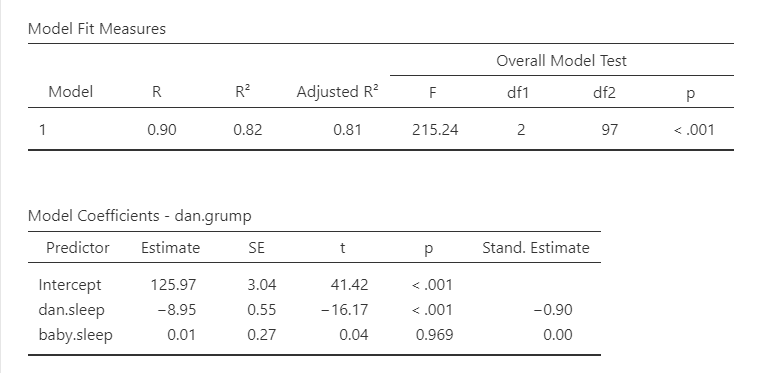

The regression output gives us information about the overall model and the individual predictors.

### Overall Model Fit

The model fit table includes \(R\), \(R^2\), adjusted \(R^2\), and the overall *F* test.

\(R^2\) is the proportion of variance in the outcome variable accounted for by the predictors in the model. In this example, Dan's sleep quality and the baby's sleep quality account for about 82% of the variance in Dan's grumpiness.

Adjusted \(R^2\) is similar to \(R^2\), but it adjusts for the number of predictors in the model. Adding predictors will usually increase \(R^2\), even if the added predictors are not very useful. Adjusted \(R^2\) provides a more cautious estimate of model fit.

The overall *F* test tells us whether the set of predictors significantly predicts the outcome variable. In this example, the overall model is statistically significant, which means that Dan's sleep quality and the baby's sleep quality together predict Dan's grumpiness better than a model with no predictors.

### Model Coefficients

The coefficients table gives us a separate test for each predictor. The **unstandardized coefficient**, often written as \(b\), tells us how much the predicted outcome changes for a one-unit increase in the predictor, holding the other predictors constant. The **standardized coefficient**, often written as \(\beta\), puts predictors on a common scale so their relative strength can be compared more easily.

In this example, `dan.sleep` significantly predicts `dan.grump`. As Dan's sleep quality increases, predicted grumpiness decreases, holding the baby's sleep quality constant. The baby's sleep quality does not significantly predict Dan's grumpiness after accounting for Dan's sleep quality.

The intercept is needed to write the prediction equation, but it is often not substantively meaningful. In this example, the intercept is the predicted grumpiness score when Dan's sleep quality and the baby's sleep quality are both 0. If 0 is outside the meaningful range of the predictors, the intercept should not be overinterpreted.

The unstandardized regression equation from this model is:

\[
\hat{y} = 125.97 - 8.95(\text{dan.sleep}) + .01(\text{baby.sleep})
\]

If Dan's sleep quality was 5 and the baby's sleep quality was 8, the predicted grumpiness score would be:

\[
\hat{y} = 125.97 - 8.95(5) + .01(8) = 81.30
\]

::: {.callout-tip title="Check Your Understanding"}

In a multiple regression, the coefficient for `hours_studied` is 4.20 when predicting exam score while controlling for prior GPA.

What does this coefficient mean?

::: {.callout-note title="Check Your Answer" collapse="true"}

For each one-unit increase in hours studied, predicted exam score increases by 4.20 points, holding prior GPA constant.

:::

:::

### Write Up the Results in APA Style

As reviewed in [Chapter 10: Writing Results in APA Style](10.0-writing-results-in-apa-style.qmd), an APA-style results section should describe the research question, report the model fit, report the relevant coefficients, and interpret the result.

> A multiple regression was conducted to examine whether Dan's sleep quality and the baby's sleep quality predicted Dan's grumpiness across 100 days. The overall model was statistically significant, *F*(2, 97) = 215.24, *p* < .001, adjusted \(R^2 = .81\). Dan's sleep quality significantly predicted grumpiness, \(b = -8.95\), *SE* = .55, \(\beta = -.90\), *t*(97) = -16.17, *p* < .001, such that days with better Dan sleep were associated with lower grumpiness. The baby's sleep quality did not significantly predict Dan's grumpiness after accounting for Dan's sleep quality, \(b = .01\), *SE* = .27, \(\beta = .00\), *t*(97) = .04, *p* = .969.

In many research reports, assumption checks are described in the analysis plan or results section only when there is a concern. For this course, be prepared to describe how you checked assumptions and whether any assumptions raised concerns.

## Categorical Predictors

Regression can include categorical predictors. When a categorical predictor has two levels, it can be represented with a 0/1 code. The group coded 0 is the reference group, and the coefficient for the predictor represents the difference between the group coded 1 and the group coded 0, holding other predictors constant.

When a categorical predictor has more than two levels, the model needs multiple comparison variables. jamovi can create these automatically when the variable is entered as a factor.

The `parenthood` dataset does not include a categorical predictor that we need for the main regression example, so we will create one for demonstration purposes. We will transform the `day` variable into a new categorical variable with three groups:

1. days 1-32,
2. days 33-65,
3. days 66-100.

This lets us demonstrate how regression handles categorical predictors with more than two levels.

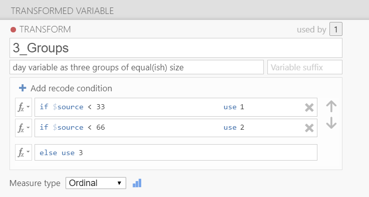

After creating `day_3groups`, we can add it to the regression model with `dan.sleep` and `baby.sleep`. The continuous predictors go in the **Covariates** box, and the categorical predictor goes in the **Factors** box.

### Reference Groups

For categorical predictors, the reference group is the group that other groups are compared to. In jamovi, use the **Reference Levels** menu to choose the reference group and coding type.

With **reference level** or dummy coding, the intercept is the predicted outcome for the reference group when all continuous predictors are 0. In this example, if group 1 is the reference group, the intercept is the predicted grumpiness score for days 1-32 when Dan's sleep quality and the baby's sleep quality are both 0.

The coefficient for `day_3groups (2 - 1)` compares group 2 to group 1, holding the other predictors constant. The coefficient for `day_3groups (3 - 1)` compares group 3 to group 1, holding the other predictors constant.

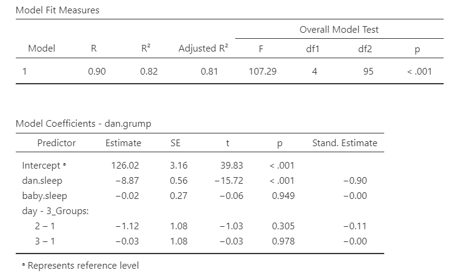

In this example, neither comparison is statistically significant. This means that Dan's predicted grumpiness does not differ significantly between days 33-65 and days 1-32, or between days 66-100 and days 1-32, after accounting for Dan's sleep quality and the baby's sleep quality.

Estimated marginal means can help us interpret categorical predictors. They show the model-estimated means for each group, adjusted for the other predictors in the model.

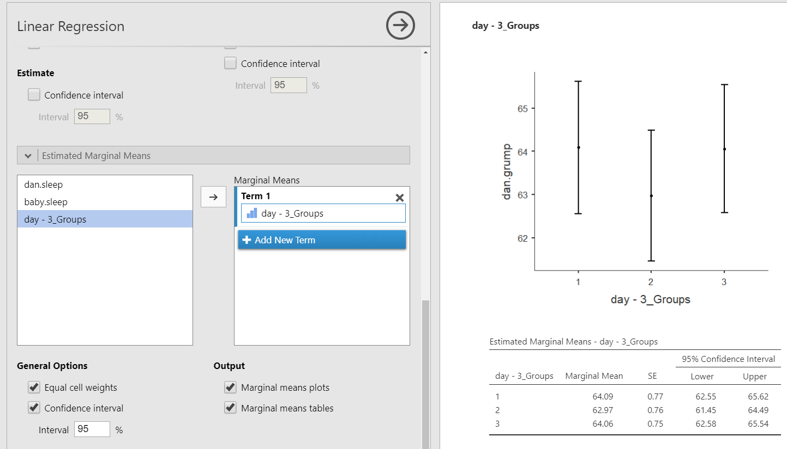

::: {.callout-tip title="Check Your Understanding"}

A regression model includes a categorical predictor called `condition` coded 0 = control and 1 = treatment. The coefficient for `condition` is positive and statistically significant.

What does this mean?

::: {.callout-note title="Check Your Answer" collapse="true"}

It means the treatment group is predicted to have a higher outcome score than the control group, holding other predictors constant. The control group is the reference group because it is coded 0.

:::

:::

## Hierarchical Regression

Hierarchical regression is a form of multiple regression in which predictors are entered in blocks or steps. The blocks should be based on theory, prior research, temporal order, or the research question. Hierarchical regression is not just a way to try predictors in different orders until the results look best.

Hierarchical regression allows us to ask whether a new block of predictors improves prediction beyond the predictors already in the model. This is called **incremental prediction**.

For this example, we will use two models:

- **Model 1:** `baby.sleep`
- **Model 2:** `baby.sleep` and `dan.sleep`

This lets us test whether Dan's sleep quality improves prediction of Dan's grumpiness above and beyond the baby's sleep quality.

To conduct hierarchical regression in jamovi, use **Regression → Linear Regression** and open the **Model Builder** menu. Put the first block of predictors in Model 1 and add the next block of predictors in Model 2. Under **Model Fit**, select `AIC` and `BIC` in addition to `R`, `R-squared`, `Adjusted R-squared`, and `F test` if you want additional model-comparison information.

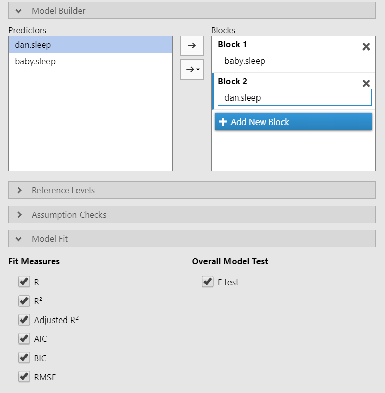

The output now includes model fit information for each model and a model comparison table. The model comparison table tells us whether the added block of predictors significantly improves the model.

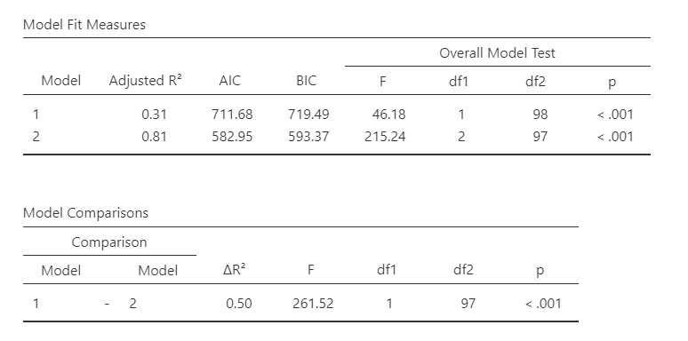

Model 1, which includes only `baby.sleep`, is statistically significant, *F*(1, 98) = 46.18, *p* < .001, adjusted \(R^2 = .31\). Model 2, which includes both `baby.sleep` and `dan.sleep`, is also statistically significant, *F*(2, 97) = 215.24, *p* < .001, adjusted \(R^2 = .81\).

The model comparison shows that adding `dan.sleep` significantly improves the model, \(F_{change}\)(1, 97) = 261.52, *p* < .001, \(\Delta R^2 = .50\). This means that Dan's sleep quality explains additional variance in Dan's grumpiness beyond the variance explained by the baby's sleep quality.

### Write Up Hierarchical Regression in APA Style

> A hierarchical regression was conducted to examine whether Dan's sleep quality predicted Dan's grumpiness above and beyond the baby's sleep quality. In Model 1, the baby's sleep quality significantly predicted Dan's grumpiness, *F*(1, 98) = 46.18, *p* < .001, adjusted \(R^2 = .31\). Higher baby sleep quality was associated with lower Dan grumpiness, \(b = -2.71\), *SE* = .40, \(\beta = -.57\), *t*(98) = -6.80, *p* < .001.
>
> In Model 2, Dan's sleep quality was added to the model. Model 2 significantly predicted Dan's grumpiness, *F*(2, 97) = 215.24, *p* < .001, adjusted \(R^2 = .81\). Adding Dan's sleep quality significantly improved model fit, \(F_{change}\)(1, 97) = 261.52, *p* < .001, \(\Delta R^2 = .50\). In Model 2, Dan's sleep quality significantly predicted grumpiness, \(b = -8.95\), *SE* = .55, \(\beta = -.90\), *t*(97) = -16.17, *p* < .001. The baby's sleep quality did not significantly predict Dan's grumpiness after accounting for Dan's sleep quality, \(b = .01\), *SE* = .27, \(\beta = .00\), *t*(97) = .04, *p* = .969.

::: {.callout-tip title="Check Your Understanding"}

A researcher enters prior GPA in Model 1 and then adds hours studied in Model 2. The model comparison is statistically significant.

What does the significant model comparison tell us?

::: {.callout-note title="Check Your Answer" collapse="true"}

It tells us that adding hours studied significantly improves prediction of the outcome beyond prior GPA. In other words, hours studied provides incremental prediction above and beyond the predictor already in Model 1.

:::

:::

## Summary

| Concept | What It Means in Regression |
|---|---|
| Outcome variable | The continuous variable being predicted |
| Predictor variable | A variable used to predict the outcome |
| Unstandardized coefficient, \(b\) | The expected change in the outcome for a one-unit increase in the predictor, holding other predictors constant |
| Standardized coefficient, \(\beta\) | A coefficient on a common scale that can help compare predictor strength |
| Intercept | The predicted outcome when all predictors are 0 |
| Residual | The difference between the observed outcome and the predicted outcome |
| \(R^2\) | The proportion of variance in the outcome accounted for by the predictors |
| Adjusted \(R^2\) | A version of \(R^2\) adjusted for the number of predictors |
| Hierarchical regression | Regression with predictors entered in blocks to test incremental prediction |

Regression is flexible, but that flexibility means we need to be careful. Always identify the outcome variable, identify the predictors, check assumptions, interpret the overall model, and then interpret the individual coefficients in relation to the research question.
