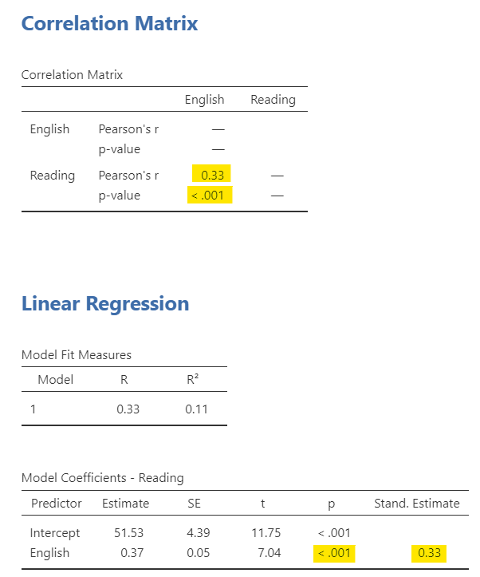
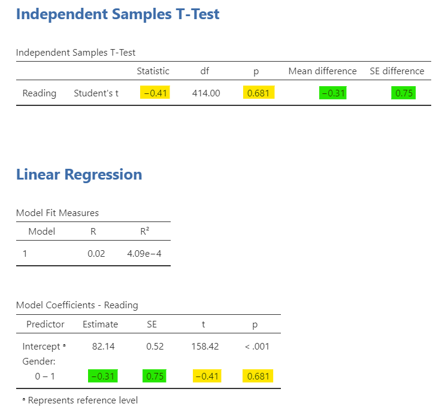
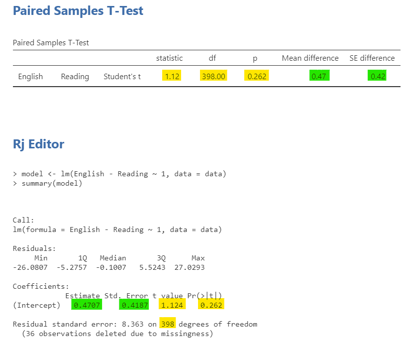

# 14.3 General Linear Model {#sec-general-linear-model .unnumbered}

```{r, echo = FALSE, message=FALSE}
library(tidyverse)
library(viridis)
options(knitr.graphics.auto_pdf = TRUE)
```

Regression is one example of a **general linear model**. In fact, many of the statistical tests we have learned can be understood as versions of the same general model: we use one or more variables to account for variation in an outcome.

:::{.callout-note}
In this section, **GLM** means **general linear model**, not **generalized linear model**. These sound similar, but they refer to different ideas. The general linear model includes many familiar analyses with continuous outcomes, such as regression, *t*-tests, and ANOVA.
:::

This section is meant to help you see connections across the course. You do not need to run every analysis as a regression, and you do not need to memorize the regression version of each test. The goal is to notice the shared logic behind the tests we have learned.

In the general linear model framework, many analyses can be written as:

\[
\text{outcome} = \text{model} + \text{error}
\]

The **model** represents the part of the outcome we can account for using predictors, group membership, or repeated measurements. The **error** represents the part of the outcome that remains unexplained by the model.

If you would like to learn more about this idea, Lindeløv's online book [*Common statistical tests are linear models*](https://lindeloev.github.io/tests-as-linear/) provides a more detailed explanation.

For the examples below, we will use the `Sample_Dataset_2014` dataset. I am only showing the relevant output so that you can focus on the connections between analyses. The dataset is available here: [Sample_Dataset_2014.xlsx](https://github.com/danawanzer/stats-with-jamovi/blob/master/data/Sample_Dataset_2014.xlsx).

We will focus on correlation, independent *t*-tests, dependent *t*-tests, and one-way ANOVA because these are the easiest to compare with regression.

## Correlation as Regression

Imagine we want to examine whether English scores and reading scores are related. We could use a Pearson correlation, as shown in the output at the top of the figure. We could also run a simple linear regression with English scores predicting reading scores, as shown in the output at the bottom of the figure.



There are a few things to notice:

1. The Pearson correlation and the standardized regression coefficient are the same.
2. The *p*-values are the same.
3. The regression output is directional in setup because one variable is entered as the predictor and the other as the outcome.
4. The correlation output is not directional in the same way because it simply describes the relationship between the two variables.

This does not mean correlation and regression are always interchangeable in how we talk about them. Correlation is usually used to describe the strength and direction of a relationship between two variables. Regression is usually used when we want to predict or explain variation in an outcome.

## Independent *t*-Test as Regression

An independent *t*-test compares two independent groups on a continuous outcome. We can also represent that same comparison using regression if we code group membership as a predictor.

In this example, we examine whether reading scores differ by gender. The independent *t*-test output is shown at the top of the figure, and the regression output is shown at the bottom.



There are a few things to notice:

1. The *t* statistic and *p*-value match across the independent *t*-test and the regression output.
2. The unstandardized regression coefficient represents the mean difference between the two groups.
3. The intercept represents the mean for the reference group.
4. The group coefficient tells us how much higher or lower the comparison group is relative to the reference group.

This is why a two-group comparison can be represented as a regression model. The categorical group variable is translated into a coded predictor, and the regression coefficient represents the group difference.

## Dependent *t*-Test as Regression

A dependent *t*-test compares two related measurements, such as two scores from the same participant. This can also be represented using the general linear model, although it is not as straightforward to run in base jamovi's regression menu.

For a dependent *t*-test, we first create a difference score between the two related measurements. The model then tests whether the average difference score differs from zero.



There are a few things to notice:

1. The *t* statistic, degrees of freedom, and *p*-value match across the dependent *t*-test and the regression-style model.
2. The intercept in the regression-style model represents the mean difference score.
3. The standard error of the intercept matches the standard error of the mean difference.

This example shows that a dependent *t*-test is also a model of an outcome: the difference between two related measurements.

## One-Way ANOVA as Regression

A one-way ANOVA compares three or more independent groups on a continuous outcome. It can also be represented as a regression model by coding group membership using comparison variables.

In this example, we examine whether English scores differ by rank. Rank has four levels, so the one-way ANOVA compares English scores across four groups. In the regression output, the group comparisons are represented through coefficients.

```{r echo = FALSE, fig.cap = "One-way ANOVA as a regression", fig.show='hold', fig.align='center', out.width = "49%"}
knitr::include_graphics(c("images/14-regression-wrap-up/anova1.png", "images/14-regression-wrap-up/anova2.png"))
```

There are a few things to notice:

1. The overall ANOVA test from the regression output matches the one-way ANOVA table.
2. The intercept represents the mean of the reference group.
3. The group coefficients represent differences between each comparison group and the reference group.
4. The estimated marginal means from the regression model match the group means from the ANOVA.

For example, if Rank 1 is the reference group, the intercept represents the mean English score for Rank 1. A coefficient comparing Rank 2 to Rank 1 represents how much the Rank 2 mean differs from the Rank 1 mean. Adding the coefficient to the intercept gives the estimated mean for Rank 2, with small differences possible due to rounding.

This is the same idea we saw with the independent *t*-test, but extended to more than two groups.

## What This Means

The purpose of this section is not to replace the tests we learned earlier. Instead, the purpose is to show that many familiar tests share a common structure.

| Familiar Test | General Linear Model Version | What the Predictor Represents |
|---|---|---|
| Pearson correlation | Simple linear regression with a standardized coefficient | A continuous predictor |
| Independent *t*-test | Regression with one two-level categorical predictor | Group membership |
| Dependent *t*-test | Model of a difference score | Difference between related measurements |
| One-way ANOVA | Regression with one categorical predictor with three or more levels | Group membership across multiple groups |
| Factorial ANOVA | Regression with multiple categorical predictors and interactions | Main effects and interactions |
| ANCOVA | Regression/ANOVA with categorical predictors and continuous covariates | Group membership and statistical adjustment variables |

Across these examples, the statistical question is often some version of: **Can we use information from one or more variables to account for variation in an outcome?**

The tests differ in the kinds of predictors they use and the kinds of research questions they answer. Correlation focuses on relationships between continuous variables. *t*-tests and ANOVA focus on group differences. Regression focuses on prediction and explanation. But under the surface, these analyses are closely related.

::: {.callout-tip title="Check Your Understanding"}

Match each familiar test to the general linear model idea it represents.

1. An independent *t*-test compares two groups on a continuous outcome.
2. A Pearson correlation examines the relationship between two continuous variables.
3. A one-way ANOVA compares three or more groups on a continuous outcome.

::: {.callout-note title="Check Your Answer" collapse="true"}

1. An independent *t*-test can be represented as regression with one two-level categorical predictor.
2. A Pearson correlation can be represented as simple linear regression with a continuous predictor.
3. A one-way ANOVA can be represented as regression with one categorical predictor that has three or more levels.

:::

:::

The general linear model is useful because it helps us see the connections among statistical tests. Once you understand the shared model logic, the different tests may feel less like separate procedures and more like variations on the same underlying idea.
