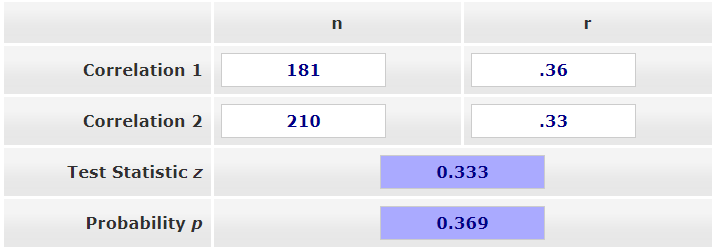
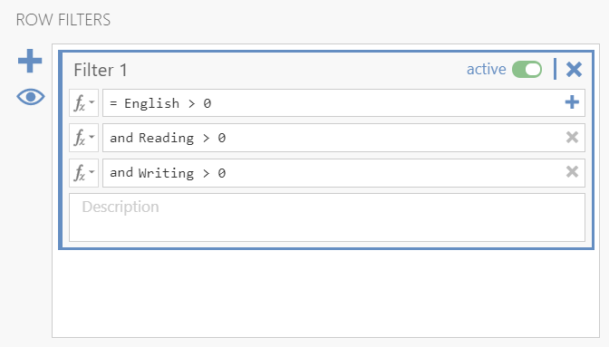
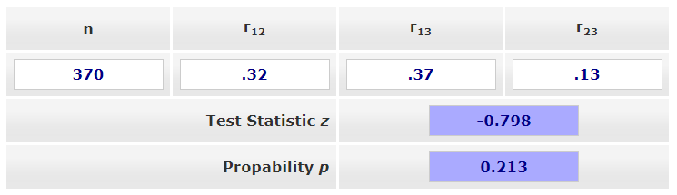

# 14.4 Comparing Strengths of Correlations {#sec-comparing-correlations .unnumbered}

:::{.callout-note title="Advanced Material"}
This is an advanced sub-chapter. You do not need to compare correlations unless an assignment specifically asks you to do so. The main goal is to understand when two correlations can be compared and what information is needed for the comparison.
:::

Sometimes we want to know whether one correlation is stronger than another correlation. For example, we might ask whether the relationship between English and reading scores is stronger than the relationship between English and writing scores. We might also ask whether the relationship between English and reading scores differs for men and women.

These questions are different from asking whether each correlation is statistically significant. Two correlations can both be statistically significant, but that does not automatically mean they are significantly different from each other. To test whether two correlations differ, we need a separate comparison test.

In this sub-chapter, we will use the online calculator [Testing the Significance of Correlations](https://www.psychometrica.de/correlation.html). This calculator includes options for comparing correlations from independent samples and dependent samples.

## Independent Versus Dependent Correlations

Before comparing correlations, we need to identify whether the correlations come from independent samples or dependent samples.

| Type of Comparison | When to Use It | Example |
|---|---|---|
| **Independent samples** | The two correlations come from different groups of people or cases. | Compare the correlation between English and reading scores for men with the correlation between English and reading scores for women. |
| **Dependent samples** | The two correlations come from the same group of people or cases and share at least one variable. | Compare the correlation between English and reading scores with the correlation between English and writing scores using the same students. |

Use the calculator’s **Independent Samples** option when the correlations come from different samples. Use the **Dependent Samples** option when the correlations come from the same sample and share one variable.

:::{.callout-warning}
Do not compare two correlations just by looking at which one is larger. A correlation of .37 is larger than a correlation of .32, but that does not tell us whether the difference between them is statistically significant.
:::

::: {.callout-tip title="Check Your Understanding"}

A researcher wants to compare two correlations:

1. The correlation between English and reading scores for men
2. The correlation between English and reading scores for women

Should the researcher use the independent-samples or dependent-samples comparison?

::: {.callout-note title="Check Your Answer" collapse="true"}

The researcher should use the **independent-samples** comparison because the two correlations come from different groups of people: men and women.

:::

:::

## Example Dataset

We will use the `Sample_Dataset_2014.xlsx` file for both examples in this sub-chapter. You can download the dataset here: [Sample_Dataset_2014.xlsx](https://github.com/danawanzer/stats-with-jamovi/blob/master/data/Sample_Dataset_2014.xlsx).

The examples use three test-score variables:

- `English`
- `Reading`
- `Writing`

The independent-samples example also uses `Gender` to create two separate groups.

## Comparing Correlations From Independent Samples

In the first example, we want to test whether the correlation between English and reading scores differs for men and women. Because men and women are different groups of students, this is an independent-samples comparison.

### Step 1: Get the Correlation for the First Group

First, we need to obtain the correlation between `English` and `Reading` for men.

1. Go to the **Data** tab in jamovi.
2. Click **Filters**.
3. Enter the filter equation `Gender == 0`.
4. Go to the **Analyses** tab.
5. Click **Regression** and choose **Correlation Matrix**.
6. Move `English` and `Reading` into the variables box.
7. Select `N` so that jamovi reports the sample size for the correlation.

For men, the correlation is *r* = .36, *p* < .001, with *n* = 181.

### Step 2: Get the Correlation for the Second Group

Next, we need to obtain the correlation between `English` and `Reading` for women.

1. Return to the **Data** tab.
2. Open the filter you created.
3. Change the filter equation to `Gender == 1`.
4. Return to the correlation output.

The output should update automatically because the filter changed. For women, the correlation is *r* = .33, *p* < .001, with *n* = 210.

### Step 3: Compare the Two Correlations

Now we can enter the information into the [Testing the Significance of Correlations - Independent Samples](https://www.psychometrica.de/correlation.html#independent) calculator.

Enter the following values:

| Correlation | *n* | *r* |
|---|---:|---:|
| Men | 181 | .36 |
| Women | 210 | .33 |

The result is not statistically significant, *p* = .369. This means that the correlation between English and reading scores does not differ significantly between men and women.

### Write Up the Independent-Samples Comparison

An APA-style write-up could say:

> The correlation between English and reading scores was significant for men, *r* = .36, *p* < .001, and women, *r* = .33, *p* < .001. However, the strength of the correlation did not differ significantly between men and women, *p* = .369.

## Comparing Correlations From Dependent Samples

In the second example, we want to test whether the correlation between English and reading scores differs from the correlation between English and writing scores. Both correlations come from the same students and both correlations include `English`, so this is a dependent-samples comparison.

For this comparison, we need three correlations:

1. The correlation between `English` and `Reading`
2. The correlation between `English` and `Writing`
3. The correlation between `Reading` and `Writing`

The third correlation is needed because the two correlations we are comparing are dependent. The calculator needs to know how strongly the two non-shared variables, `Reading` and `Writing`, are related to each other.

:::{.callout-note}
The dependent-samples test used here applies when the two correlations come from the same sample and share one variable. It is not used when comparing two completely separate correlations, such as the correlation between Variable A and Variable B versus the correlation between Variable C and Variable D.
:::

### Step 1: Turn Off Any Previous Filters

If you still have the gender filter turned on from the previous example, turn it off before continuing.

1. Go to the **Data** tab.
2. Click **Filters**.
3. Delete the filter or toggle it off.

### Step 2: Get the Three Correlations

Return to the **Correlation Matrix** analysis and include `English`, `Reading`, and `Writing`.

However, there is a complication: the correlation matrix may show different sample sizes because some students have missing data on one or more variables. The dependent-samples calculator requires one sample size, so we need the same cases included in all three correlations.

To do this in jamovi, use filters to create listwise deletion for the three variables. Add filters so that cases are included only when they have data for `English`, `Reading`, and `Writing`.

After applying the filters, the correlation matrix should update so that all three correlations use the same sample size. In this example, all three correlations use *n* = 370.

### Step 3: Compare the Two Correlations

Now enter the information into the [Testing the Significance of Correlations - Dependent Samples](https://www.psychometrica.de/correlation.html#dependent) calculator.

The calculator asks for:

| Input | Meaning |
|---|---|
| *n* | The sample size used for all three correlations |
| \(r_{12}\) | The correlation between Variable 1 and Variable 2 |
| \(r_{13}\) | The correlation between Variable 1 and Variable 3 |
| \(r_{23}\) | The correlation between Variable 2 and Variable 3 |

For this example:

- Variable 1 is `English`.
- Variable 2 is `Reading`.
- Variable 3 is `Writing`.

Enter the correlations from the jamovi correlation matrix. The result is not statistically significant, *p* = .213. This means that the correlation between English and reading scores, *r* = .32, does not differ significantly from the correlation between English and writing scores, *r* = .37.

### Write Up the Dependent-Samples Comparison

An APA-style write-up could say:

> English scores were significantly correlated with reading scores, *r* = .32, *p* < .001, and writing scores, *r* = .37, *p* < .001. A dependent-samples comparison indicated that these two correlations did not differ significantly in strength, *p* = .213.

::: {.callout-tip title="Check Your Understanding"}

A researcher wants to compare two correlations from the same students:

1. The correlation between motivation and exam score
2. The correlation between motivation and final grade

The researcher also has the correlation between exam score and final grade.

Should the researcher use the independent-samples or dependent-samples comparison?

::: {.callout-note title="Check Your Answer" collapse="true"}

The researcher should use the **dependent-samples** comparison because the correlations come from the same students and share one variable: motivation.

:::

:::

## Summary

| Question | Comparison Type | Information Needed |
|---|---|---|
| Do two correlations from different groups differ? | Independent samples | The two correlations and their two sample sizes |
| Do two correlations from the same group differ when they share one variable? | Dependent samples | The three correlations among the variables and one shared sample size |

When reporting these analyses, remember that the comparison test answers a specific question: whether the two correlations differ significantly in strength. It does not replace the original correlation tests, and it does not establish causation.
