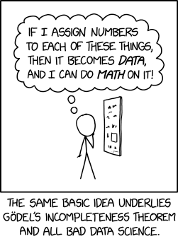

# 2. Statistics foundations


This chapter introduces key ideas that will support everything you learn in this course and throughout the rest of this textbook.

Some of this material may feel familiar from previous courses, while other concepts may be new. The goal of this chapter is not to master everything at once, but to build a strong foundation you can return to as needed.

------------------------------------------------------------------------

### How to Use This Chapter {.unlisted .unnumbered}

This chapter is organized into short sections that introduce foundational concepts and terminology.\
\
You are not expected to memorize everything right away. Instead, focus on understanding the big ideas and use this chapter as a resource you can revisit throughout the course.

------------------------------------------------------------------------

### What You’ll Learn {.unlisted .unnumbered}

By working through this chapter, you will begin to to:

-   Understand how data are used to answer research questions
-   Distinguish between describing data and making inferences
-   Recognize different types of variables
-   Become familiar with key statistical terms used throughout the course

------------------------------------------------------------------------

### Chapter Sections {.unlisted .unnumbered}

-   **2.1 Describing Our Data**:Introduces what data are, how we summarize them, and why descriptive statistics matter.

-   **2.2 Levels of Measurement**: Explains different types of variables and how they influence the analyses we choose.

-   **2.3 Descriptive vs Inferential Statistics**: Builds the conceptual foundation for hypothesis testing and statistical inference.

-   **2.4 Key Terms & Concepts**: Provides definitions and explanations of statistical terms you will encounter throughout the textbook. You do not need to memorize all of these now—return to this section as needed.

------------------------------------------------------------------------

### Why This Matters {.unlisted .unnumbered}

These foundational ideas will be used throughout the rest of the textbook and in your work as a researcher or practitioner.

For example:

-   You will use **types of variables** to determine which statistical test to run
-   You will use **descriptive statistics** to summarize and interpret data
-   You will use these concepts to understand **hypothesis testing** and draw conclusions from data
-   You will rely on **key terms and concepts** when interpreting output and writing results in APA style

You do not need to master all of this immediately—these ideas will become clearer as you apply them in later chapters.

------------------------------------------------------------------------

### A Note on Learning Statistics {.unlisted .unnumbered}

It’s completely normal if some of these concepts feel challenging or unfamiliar at first. Statistics builds over time, and you will revisit many of these ideas in later chapters with more context and examples.

Focus on understanding the big picture—you will have many opportunities to practice and apply these concepts as you move forward.

## 2.1 Describing data

Before we can analyze data, we need to understand what our data represent and how they are organized.

At its core, statistics is about using data to answer questions. Data are pieces of information we collect about people, behaviors, or outcomes of interest.

First, let's understand some basic statistics related to how we describe our data, including measures of central tendency (averages), measures of dispersion (spread), and measures of shape of the distribution (particularly a normal distribution). Here's a [video](https://www.youtube.com/watch?v=QirHpjLkHmc) walking you through what we learn in this chapter.


```{=html}
<div class="vembedr">
<div>
<iframe src="https://www.youtube.com/embed/QirHpjLkHmc" width="533" height="300" frameborder="0" allowfullscreen="" data-external="1"></iframe>
</div>
</div>
```


::: callout-tip
### Learning Objectives

By the end of this section, you should be able to:

-   Define what data are and explain why context matters
-   Identify observations (rows) and variables (columns) in a dataset
-   Distinguish between categorical and numerical variables
-   Describe how datasets are structured for analysis
-   Recognize features of a well-organized dataset
:::

### What Are Data?

In research, data are typically organized in a dataset (often a spreadsheet format), where:

-   **Rows** represent individual observations (e.g., participants)
-   **Columns** represent variables (e.g., age, test score, group membership)

Each value in the dataset tells us something about a specific observation on a specific variable.

::: {.info data-latex=""}
**Is "data" singular or plural?**

In formal scientific writing, including APA style, “data” is treated as plural (the singular form is datum). For example, "The data are consistent with the hypothesis."

However, in common usage, “data” is often treated as singular when referring to a set or collection of information. For example, "The data is stored in a spreadsheet."

In this textbook, we will treat data as singular for ease of readability. However, you may see “data” treated as plural in research articles and formal writing, so it’s helpful to be familiar with both conventions.
:::

------------------------------------------------------------------------

### Data Need Context

Data are only meaningful when we understand what they represent.

For example, a value of “75” could represent:

-   A test score

-   A heart rate

-   A temperature

To interpret data correctly, we need to know:

-   What each variable represents

-   How it was measured

-   What the values mean

This is why clear variable names and documentation are important when working with datasets.

------------------------------------------------------------------------

### How to Read and Work With Data

To understand and use a dataset effectively, it’s important to recognize how data are organized. Well-structured datasets follow a few key principles:

-   **Rows represent observations** (e.g., one participant, one trial, or one case)
-   **Columns represent variables** (e.g., age, condition, score)
-   **Each cell contains a single value** for one observation on one variable
-   **Variable names are clear and consistent**, so you know what each column represents
-   **Missing data are clearly labeled** (e.g., NA), rather than left blank, although *jamovi* knows to treat blank cells as missing data
-   **Data are stored in a clean, rectangular format**, making them easier to analyze

Understanding this structure will help you read datasets, identify variables, and prepare your data for analysis in tools like jamovi.

Following these principles also helps prevent errors and makes data easier to analyze, share, and reproduce ([Broman & Woo, 2018](https://www.tandfonline.com/doi/full/10.1080/00031305.2017.1375989)).

------------------------------------------------------------------------

### What Is a Variable?

A **variable** is anything we measure or record that can vary across individuals or observations.

Examples of variables include:

-   Age
-   Gender
-   Test scores
-   Survey responses

Some variables describe characteristics of participants, while others represent outcomes we are interested in understanding.

You will learn more about different types of variables in the next section.

------------------------------------------------------------------------

### Types of Data

Not all variables are the same. Broadly, variables fall into two categories:

-   **Categorical variables** describe groups or categories (e.g., gender, major, treatment condition)
-   **Numerical variables** represent quantities or amounts (e.g., age, height, test scores)

Understanding the type of data you are working with will help you decide how to summarize and analyze it. You'll learn more about this and how to apply it in future chapters.

------------------------------------------------------------------------

### Why Do We Describe Data?

Once we collect data, the first step is to **describe what we have**. Raw data (a spreadsheet full of numbers) can be difficult to interpret on their own. Descriptive statistics help us:

-   Summarize large amounts of data
-   Identify patterns or trends
-   Understand what is typical or unusual
-   Prepare for further analysis

------------------------------------------------------------------------

### What Does It Mean to Describe Data?

When we describe data, we are typically trying to understand three key features:

1.  **Center (What is typical?)**: This tells us what a “typical” value looks like, often summarized using measures like the mean or median. These are called *measures of central tendency*.

2.  **Variability (How spread out are the values?)**: This tells us how much the data differ from one another. Some datasets are tightly clustered, while others are more spread out. These are called *measures of dispersion*.

3.  **Shape (What does the distribution look like?)**: This refers to how the data are distributed—for example, whether values are evenly spread out or skewed in one direction.

You will learn how to calculate and interpret these in later chapters.

------------------------------------------------------------------------

### Types of Descriptive Information

There are two main ways we describe data:

1.  Numerical summaries, using measures of central tendency (e.g., mean, median, mode) and dispersion (e.g., standard deviation, variance).

2.  Visual summaries, using graphs and charts (e.g., histograms, bar charts) which help us quickly see patterns and differences.

------------------------------------------------------------------------

### Looking Ahead

Describing data is always the first step in any statistical analysis.

You will use these ideas when you:

-   Summarize your data (Chapter 4)
-   Visualize patterns (Chapter 5)
-   Begin hypothesis testing (Chapter 7)
-   Interpret results from statistical tests (Chapters 11–14)

Understanding your data before analyzing it will help you make better decisions and avoid mistakes.

------------------------------------------------------------------------

### Key Takeaways

-   Data are organized into rows (observations) and columns (variables)
-   Variables are characteristics or outcomes that can vary
-   Describing data involves understanding center, variability, and shape
-   Descriptive statistics summarize and simplify data
-   Describing data is the first step in any analysis

::: callout-tip
### Check Your Understanding

By the end of this section, you should be able to:

1.  In a dataset, what does each **row** represent? What does each **column** represent?\
2.  Give an example of a **categorical variable** and a **numerical variable**.\
3.  Why is it important that each cell contains only one value?\
4.  What are two features of a well-organized dataset?\
5.  Why do data need context to be meaningful?
:::

::: {.callout-tip collapse="true"}
### Answers

1.  Rows represent observations (e.g., participants), and columns represent variables.\
2.  Categorical: major. Numerical: age.
:::

## 2.2 Levels of measurement

This may or may not be refresher material for you, but it is extremely important you are familiar with the four levels of measurement.


**Categorical**: variables that have *categories* to the levels, but cannot be analyzed with a mean because the levels are not proportionate. There are two types of categorical variables:

-   **Nominal**: a categorical variable in which each level of the variable is named but there is no order to them (e.g., breeds of dogs). Nominal variables can only be analyzed with frequencies, modes, counts, or percentages. Nominal variables with only two levels (generally coded as 0 or 1, although jamovi can handle named levels), we call these special nominal variables as either binary, dummy-coded, or dichotomous nominal variables. For example, binary variables could be coded as yes or no or as absence or presence.

-   **Ordinal**: a categorical variable in which each level of the variable is named and there is an order to them (e.g., ranks). We can analyze ordinal variables with frequencies and percentages, like nominal variables, but we can *also* analyze them using medians, minimum and maximum values, ranges, and percentiles.

**Continuous**: variables with proportionate intervals between the levels, meaning they can be analyzed with a mean, SD, variance. There are two types of continuous variables (although for the purpose of this course we will simply call them continuous variables):

-   **Interval**: a continuous variable that has intervals that are directly proportionate (e.g., the distance between 2-3 is the same as the distance between 5-6). We can analyze interval variables using means, variances, and standard deviations.

-   **Ratio**: a continuous variable like an internal variable but can accommodate an absolute zero, meaning a zero is actually possible (e.g., weight, temperature in Kelvin, reaction time). We can also analyze ratio variables with means, variances, and standard deviations, but we can also conduct arithmetic operations like fractions and ratios.

Note that in this class, I won't ask you to differentiate between interval and ratio levels of measurement because the differences between the two are usually not meaningful in our work. You'll even find that jamovi doesn't differentiate between the two, either. Instead, you just need to know whether the variables are continuous, ordinal, or nominal.

### Examples of levels of measurement

Confused still on the levels of measurement? Maybe this will help!

One semester, a student asked, "Isn't time a continuous variable?" To which I responded, "It depends on how it is measured!" If time was measured in a simple pre/post design, such as the start of the semester and the end of the semester, then it's a nominal variable, and a specific type of nominal variable that we can call binary or dichotomous. If time was measured by month, January through December, then it would be ordinal because January is before (earlier than) February, for example. There is an order to the months, and a calendar that went March, October, April, January, etc. would make no sense. If time was measured as a continuous variable, it could be something like the exact day, exact time, response time, or time remaining.

Here's another example. Notice that studying can be measured at different levels. Depending on the nature of the question and response options, it might be nominal, ordinal, or continuous! Here's an example of data at the continuous, ordinal, and nominal level.

| Name | Study_Continuous | Study_Ordinal | Study_Nominal |
|------------------|------------------|------------------|-------------------|
| *Name (Character)* | *Hours studied per day* | *Likert scale of amount of studying* | *Whether or not they study every day* |
| Jesus | 5.0 | A great deal | Yes |
| Nicky | 4.5 | A great deal | Yes |
| Bradford | 3.2 | A moderate amount | Yes |
| Sylvia | 1.7 | A small amount | Yes |
| Martha | 0.2 | Rarely | Yes |
| Lillian | 0.0 | Never | No |
| Trayvon | 0.0 | Never | No |

We can make any continuous variable into an ordinal and nominal variable and any ordinal variable into a nominal variable. But if we have a nominal variable we cannot make it ordinal, nor can we make an ordinal variable continuous. In other words, continuous variables *contain more information* than categorical variables. Often, we want to avoid losing information and so we should aim to keep the variable at the highest level of measurement.

Because continuous variables have more information, we want to avoid doing things like mean or median splits or "collapsing" categories when you can. A mean or median split, which involves finding the mean or median value and splitting the data so it's above the mean/median or below the mean/median, is making a continuous variable as nominal, which is removing information. Collapsing categories may also further reduce the information.

Another thing to keep in mind is that just because we put numbers to something does not necessarily make it continuous! Be careful and think critically. If I said cat = 1, dog = 2, and frog = 3 it doesn't make it an ordinal or continuous variable.



## 2.3 Descriptive vs inferential statistics

There are basically two different types of statistics:

1.  **Descriptive statistics** are used to summarize, organize, and overall *describe* our sample data. Typically, we do so using measures of central tendency (e.g., mean, median, mode), measures of dispersion (e.g., range, standard deviation, variance), and shape (e.g., skew, kurtosis). We may also visualize the data using tables or graphs.

2.  **Inferential statistics** are what we use when we collect data about a sample and see how well that sample *infers* things about the population from which the sample comes from. Typically, we do so with statistical tests like the t-test, ANOVA, correlation, chi-square, regression, and more.

We can visualize the relationship between the population, sample, descriptive statistics, and inferential statistics (see figure below). We are typically interested in a **population** of interest but may not be able to collect data from the entire population because of budget, time, access, or other constraints. Therefore, we typically **sample** from the population; ideally, we do so randomly, but there are other types of sampling methods available that are covered in research methods. We then use **descriptive statistics** to describe our sample data, and we and **inferential statistics** to make generalizations about the population from which they were selected.


Note that we typically use both descriptive and inferential statistics. However, some studies may be purely descriptive with no inference back to the population. We typically always describe the sample when we are performing inferential statistics though.

### An example

This has been pretty abstract so far. Let's go through a fairly simple research study to walk through all of this.

Imagine we're conducting an experimental study examining whether watching Schitt's Creek--a very good show--versus watching video lessons on studying techniques--useful, but boring--improved test performance in UW-Stout students.

Our population of interest is therefore all UW-Stout students, roughly 9,500 students total. We cannot include them all in our study; it wouldn't be feasible for us to collect all that data and probably not possible to get the university to get on board with the study of the entire student body. Therefore, we smartly decide to only collect data from a sample of the student body.

Who might our sample be? Ideally, we'd gather a random sample of the 9,500 students. However, to do that we'd likely need to still get university approval and get a list of a portion of student emails for recruitment purposes (oversampling because our response rate is unlikely to be 100%). I just want to do this study to show what descriptive and inferential statistics are, so I just use students in my two sections of introduction to psychology classes (around 80 students total) as my population. This is definitely not a random sample, but a fine study for our illustrative purposes.

We conduct our study--let's assume we're fabulous researchers and it worked out perfectly. We randomly assign half our students to watch Schitt's Creek as part of their studying, and the other half watch video lessons on studying techniques. They have an exam a week later and we measure their accuracy on that exam. We then want to know: which group performed better on the exam?

First, let's describe the sample. We would likely visualize our results, perhaps as a histogram of all test scores, maybe separated by which group they were in. This would help us look at whether our data is normally distributed (more on this in a subsequent chapter on assumption checking). We would get the descriptive statistics: probably the mean, maybe the median if our data is skewed, the standard deviation and variance, and the range. If we wrote up our results and didn't share a visualization, this information would give a good sense of our data to our readers.

But what we really want to know is: which group performed better on the test? For that, we need our mean, standard deviations, and sample sizes for both groups. We then plug the numbers into the equation for this particular inferential statistic (in this case, an independent t-test, but we'll learn about that later) or--even better--we perform the statistic in our statistical software (jamovi). It spits out our statistical value and our p-value and we can then infer what the results mean for our population and answers our research question.[^02.0-statistics-foundations-1]

[^02.0-statistics-foundations-1]: You might be wondering: well, what were the results? Which group performed better? As much as I love Schitt's Creek, most students don't know how to study well, and so the students who watched the video lessons on studying techniques far outperformed the students who watched Schitt's Creek.

    Interested in better techniques for studying? Check out [The Learning Scientists](https://www.learningscientists.org/blog/category/For+Students). This [article](https://www.learningscientists.org/blog/2020/1/9-1) does a good job of summarizing the research on effective study practices.
