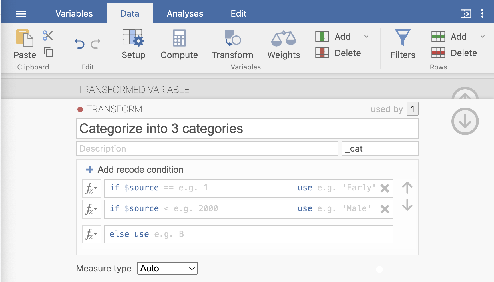
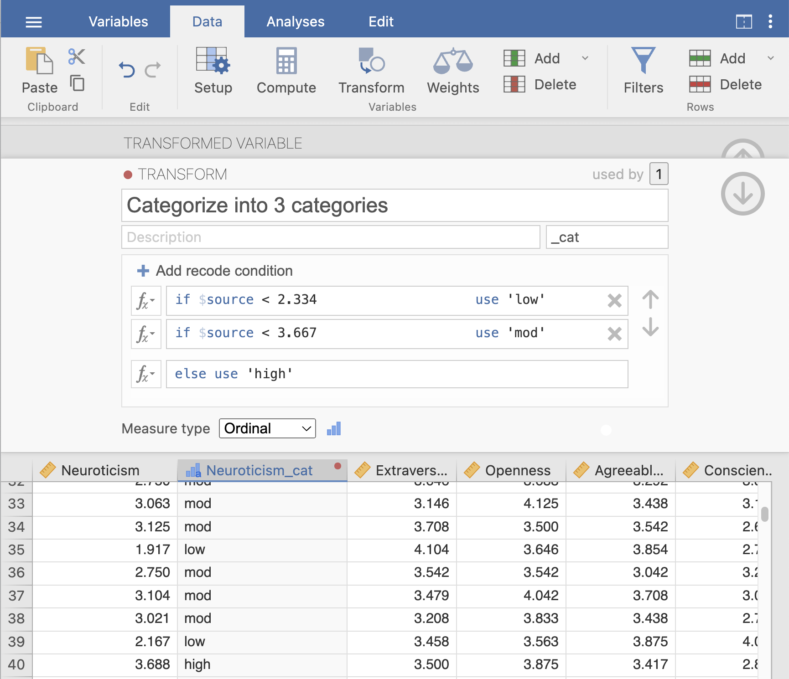
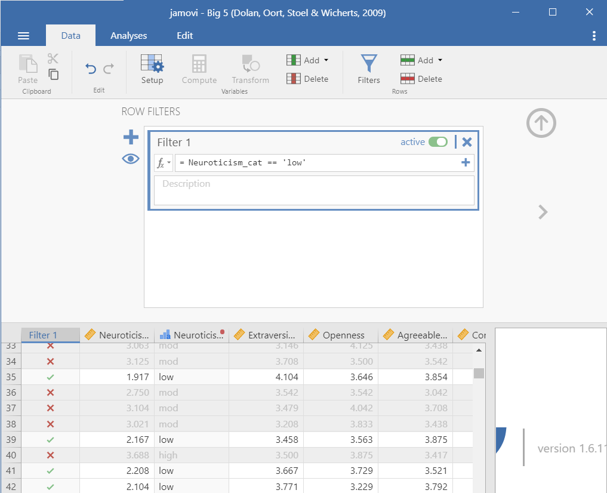
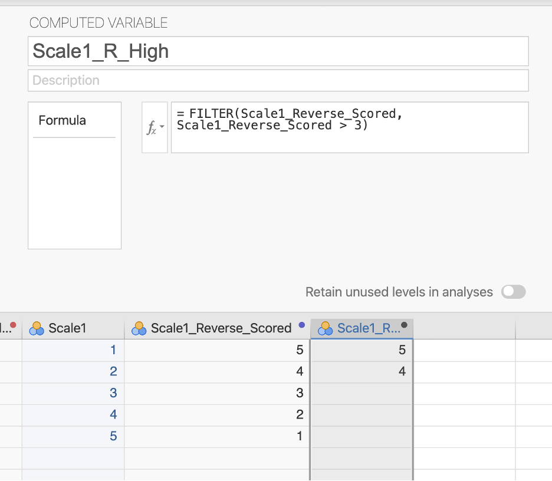

# 6. Cleaning data

There are four basic types of cleaning we will be learning about: checking your data is setup correctly, computing new variables, transforming variables, and using filters.

The following [video](https://www.youtube.com/watch?v=BGOZtlHRv6k) walks through some of these data cleaning techniques.


```{=html}
<div class="vembedr">
<div>
<iframe src="https://www.youtube.com/embed/BGOZtlHRv6k" width="533" height="300" frameborder="0" allowfullscreen="" data-external="1"></iframe>
</div>
</div>
```


## 6.1 Data setup

As previously mentioned, it's really important to check that the data types and measurement types of your variables are correct. You should open the Setup ({width="15"}) option under the Data tab to check.

When you're in Setup, here's the things you should be doing for all variables:

1.  Make sure the variable name is meaningful to you. You may also want to change it to something that will appear nicely in your data visualizations or tables (e.g., don't write `Q35` but rather `BDI_Score`).

2.  Add a description to your variable so you have more context. Maybe you write `Average score of all BDI items` for the description of your `BDI_Score` variable.

3.  Check your measurement level (i.e., nominal, ordinal, continuous, ID) and data type (i.e., integer, decimal, text) are correct.

4.  Specify if there is a code for missing values. Make sure the code *does not* match the code you use for actual variables! For example, if I have a variable that ranges from 0-10, then I wouldn't use 9 as a code for missing values; instead, I might use 99 or -9.

5.  Add labels to the categories in categorical variables. For example, the variable `Athlete` codes 0 for non-athlete and 1 for athlete. Rather than keeping just the 0 and 1, you can specify under Levels that 0 is non-athlete and 1 is athlete.

## 6.2 Compute

Sometimes you need to create new variables from your raw (meaning uncleaned) data. I recommend you watch this video by Alexander Swan on [computing variables in jamovi](https://youtu.be/_CqfI3eFqD4).

Perhaps you collected data on a scale that has five items. Normally, we create an average score of all the five items and that new *computed* average score is what we use in our analyses.

Let's open the Big 5 dataset built into jamovi. You can open this dataset by clicking the three horizontal lines on the top left of jamovi (the menu), choose Open, then select Data Library. In the main Data Library folder is a dataset called Big 5.

This dataset has the scores on all five subscales of the Big Five personality test. Let's imagine we want the average score of the entire Big Five test.

1.  Go to the Data tab in jamovi.

2.  Click `Compute`. Note that jamovi will create a new variable directly after the column you have selected. If you want this variable to be at the end of your dataset, you should select the last column of the dataset and then click Compute.

3.  Rename the computed variable to something meaningful (e.g., `Big5_Avg`)

4.  Add in an informative description for your computed variable (e.g., `Mean score of the Big 5 personality traits`)

5.  Click the $f_x$ (formula) button.

    1.  Under Functions, find the function we are computing. In this case it is `Mean` but sometimes scales want us to use `Sum`. These are the two functions we will primarily use in this course.

    2.  jamovi tells us more information about the particular formula function. In this case, it says `MEAN(*number1, number2, ..., ignore_missing=0, min_valid=0)`. Therefore, we need to specify the numbers we are calculating the mean for. The `ignore_missing` argument is defaulted to 0 (do not ignore missing values) but you could set it to 1 (ignore missing values). The `min_valid` argument is defaulted to 0 variables, but you could specify the minimum number of valid responses we want in order to calculate the function.

    3.  Double click on the function `Mean` to enter it into the formula box. You should see `=MEAN()` now.

    4.  Click inside the parentheses and double click the first variable of the Big 5. Then add a comma. Double click the second variable and add a comma. Repeat until you have all variables in the formula box.

6.  When you are complete, click outside of the function box and it will automatically create your computed variable.

<div class="warning">
<p>jamovi will often tell you if there is an error in your formula. For
example, if you get the warning “Column <code>NAME</code> does not exist
in the dataset” that means you entered something incorrect; typically,
you either mispelled a variable or forgot to separate variables with
commas.</p>
</div>

You can see what we need to do with this dataset below. There's actually no missing data, so the two additional arguments aren't necessary for us to worry about.


Note that this was creating an average score using the `MEAN()` function. Sometimes, psychological scales want you to create a total score using the `SUM()` function. jamovi also has a lot of other functions you may need to use in the future.

<div class="info">
<p>After computing a new variable, I always like to double check the
work to make sure it’s okay. I review to make sure if there is any
missing data that it’s appropriate (e.g., I specified min_valid=9 for a
10-item scale, so only people with at least 9 valid responses should
have a mean calculated). If I’m doing other basic math, I also like to
make sure that I specified it correctly by manually calculating a few
rows myself.</p>
</div>

If you'd like to learn more about computed variables in jamovi, [check out this jamovi blog post on the topic](https://blog.jamovi.org/2017/11/28/jamovi-formulas.html).

## 6.3 Transform

Sometimes we want to take an existing variable and transform it in some way or we want to do a computation across multiple variables (e.g., reverse-score multiple items in a dataset).

I recommend you watch this video by Alexander Swan on [transforming variables in jamovi](https://youtu.be/-duFdGa11kw).

If you want to learn more about transforming variables, [the jamovi blog has a great blog post on the topic](https://blog.jamovi.org/2018/10/23/transforming-variables.html).

### Recoding

Sometimes variables need to be recoded. As one example, if you have a text variable with many options, sometimes you want to recode things into a new variable with fewer options. This might mean taking something with 9 categories and collapsing them down to 3 overarching categories. The benefit of transforming through recoding is that you retain the original variable with the 9 categories but you also now have the new variable with 3 categories.

Let's return to the Big5 dataset and recode the Neuroticism scale into low, moderate, and high neuroticism. The scale ranges from 1-5, so I'm going to say that scores between 1-2.333 are low, 2.334 to 3.666 is moderate, and 3.667 to 5 is high.

1.  Go to the Data tab in jamovi and select the variable that you want to be transformed in the dataset. In this case, ensure `Neuroticism` is selected.

2.  Click `Transform`.

3.  Rename the transformed variable to something meaningful. I typically try to write it in such a way that it retains the old variable name. For example, we can transform the `Neuroticism` variable into the newly transformed variable `Neuroticism_cat` where "cat" stands for category.

4.  Ensure the correct Source variable is being used. The source variable is the variable that is being transformed; in this case it is `Neuroticism`.

5.  Under using transform, select `Create New Transform...` from the drop-down menu. If you have already created the transformation (e.g., you are applying the same transformation to multiple variables) then you can select the transformation from the drop-down menu instead.

Here's what it should look like prior to creating a new transformation:


6.  Rename the transformation to something meaningful. In this case we are categorizing into three categories so I might rename it `Categorize into 3 categories`

7.  Add a description if you desire.

8.  Specify the `Variable suffix`. This is what renames your transformed variable from something really annoying (e.g., Neuroticism - Categorize into 3 categories) into something succinct (e.g., Neuroticism_cat). In this case, the suffix would be `_cat`. This is particularly helpful if you are transforming multiple variables at once so they don't all have really long names.

9.  Select `Add recode condition` for n-1 recodings you are doing. In this case, we have 3 categories so we only need to specify 2 (3-1=2).

Your view should look something like this now:



10. We now need to specify the recode formulas. First, after the `if $source` statement we enter `< 2.334` and then in the `use` box we enter `'low'`. Note the usage of apostrophes (you can also use quotation marks) which tells jamovi this will be text data. If you don't wrap things in apostrophes and quotation marks, it will assume it is numeric information (of which you should be putting numbers containing 0-9)

11. For the second `if $source` statement we enter `<3.667` and then specify to use `'mod'`.

12. For the `else use` statement at the end, we enter `'high'` because we don't need to specify anything further. If it's not \<2.334 and not \<3.667 then its \>=3.667 which is all that's left in this particular data.

13. Specify the correct `Measure type`. jamovi automatically guessed that the data was ordinal, but I like to specify it just to be sure. Enter `ordinal` for our particular data since low \< mod \< high.

Your data should now look like this:



<div class="info">
<p>Just like with computing new variables, when transforming new
variables I like to peruse the newly transformed variable to make sure
it did what I expected. In this case I see that participant 35 has a
Neuroticism score of 1.917 which was correctly coded as low whereas
participant 40 has a Neuroticism score of 3.688 which was correctly
coded as high. A quick perusall makes me feel confident that I did my
transformation correctly!</p>
</div>

### Reverse-scoring

Sometimes items need to be reverse-scored because the items are in the opposite direction of the rest of the items in the particular scale or subscale.

Let's imagine we have a Happiness Scale with the following four items:

1.  I am happy.
2.  I am content.
3.  Life is overall positive.
4.  I am unhappy.

The happiness scale suggests that higher scores is higher happiness. However, the fourth item is opposite such that a person scoring higher on that item actually indicate lower happiness. Therefore, we would need to transform that item to reverse-score it such that it's in the same direction of all the items.

The way we do this is by recoding the levels so the highest score is the lowest score and so on. For example, if it were rated on a 5-point scale then you would need to recode so a 1 = 5, 2 = 4, 3 = 3, 4 = 2, and 5 = 1.

<div class="info">
<p>Alternatively, instead of transforming you could use compute where
the formula is the maximum value + 1 minus the value. For example, if
you have a 5-point scale then you would do “6-variablename” in the
computation box.</p>
</div>

We can use the same recoding feature as before to do this. The only difference is that we are going to use the double equal sign `==` (R is a bit weird in that we use `==` to mean `=`). See the screenshot below to see how we are specifying that if the source variable equals the value, then use the reverse-scored value. We should add 4 recode conditions in this case and then have the final else use value for the 5th category.


### Multiple transformations

Sometimes we want to do a transformation across multiple variables. Perhaps we have multiple items that need to be reverse-scored. Or maybe like in our first example above we want to use our previous `Low_mod_high` transformation to perform on *all* the subscales of the Big 5.

We can click a new variable (e.g., Openness), select Transform, rename the variable, and select the `Categorize into 3 categories` transformation we already used. Voila! The work we did previously can easily be used again in this analysis.

Alternatively, you can select all the variables at once that you want to transform and then specify the same transformation to be used across all four variables.

## 6.4 Filter

Sometimes we only want to analyze certain pieces of our data. We can filter by rows and by columns. [Check out this blog post by jamovi on more details of filters](https://blog.jamovi.org/2018/04/25/jamovi-filters.html).

### Row filters

Let's imagine we only want to analyze data from people who are low in neuroticism. We would create the following filter:



You'll notice in the dataset it will add a new column named `Filter 1` (the name of the filter) and there will either be an X or a green check mark indicating whether it's removed (X) or kept (check) in the analyses.

If you want to take off the filter, but keep it available, click on the filter column and toggle the green button on the top right from `active` to `inactive`. It will then grey out the column, meaning it's not being used.

A couple things to note:

-   Commonly, we want to specify the variable equals something. You would use the double equal sign: `==`

-   Another common thing you may want to specify is that the variable is *not* equal to something. You would use the following: `!=`

-   Otherwise you should be familiar with the other operations from previous math courses: `<`, `>`, `<=`, `>=`

### Column filters

Column filters are useful when you want to use a filter for *some* but not all of your analyses. Rather than creating a filter, we need to compute a new variable using the `FILTER()` function.

For example, we learned how to reverse score our hypothetical happiness item above. We could then say we only want people who are high in that variable for another analysis. We could apply a column filter that is `FILTER(Scale1_Reverse_Scored, Scale1_Reverse_Scored > 3)` .


