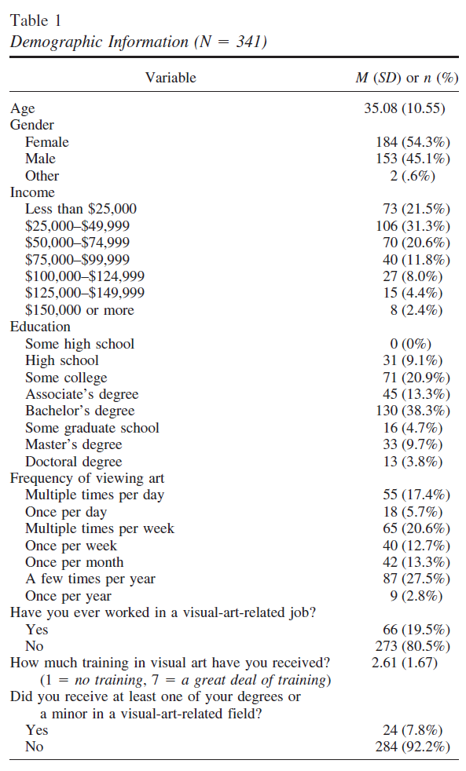

# 4. Describing Data in jamovi

In this chapter, we begin describing our data using statistical summaries.

In Chapter 2, we learned what descriptive statistics are and why they matter. In Chapter 3, we learned how to set up and navigate data in jamovi. Now, we will bring those together and begin using jamovi to describe our data.

By the end of this chapter, you should be able to:

-   Generate descriptive statistics in jamovi
-   Choose appropriate descriptive statistics based on variable type
-   Interpret measures of center and variability
-   Write up descriptive statistics clearly

------------------------------------------------------------------------

## 4.1 Describing continuous variables

We will start by describing **continuous variables**, such as test scores, age, or reaction time.

### Running descriptive statistics in jamovi

To generate descriptive statistics:

1.  Click **Exploration**
2.  Select **Descriptives**
3.  Move your variable into the **Variables** box

Once you do this, jamovi will automatically generate output.

In the options panel, you can select which statistics to display.

For most purposes, you should include:

-   **Mean**: the average value
-   **Median**: the middlemost value
-   **Standard deviation**: average spread around the mean
-   **Variance**: squared spread
-   **Minimum and maximum**: the lowest and highest values, respectively
-   **N (sample size)**: the total number of observations

You may also include:

-   **Skewness**: the shape of the tail of the distribution
-   **Kurtosis**: the shape of the height of the distribution

------------------------------------------------------------------------

### Interpreting the output

Once you run the analysis, jamovi will provide a table of descriptive statistics.

When interpreting a continuous variable, focus on:

-   **Center** such as mean or median
-   **Variability** such as standard deviation or variance
-   **Range** such as the highest and lowest values

You can ask yourself the following questions to understand the distribution of the data:

-   Are the mean and median similar, which suggests a more normal distribution?
-   Are the values tightly clustered or widely spread out?
-   Are there potential outliers?
-   Do the highest and lowest values make sense based on the dataset?

This information is often used to write-up results in APA Style. For example:

> The average test score was 78.4 (SD = 10.2), with scores ranging from 52 to 95.

This tells us:

-   the typical score (mean)
-   how spread out scores are (SD)
-   the range of observed values

I recommend you watch this video by Alexander Swan on [how to describe continuous data in jamovi](https://youtu.be/oVE0nxJ0J44).

------------------------------------------------------------------------

## 4.2 Describing categorical variables

Now let’s describe **categorical variables**, such as gender, major, or condition.

### Running frequencies in jamovi

To describe categorical variables:

1.  Click **Exploration**
2.  Select **Descriptives**
3.  Move your variable into the **Variables** box
4.  Select the **Frequency tables** check box

------------------------------------------------------------------------

### Interpreting output

Example:

| Category | Count | Percent |
|----------|-------|---------|
| Yes      | 45    | 56.3%   |
| No       | 35    | 43.8%   |

Interpretation:

> 56.3% of participants responded “Yes,” while 43.8% responded “No.”

**Key reminder**

For categorical variables:

-   We do **not** calculate means or standard deviations
-   We describe how often each category occurs
-   A statistics table will be provided, but as the variable is categorical it will only provide N and Missing, as the other statistics are used for continuous variables

I recommend you watch this video by Alexander Swan on [how to describe categorical data in jamovi](https://youtu.be/eGdkYZbljbQ).

------------------------------------------------------------------------

## 4.3 Describing a continuous variable by a categorical variable

Often, we want to describe a continuous variable **across groups**.

Example:

-   Test scores by condition
-   Stress levels by major

------------------------------------------------------------------------

### Running grouped descriptives

In **Descriptives**:

1.  Click **Exploration**
2.  Select **Descriptives**
3.  Place your continuous variable in the **Variables** box
4.  Place your categorical variable in the **Split by** box

------------------------------------------------------------------------

### Interpreting output

jamovi will now provide descriptive statistics **for each group separately**.

This allows you to compare:

-   group means
-   group variability
-   sample sizes

For example:

> Students in the intervention group scored higher (M = 82.3, SD = 8.5) than students in the control group (M = 75.6, SD = 11.2).

::: {.warning data-latex=""}
Descriptive statistics are not inferential statistics. We can describe differences—but we are not yet testing whether those differences are statistically significant. That comes later. Be careful that you write up descriptive statistics as simply *describing* the data and not making causal inferences.
:::

------------------------------------------------------------------------

## 4.4 Choosing the right descriptive statistics

Not all statistics are appropriate for all variables.

Here is a quick reminder from Chapter 2. The type of variable determines:

-   what statistics you can compute
-   how you interpret the results

This is why correctly setting your variable type in jamovi (Chapter 3) is so important.

| Variable Type | What to Report           |
|---------------|--------------------------|
| Continuous    | Mean, median, SD, range  |
| Ordinal       | Median, frequencies      |
| Nominal       | Frequencies, percentages |

------------------------------------------------------------------------

## 4.5 Writing up descriptive statistics

Being able to compute statistics is not enough—you also need to communicate them clearly.

------------------------------------------------------------------------

### Basic format (continuous variable)

> *M* = *, SD =*

Example:

> Participants reported moderate stress levels (M = 3.45, SD = 0.82).

------------------------------------------------------------------------

### Including range

> Scores ranged from \_\_\_ to \_\_\_

------------------------------------------------------------------------

### Group comparisons

> Group A (*M* = , *SD* = ) scored higher/lower than Group B (*M* = , *SD* = ).

------------------------------------------------------------------------

### Tips

-   Always include **units** (e.g., test scores, minutes, ratings)
-   Round consistently (typically 2 decimal places)
-   Be clear and concise

### Examples from the literature

In small examples, we might write-up our descriptive statistics into a paragraph[^04-descriptive-statistics-1] (note: I also describe an independent t-test and a chi-square test of independence in this paragraph):

[^04-descriptive-statistics-1]: This comes from [Wanzer (2017) Developmentally appropriate evaluations: How evaluation practices differ across age of participants](https://thesiscommons.org/bk57d/)

{width="602"}

In examples with many variables, we might write-up our descriptive statistics into a table[^04-descriptive-statistics-2]:

[^04-descriptive-statistics-2]: This comes from [Wanzer et al. (2020) Experiencing flow while viewing art: Development of the aesthetic experience questionnaire](https://psycnet.apa.org/record/2018-49650-001)

{width="400"}

------------------------------------------------------------------------

## 4.6 Common mistakes

Here are a few common mistakes to avoid:

-   Reporting means for categorical variables
-   Ignoring variability (only reporting the mean)
-   Misinterpreting skewed data
-   Forgetting to report sample size
-   Not checking your data before analysis

------------------------------------------------------------------------

## 4.7 Looking ahead

In this chapter, we focused on summarizing data numerically.

In the next chapter, we will learn how to **visualize data** using graphs, which can often reveal patterns that numbers alone cannot.

Together, descriptive statistics and visualizations provide a complete picture of your data.
