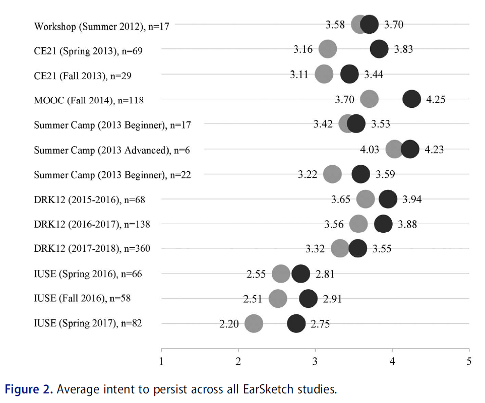
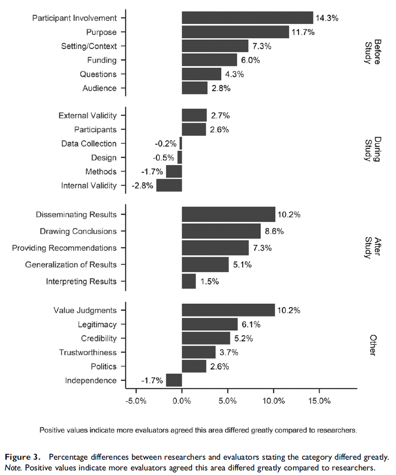

# 5. Visualizing data in jamovi

In Chapter 4, we described data using numerical summaries such as means and standard deviations. In this chapter, we will describe data using **visualizations**.

Graphs allow us to see patterns in our data that may not be obvious from numbers alone. They are an essential part of understanding and communicating statistical results.

By the end of this chapter, you should be able to: - Choose an appropriate graph based on variable type\
- Create visualizations in jamovi\
- Interpret what a graph shows\
- Identify common issues in graphs

## 5.1 Why visualize data?

In Chapter 4, we described data using numbers such as means, standard deviations, and percentages. While these summaries are essential, they do not always tell the full story.

You have likely heard the phrase, *“a picture is worth a thousand words.”* This is especially true in statistics. A well-designed graph can often communicate patterns in data more quickly and clearly than a table of numbers or a written paragraph.

Visualizations can help you:

-   See the **shape** of a distribution (e.g., symmetric or skewed)
-   Identify **outliers** or unusual values
-   Understand **variability** and spread
-   Detect patterns or trends that are not obvious from numerical summaries

For example, two datasets can have the same mean and standard deviation but look very different when graphed. Without a visualization, those differences might go unnoticed.

------------------------------------------------------------------------

### Visualizations in practice

Visualizations are not just helpful for your own understanding—they are also essential for communicating results to others.

In research and professional settings:

-   Journal articles often have **word or page limits**
-   Reports need to be **clear and efficient**
-   Audiences may not have strong statistical backgrounds

A single well-designed graph can:

-   summarize large amounts of information
-   highlight key findings
-   make results more accessible to a broader audience

Because of this, visualizations are commonly used alongside (or sometimes instead of) detailed numerical summaries.

------------------------------------------------------------------------

### Key takeaway

Descriptive statistics and visualizations work together:

-   **Statistics** provide precise numerical summaries
-   **Visualizations** provide an overall picture of the data

Using both allows you to better understand and communicate your results.

::: {.info data-latex=""}
**Remember: it is incredibly important to always visualize your data!** You never know what descriptive statistics may be hiding.
:::

Here's a [video](https://www.youtube.com/watch?v=d2wU0kmCJEY) walking through why it's so important to look at your data.


```{=html}
<div class="vembedr">
<div>
<iframe src="https://www.youtube.com/embed/d2wU0kmCJEY" width="533" height="300" frameborder="0" allowfullscreen="" data-external="1"></iframe>
</div>
</div>
```


## 5.2 Choosing the right graph

The type of graph you use depends on the type of variable(s) you are working with.

| Variable Type            | Graph                            |
|--------------------------|----------------------------------|
| Continuous               | Histogram, density plot, boxplot |
| Categorical              | Bar chart                        |
| Continuous + categorical | Bar chart, line chart, boxplot   |
| Continuous + continuous  | Scatter plot, line chart         |

Choosing the correct graph is just as important as choosing the correct statistical test.

Want to learn more about choosing the right chart? [Chart Chooser](https://www.highcharts.com/chartchooser/) provides a useful tutorial for choosing charts based on your variable type and objective.

jamovi has some plots built into its platform, both under the `Plots` drop-down menu in the `Descriptives` analysis and as options for many of the inferential statistical analyses.

We'll learn more about how to choose and conduct better data visualizations later, but for now here are some recommended visualizations depending on what you are trying to do. Note that we will do most of our visualizations in jamovi, but we may also learn how to visualize data via Excel. There are also excellent LinkedIn Learning courses on data visualization in Excel and other tools that I strongly recommend; they are free for you if you are a UW-Stout student.

## 5.1 Visualizing a single continuous variable

As described above, a **histogram** and/or **density plot** is one of the best ways to visualize a single continuous variable. Both are useful for seeing the overall distribution of your data and to help check for normality. Which should you use? I think they're both pretty great, and in fact you can combine the two to have a histogram plot with a density overlay. I like this option best because it presents more information and better lets us see if the if the density curve looks normally distributed.

### Creating a histogram in jamovi

1.  Go to **Exploration → Descriptives**
2.  Move your variable into the **Variables** box
3.  Under *Plots*, select **Histogram** and/or **Density**

When interpreting a histogram or density plot, look for:

-   **Shape**: Is the distribution symmetric or skewed?

-   **Center**: Where are most values located?

-   **Variability**: How spread out are the values?

-   **Outliers**: Are there unusually high or low values?

Histograms help you visually understand: - mean and median (center) - standard deviation (spread) - skewness (shape)

## 5.2 A categorical variable

For this you would choose the single option under **Bar Plots**: `Bar plot`. It will simply show the frequencies of a categorical variable.

## 5.3 A continuous variable split by a categorical variable

There are three options under **Box Plots**: `Box plot`, `Violin` (which is really a density plot with its mirror image!), `Data` (which can be Jittered or Stacked; I prefer Jittered so you can see the density of data points really well), and `Mean`. Personally, I love checking all four boxes! This gives you the best of all of them: the distribution of your data with the `Violin` option, the quartiles and mean with the `Box plot` option, a visualization of all your data points using the `Data` option, which is really useful because the other two options can be *hiding* weird things in your data, and what the `Mean` is.

## 5.4 Expanding your data visualization

Although these can be useful plots, I often do most of my data visualizations in other platforms. For most of my work, I use Excel because I find it pretty easy to make beautiful graphs. Here's an example of a visualization I made in Excel[^05-visualizing-data-1]:

[^05-visualizing-data-1]: This comes from [Wanzer et al. (2020) Promoting intentions to persist in computing: An examination of six years of the EarSketch program](https://doi.org/10.1080/08993408.2020.1714313)



For some more complicated figures, I turn to the `ggplot2` package in R. Here's an example of a visualization I made in R[^05-visualizing-data-2]:

[^05-visualizing-data-2]: This comes from [Wanzer (2020) What is evaluation? Perspectives of how evaluation differs (or not) from research](https://journals.sagepub.com/doi/10.1177/1098214020920710)


