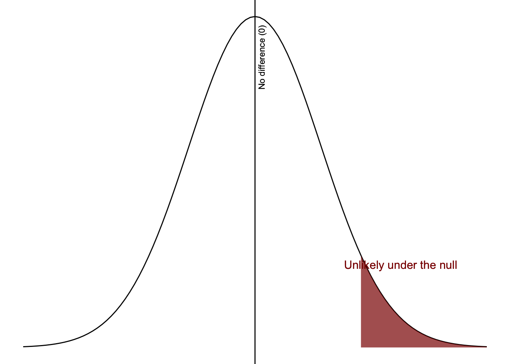
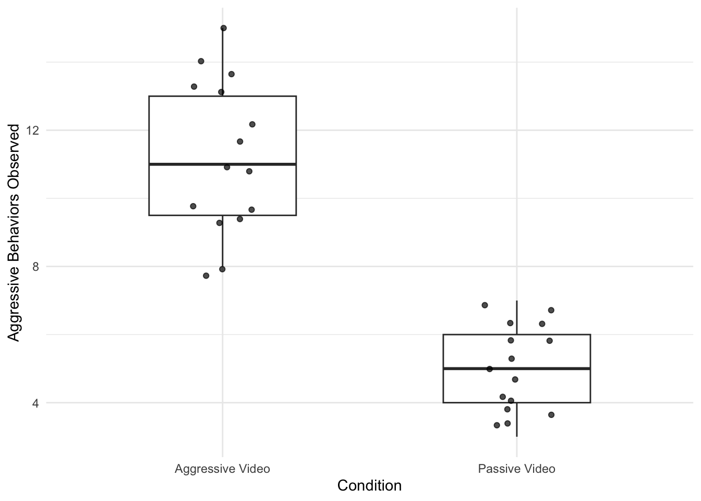

# (PART) NHST {.unnumbered}

# 7. Hypothesis Testing

In previous chapters, we focused on understanding, describing, visualizing, and cleaning our data. These steps are essential—but they are not the end goal.

Often, we want to go one step further:

> Can we use our sample data to make conclusions about a larger population?

This is the goal of **inferential statistics**.

In Chapter 2, we introduced the distinction between:

-   **Descriptive statistics**: summarize our sample
-   **Inferential statistics**: make conclusions about a population

In this chapter, we introduce the logic of **hypothesis testing**, also known as **null hypothesis significance testing (NHST)**.

------------------------------------------------------------------------

### One process, many tests

Although there are many statistical tests (t-tests, ANOVAs, correlations, etc.), they all follow the same basic process:

1.  **Look at the data**
2.  **Check assumptions**
3.  **Perform the test**
4.  **Interpret the results**

> This 4-step framework will be used in *every inferential statistics chapter moving forward*.

Each test differs in *how* we perform Step 3 and what assumptions we check in Step 2—but the overall logic stays the same.

------------------------------------------------------------------------

### Running example: Bobo doll replication

Let’s walk through this process using a hypothetical example.

Imagine a researcher wants to replicate Albert Bandura’s famous **Bobo doll experiment**. In this replication study, the researcher randomly assigns 30 six-year-old children to one of two conditions:

-   One group watches a video of an adult behaving **aggressively** toward a Bobo doll
-   The other group watches a video of an adult playing **passively** with the Bobo doll

After watching their assigned video, children are placed in the same room with a Bobo doll. Researchers then observe and record the children’s **aggressive behaviors**.

::: callout-note
The original study design was more complex than this simplified version. It accounted for factors like baseline aggression and gender. If you are interested, you can read more here: <https://www.simplypsychology.org/bobo-doll.html>
:::

::: callout-note
This example is an instance of an **independent samples t-test** (comparing two groups on a continuous outcome).

You are not expected to fully understand this test yet—we will return to it in a later chapter. For now, focus on the overall process of hypothesis testing.
:::

------------------------------------------------------------------------

### What you will learn

By the end of this chapter, you should be able to:

-   Understand the logic of hypothesis testing
-   Apply the 4-step framework
-   Interpret p-values and statistical significance
-   Understand effect size and power at a conceptual level

> This chapter provides the foundation for all inferential statistics you will learn next.

## 7.1 Step 1: Look at the data

The first step in any inferential analysis is to understand your data and your research question.

Before running any statistical test, you should be able to clearly describe what you are studying and how your data are structured.

------------------------------------------------------------------------

### Identify your variables

You should always be able to answer:

-   What is my IV?
-   What is my DV?
-   What type of variables are these (categorical vs continuous)?
-   What is my research design?

These decisions will determine which statistical test you use later.

Using our Bobo doll example:

-   **Independent variable (IV)**: Type of video (either aggressive or passive). This is an example of a categorical variable; more specifically, it is a binary nominal variable.
-   **Dependent variable (DV)**: Number of aggressive behaviors observed. This is an example of a continuous variable.
-   **Research design**: This is an example of a between-subjects research design. Children were randomly assigned to one or the other type of video.

------------------------------------------------------------------------

### Describe your data

Before performing any inferential test, you should:

-   Examine **descriptive statistics** (e.g., means, variability)
-   Look at **visualizations** (e.g., histograms, boxplots)

------------------------------------------------------------------------

#### What might the dataset look like?

In jamovi (or any statistical software), your data are organized in a spreadsheet format:

-   Each **row** represents a participant (in this case, child)
-   Each **column** represents a variable

Here is a small example of what the dataset might look like for our study:

| Child_ID | Condition        | Aggressive_Behavior_Count |
|----------|------------------|---------------------------|
| 1        | Aggressive_Video | 12                        |
| 2        | Aggressive_Video | 9                         |
| 3        | Aggressive_Video | 15                        |
| 4        | Passive_Video    | 4                         |
| 5        | Passive_Video    | 6                         |
| 6        | Passive_Video    | 3                         |

-   **Child_ID**: a unique identifier for each participant
-   **Condition**: the independent variable (which video they watched)
-   **Aggressive_Behavior_Count**: the dependent variable (number of aggressive behaviors observed)

------------------------------------------------------------------------

#### Describe the data

Before running any statistical test, we would:

-   Check for unusual values or patterns
-   Compare the **average aggressive behavior** in each group
-   Look at how much the scores vary within each group

Suppose we calculate descriptive statistics for the full dataset (all 30 children):

| Condition        | Mean Aggression | Standard Deviation | Sample Size |
|------------------|-----------------|--------------------|-------------|
| Aggressive_Video | 11.20           | 3.10               | 15          |
| Passive_Video    | 5.40            | 2.80               | 15          |

What do we notice?

-   Children in the **aggressive video condition** show higher average aggression
-   There is some variability in both groups
-   The groups appear meaningfully different at first glance

> In this example, it looks like children in the aggressive condition tend to show higher aggression—but we don’t yet know if that difference is meaningful or just due to chance.

This connects directly to what you learned in:

-   Chapter 2 (describing data)
-   Chapter 4 (descriptive statistics in jamovi)
-   Chapter 6 (cleaning your data)

You are making sure your data make sense and that you understand them before analyzing them.

------------------------------------------------------------------------

### State your hypotheses

As part of understanding your research question, we need to clearly state our hypotheses.

Because we are using **null hypothesis significance testing (NHST)**, we define two hypotheses:

-   the **alternative hypothesis**
-   the **null hypothesis**

These two hypotheses work together to represent all possible outcomes of our study.

------------------------------------------------------------------------

#### Alternative hypothesis (H₁ or Hₐ)

The **alternative hypothesis** states that there is an effect, difference, or relationship.

In our Bobo doll example:

> Children who watch the aggressive video will exhibit *more* aggressive behaviors than children who watch the passive video.

This reflects what the researcher expects to find based on theory and prior research on observational learning.

------------------------------------------------------------------------

#### Null hypothesis (H₀)

The **null hypothesis** states that there is **no effect, no difference, or no relationship**.

In our example:

> There will be no difference in aggressive behavior between children who watch the aggressive video and those who watch the passive video.

::: callout-note
A helpful way to remember this: **Null = none (or zero effect)**
:::

When we use **non-directional (two-tailed)** hypotheses, the null hypothesis is simply “no difference.”

However, when we use **directional (one-tailed)** hypotheses, the null hypothesis becomes slightly broader—it includes both "no difference, or the opposite direction of the predicted effect."

We will return to this idea below.

------------------------------------------------------------------------

#### How the hypotheses work together

The null and alternative hypotheses must be:

-   **Mutually exclusive** → a result cannot support both
-   **Exhaustive** → all possible outcomes are covered

This means:

-   Every possible result must support either the null or the alternative
-   There is no “in-between” option

::: callout-warning
A common error is writing hypotheses that are not mutually exclusive or not exhaustive.

-   If a result could support both hypotheses → they are not mutually exclusive
-   If a result fits neither hypothesis → they are not exhaustive
:::

------------------------------------------------------------------------

#### Directional vs non-directional hypotheses

In this example, the hypothesis is **directional**: We predict that one group will show *more* aggressive behavior than the other. This is also called a **one-tailed hypothesis**.

If we did not predict a direction, we would use a **non-directional (two-tailed)** hypothesis. For example, we might predict there is a difference in aggressive behavior between groups without specifying which group is higher.

When we use a directional hypothesis, the alternative hypothesis specifies one direction of the effect. To ensure the hypotheses remain **exhaustive**, the null hypothesis must include everything else.

In our example:

-   **Alternative (H₁):** Children in the aggressive condition show *more* aggressive behavior
-   **Null (H₀):** Children in the aggressive condition show *no difference* or *less* aggressive behavior

This ensures that all possible outcomes are covered:

-   More aggression → supports the alternative
-   No difference → supports the null
-   Less aggression → also supports the null

> Together, the null and alternative hypotheses must account for every possible result. This ensures the hypotheses are *exhaustive*

::: callout-note
Directional hypotheses should be used thoughtfully. They require stronger theoretical justification because you are predicting a specific direction of the effect.

At the same time, directional hypotheses can increase **statistical power**, meaning you may be more likely to detect a real effect if it exists. We will return to this idea later in the textbook.
:::

Before we formally test our hypotheses, we need to ensure that our data meet the assumptions required for the statistical test.

------------------------------------------------------------------------

#### Check your understanding

1.  What is the difference between the null and alternative hypothesis?
2.  What does the null hypothesis always represent?
3.  In the Bobo doll example, what is the alternative hypothesis?
4.  What is the difference between directional and non-directional hypotheses?\

::: {.callout-answer collapse="true"}
1.  The null hypothesis states no effect; the alternative states there is an effect
2.  No effect, no difference, or no relationship
3.  That children who watch the aggressive video will show more aggressive behavior
4.  Directional specifies the direction of the effect; non-directional does not
:::

## 7.2 Step 2: Check assumptions

Before performing a statistical test, we need to check whether our data meet certain **assumptions**. Statistical tests are built on certain expectations about the data. These expectations are called **assumptions**.

> Assumptions are conditions that must be reasonably met for the results of a statistical test to be valid.

------------------------------------------------------------------------

### Why assumptions matter

If assumptions are not met:

-   The results of the test may be inaccurate or misleading
-   We may need to use a different version of the test
-   Our conclusions may not be trustworthy

> Good data analysis is not just about running a test—it is about making sure the test is appropriate for the data.

------------------------------------------------------------------------

### Common assumptions

Most statistical tests rely on a few key assumptions:

------------------------------------------------------------------------

#### Normality

This refers to the **shape of the distribution**.

-   Are the data roughly bell-shaped?
-   Are there extreme skewed values?

This connects back to **Distribution shape** which you learned about in Chapter 2.

------------------------------------------------------------------------

#### Homogeneity of variance

This refers to **variability across groups**.

-   Do the groups have similar levels of spread?
-   Is one group much more variable than the other?

This connects back to **Variability and dispersion** which you learned about in Chapter 2.

------------------------------------------------------------------------

#### Independence

This refers to how the data were collected.

-   Are observations independent of each other?
-   Does one participant’s score influence another’s?

This is determined by the **study design**, not just the data.

------------------------------------------------------------------------

These assumptions connect directly to ideas from earlier chapters, particularly distribution shape and variability (Chapter 2). When assumptions are violated, the results of a statistical test may be misleading, which is why checking assumptions is a critical step before performing any analysis.

------------------------------------------------------------------------

### Connecting to our example

In the Bobo doll study:

-   **Normality** → Are aggressive behavior scores roughly normally distributed?
-   **Homogeneity** → Is variability similar between the aggressive and passive conditions?
-   **Independence** → Each child is observed separately, so scores should be independent.

::: callout-note
In this chapter, we focus on understanding *what* assumptions are and *why they matter*.

We will learn how to formally check assumptions in **Chapter 9**.
:::

Once assumptions are reasonably met, we can move forward with formally evaluating our hypotheses.

------------------------------------------------------------------------

### Check your understanding

1.  What are statistical assumptions?
2.  Why is it important to check assumptions before running a test?
3.  What does normality refer to?
4.  What does homogeneity of variance refer to?
5.  What does independence refer to?

::: {.callout-answer collapse="true"}
1.  Conditions that must be met for a statistical test to be valid
2.  Because violations can lead to inaccurate or misleading results
3.  The shape of the distribution of the data
4.  Whether groups have similar variability
5.  Whether observations are independent of each other
:::

## 7.3 Step 3: Perform the test

Now that we understand our data, have clearly stated our hypotheses, and checked assumptions, we are ready to perform the statistical test.

This is where we formally evaluate our hypotheses.

The core question in hypothesis testing is:

> How large does a difference need to be before we consider it “real” rather than just due to chance?

In our Bobo doll example, we observed:

-   Mean aggression (Aggressive condition) = 11.20
-   Mean aggression (Passive condition) = 5.40

That’s a difference of **5.80 aggressive behaviors**.

At first glance, that seems meaningful—but we need to ask:

> Is this difference large enough that we would *not expect it to happen by chance* if there were truly no difference between groups?

------------------------------------------------------------------------

### “Close enough to zero” vs “too far from zero”

If the null hypothesis is true, the true difference between groups is **0**. But in real data, we almost never observe an exact difference of 0. So instead, we ask:

-   Which differences are **close enough to 0** that we treat them as “no difference”?
-   Which differences are **far enough from 0** that we consider them meaningful?

This creates a boundary between:

-   **Not surprising (consistent with the null)**
-   **Surprising (unlikely under the null)**

------------------------------------------------------------------------

### Alpha (α): where we draw the line

We define this boundary using **alpha (α)**. Most commonly, we set **α = .05**, although there might be reasons you change your alpha level (see Chapter 8).

Alpha represents our threshold for what we consider “surprising.”

> Values that fall in the most extreme 5% of possible outcomes (assuming the null is true) are considered unlikely enough that we reject the null hypothesis.

We can visualize this idea using a distribution centered at 0 (which represents the null hypothesis of no difference). Most possible differences fall near 0 and are considered **not surprising**. Values farther away from 0 are more unusual.

Alpha (α = .05) defines the boundary between:

-   results that are **likely under the null hypothesis**
-   results that are **unlikely under the null hypothesis**

The shaded 5% region in the figure represents results that are unlikely if the null hypothesis is true. This boundary corresponds to a \*\*cutoff value\*\*—the point at which a result becomes “surprising enough” that we would reject the null hypothesis. In practice, this cutoff is expressed in terms of the \*\*difference we observe in our data\*\*.

::: callout-note
This particular figure only has the shaded region on the right side of the distribution because we had a one-tailed hypothesis. If we had a non-directional, two-tailed hypothesis, the shaded region would be 2.5% of the left tail and 2.5% of the right tail.
:::

If our observed result falls in this region, it is considered unlikely enough that we would reject the null hypothesis.

(\#fig:unnamed-chunk-1)Conceptual illustration of alpha and the critical region

::: callout-note
### A quick note on how this used to be done

Before statistical software was widely available, researchers often analyzed data by hand.

They would:

-   Determine the **critical region** based on:
    -   the alpha level (e.g., .05)
    -   the sample size
    -   whether the hypothesis was **directional (one-tailed)** or **non-directional (two-tailed)**
-   This process produced a **cutoff value** (called a *critical value*)
-   Then they would compare that cutoff to their observed result

------------------------------------------------------------------------

In our example, we observed a mean difference of **5.80 aggressive behaviors**.

Researchers would ask:

> Does this observed difference fall into the “unlikely” (critical) region?

-   If it **does** → the result is statistically significant (**p \< .05**)
-   If it **does not** → the result is not statistically significant (**p ≥ .05**)

------------------------------------------------------------------------

Today, we no longer need to do this by hand.

Statistical software (like jamovi) calculates the **exact p-value**, which tells us directly:

> How likely our result is under the null hypothesis

This allows us to make more precise decisions without relying on tables or cutoff values.
:::

------------------------------------------------------------------------

### The p-value: how surprising are our results?

Once we run the statistical test, we obtain a **p-value**.

> The p-value tells us how likely our results would be if the null hypothesis were true.

In our example:

-   If the p-value is very small → our observed difference is unlikely under the null
-   If the p-value is large → our observed difference is plausible under the null

::: callout-warning
A p-value is **NOT** the probability that the null hypothesis is true.

It is the probability of the observed data (or more extreme data) assuming the null hypothesis is true.
:::

We compare the p-value to our alpha level:

-   If **p \< α** → the result is **statistically significant**
-   If **p ≥ α** → the result is **not statistically significant**

This comparison is what we will use in Step 4 to make our decision.

------------------------------------------------------------------------

### Effect size: how big is the effect?

Even if a result is statistically significant, we still need to ask how large is the difference. That’s what **effect size** tells us.

In our example: How much more aggressive are children in the aggressive condition compared to the passive condition?

In this case, we would get a **Cohen's d** effect size, which is the type of effect size used for comparing group differences. There are other effect sizes (e.g., r, eta-squared, phi) that you'll learn throughout the various inferential statistics.

In our study, given the descriptive statistics from earlier, we would calculate a **Cohen's d of about 1.97**. That means the difference between groups is almost **two standard deviations**, which would typically be considered a **large effect**.

This suggests that the difference in aggressive behavior between the two groups is substantial.

It is important to note that effect sizes this large are relatively uncommon in many real-world studies. Often, effects are smaller and more subtle, which makes interpreting both statistical and practical significance especially important.

::: callout-note
Effect size interpretations (small, medium, large) are only rough guidelines.

What counts as “meaningful” always depends on the context, theory, and application.

We will revisit effect sizes in more detail in Chapter 8.
:::

Statistical significance tells us whether an effect is unlikely to be due to chance.

**Practical significance asks: does this effect actually matter in the real world?**

In this case:

-   A difference of nearly **6 aggressive behaviors** is quite large\
-   The effect size (d ≈ 1.97) indicates strong separation between the groups

> This would likely be considered both **statistically significant** and **practically meaningful**

> Statistical significance tells us *if* an effect exists.\
> Effect size tells us *how much it matters*.

Even a **small effect size** can be practically important depending on the context.

For example:

-   A small improvement in a medical treatment could save lives
-   A small increase in graduation rates could affect thousands of students
-   A small reduction in harmful behavior could have meaningful long-term impact

Conversely, even a large effect might not be important if:

-   it has little real-world consequence
-   it is not meaningful in context

> Effect size helps us move beyond “Is there an effect?” to **“How much does this effect actually matter?”**

------------------------------------------------------------------------

### Power: how likely are we to detect a real effect?

Another important idea is **statistical power**.

> Power is the ability of a test to detect a real effect if one exists.

Power matters because:

-   Low power → we may miss real effects
-   High power → we are more likely to detect real effects

Power depends on:

-   sample size
-   effect size
-   variability in the data

::: callout-note
Directional (one-tailed) hypotheses can increase power, which is one reason they must be theoretically justified.

We will explore power in more detail in Chapter 8 (BEAN).
:::

Now that we have our statistical results, we can interpret what they mean in relation to our research question.

------------------------------------------------------------------------

### Check your understanding

1.  What is the main question hypothesis testing is trying to answer?
2.  What does alpha (α) represent?
3.  What does a p-value represent?
4.  What is the difference between statistical significance and effect size?
5.  What is statistical power?

::: {.callout-answer collapse="true"}
1.  Whether the observed results are likely if the null hypothesis is true
2.  The threshold for what we consider a surprising result
3.  The likelihood of the observed data (or more extreme data) under the null hypothesis
4.  Statistical significance tells us if an effect exists; effect size tells us how large it is
5.  The ability of a test to detect a real effect
:::

## 7.4 Step 4: Interpret the results

After performing the statistical test, the final step is to interpret the results and make a decision about our hypotheses. This is the point where we take the output from the test and turn it into a meaningful conclusion about our research question.

### Interpret the results

To make a decision, we compare the p-value to our alpha level (α = .05). If the p-value is less than .05, we reject the null hypothesis. If the p-value is greater than or equal to .05, we fail to reject the null hypothesis.

It is important to use this language carefully. We either **reject** the null hypothesis or **fail to reject** the null hypothesis. We do not say that we “accept” the null hypothesis. This is because hypothesis testing is designed to evaluate evidence against the null hypothesis. If we do not have strong enough evidence to reject it, that does not mean the null is true; it simply means we do not have enough evidence against it.

Returning to our Bobo doll example, we observed a mean difference of 5.80 aggressive behaviors between the two conditions. In Step 3, we learned that the test result was **p \< .001**. Because this p-value is smaller than our alpha level of .05, the result is statistically significant and we reject the null hypothesis.

In context, this means that children who watched the aggressive video exhibited more aggressive behavior than children who watched the passive video. In other words, the observed difference is unlikely to have occurred by chance alone if there were truly no difference between the groups.

Of course, statistical significance is only part of the story. We also found that **Cohen’s *d* ≈ 1.97**, which is a very large effect. This tells us that the difference is not only statistically significant, but also substantial in size. A difference of nearly six aggressive behaviors would likely be considered practically meaningful in this context. More broadly, practical significance asks whether an effect matters in the real world, not just whether it crosses a statistical threshold.

### Type I vs. Type II errors

Because we are making decisions under uncertainty, it is always possible to make the wrong decision.

A **Type I error** occurs when we reject the null hypothesis even though it is actually true. In our example, this would mean concluding that the aggressive video increases aggression when in reality it does not. The probability of making a Type I error is equal to our alpha level, which is typically 5%.

A **Type II error** occurs when we fail to reject the null hypothesis even though it is false. In our example, this would mean concluding that there is no difference in aggression when the aggressive video really does increase aggressive behavior.

These two types of errors help us understand why hypothesis testing involves judgment and uncertainty rather than absolute certainty. They also connect back to **power**, which we introduced in Step 3. Higher power means we are more likely to detect a real effect and less likely to make a Type II error.

### APA write-up

When writing up the results, we want to communicate the research question, the direction of the effect, the statistical significance, and the effect size as clearly as possible.

A complete APA-style write-up for our example is:

> Children who viewed the aggressive video (*M* = 11.20, *SD* = 3.10) exhibited significantly more aggressive behavior than those who viewed the passive video (*M* = 5.40, *SD* = 2.80), *t*(28) = 5.39, *p* \< .001, *d* = 1.97.

At this point, the most important thing is that you understand the structure of the interpretation. Later chapters will show you how to obtain and report the exact test statistic and degrees of freedom for each specific test, and Chapter 10 will show you how to write these results more fully in APA style.

### Visualize the results

Just like in later inferential statistics chapters, we should also visualize the results. For a comparison between two groups on a continuous outcome, a boxplot with the raw data overlaid is often a good choice because it shows the center, spread, and individual observations. However, there are other valid choices, including a bar plot with error bars.

Here is an example visualization of the Bobo doll results:

(\#fig:unnamed-chunk-2)Aggressive behaviors by video condition

This kind of plot lets us quickly see that the children in the aggressive video condition generally showed more aggressive behavior than those in the passive video condition. It also helps us see the spread of the data within each group, which is one reason visualizations are so useful alongside statistical tests.

------------------------------------------------------------------------

### Check your understanding

What decision do we make when p \< .05? Why do we say “fail to reject the null hypothesis” instead of “accept the null hypothesis”? What is a Type I error? What is a Type II error? Why is it useful to report both the p-value and the effect size?

::: {.callout-answer collapse="true"}
We reject the null hypothesis. Because not rejecting the null does not prove it is true; it only means we do not have enough evidence against it. A Type I error is rejecting the null hypothesis when it is actually true. A Type II error is failing to reject the null hypothesis when it is actually false. The p-value tells us whether the result is statistically significant, while the effect size tells us how large or meaningful the effect is.
:::

## 7.5 Recap, Common Mistakes, and Looking Ahead

Throughout this chapter, we introduced the logic of hypothesis testing and worked through the full process using our Bobo doll example. Although there are many different statistical tests, they all follow the same core framework:

1.  **Look at the data**
2.  **Check assumptions**
3.  **Perform the test**
4.  **Interpret the results**

If you understand this process, you understand the foundation of inferential statistics.

------------------------------------------------------------------------

### Key takeaways

Hypothesis testing is about making decisions under uncertainty. We use sample data to evaluate whether an observed effect is likely to reflect a real difference in the population or whether it could reasonably be explained by chance.

In this chapter, you learned that:

-   The **null hypothesis (H₀)** represents no effect
-   The **alternative hypothesis (H₁)** represents the presence of an effect
-   The **p-value** tells us how likely our results are under the null hypothesis
-   The **alpha level (α)** defines what we consider “unlikely” enough that we care about
-   **Effect size** tells us how large the effect is
-   **Power** reflects our ability to detect real effects

Most importantly, you learned that statistical significance and practical significance are not the same thing. A result can be statistically significant but trivial in practice, and a small effect can still matter depending on the context.

------------------------------------------------------------------------

### Common mistakes to avoid

There are several common misunderstandings about hypothesis testing:

-   A p-value is **not** the probability that the null hypothesis is true
-   Failing to reject the null hypothesis does **not** mean the null is true
-   Statistical significance does **not** mean the effect is important
-   A non-significant result does **not** prove there is no effect
-   Ignoring effect size can lead to misleading conclusions
-   A statistically significant result does **not** mean the study was well-designed

These mistakes are common because hypothesis testing involves abstract reasoning about probability and uncertainty. As you continue through the course, focus on understanding the logic rather than memorizing rules.

------------------------------------------------------------------------

### Final note about hypothesis testing

When you read journal articles, you will likely notice that researchers rarely explicitly discuss the null hypothesis. They may describe their research questions or their hypotheses (which correspond to the alternative hypothesis), but the null hypothesis is often left implicit.

This is not inherently problematic. However, it can become problematic if researchers apply hypothesis testing without carefully considering what their null hypothesis actually is, or whether a directional (one-tailed) or non-directional (two-tailed) hypothesis is most appropriate. In practice, researchers often rely on default choices, even when those defaults may not be the best fit for their research question.

Ideally, researchers would clearly specify both their alternative and null hypotheses when using hypothesis testing. Doing so encourages more thoughtful and transparent analysis.

You may also have heard that p-values are controversial or that some researchers want to move away from them. We will discuss this in more detail in the next chapter. For now, it is important to understand that p-values are often **misunderstood and misused**, and many proposed alternatives come with their own limitations. The goal is not to abandon statistical tools, but to use them thoughtfully and appropriately.

------------------------------------------------------------------------

### Looking ahead

In the next section of the textbook (chapters 11-14), you will learn specific statistical tests (e.g., t-tests, ANOVA, correlation). Each of these tests is simply a different way of applying the same 4-step process you learned in this chapter.

> The framework stays the same—only the details of the test change.

As you move forward, keep returning to this process. It will help you make sense of new statistical techniques and avoid common pitfalls.

------------------------------------------------------------------------

### Check your understanding

1.  What are the four steps of hypothesis testing?
2.  What is the difference between statistical significance and practical significance?
3.  Why is it important to consider effect size?
4.  Why might relying on default statistical decisions be problematic?
5.  What is one common misconception about p-values?

::: {.callout-answer collapse="true"}
1.  Look at the data, check assumptions, perform the test, interpret the results
2.  Statistical significance tells us whether an effect is unlikely due to chance; practical significance tells us whether the effect matters
3.  Because it tells us how large or meaningful the effect is
4.  Because defaults may not match the research question or design
5.  That a p-value is the probability that the null hypothesis is true
:::
