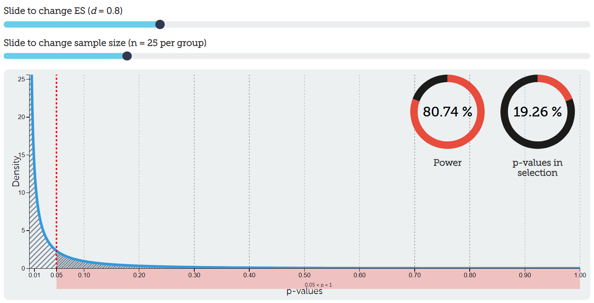

## 8.3 Power

In Chapter 7, we introduced power as part of hypothesis testing. In this section, we expand on that idea and connect power more explicitly to the BEAN framework.

---

### What is power?

**Power** is the probability that you will observe a statistically significant effect if there is a true effect. In other words, power is the probability of a statistically significant result assuming the alternative hypothesis is true.  

Power can range from 0–100%, but typically people set it at 80%. This means that, if we set power at 80% and if the alternative hypothesis is true, then we have an 80% chance of detecting the effect.

However, in practice, power is often far lower than 80% due to insufficient sample sizes for the effect sizes of interest, something we'll investigate in the final section of this chapter and in the homework.

:::{.info}
Just like with alpha, you have to critically set your power level too. Although we commonly set it to 80%, that still leaves a large likelihood of a false negative if the alternative hypothesis is true. To better detect a statistically significant result (assuming the alternative is true), we should aim for higher power levels.
:::

Power is based on the assumption that the alternative hypothesis is true whereas the *p*-value is based on the assumption that the null hypothesis is true. If we want to increase the likelihood of supporting our alternative hypothesis, then we should be doing all we can to increase our power!

---

### Power vs the p-value

**Power** is the probability that you will observe a statistically significant effect if there is a true effect. In other words, power is the probability of a statistically significant result assuming the alternative hypothesis is true.

Let's compare this to our definition of the *p*-value: the probability of observing data that is as extreme or more extreme than the data you have observed, assuming the null hypothesis is true.

Although these definitions may sound similar, they are actually answering two very different questions:

- The *p*-value asks: “If there is no effect (the null hypothesis is true), how surprising are these data?”
- Power asks: “If there is a real effect (the alternative hypothesis is true), how likely are we to detect it?”

The key difference is the assumption each one makes:

- *p*-values are calculated **assuming the null hypothesis is true**  
- Power is calculated **assuming the alternative hypothesis is true**  

> In this sense, they are two sides of the same coin—but they are not interchangeable.

Another way to think about it:

- The *p*-value helps us evaluate evidence **against the null hypothesis**  
- Power tells us how likely we are to find evidence **for the alternative hypothesis when it is true**

This distinction is critical for understanding hypothesis testing. A small *p*-value tells us that our data are unlikely under the null hypothesis, but it does **not** tell us how likely we were to detect the effect in the first place—that is the role of power.

---

### A key idea: power reflects detectability

Power is best understood as our **ability to detect effects**.

- High power → we are likely to detect real effects  
- Low power → we are likely to miss real effects  

This makes power a central concept in BEAN:

> Effect size, alpha, and sample size all work together to determine power.

---

### B(E)A(N): Alpha and power

Let's start putting all this together. Here's all our definitions so far (remember, we can never truly know whether the null or alternative hypothesis is true):

1. Alpha is the value we set to determine what constitutes a statistically significant result, assuming the null hypothesis is true.  
2. Power is the value we set at for what constitutes a statistically significant result, assuming the alternative hypothesis is true.  
3. A Type I error is when we get a statistically significant result but in fact the null hypothesis is true.  
4. A Type II error is when we do not get a statistically significant result but in fact the alternative hypothesis is true.  
5. A correct inference is when we either  
   - get a statistically significant result when the alternative hypothesis is true *or*  
   - do not get a statistically significant result when the null hypothesis is true.  

---

### Check your understanding

Consider the following table:

|                                                    | H~0~ is true | H~1~ is true |
|------------------------------------------|:-------------:|:-------------:|
| ***p*** **\< .05** (statistically significant)     |      A       |      B       |
| ***p*** **\> .05** (statistically non-significant) |      C       |      D       |

Using what you know about alpha, power, and errors, determine which cell(s) each of the following belong in:

1. Alpha  
2. Power  
3. Type I error  
4. Type II error  
5. Correct inference (there are two!)  

Before checking the answers, try to reason through each one carefully.

::: {.callout-answer collapse="true"}
1. **Alpha → A**: Alpha is the probability of a statistically significant result when the null hypothesis is true (Type I error)

2. **Power → B**: Power is the probability of a statistically significant result when the alternative hypothesis is true

3. **Type I error → A**: Rejecting the null hypothesis when it is actually true

4. **Type II error → D**: Failing to reject the null hypothesis when the alternative hypothesis is true

5. **Correct inference → B and C**  
   - B: Detecting a real effect when it exists  
   - C: Correctly concluding no effect when the null hypothesis is true  
:::

---

### How alpha and power relate to one another

We'll eventually see how power, alpha, effect sizes, and sample size all interrelate (BEAN!). For now, let's examine how alpha and power relate to one another in the context of hypothesis testing.

Note that a lot of this comes from Daniel Lakens' [Improving your Statistical Inference](https://lakens.github.io/statistical_inferences/errorcontrol.html) work.

:::{.warning}
Remember: we never know for certain if the null or alternative hypotheses are true! These are for illustrative purposes.
:::

---

#### Assuming the null hypothesis is 100% true

If we set alpha at 5%, power at 80%, and assume the null hypothesis is 100% true (meaning the effect definitely does not exist), we could fill in the following table as such: 

|                                                    | H~0~ is true | H~1~ is true |
|------------------------------------------|:-------------:|:-------------:|
| ***p*** **\< .05** (statistically significant)     |      5%      |      0%      |
| ***p*** **\> .05** (statistically non-significant) |     95%      |      0%      |

How did I get there? First, we're assuming the null hypothesis is 100% true. Therefore, that column must add up to 100%. If the null hypothesis is 100%—and we know our hypotheses must be mutually exclusive—then the alternative hypothesis must be 0% true. Therefore, that column must add up to 0%. The whole table must equal to 100% to exhaust all options.

Therefore, our power doesn't matter at all in this case. If the null is true, then it doesn't matter what power we have to detect the alternative effect *because the alternative effect does not exist*. So we instead use alpha and put it in the upper left cell. Note that our alpha level is the Type I error rate we are setting!

If the whole table must equal to 100%, and the left column must equal to 100% because the null is 100% true, then 100%-5% = 95% for the correct inference. In other words, if we tested this effect (that doesn't exist) 100 times, around 95% of the time we would get a non-significant p-value (*p* \> .05) and about 5% of the time we would get a significant p-value and be making a Type I error.

We can visualize our *p*-value distribution using this [handy interactive calculator](https://rpsychologist.com/d3/pdist/). We set our effect size (ES) to be *d* = 0, meaning there is no effect (i.e., the null hypothesis is true). This results in a uniform distribution of p-values. Exactly 5% of p-values would fall between *p* = 0 and *p* = .05 (the shaded region to the right of the red dotted line). That aligns with our Type I error rate as well (5%). Go ahead and play around with the interactive calculator and try moving the slider for sample size! Notice that it does absolutely nothing. We'll understand why when we put everything together.


#### Assuming the alternative hypothesis is 100% true

Let's try out the opposite: assume the alternative hypothesis is 100% true, alpha is 5%, and power is 80%. What would you put in the table?

|                                                    | H~0~ is true | H~1~ is true |
|------------------------------------------|:-------------:|:-------------:|
| ***p*** **\< .05** (statistically significant)     |      0%      |     80%      |
| ***p*** **\> .05** (statistically non-significant) |      0%      |     20%      |

How did I get those numbers? First, remember that the table must equal to 100% (hypotheses must be exhaustive). Second, remember that the alternative hypothesis is 100% true so that column must equal to 100% (and because hypotheses must be mutually exclusive, the other column must equal to 0%).

Therefore, it doesn't matter what we set alpha to. We cannot get a Type I error if the alternative hypothesis is true! We can only get a correct inference or make a Type II error.

We set power to 80%, and power is the probability of getting a statistically significant result assuming the alternative hypothesis is true. Therefore it goes in the top right cell. Notice that power is the probability of correctly detecting a statistically significant effect!

With simple arithmetic, 100%-80% = 20% is our Type II error (aka a false negative). If we were to test for this effect 100 times, about 80 times we would correctly detect the effect and about 20 times we would fail to detect the effect.

Let's visualize this. Go back to our [handy interactive calculator](https://rpsychologist.com/d3/pdist/) and put *d* = .8 as our effect size and *n* = 25 per group to our sample size. Notice now what our distribution of p-values looks like! Rather than a uniform distribution, now we have a steep exponential distribution. I have chosen to highlight all p-values in the range of *p* \> .05, which in that selection is roughly 20% (our Type II error rate from above). The number of *p*-values \< .05 is roughly 80%. Play again with the ES slider and sample size slider. Notice now that it makes a difference to our power! You're getting a glimpse into how power depends on our alpha, effect size, and sample size. BEAN!



#### Assuming a 50/50 split on the null and alternative hypotheses

In reality, we never truly know whether the null or alternative hypotheses are true. Maybe we're testing a new effect and we are completely 50/50 on whether the null or alternative hypothesis is true. Let's keep our alpha and power the same (5% and 80%, respectively) and fill out our table now:

|                                                    | H~0~ is true | H~1~ is true |
|------------------------------------------|:-------------:|:-------------:|
| ***p*** **\< .05** (statistically significant)     |     2.5%     |     40%      |
| ***p*** **\> .05** (statistically non-significant) |    47.5%     |     10%      |

How did we get there? Again: the table must equal to 100% and we specified ahead of time that we thought it was about 50% true for each of the hypotheses, so each column must equal to 50%. 50% of 5% (alpha) is 2.5% and 50% of 80% (power) is 40%. We then fill out the bottom row based on arithmetic.

Imagine this were your study and you got a significant *p*-value. What could you conclude? Either you reject the null hypothesis or fail to reject the null hypothesis. But which one? In reality, we never know, but there are things we can do to increase the likelihood that our statistically significant result is because the alternative hypothesis is true and not the null hypothesis.

Right now, based on the values we have set (alpha = 5% and power = 80%), it is *16 times more likely* that a statistically significant result means the alternative hypothesis is true than the null hypothesis is true. We calculate this with the first row of data: the probability of a statistically significant result if the alternative is true divided by the probability of a statistically significant result if the null is true: 40%/2.5% = 16.

You might be fine with a statistically significant result being 16 times more likely that the alternative is true compared to the null, but what can we do to increase this likelihood?

##### Increasing power

:::{.info data-latex=""}
Remember: the researcher sets the alpha and power levels! Let's find out what happens when we adjust those values. 
:::

Let's try it again, but this time let's increase our power to 95% and keep our alpha at 5% (50/50 on the hypotheses). Fill out the table!

|                                                    | H~0~ is true | H~1~ is true |
|------------------------------------------|:-------------:|:-------------:|
| ***p*** **\< .05** (statistically significant)     |     2.5%     |    47.5%     |
| ***p*** **\> .05** (statistically non-significant) |    47.5%     |     2.5%     |

Now it is *19 times more likely* (47.5/2.5 = 19) that the alternative hypothesis is true than the null hypothesis is true. Awesome! We have now discovered that increasing power increases the likelihood that a statistically significant result means our our alternative hypothesis is true.

##### Decreasing alpha

Let's do another example in which we still have a 50/50 on the hypotheses but we reduce our alpha to 1% and keep our power at 80%. Fill out the table!

|                                                    | H~0~ is true | H~1~ is true |
|------------------------------------------|:-------------:|:-------------:|
| ***p*** **\< .05** (statistically significant)     |     .5%      |     40%      |
| ***p*** **\> .05** (statistically non-significant) |    49.5%     |     10%      |

Now it is *80 times more likely* (40/.5 = 80) that the alternative hypothesis is true than the null hypothesis is true. Awesome!

We have now discovered that **decreasing alpha, not increasing power, is the best way for increasing the likelihood that a statistically significant result means our our alternative hypothesis is true.**

##### Your turn: Increasing power AND decreasing alpha

### Check your understanding

Let's see what happens when we both increase power **and** decrease alpha.

Assume:
- The null and alternative hypotheses are each 50% likely  
- Alpha (α) = 1%  
- Power = 95%  

Fill out the table below:

|                                                    | H~0~ is true | H~1~ is true |
|------------------------------------------|:-------------:|:-------------:|
| ***p*** **\< .05** (statistically significant)     |      A       |      B       |
| ***p*** **\> .05** (statistically non-significant) |      C       |      D       |

Then answer:

1. What value goes in each cell (A, B, C, D)?  
2. How much more likely is it that a statistically significant result reflects the alternative hypothesis rather than the null hypothesis?  

Take a moment to work through this before checking your answer.

::: {.callout-answer collapse="true"}
Step 1: Fill in the table

Because each hypothesis is 50% likely:

- Alpha = 1% → 50% of 1% = **0.5%** → A  
- Power = 95% → 50% of 95% = **47.5%** → B  

Now fill in the remaining cells:

- C = 50% − 0.5% = **49.5%**  
- D = 50% − 47.5% = **2.5%**  

Final table:

|                                                    | H~0~ is true | H~1~ is true |
|------------------------------------------|:-------------:|:-------------:|
| ***p*** **\< .05**                       |     0.5%     |     47.5%     |
| ***p*** **\> .05**                       |    49.5%     |     2.5%      |

---

Step 2: Compare likelihoods

We compare the probability of a significant result under each hypothesis:

\[
\frac{47.5}{0.5} = 95
\]

→ A statistically significant result is **95 times more likely** to reflect the alternative hypothesis than the null hypothesis.

---

**Interpretation:**

By **increasing power** and **decreasing alpha**, we dramatically improve our confidence that a statistically significant result reflects a true effect rather than a false positive.

This illustrates how BEAN works:

- Lower alpha → fewer false positives  
- Higher power → more true positives  

Together, they make our results much more trustworthy.
:::

---

### Connecting power to BEAN

Power is not an isolated concept—it is determined by:

- **Effect size** → larger effects are easier to detect  
- **Sample size (N)** → more data increases power  
- **Alpha** → stricter thresholds reduce power  

> BEAN determines power, and power determines whether we detect effects.

---

### A practical takeaway

When evaluating or designing a study, we should ask:

- Do we have enough power to detect the effect?  
- Is the effect size realistic?  
- Is our alpha appropriate?  
- Do we have enough data?  

These questions help us understand whether a study is capable of detecting meaningful effects.

---

### Want another explanation of power?

If power still feels a bit abstract, the following video provides another walkthrough of the concept and may help reinforce how power relates to hypothesis testing, Type II error, alpha, and sample size.


```{=html}
<div class="vembedr">
<div>
<iframe src="https://www.youtube.com/embed/_9ImSIP609I" width="533" height="300" frameborder="0" allowfullscreen="" data-external="1"></iframe>
</div>
</div>
```


--- 

## Check your understanding

1. What does statistical power represent?  
2. How is power different from a p-value?  
3. What happens to power when effect size increases?  
4. What happens to power when sample size increases?  
5. Why is power important for interpreting non-significant results?  
6. Which change has the largest impact on confidence in significant results: increasing power or decreasing alpha?  

::: {.callout-answer collapse="true"}
1. The probability of detecting a real effect when it exists  
2. Power assumes the alternative is true; p-values assume the null is true  
3. Power increases  
4. Power increases  
5. Because low power may lead to missing real effects  
6. Decreasing alpha  
:::
