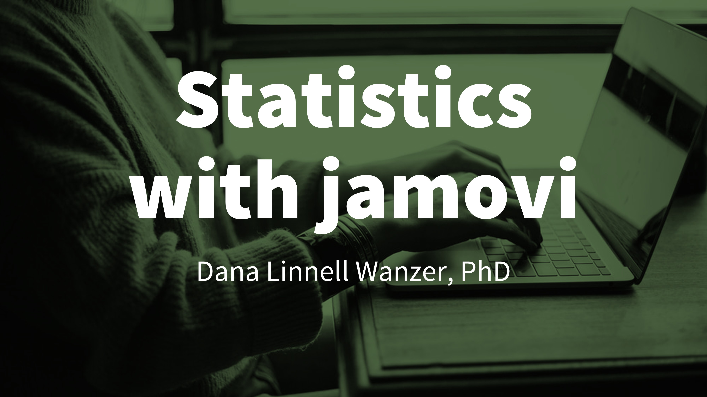

```{r cite-packages}
#| include: false

knitr::write_bib(c(
  .packages(), "bookdown", "tidyverse", "webshot"
), "packages.bib")
```

# 1. Statistics With jamovi {.unnumbered}



Welcome! This book is designed to help you learn statistics in a way that is practical, approachable, and connected to real research and decision making.

I wrote this book because I want statistics to feel more usable and less mysterious. You do not need to become a mathematician to use statistics well. You do need to learn how to ask good questions, choose appropriate analyses, interpret results carefully, and explain what those results mean.

## What You’ll Learn

By using this book, you will learn how to:

-   understand and interpret statistical results
-   analyze data using *jamovi*
-   connect statistics to research questions and real-world decisions
-   choose statistical tools that fit your variables and research design
-   communicate findings clearly using APA-style reporting

## Get Started

If you are new to this book, start with [How to Use This Book](01.0-intro.qmd). That chapter explains the different ways you can move through the book, including how to use it for a course, how to use it as a reference, and how to find help when you get stuck.

This book uses *jamovi*, a free and user-friendly statistical software program. You can download *jamovi* from <https://www.jamovi.org>. The early chapters will help you install the software, open data, check your variables, and begin running analyses.

## A Note About Learning Statistics

Statistics can feel overwhelming at first, and that is completely normal. Many students come into statistics unsure, anxious, or convinced that they are “not a stats person.” If that sounds like you, you are in good company.

This book is designed to help you build confidence step by step. Focus less on memorizing isolated rules and more on understanding what the results mean. When you can explain what a statistic is helping you decide, you are doing the real work of statistics.

## About This Book

This is an open educational resource (OER), which means it is free to use, share, and adapt with attribution. It is also a living resource. I update it based on student questions, instructor feedback, changes to *jamovi*, and places where the explanations can be clearer.

You can learn more about the book, licensing, attribution, errors, suggestions, and the author in [About This Book](01.1-about-this-book.qmd).
